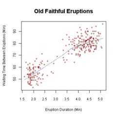

# Bivariate Analysis

## Bivariate analysisis one of the simplest forms of [quantitative (statistical) analysis](https://en.wikipedia.org/wiki/Statistics).It involves the analysis of two [variables](https://en.wikipedia.org/wiki/Dependent_and_independent_variables)(often denoted as*X*,*Y*), for the purpose of determining the empirical relationship between them

Bivariate analysis can be helpful in testing simple [hypotheses](https://en.wikipedia.org/wiki/Hypotheses) of [association](https://en.wikipedia.org/wiki/Association_(statistics)). Bivariate analysis can help determine to what extent it becomes easier to know and predict a value for one variable (possibly a [dependent variable](https://en.wikipedia.org/wiki/Dependent_variable)) if we know the value of the other variable (possibly the [independent variable](https://en.wikipedia.org/wiki/Independent_variable)) (see also [correlation](https://en.wikipedia.org/wiki/Correlation) and [simple linear regression](https://en.wikipedia.org/wiki/Simple_linear_regression)).
Bivariate analysis can be contrasted with [univariate analysis](https://en.wikipedia.org/wiki/Univariate_analysis) in which only one variable is analysed.Like univariate analysis, bivariate analysis can be [descriptive](https://en.wikipedia.org/wiki/Descriptive_statistics) or [inferential](https://en.wikipedia.org/wiki/Inferential_statistics). It is the analysis of the relationship between the two variables.Bivariate analysis is a simple (two variable) special case of [multivariate analysis](https://en.wikipedia.org/wiki/Multivariate_analysis)(where multiple relations between multiple variables are examined simultaneously).

Waiting time between eruptions and the duration of the eruption for the [Old Faithful Geyser](https://en.wikipedia.org/wiki/Old_Faithful_Geyser) in [Yellowstone National Park](https://en.wikipedia.org/wiki/Yellowstone_National_Park), [Wyoming](https://en.wikipedia.org/wiki/Wyoming), USA. This [scatterplot](https://en.wikipedia.org/wiki/Scatterplot) suggests there are generally two "types" of eruptions: short-wait-short-duration, and long-wait-long-duration.

## Graphical Methods

[Graphs](https://en.wikipedia.org/wiki/Statistical_graphics) that are appropriate for bivariate analysis depend on the type of variable. For two continuous variables, a [scatterplot](https://en.wikipedia.org/wiki/Scatterplot) is a common graph. When one variable is categorical and the other continuous, a [box plot](https://en.wikipedia.org/wiki/Box_plot) is common and when both are categorical a [mosaic plot](https://en.wikipedia.org/wiki/Mosaic_plot) is common. These graphs are part of [descriptive statistics](https://en.wikipedia.org/wiki/Descriptive_statistics).

## Questions

Suppose we have two random variables, X and Y, which are bivariate normal. The correlation between them is -0.2. Let A = cX + Y and B = X + cY. For what values of c are A and B independent?
<https://en.wikipedia.org/wiki/Bivariate_analysis>
