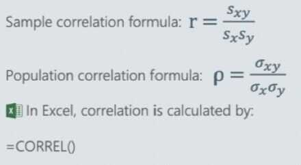
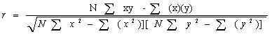
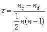
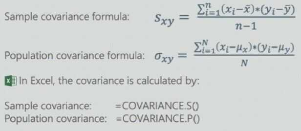

# Correlation and Covariance

## Data Relationships

In statistics, we can also examine how two or more variables are related to each other

- In some cases, we restrict ourselves to *chronicling whether that co-movement* is in the same direction, opposite directions and that there is no co-movement at all
- In others, we try to find *whether there is causation,* where one variable's movement is the cause of the other variable's movement
- Finally, if there is a link, we can use statistics *to try to predict a variable,* based upon observed values of another variable

As an example, consider the linkage between stock prices and interest rates

- We can measure whether interest rates and stock prices move together, in opposite directions and are unrelated
- We can also examine which direction the causation runs (do higher stock prices cause higher interest rates or vice versa)
- And if there is causation or a link, we can see if we use changes in interest rates can be use to predict changes in stock prices or vice versa

## Exploring data linkages/relationships

- When you have two or more data series, you can check for linkages between the data, i.e., whether the data move together (positive co-movement), move inversely (negative co-movement) or are unrelated (no co-movement)
- If there is a linkage, you can explore further to see if
    - **Time lags and leads:** Changes in one data variable lead changes in the other
    - **Correlation vs Causation:** Changes in one data variable are causing changes in the other
    - **Prediction:** You can predict one variable, using the other variable

## Correlation

Correlationis a bivariate analysis that measures the strength of association between two variables and the direction of the relationship.
Correlation coefficient measures how two variables move together.
Unlike covariance, correlation could be thought of as a standardized measure. It is easy for us to interpret the result
In terms of the strength of relationship, the value of the **correlation coefficient** varies between +1 and -1. A value of ± 1 indicates a perfect degree of association between the two variables. As the correlation coefficient value goes towards 0, the relationship between the two variables will be weaker. The direction of the relationship is indicated by the sign of the coefficient; a + sign indicates a positive relationship and a -- sign indicates a negative relationship.
Usually, in statistics, we measure four types of correlations:

- [Pearson correlation](http://www.statisticssolutions.com/academic-solutions/membership-resources/member-profile/conducting-analyses-results/videos/pearson-correlation/)
- Kendall rank correlation
- Spearman correlation
- Point-Biserial correlation

## General Correlation

1. 1, Positive Correlation - Both variables change in the same direction

2. 0, Neutral Correlation - No relationship in the change of the variables, independent

3. -1, Negative Correlation - Variables change in opposite directions

The performance of some algorithms can deteriorate if two or more variables are tightly related, called **multicollinearity**. An example is linear regression, where one of the offending correlated variables should be removed in order to improve the skill of the model. We can quantify the relationship between samples of two variables using a statistical method called Pearson's correlation coefficient, named for the developer of the method, Karl Pearson.

## Pearson r Correlation

Pearsonrcorrelation is the most widely used correlation statistic to measure the degree of the relationship between linearly related variables. For example, in the stock market, if we want to measure how two stocks are related to each other, Pearsonrcorrelation is used to measure the degree of relationship between the two. The point-biserial correlation is conducted with the Pearson correlation formula except that one of the variables is dichotomous. The following formula is used to calculate the Pearsonrcorrelation:

r= Pearson r correlation coefficient

N = number of observations

∑xy = sum of the products of paired scores

∑x = sum of x scores

∑y = sum of y scores

∑x2= sum of squared x scores

∑y2= sum of squared y scores

## Types of research questions a Pearson correlation can examine

- Is there a statistically significant relationship between age, as measured in years, and height, measured in inches?
- Is there a relationship between temperature, measured in degrees Fahrenheit, and ice cream sales, measured by income?
- Is there a relationship between job satisfaction, as measured by the JSS, and income, measured in dollars?

## Assumptions

For the Pearsonrcorrelation, both variables should be normally distributed (normally distributed variables have a bell-shaped curve). Other assumptions include linearity and homoscedasticity. Linearity assumes a straight line relationship between each of the two variables and homoscedasticity assumes that data is equally distributed about the regression line.

## Key Terms

**Effect size:** Cohen's standard may be used to evaluate the correlation coefficient to determine the strength of the relationship, or the effect size. Correlation coefficients between .10 and .29 represent a small association, coefficients between .30 and .49 represent a medium association, and coefficients of .50 and above represent a large association or relationship

**Continuous data:** Data that is interval or ratio level. This type of data possesses the properties of magnitude and equal intervals between adjacent units. Equal intervals between adjacent units means that there are equal amounts of the variable being measured between adjacent units on the scale. An example would be age. An increase in age from 21 to 22 would be the same as an increase in age from 60 to 61

## Kendall rank correlation

Kendall rank correlation is a non-parametric test that measures the strength of dependence between two variables. If we consider two samples, a and b, where each sample size isn, we know that the total number of pairings with a b isn(n-1)/2. The following formula is used to calculate the value of Kendall rank correlation:

Nc= number of concordant

Nd= Number of discordant

## Key Terms

- Concordant:Ordered in the same way
- Discordant:Ordered differently

## Spearman rank correlation

Spearman rank correlation is a non-parametric test that is used to measure the degree of association between two variables. The Spearman rank correlation test does not carry any assumptions about the distribution of the data and is the appropriate correlation analysis when the variables are measured on a scale that is at least ordinal.

The following formula is used to calculate the Spearman rank correlation:

$1= Spearman rank correlation

di= the difference between the ranks of corresponding variables

n= number of observations

### Types of research questions a Spearman Correlation can examine

- Is there a statistically significant relationship between participants' level of education (high school, bachelor's, or graduate degree) and their starting salary?
- Is there a statistically significant relationship between horse's finishing position a race and horse's age?

### Assumptions

The assumptions of the Spearman correlation are that data must be at least ordinal and the scores on one variable must be monotonically related to the other variable.

## Key Terms

### Effect size

Cohen's standard may be used to evaluate the correlation coefficient to determine the strength of the relationship, or the effect size. Correlation coefficients between .10 and .29 represent a small association, coefficients between .30 and .49 represent a medium association, and coefficients of .50 and above represent a large association or relationship.

### Ordinal data

In an ordinal scale, the levels of a variable are ordered such that one level can be considered higher/lower than another. However, the magnitude of the difference between levels is not necessarily known. An example would be rank ordering levels of education. A graduate degree is higher than a bachelor's degree, and a bachelor's degree is higher than a high school diploma. However, we cannot quantify how much higher a graduate degree is compared to a bachelor's degree. We also cannot say that the difference in education between a graduate degree and a bachelor's degree is the same as the difference between a bachelor's degree and a high school diploma.

http://www.statisticssolutions.com/correlation-pearson-kendall-spearman

https://machinelearningmastery.com/how-to-calculate-nonparametric-rank-correlation-in-python

https://towardsdatascience.com/clearly-explained-pearson-v-s-spearman-correlation-coefficient-ada2f473b8

https://www.freecodecamp.org/news/what-is-a-correlation-coefficient-r-value-in-statistics-explains

## Covariance

Covariance is a measure of the joint variability of two variables
Covariance can take on values from -inf to +inf. This is the problem as it is very hard to put such numbers into perspective

Like the correlation, a positive covariance indicates that two variables move together, a zero covariance that there is no relationship between the two variables, and a negative covariance an indication that they move in opposite directions

## Correlation doesn't equal Causation

- Scatterplot
- Bivariate data
- Regression line
- Correlation
- Positive correlation
- Negative correlation

- We use standard deviations to scale our correlations so that it always stays between -1 and 1. This is our correlation coefficient, r.

- Squared correlation coefficient - r^2^ is always between 0 and 1, and tells us - in decimal form - how much of the variance in one variable is predicted by the other.

- Correlation doesn't equal causation

- Spurious correlations: If two variables are correlated, we are often tempted to create elaborate explanations for why. In many cases, that correlation can be suprious, with the two variables that are correlated both driven by a third and often unseen variable

- Past vs Future: The data that we use to estimate correlation come from the past, and past correlation is not always a predictor of future correlation

## A Best Fit Line

