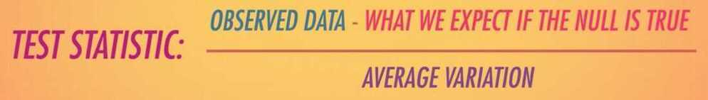
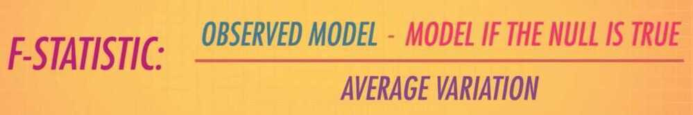
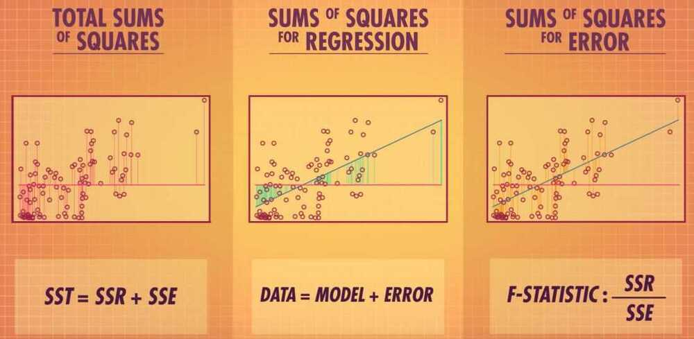
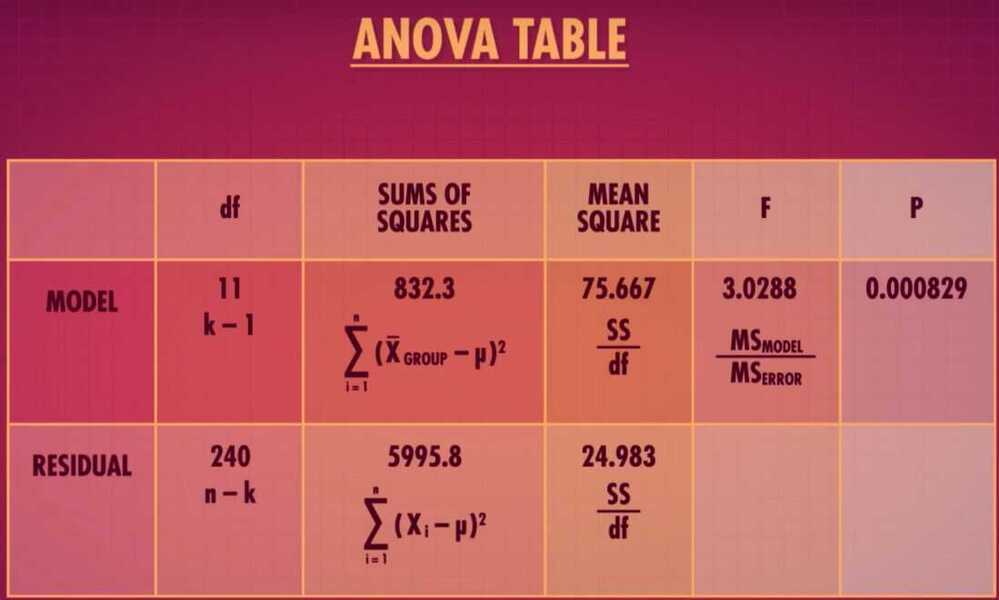
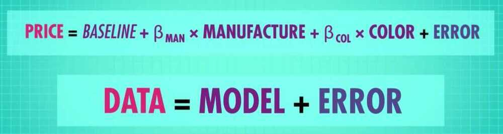
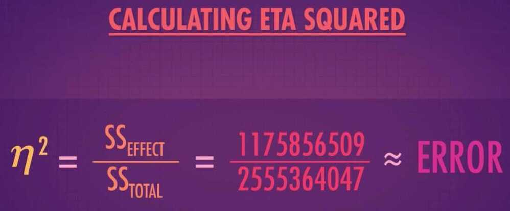
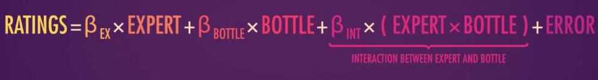
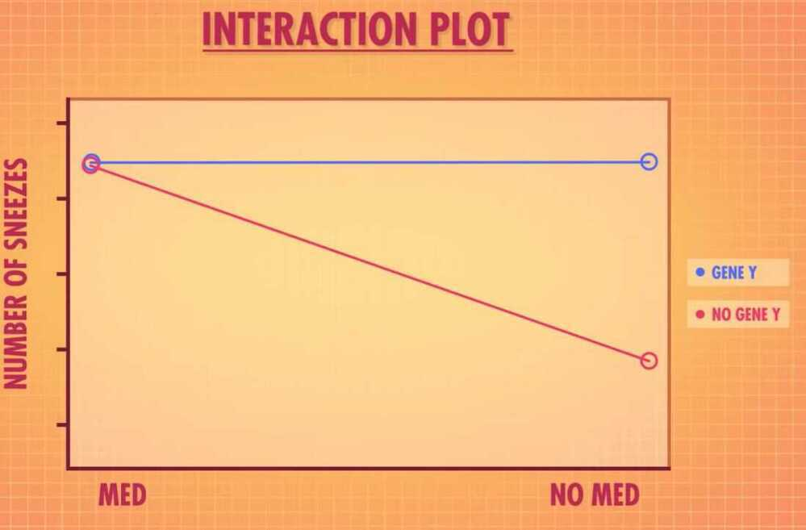
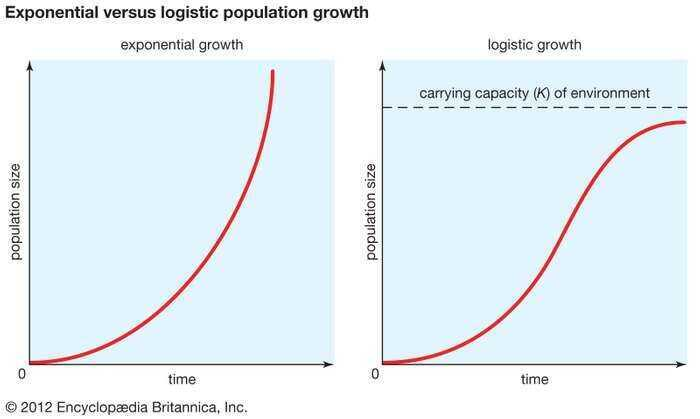

# Crash Course Statistics

[Statistics](https://www.youtube.com/playlist?list=PL8dPuuaLjXtNM_Y-bUAhblSAdWRnmBUcr)

## Z-scores

- Z-scores - Amount of standard deviation above or below the mean
- Z-scores in general allow us to compare things that are not on the same scale, as long as they're normally distributed.

## Confidence intervals

- Confidence intervals - An estimated range of values that seem reasonable based on what we've observed. It's center is still the sample mean, but we've got some room on either side for our uncertainity.
- T-distribution - A continuous probability distribution that's unimodal; it's useful to represent sampling distributions
- Margin of Error - Just like a confidence interval, reflects the uncertainity that surrounds sample estimates of parameters like the mean or a proportion

## How p-value help us test hypothesis

- Statistical inference
- Null Hypothesis Significance Testing (NHST)

A form of the Reduction Ad Absurdum argument which tries to discredit an idea by assuming the idea is true, and then showing that if you make that assumption, something contradictory happens.

Ex- we use this to prove that there is no largest positive integer

## p-values (how rare your data is)

If your p-value were 0.10 you could say that your sample is in the top 10% most extreme samples we'd expect to see based on the distribution of sample means.

https://www.freecodecamp.org/news/what-is-statistical-significance-p-value-defined-and-how-to-calculate-it

## p-value problems

- Alternative Distribution
- Alternative Hypothesis
- Failing to reject the null hypothesis doen't mean that there isn't an effect or relationship, it just means we didn't get enought evidence to say there definitely is one.

## Playing with power - p-value part 3

- Type 1 Error -
    - rejecting the null, even if it's true. It can therefore only happen if the null is true
    - Essentially false positives: we think we've detected an effect, but there isn't one

- Type 2 Error -
    - False negatives: There was an effect, but we didn't see it.

## You know I am all about that Bayes

- Bayesian statistics is about updating beliefs and can be used to test hypotheses.
- Bayes' Factor - Represents the amount of information that we've learned about our hypotheses from the data
- Bayesian hypothesis testing provides a structured way to quantify a logical process that we do everyday day, incorporating new events into the way we see the world

## Bayes in science and everyday life

- We will take our prior belief and update it with the likelihood of our evidence

## Test Statistics

- Allow us to quantify how close things are to our expectations or theories
- Sampling Distribution - The distribution of all possible group means for a certain sample size
- Z-statistics around 1 or -1 tell us that the sample mean is the typical distance we'd expect a typical sample mean to be from the mean of the null hypothesis
- We can use Z-tests to do hypothesis tests about means, differences between means, proportions, or even differences between proportions
- Critical value - A value of our test statistic that marks the limits of our extreme values.
- But sometimes, a Z-Test won't apply. And when that happens, we can use the T-Distribution and corresponding T-statistic to conduct a hypothesis test
- Reject H~0~ if the p is too low

## T-Tests: A matched pair made in heaven

T-Statistics tells us how many standard errors away from the mean our observed difference is.

## Degrees of Freedom and Effect Sizes

- Degrees of freedom is the number of independent pieces of information we have.

- Effect Size - Tells us how big the effect we observed was, compared to random variation.

## Chi-Squared Tests

A **chi-squared test**, also written as ***χ*^2^test**, is any [statistical hypothesis test](https://en.wikipedia.org/wiki/Statistical_hypothesis_testing) where the [sampling distribution](https://en.wikipedia.org/wiki/Sampling_distribution) of the test statistic is a [chi-squared distribution](https://en.wikipedia.org/wiki/Chi-squared_distribution) when the [null hypothesis](https://en.wikipedia.org/wiki/Null_hypothesis) is true. Without other qualification, 'chi-squared test' often is used as short for [*Pearson's*chi-squared test](https://en.wikipedia.org/wiki/Pearson%27s_chi-squared_test). The chi-squared test is used to determine whether there is a significant difference between the expected frequencies and the observed frequencies in one or more categories.

Tests of Independence - Look to see whether being a member of one category is independent of the other

Test of Homogeneity - Looking at whether it's likely that different samples come from the same population

## P-Hacking

- P-Hacking - Manipulating data or analyses to artificially get significant P-values
- P-Hacking - When analyses are being chosen based on what makes the P-value significant, not what's the best analysis plan
- Bonferroni Correction

## The Replication Crisis

- Replication
- Reproducible analysis

## Regression

- General Linear Model (GLM)
    - Data = Model + Error
    - Model (Y = MX + B)
    - Error (A deviation from our model)
    - Inferences
    - Types of GLM
        - Regression model (Continuous variable)
            - One reason we are concerned with outliers in regression is that values that are really far away from the rest of our data can have undue influence on the regression line
            - The sum of all squared distances of each point to the line
            - Residuals
            - F-Test - Helps us quantify how well we think our data fit a distribution, like the null distribution

- Sum of Squares for Regression (SSR)
- Sum of Squares for Error (SSE)

- Degrees of Freedom - represents the amount of independent information we have

## ANOVA (Analysis of Variance)

Allows us to compare three or more groups for statistical significance

Omnibus Test - A test that contains many items or groups (Ex - F-Test)

## ANOVA Part 2: Dealing with Intersectional Groups

- Factorial ANOVA - A factorial ANOVA does almost exactly what a regular ANOVA does: it takes the overall variation - or sums of squares - and portions it out into different categories.
- Example - Does car color and manufacture effect the overall price.
- Sums of squares total

SS - Sum of Squares

MS - Mean squares

- ANOVA Table

But just like with our T-Tests, we know that a significant F-Test only means that the result is statistically significant. It doesn't always mean it's practically significant to you.

- ETA squared tells you the proportion of total variation tha's accounted for by your specific variable

- Interaction
- Two-way ANOVA

SSG - Sum of Squares between Groups

SSG tell us how much variation can be explained by coming from one of the four possible combination of olive oil expertise and bottle type

- Main Effects

## Fitting models is like Tetris

- ANCOVA - Analysis of Covariance
- Repeated measures ANOVA
- ANOVA - Allow us to analyze the effect of variables with two or more groups on continuos variables
- Regressions - Allow us to analyze two continuous variables
- General Linear Model - Explain the data we observe by building a model to predict that data, and then keeping track of how close the prediction is.
- We can combine ANOVA and regression to give us more flexible ANCOVA
- Example - we want to calculate the amount of anaesthesia needed for red heads and non red heads. We have two categorical variables (red and non-red) and a continuous variable i.e. weight. Because weight plays a important role in the amount of anaesthesia used.
- Covariates - Continuous variables that are used to explain our outcome variable.
- Repeated measures ANOVA - Asks whether there's a significant difference between two or more groups or conditions

## War

- Bayesian search theory
- For finding the number of tanks based on number of observations
    - Max = M + (M/N) + 1
    - M is max serial number observed
    - N is number of observations

### War Economy Trilemma

The "war economy trilemma" refers to the challenges a country faces when trying to simultaneously maintain a strong military, a stable economy, and a high standard of living during a period of conflict, often requiring difficult choices and trade-offs.

## When predictions fail

- Logistic Curve

carrying capacity; exponential versus logistic population growth

In an ideal environment (one that has no limiting factors) populations grow at an exponential rate. The growth curve of these populations is smooth and becomes increasingly steep over time (left). However, for all populations, exponential growth is curtailed by factors such as limitations in food, competition for other resources, or disease. As competition increases and resources become increasingly scarce, populations reach the carrying capacity (K) of their environment, causing their growth rate to slow nearly to zero. This produces an S-shaped curve of population growth known as the logistic curve (right).- Inflection Point

A point on a curve at which the curve changes from being concave (concave downward) to convex (concave upward), or vice versa.
