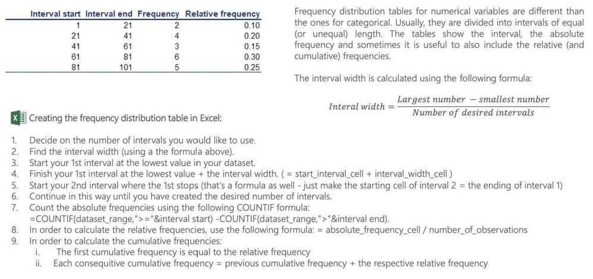
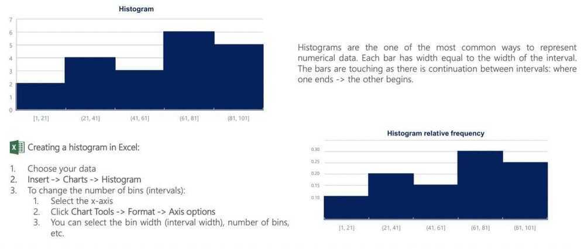
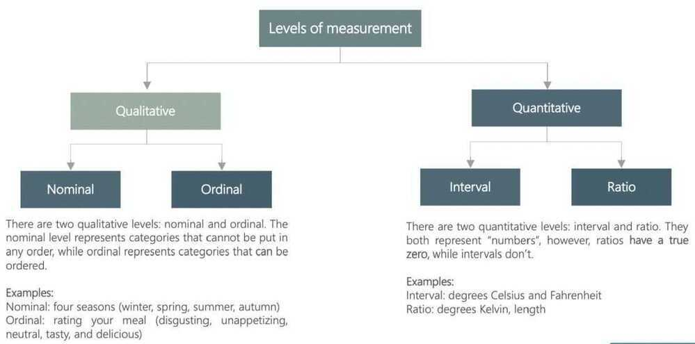
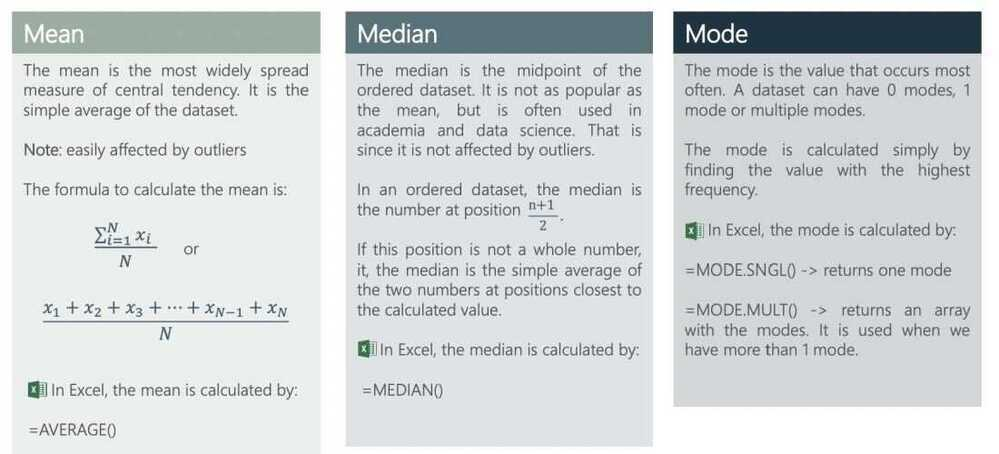
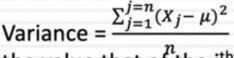
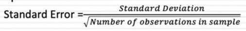

# Descriptive Statistics

Levels of measurement

Categorical variables. Visualization techniques

Numerical variables. Frequency distribution table

The histogram

Cross table and scatter plot

Mean, median, mode

Skewness

Variance

Standard deviation and coefficient of variation

## Descriptive Statistics (Summarizing Data)

- Itrefer to methods for summarizing raw observations into information that we can understand and share.
- Usually include things like where the middle of the data is - what statisticians call measure of central tendency - and measures of how spread out the data are

- Descriptive statistics are mostly used to summarize values and may not be sufficient to make conclusions about the entire population or to infer or predict data patterns

## Graphs and tables that represent categorical variables

## Excel formulas

## Pareto diagrams in Excel

## Numerical variables. Frequency distribution table and histogram

## Graphs and tables for relationships between variables. Cross tables

## Scatter plots

## Levels of measurement

## When faced with sample data, data descriptives try to summarize the data with metrics. Those metrics can include

- **Measures of location (Measures of centrality):** Measures of location try to identify the number or numbers around which the data is centered or is most likely to take
- **Measures of dispersion:** Measures of dispersion measure how much divergence there is on a data item, across a sample
- **Measures of skewness (Measures of symmetry):** Measures of skewness look at whether how symmetric or asymmetric the data is around the central value
- **Measures of extremes:** Measure the likelihood of extreme values (the fatness of distributional tails)

## Mean, Median, and Mode: Measure of Central Tendency

- Normal distribution

- Mode - The value that appears most in our dataset

- Bimodal Data is an example of Multimodal data which has many values that are similarly common. Usually multimodal data results from two or more underlying groups all being measured together

- The fact that the median and mean are the same tells us that the distibution is symmetric: that there's equal amount of data on either side of the median, and equal amounts on either side of the mean

- If the mean and median are different that the distribution is skewed

## Measures of Spread

- Range takes the largest number in our dataset and subtracts the smallest number in the set to give us the distance between the two extremes. The larger the distance, the more spread out our data is.

- Interquartile range - Doesn't consider extreme values, the IQR looks at the spread of the middle 50% of your data

## Measures of Dispersion

- **Ranges and variants:** With the range, you look at the difference between the highers and lowest values for a variable, across a sample. In variants, you can look at the difference between the first and third quartile of the data (interquartile range) or between the first and the ninth decile of the data
- **Standard deviation/Variance:** With the standard deviation, you estimate the difference between each value of a variable and its mean and arrive at a measure of dispersion
- **Coefficient of variation:** With the coefficient of variation, you divide the standard deviation of a data series by its mean, to provide a measure of comparision with data series of different levels

## Variance and standard deviation

## Standard Deviation/Variance & Coefficient of Variation

- The standard deviation is a measure of dispersion which uses all of the observations, computes the difference between each one and the mean, and summing up the squared differences:
- Variance

Where μ is the average across the n observations, and X~j~ is the value that of the j^th^ observation; The sum of the squared differences is divided by n, if your data comprises the entire population, or n-1, if it is a sample

- The standard deviation is the square root of the variance
- When there is more divergence from the mean, the standard deviation will be higher, but it will be in the same units as the base data. Thus, if the base data is in dollars, the standard deviation will be in dollars, and if it is in percent, it will be in percent
- Since standard deviations cannot be compared across two samples with different units or levels, you can compute a standidized version of the measure
  - **Coefficient of Variation = Std deviation in value / average value**

## Standard Deviation and Standard Error

- The standard deviation measures the amount of variability, or dispersion from the individual data values to the mean
- The standard error of the mean measures how far the sample mean (average) of the data is likely to be from the true population mean. It is computed as follows

- As sample size increases, there will be no discernible effect on the former, but the latter will always decrease
- When you are extrapolating from sample findings to the population, the standard errors become useful because they can be used to provide ranges for estimates. Thus, if your averate is μ, and your standard error is SE, drawing on the central limit theorem, you can estimate the population mean:
  - With 67% confidence: μ ± SE
  - With 95% confidence: μ ± 2*SE

## Measures of Asymmetry

- When the data is symmetric, the deviations from the mean fall equally or roughly equally on either side of the mean
- When the data is asymmetric, deviations on one side of the mean are much more pronounced than deviations on the other side. This deviation is measured with skewness
  - If the deviations are more pronounced/extreme for the observations that have values higher than the average, the distribution is positively skewed
  - If the deviations are more pronounced/extreme for the observations that have values lower than the average, the distribution is negatively skewed
- When data is asymmetric, the average will be skewed in the same direction as the asymmetry, and in some cases the skew can be large enough to make it unrepresentative of the sample

## Skewness

## Measures of extreme values

- You can measure of how much, and how frequently, data takes extreme values, relative to its central value. That measure is called kurtosis
- While variance and kurtosis are both affected by the presence (or absence) of extreme values, they measure different phenomenon
  - You can have high variance and low kurtosis, low variance and high kurtosis or high variance and high kurtosis
  - Distributions that have more frequent occurrences of extreme values are referred to as having fat tails or **leptokurtic.** Distribution that have less frequent occurrences of extreme values are referred to as **platykurtic**

## Randomness

- Expectation

- Variance (2nd moment)

- Skeweness (3rd moment)

- Kurtosis (4th moment)

- The mean of the sum is the sum of the means

- The variance of the sum of the two independent variables is the sum of their variances.
