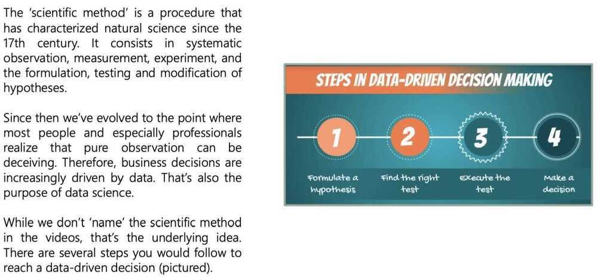
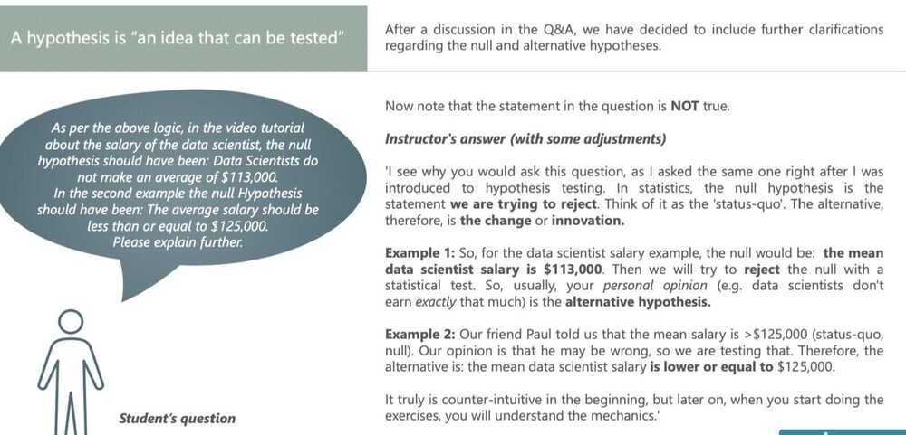
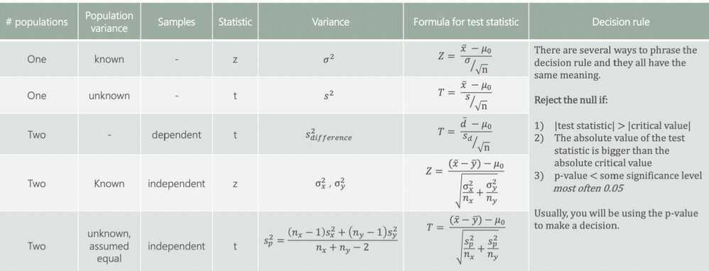

# Hypothesis Testing

Null vs Alternative

Rejection region and significance level

Type I error vs type II error

Test for the mean. Population variance known

p-value

Test for the mean. Population variance unknown

Test for the mean. Dependent samples

Test for the mean. Independent samples (Part1)

Test for the mean. Independent samples (Part2)

## Scientific Method

## Hypotheses

- A hypothesis is "an idea that can be tested"
- It is a supposition or proposed explanation made on the basis of limited evidence as a starting point for further investigation

## Examples of hypotheses

## Decisions you can take

## Level of significance and types of tests

- Level of significance (α) - The probability of rejecting a null hypothesis that is true; the probability of making this error.

## Statistical errors (Type I and Type II Error)

## P-value

- The p-value is the smallest level of significance at which we can still reject the null hypothesis, given the observed sample statistic

## Formulae for Hypothesis Testing

