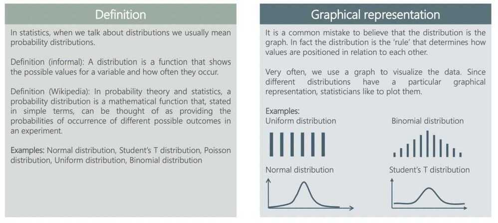
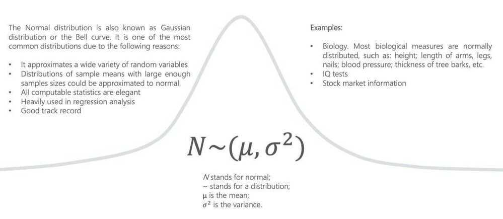
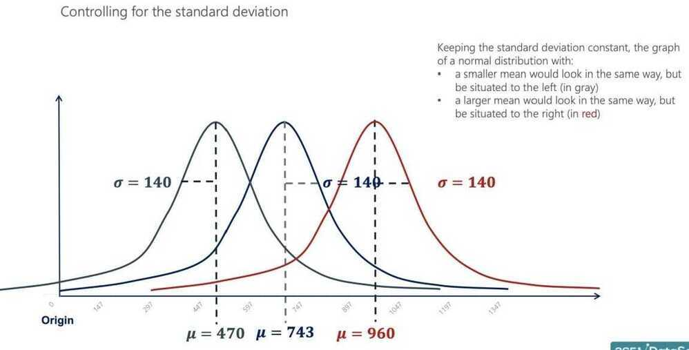
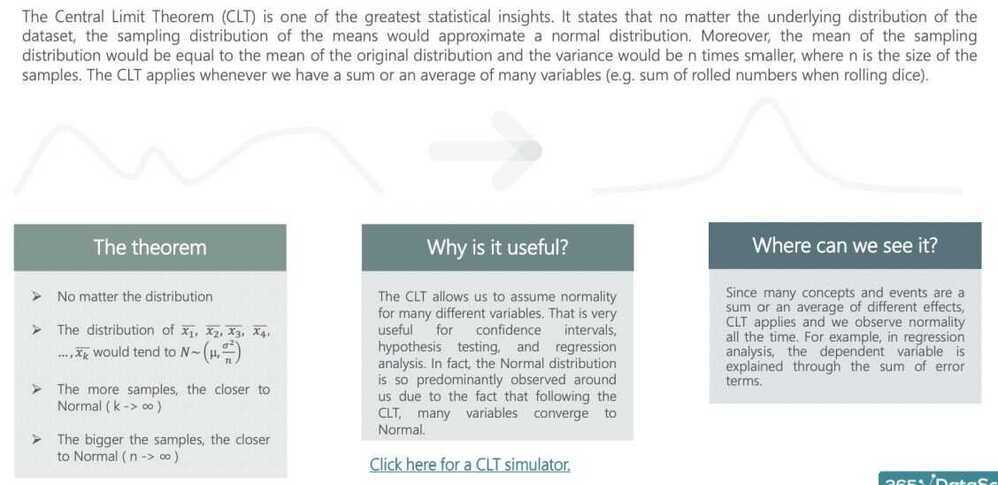
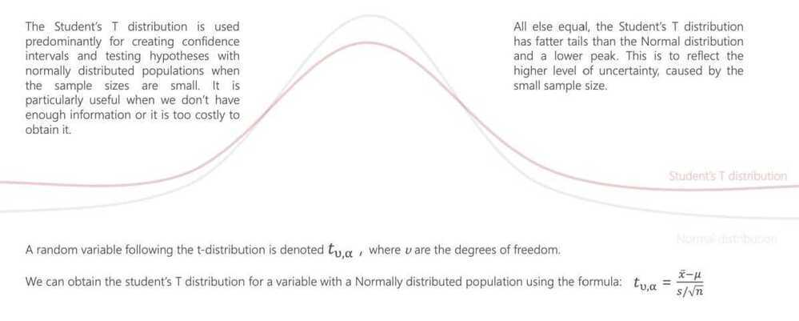

# Inferential Statistics

Introduction

What is a distribution

The Normal Distribution

The Standard Normal Distribution

Central limit theorem

Standard error

Estimators and estimates

## Inferential Statistics (Drawing Conclusion)

Itis a fancy name for methods that aid in quantifying properties of the domain or population from a smaller set of obtained observations called a sample

## Distributions

## The Normal Distribution

## The Standard Normal Distribution

## The Central Limit Theorem

## Estimators and Estimates

## Confidence Intervals and the Margin of Error

## Student's T Distribution

## Formulas for Confidence Intervals

