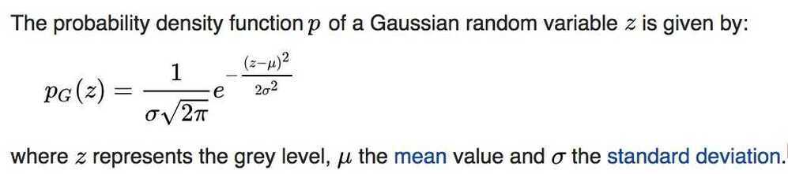
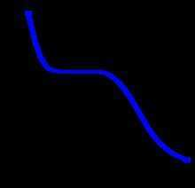
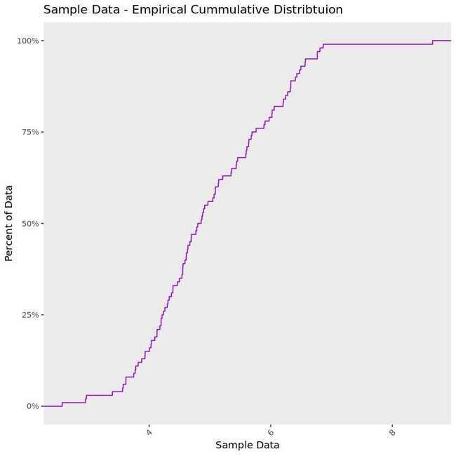
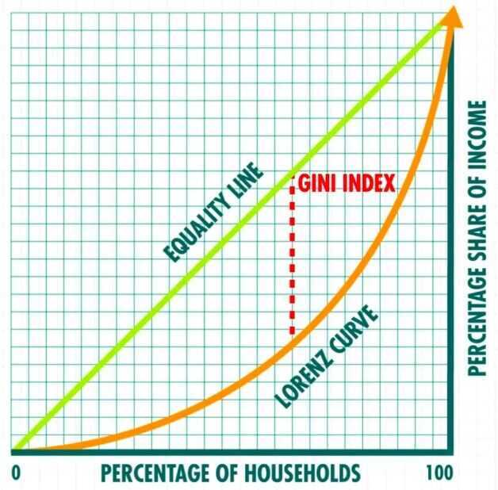

# Other Statistics

## Gaussian Noise

Gaussian noise is statistical noise having a probability density function (PDF) equal to that of the normal distribution, which is also known as the Gaussian distribution. In other words, the values that the noise can take on are Gaussian-distributed

A special case is *white Gaussian noise*, in which the values at any pair of times are identically distributed and statistically independent (and hence uncorrelated). In communication channel testing and modelling, Gaussian noise is used as additive white noise to generate additive white Gaussian noise.

<https://en.wikipedia.org/wiki/Gaussian_noise>

## Monotonic Function

A monotonic function is a function which is either entirely [nonincreasing](http://mathworld.wolfram.com/NonincreasingFunction.html) or [nondecreasing](http://mathworld.wolfram.com/NondecreasingFunction.html). A function is monotonic if its first [derivative](http://mathworld.wolfram.com/Derivative.html) (which need not be continuous) does not change sign.

Figure 1. A monotonically increasing function.

Figure 2. A monotonically decreasing function

Figure 3. A function that is not monotonic

In mathematics, a **monotonic function** (or **monotone function**) is a function between ordered sets that preserves or reverses the given order.

<https://en.wikipedia.org/wiki/Monotonic_function>

## Null Hypothesis

- (in a statistical test) the hypothesis that there is no significant difference between specified populations, any observed difference being due to sampling or experimental error.
- The idea that there's no effect

## Alternative hypothesis

- is one that states that sample observations are influenced by some non-random cause. From an A/B test perspective, the alternative hypothesis states that thereisa difference between the control and variant group.

## F-distribution

In [probability theory](https://en.wikipedia.org/wiki/Probability_theory) and [statistics](https://en.wikipedia.org/wiki/Statistics), the **F-distribution**, also known as **Snedecor's *F* distribution** or the **Fisher--Snedecor distribution** (after [Ronald Fisher](https://en.wikipedia.org/wiki/Ronald_Fisher) and [George W. Snedecor](https://en.wikipedia.org/wiki/George_W._Snedecor)) is a [continuous probability distribution](https://en.wikipedia.org/wiki/Continuous_probability_distribution) that arises frequently as the [null distribution](https://en.wikipedia.org/wiki/Null_distribution) of a [test statistic](https://en.wikipedia.org/wiki/Test_statistic), most notably in the [analysis of variance](https://en.wikipedia.org/wiki/Analysis_of_variance)(ANOVA), e.g., [*F*-test](https://en.wikipedia.org/wiki/F-test).

## F-test

An***F*-test**is any [statistical test](https://en.wikipedia.org/wiki/Statistical_test) in which the [test statistic](https://en.wikipedia.org/wiki/Test_statistic) has an [*F*-distribution](https://en.wikipedia.org/wiki/F-distribution) under the [null hypothesis](https://en.wikipedia.org/wiki/Null_hypothesis). It is most often used when [comparing statistical models](https://en.wikipedia.org/wiki/Model_selection) that have been fitted to a [data](https://en.wikipedia.org/wiki/Data) set, in order to identify the model that best fits the [population](https://en.wikipedia.org/wiki/Population_(statistics)) from which the data were sampled. Exact "*F*-tests" mainly arise when the models have been fitted to the data using [least squares](https://en.wikipedia.org/wiki/Least_squares).

## F1-score

In [statistical](https://en.wikipedia.org/wiki/Statistics) analysis of [binary classification](https://en.wikipedia.org/wiki/Binary_classification), the **F~1~score**(also**F-score** or **F-measure**) is a measure of a test's accuracy. It considers both the [precision](https://en.wikipedia.org/wiki/Precision_(information_retrieval)) *p* and the [recall](https://en.wikipedia.org/wiki/Recall_(information_retrieval))*r*of the test to compute the score: *p* is the number of correct positive results divided by the number of all positive results returned by the classifier, and *r* is the number of correct positive results divided by the number of all relevant samples (all samples that should have been identified as positive). The F~1~score is the [harmonic average](https://en.wikipedia.org/wiki/Harmonic_mean) of the [precision and recall](https://en.wikipedia.org/wiki/Precision_and_recall), where an F~1~score reaches its best value at 1 (perfect precision and recall) and worst at 0.

## Moving Average (MA)

In [statistics](https://en.wikipedia.org/wiki/Statistics), a **moving average**(**rolling average** or **running average**) is a calculation to analyze data points by creating series of [averages](https://en.wikipedia.org/wiki/Average) of different subsets of the full data set. It is also called a **moving mean** (**MM**) or **rolling mean** and is a type of [finite impulse response](https://en.wikipedia.org/wiki/Finite_impulse_response) filter.
Given a series of numbers and a fixed subset size, the first element of the moving average is obtained by taking the average of the initial fixed subset of the number series. Then the subset is modified by "shifting forward"; that is, excluding the first number of the series and including the next value in the subset.
A moving average is commonly used with [time series](https://en.wikipedia.org/wiki/Time_series) data to smooth out short-term fluctuations and highlight longer-term trends or cycles. The threshold between short-term and long-term depends on the application, and the parameters of the moving average will be set accordingly. For example, it is often used in [technical analysis](https://en.wikipedia.org/wiki/Technical_analysis) of financial data, like stock [prices](https://en.wikipedia.org/wiki/Price), [returns](https://en.wikipedia.org/wiki/Return_(finance)) or trading volumes. It is also used in [economics](https://en.wikipedia.org/wiki/Economics) to examine gross domestic product, employment or other macroeconomic time series. Mathematically, a moving average is a type of [convolution](https://en.wikipedia.org/wiki/Convolution) and so it can be viewed as an example of a [low-pass filter](https://en.wikipedia.org/wiki/Low-pass_filter) used in [signal processing](https://en.wikipedia.org/wiki/Signal_processing). When used with non-time series data, a moving average filters higher frequency components without any specific connection to time, although typically some kind of ordering is implied. Viewed simplistically it can be regarded as smoothing the data.- Simple Moving Average

- Cumulative Moving Average
- Weighted Moving Average
- Exponential Moving Average
- Centered Moving Average
<https://en.wikipedia.org/wiki/Moving_average>

## Parameter Space

In [statistics](https://en.wikipedia.org/wiki/Statistics), a**parameter space** is the [space](https://en.wikipedia.org/wiki/Space_(mathematics)) of all possible combinations of values for all the different [parameters](https://en.wikipedia.org/wiki/Parameter) contained in a particular [mathematical model](https://en.wikipedia.org/wiki/Mathematical_model). The ranges of values of the parameters may form the axes of a [plot](https://en.wikipedia.org/wiki/Plot_(graphics)), and particular outcomes of the model may be plotted against these axes to illustrate how different regions of the parameter space produce different types of behaviour in the model.
<https://en.wikipedia.org/wiki/Parameter_space>

## Ziph's Law

Zipf's law([/zɪf/](https://en.wikipedia.org/wiki/Help:IPA/English)) is an [empirical law](https://en.wikipedia.org/wiki/Empirical_law) formulated using [mathematical statistics](https://en.wikipedia.org/wiki/Mathematical_statistics) that refers to the fact that many types of data studied in the [physical](https://en.wikipedia.org/wiki/Physical_science) and [social](https://en.wikipedia.org/wiki/Social_science) sciences can be approximated with a Zipfian distribution, one of a family of related discrete [power law](https://en.wikipedia.org/wiki/Power_law)[probability distributions](https://en.wikipedia.org/wiki/Probability_distribution).Zipf distributionis related to the [zeta distribution](https://en.wikipedia.org/wiki/Zeta_distribution), but is not identical.
For example, Zipf's law states that given some [corpus](https://en.wikipedia.org/wiki/Text_corpus) of [natural language](https://en.wikipedia.org/wiki/Natural_language) utterances, the frequency of any word is [inversely proportional](https://en.wikipedia.org/wiki/Inversely_proportional) to its rank in the [frequency table](https://en.wikipedia.org/wiki/Frequency_table). Thus the most frequent word will occur approximately twice as often as the second most frequent word, three times as often as the third most frequent word, etc.: the [rank-frequency distribution](https://en.wikipedia.org/wiki/Rank-frequency_distribution) is an inverse relation. For example, in the [Brown Corpus](https://en.wikipedia.org/wiki/Brown_Corpus) of American English text, the word [the](https://en.wikipedia.org/wiki/English_articles#Definite_article) is the most frequently occurring word, and by itself accounts for nearly 7% of all word occurrences (69,971 out of slightly over 1 million). True to Zipf's Law, the second-place wordofaccounts for slightly over 3.5% of words (36,411 occurrences), followed byand(28,852). Only 135 vocabulary items are needed to account for half the [Brown Corpus](https://en.wikipedia.org/wiki/Brown_Corpus).
<https://en.wikipedia.org/wiki/Zipf%27s_law>

## Power Law Distribution

In [statistics](https://en.wikipedia.org/wiki/Statistics), a**power law** is a functional relationship between two quantities, where a relative change in one quantity results in a proportional relative change in the other quantity, independent of the initial size of those quantities: one quantity varies as a [power](https://en.wikipedia.org/wiki/Exponentiation) of another. For instance, considering the area of a square in terms of the length of its side, if the length is doubled, the area is multiplied by a factor of four.

An example power-law graph, being used to demonstrate ranking of popularity. To the right is the [long tail](https://en.wikipedia.org/wiki/Long_tail), and to the left are the few that dominate (also known as the [80--20 rule](https://en.wikipedia.org/wiki/Pareto_principle)).
<https://en.wikipedia.org/wiki/Power_law>

## Pivot Table

A **pivot table** is a [table](https://en.wikipedia.org/wiki/Table_(information)) of statistics that summarizes the data of more extensive table (such as from a [database](https://en.wikipedia.org/wiki/Database), [spreadsheet](https://en.wikipedia.org/wiki/Spreadsheet), or [business intelligence program](https://en.wikipedia.org/wiki/Business_intelligence_software)). This summary might include sums, averages, or other statistics, which the pivot table groups together in a meaningful way.
Pivot tables are a technique in [data processing](https://en.wikipedia.org/wiki/Data_processing). They enable a person to arrange and rearrange (or "pivot") statistics in order to draw attention to useful information.
<https://en.wikipedia.org/wiki/Pivot_table>

## Empirical Cumulative Distribution Function

This plot draws a line showing us what percent of our data falls below a certain value on the x-axis. Here the x-axis displays the value of the data and the y-axis the percent of our data that falls below a specific value on the x-axis.
On the chart below, take the point 6 on the x-axis and use your finger to trace a straight path up until you hit the line - the value on the y-axis at the point you hit the line is about 75%. So 75% of the data in the example below are lower than 6.

## Gini Coefficient

In [economics](https://en.wikipedia.org/wiki/Economics), theGini coefficient, sometimes called theGini indexorGini ratio, is a [measure of statistical dispersion](https://en.wikipedia.org/wiki/Statistical_dispersion#Measures_of_statistical_dispersion) intended to represent the [income](https://en.wikipedia.org/wiki/Income_distribution) or [wealth distribution](https://en.wikipedia.org/wiki/Wealth_distribution) of a nation's residents, and is the most commonly used measurement of [inequality](https://en.wikipedia.org/wiki/Economic_inequality). It was developed by the Italian [statistician](https://en.wikipedia.org/wiki/Statistics) and [sociologist](https://en.wikipedia.org/wiki/Sociology) [Corrado Gini](https://en.wikipedia.org/wiki/Corrado_Gini) and published in his 1912 paperVariability and Mutability.
The Gini coefficient measures the inequality among values of a [frequency distribution](https://en.wikipedia.org/wiki/Frequency_distribution)(for example, levels of [income](https://en.wikipedia.org/wiki/Income)). A Gini coefficient of zero expresses perfect equality, where all values are the same (for example, where everyone has the same income). A Gini coefficient of one (or 100%) expresses maximal inequality among values (e.g., for a large number of people, where only one person has all the income or consumption, and all others have none, the Gini coefficient will be very nearly one).For larger groups, values close to one are very unlikely in practice. Given the normalization of both the cumulative population and the cumulative share of income used to calculate the Gini coefficient, the measure is not overly sensitive to the specifics of the income distribution, but rather only on how incomes vary relative to the other members of a population. The exception to this is in the [redistribution of income](https://en.wikipedia.org/wiki/Redistribution_of_income) resulting in a minimum income for all people. When the population is sorted, if their income distribution were to approximate a well-known function, then some representative values could be calculated.
The Gini coefficient was proposed by Gini as a measure of [inequality](https://en.wikipedia.org/wiki/Social_inequality) of [income](https://en.wikipedia.org/wiki/Income_inequality_metrics) or [wealth](https://en.wikipedia.org/wiki/Wealth_concentration).For [OECD countries](https://en.wikipedia.org/wiki/Organisation_for_Economic_Co-operation_and_Development), in the late 20th century, considering the effect of taxes and [transfer payments](https://en.wikipedia.org/wiki/Transfer_payments), the income Gini coefficient ranged between 0.24 and 0.49, with Slovenia being the lowest and Mexico the highest.African countries had the highest pre-tax Gini coefficients in 2008--2009, with South Africa the world's highest, variously estimated to be 0.63 to 0.7, although this figure drops to 0.52 after social assistance is taken into account, and drops again to 0.47 after taxation.The global income Gini coefficient in 2005 has been estimated to be between 0.61 and 0.68 by various sources.
There are some issues in interpreting a Gini coefficient. The same value may result from many different distribution curves. The demographic structure should be taken into account. Countries with an aging population, or with a baby boom, experience an increasing pre-tax Gini coefficient even if real income distribution for working adults remains constant. Scholars have devised over a dozen variants of the Gini coefficient.
<https://en.wikipedia.org/wiki/Gini_coefficient>

<https://www.investopedia.com/terms/g/gini-index.asp>

## Lorenz Curve

The Lorenz curve is a graphical representation of [income inequality](https://www.investopedia.com/terms/i/income-inequality.asp) or wealth inequality developed by American economistMax Lorenz in 1905. The graph plotspercentiles of the population on the horizontal axis according to income or wealth. It plots cumulativeincome or wealth on the vertical axis, so that an x-value of 45 and a y-value of 14.2 would mean that the bottom 45% of the population controls 14.2% of the total income or wealth.

<https://www.investopedia.com/terms/l/lorenz-curve.asp>

## Rank Order Scale / Rank Ordering / Ranking scale

Rank order items are analyzed using [Spearman](http://changingminds.org/explanations/research/analysis/spearman.htm) or [Kendall](http://changingminds.org/explanations/research/analysis/kendall.htm) correlation.

## Statistical Power

<https://machinelearningmastery.com/statistical-power-and-power-analysis-in-python>

## Effect Size

<https://machinelearningmastery.com/effect-size-measures-in-python>
