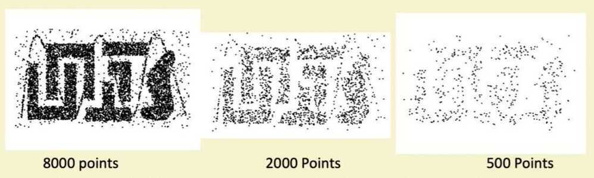

# Sampling

- Sampling is the main technique employed for data selection
    - It is often used for both the preliminary investigation of the data and the final data analysis
- Statisticians samples because obtaining the entire set of data of interest is too expensive or time consuming
- Sampling is used in data mining because processing the entire set of data of interest is too expensive or time consuming
- The key principle for effective sampling is the following:
    - Using a sample will work almost as well as using the entire data sets, if the sample is representative
    - A sample is representative if it has approximately the same property (of interest) as the original set of data

## Probability vs non-probability sampling

In a probability-based sample, the observations/subjects are picked at random. In a non-probability sample, the researcher hand picks the sample, based upon criteria that he or she picks

## Types of Sampling

- **Simple random sampling**
    - There is an equal probability of selecting any particular item
- **Samling without replacement**
    - As each item is selected, it is removed from the population
- **Sampling with replacement**
    - Objects are not removed from the population as they are selected for the sample
        - In sampling with replacement, the same objects can be picked up more than once
- **Stratified sampling**
    - Split the data into several partitions; then draw random samples from each paritition
- **Cluster Random**
    - You break the population into groups, and then randomly select some of these groups and collect data on each group member
Data sampling is a [statistical analysis](https://whatis.techtarget.com/definition/statistical-analysis) technique used to select, manipulate and analyze a representative subset of data points to identify patterns and trends in the larger [data set](https://whatis.techtarget.com/definition/data-set) being examined. It enables [data scientists](https://searchenterpriseai.techtarget.com/definition/data-scientist), predictive modelers and other data analysts to work with a small, manageable amount of data about a statistical [population](https://whatis.techtarget.com/definition/population) to build and run analytical models more quickly, while still producing accurate findings.

## Advantages and challenges of data sampling

Sampling can be particularly useful with data sets that are too large to efficiently analyze in full -- for example, in [big data analytics](https://searchbusinessanalytics.techtarget.com/definition/big-data-analytics) applications or surveys. Identifying and analyzing a representative sample is more efficient and cost-effective than surveying the entirety of the data or population.
An important consideration, though, is the size of the required data sample and the possibility of introducing a [sampling error](https://whatis.techtarget.com/definition/sampling-error). In some cases, a small sample can reveal the most important information about a data set. In others, using a larger sample can increase the likelihood of accurately representing the data as a whole, even though the increased size of the sample may impede ease of manipulation and interpretation.

## Types of data sampling methods

There are many different methods for drawing samples from data; the ideal one depends on the data set and situation. Sampling can be based on [probability](https://whatis.techtarget.com/definition/probability), an approach that uses [random numbers](https://whatis.techtarget.com/definition/random-numbers) that correspond to points in the data set to ensure that there is no correlation between points chosen for the sample. Further variations in probability sampling include:

- Simple random sampling:Software is used to randomly select subjects from the whole population.
- Stratified sampling:Subsets of the data sets or population are created based on a common factor, and samples are randomly collected from each subgroup.
- Cluster sampling:The larger data set is divided into subsets (clusters) based on a defined factor, then a random sampling of clusters is analyzed.
- Stratified random sampling - splits the population into groups of interest and randomly selects people from each of the "stratas" so that each group in the overall sample is represented appropriately
- Multistage sampling:A more complicated form of cluster sampling, this method also involves dividing the larger population into a number of clusters. Second-stage clusters are then broken out based on a secondary factor, and those clusters are then sampled and analyzed. Thisstagingcould continue as multiple subsets are identified, clustered and analyzed.
- Systematic sampling:A sample is created by setting an interval at which to extract data from the larger population -- for example, selecting every 10th row in a spreadsheet of 200 items to create a sample size of 20 rows to analyze.
- Snowball sampling - When current respondants are asked to help recruit people they know from the population of interest
- Census - A survey that samples an entire population
Sampling can also be based on nonprobability, an approach in which a data sample is determined and extracted based on the judgment of the analyst. As inclusion is determined by the analyst, it can be more difficult to extrapolate whether the sample accurately represents the larger population than when probability sampling is used.
Nonprobability data sampling methods include:
- Convenience sampling:Data is collected from an easily accessible and available group.
- Consecutive sampling:Data is collected from every subject that meets the criteria until the predetermined sample size is met.
- Purposive or judgmental sampling:The researcher selects the data to sample based on predefined criteria.
- Quota sampling:The researcher ensures equal representation within the sample for all subgroups in the data set or population.
Once generated, a sample can be used for [predictive analytics](https://searchbusinessanalytics.techtarget.com/definition/predictive-analytics). For example, a retail business might use data sampling to uncover patterns about customer behavior and [predictive modeling](https://searchenterpriseai.techtarget.com/definition/predictive-modeling) to create more effective sales strategies.

## Sample Size

## Sampling Sins

- Bias: The sample has to be representative of the population. If the sampling method creates bias, the results from the sample cannot be extrapolated to the population
    - Exclusion: Some parts of the population may not even make into the sampling universe
    - Self-selection: Some parts of the population may be more easily accessible than other parts, given how you collect data
    - Non-response: Some parts of the population may be less likely to respond to requests for data
    - Survivorship: Success (of failure, sometimes) may make an observation more likely to be sampled
- Noise: Even if the sample is representative, the results that you obtain will have statistical error or noise that can muddy your conclusions.

## Why do we need sampling?

1. **Practicality:** If the population is too large to collect data on, and/or a subset (small or large) of the population is inaccessible, you have no choice but to sample the data

2. **Costs:** Even if you could collect data on the entire population, the costs (in time and money) may outweigh the benefits of doing so

3. **Time trade off:** Related to the second point is the question of how frequently you want to update the data. It is easier to update sampled data than data on the entire population

## Independence + Identical Distributions (ID) (IID)

- In almost any discussion of sampling and statistics, the words independence and identical distributions thrown in as pre-requisites or at least good qualities in a sample
    - Independence: Events are independent when whether an event occurs or not is not determined by other events occuring
        - Coin tosses are a classic example of independence
        - Are stock price changes independent
    - Identical Distributions: Each event draws from the same probability distribution
        - Coin tosses draw from the same distribution
        - Do stock price changes draw from the same distribution
- In finance, researchers often assume independence and identical distributions, in making assertions based upon samples, but the truth is that both characteristics are hard to find

## Stratified Random Sampling

In the context of sampling, stratifiedmeans splitting the population into smaller groups or strata based on a characteristic. To put it another way, you divide a population into groups based on their features
Randomsamplingentails randomly selecting subjects (entities) from a population. Each subject has an equal probability of being chosen from the population to form a sample (subpopulation) of the overall population
So therefore, stratified random samplingis a sampling approach in which the population is separated into groups or strata depending on a particular characteristic. Then subjects from each stratum (the singular of strata) are randomly sampled
You divide the population into groups based on a characteristic and then choose a subject or entity at random from each group

## Types of Stratified Random Sampling

Stratified sampling is divided into two categories, which are:

- **Proportionate stratified random sampling**
- **Disproportionate stratified random sampling**
https://www.freecodecamp.org/news/what-is-stratified-random-sampling-definition-and-python-example
