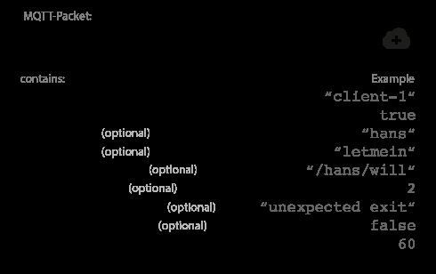
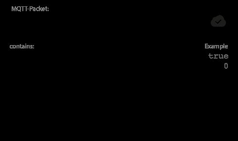

# Client, Broker & Connection Establishment

## Client

Both publishers and subscribers are MQTT clients.

The publisher and subscriber labels refer to whether the client is currently publishing messages or subscribing to messages (publish and subscribe functionality can also be implemented in the same MQTT client)

Basically, any device that speaks MQTT over a TCP/IP stack can be called an MQTT client.

## Broker

The broker is responsible for receiving all messages, filtering the messages, determining who is subscribed to each message, and sending the message to these subscribed clients.

The broker also holds the sessions of all persisted clients, including subscriptions and missed messages

## MQTT Connection

The MQTT protocol is based on TCP/IP. Both the client and the broker need to have a TCP/IP stack.
The MQTT connection is always between one client and the broker. Clients never connect to each other directly. To initiate a connection, **the client sends a CONNECT message to the broker. The broker responds with a CONNACK message**and a status code. Once the connection is established, the broker keeps it open until the client sends a disconnect command or the connection breaks.

## MQTT Connect

To initiate a connection, the client sends a command message to the broker. If this CONNECT message is malformed (according to the MQTT specification) or too much time passes between opening a network socket and sending the connect message, the broker closes the connection.

## ClientID

The client identifier (ClientId)identifies each MQTT clientthat connects to an MQTT broker. The broker uses the ClientID to identify the client and the current state of the client.Therefore, this ID should be unique per client and broker. In MQTT 3.1.1 (the current standard), you can send an empty ClientId, if you don't need a state to be held by the broker. The empty ClientID results in a connection without any state. In this case, the clean session flag must be set to true or the broker will reject the connection.

## Clean Session

The clean session flag tells the broker whether the client wants to establish a persistent session or not. In a persistent session (CleanSession = false), the broker stores all subscriptions for the client and all missed messages for the client that subscribed with a [Quality of Service (QoS)](https://www.hivemq.com/blog/mqtt-essentials-part-6-mqtt-quality-of-service-levels/) level 1 or 2. If the session is not persistent (CleanSession = true), the broker does not store anything for the client and purges all information from any previous persistent session.

## Username/Password

MQTT can send auser name and password for client authentication and authorization. However, if this information isn't encrypted or hashed (either by implementation or TLS), the password is sent in plain text. We highly recommend the use of user names and passwords together with a secure transport.

## Will Message

The last will message is part of the Last Will and Testament (LWT) feature of MQTT.This message notifies other clients when a client disconnects ungracefully.When a client connects, it can provide the broker with a last will in the form of an MQTT message and topic within the CONNECT message. If the client disconnects ungracefully, the broker sends the LWT message on behalf of the client.

## KeepAlive

The keep alive isa time interval in secondsthat the client specifies and communicates to the broker when the connection established. This interval defines the longest period of time that the broker and client can endure without sending a message.The client commits to sending regular PING Request messages to the broker. The broker responds with a PING response. This method allows both sides to determine if the other one is still available.

## CONNACK Message

When a broker receives a CONNECT message, it is obligated to respond with a CONNACK message.

The CONNACK message contains two data entries:

- The session present flag
- A connect acknowledge flag

## Session Presentflag

Thesession present flag tells the client whether the broker already has a persistent session available from previous interactions with the client. When a client connects with Clean Session set to true, the session present flag is always false because there is no session available. If a client connects with Clean Session set to false, there are two possibilities: If session information is available for the client Id. and the broker has stored session information, the session present flag is true. Otherwise, if the broker does not have any session information for the client ID, the session present flag is false. This flag was added in MQTT 3.1.1 to help clients determine whether they need to subscribe to topics or if the topics are still stored in a persistent session.

## Connect acknowledge flag

The second flag in the [CONNACK](http://docs.oasis-open.org/mqtt/mqtt/v3.1.1/os/mqtt-v3.1.1-os.html#_Toc398718033) message is the connect acknowledge flag. This flag containsa return code that tells the client whether the connection attempt was successful.

| Return Code | Return Code Response                              |
|-------------|---------------------------------------------------|
| 0           | Connection accepted                               |
| 1           | Connection refused, unacceptable protocol version |
| 2           | Connection refused, identifier rejected           |
| 3           | Connection refused, server unavailable            |
| 4           | Connection refused, bad user name or password     |
| 5           | Connection refused, not authorized                |

## References

<https://www.hivemq.com/blog/mqtt-essentials-part-3-client-broker-connection-establishment>
