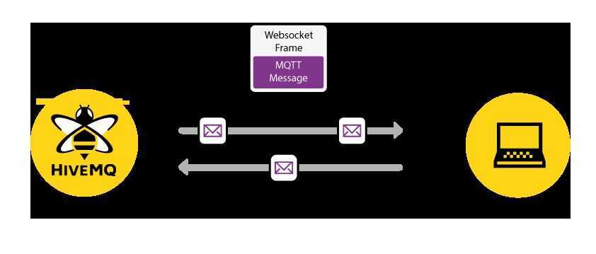

# MQTT over WebSockets

We've seen that MQTT is ideal for constrained devices and unreliable networks and that it is perfect for sending messages with a very low overhead. Naturally, it would be quite nice to send and receive MQTT messages directly in a browser. For example, on a mobile phone.MQTT over WebSockets is the answer. MQTT over WebSockets enables the browser to leverage all MQTT features. You can use these capabilities for many interesting use cases:

- Display live information from a device or sensor.
- Receive push notifications (for example, an alert or critical condition warning).
- See the current status of devices with LWT and retained messages.
- Communicate efficiently with mobile web applications.

HTML5 websockets provide a full-duplex communication over a TCP connection. Most modern web browsers implement this specification, even on mobile devices. MQTT can be used in conjunction with websockets to allow any web application to behave like a full-featured MQTT client. A library that utilizes websockets for MQTT like the Paho Javascript Client is needed.

## The advantages of using MQTT in web applications are

- Quality of Service semantics: With QoS 1 and 2, there's an assurance that a message arrives on the client or broker at least once/exactly once, even if the Internet connection dropped in the meantime.
- Queuing: When using QoS 1 or 2 and a persistent session, the broker will queue all messages a client misses from its subscriptions when it is not connected. On reconnect, all messages are delivered instantly to that client.
- Retained messages: Messages that are retained on the server are delivered instantly when a web application subscribes to one of these topics.
- Last Will and Testament: If a client doesn't disconnect gracefully, it's possible to publish a message to a topic in order to notify all subscribers that the client went offline.

## What does all this mean from a technical point of view?

[Every modern browser that supports WebSockets](http://caniuse.com/#feat=websockets) can be a full-fledged MQTT client and offer all the features described in the MQTT Essentials.The Keep Alive, Last Will and Testament, Quality of Service, and Retained Messages features work the same way in the browser as in a native MQTT client. All you need is a [JavaScript library](https://eclipse.org/paho/clients/js/) that enables MQTT over WebSockets and a broker that supports MQTT over webSockets. Of course, the HiveMQ broker offers this capability straight out-of-the-box.

## How does it work?

WebSocket is a network protocol that provides bi-directional communication between a browser and a web server. The protocol was standardized in 2011 and all modern browsers provide built-in support for it. Similar to MQTT, the WebSocket protocol is based on TCP.

InMQTT over WebSockets, the MQTT message (for example, a CONNECT or PUBLISH packet) is transferred over the network and encapsulated by one or more WebSocket frames. WebSockets are a good transport method for MQTT because they provide bi-directional, ordered, and lossless communication (WebSockets also leverage TCP). To communicate with an MQTT broker over WebSockets, the broker must be able to handle native WebSockets. Occasionally, people use a webserver and bridge WebSockets to the MQTT broker, but we don't recommend this method. When using HiveMQ, it is very easy to get started with WebSockets. Simply enable the native support in the configuration. For more information, read [MQTT over WebSockets with HiveMQ](https://www.hivemq.com/mqtt-over-websockets-with-hivemq/).

## Why not use MQTT directly?

Currently, it is not possible to speak pure MQTT in a browser because it is not possible to open a raw TCP connection. [Socket API](http://www.w3.org/TR/raw-sockets/) will change that situation; however, few browsers implement this API yet.

## Secure WebSockets

You can leverage Transport Layer Security (TLS) to use secure WebSockets with encryption of the whole connection. This method works seamlessly with HiveMQ. However, there are a few points that you need to keep in mind.

## References

https://www.hivemq.com/blog/mqtt-essentials-special-mqtt-over-websockets
