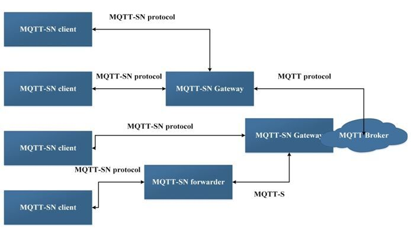

# MQTT - SN

MQTT for Sensor Networks

- MQTT-SN uses UDP and not TCP for its transport.
- UDP is a connection less protocol whereasTCPis connection orientated.
- MQTT-SN is designed, as far as possible, to work in the same way as MQTT
- In that regard MQTT-SN usually requires a connection to the broker before it can send and receive messages.
- This connection is in effect avirtual connection.

## QOS Levels

MQTT-SN supports QOS 0,1,2 as per MQTT, but it also supports a special publish QOS of 3 or -1.

Note: it is known as QOS -1 but the QOS flag in the message is set to 11 or decimal 3.

Publishing messages with a QOS of -1 or 3 doesn't require an initial connection to have been set up.

You can publish using the topic id or short topic name.

## Subscribing to MQTT-SN Topics

You cansubscribe to a topicsusing 3 different formats:

- A long topic name as per MQTT e.g.house/sensor1
- A short topic name of 2 characters only e.g.s1
- A pre-defined topic id (integer) e.g. 1

Wildcardscan be used as per MQTT, but they only make sense for long topic names.

## MQTT-SN clients have the ability to discover brokers

There are two mechanisms used:

- Advertising by a broker or Gateway
- A Search by the client

Both methods use a multicast packet. Currently there is no standardized multicast packet address.

## MQTT-SN Architecture

The architecture of MQTT-SN can be represented by the following figure -

There are three kinds of MQTT-SN components -

1. MQTT-SN clients,
2. MQTT-SN gateways (GW) and
3. MQTT-SN forwarders.

MQTT-SN clients connect themselves to a MQTT server via a MQTT-SN GW using the MQTT-SN protocol. A MQTT-SN GW may or may not be integrated with a MQTT server. In case of a stand-alone GW, the MQTT protocol is used between the MQTT server and the MQTT-SN GW. Its main function is the translation between MQTT and MQTT-SN. MQTT-SN clients can also access a GW via a forwarder in case the GW is not directly attached to their network. The forwarder simply encapsulates the MQTT-SN frames it receives on the wireless side and forwards them unchanged to the GW. In the opposite direction, it releases the frames it receives from the gateway and sends them to the clients, unchanged too.

There are two types of Gateways depending on how a Gateway performs the protocol translation between MQTT and MQTT-SN:

1. Transparent Gateway - For each MQTT-SN client, transparent gateway will form an individual MQTT connection to the MQTT broker.
2. Aggregating Gateway - In this, for all MQTT-SN clients, the Aggregating gateway will form only one MQTT connection to the MQTT broker. The advantage of using aggregating gateway is shown where WSN network has large number of sensor nodes because it helps in reducing the number of MQTT connections that broker has to create with individual client.

## MQTT-SN vs MQTT

### Advantages

1. MQTT-SN supports topic ID instead of topic name. First client sends a registration request with topic name and topic ID (2 octets) to a broker. After the registration is accepted, client uses topic ID to refer the topic name. This saves media bandwidth and device memory - it is quite expensive to keep and send topic name e.g: `home/livingroom/socket2/meter` in memory for each publish message.
2. Topic name to topic ID can be preconfigured in MQTT-SN gateway, so that even registration message can be skipped before publish.
3. MQTT-SN does not require TCP/IP stack. It can be used over a serial link (preferred way), where with simple link protocol (to distinguish different devices on the line) overhead is really small. Alternatively it can be used over UDP, which is less hungry than TCP.

### Disadvantages

1. You need some sort of gateway, which is nothing else than a TCP or UDP stack moved to a different device. This can also be a simple device (e.g.: Arduino Uno) just serving multiple MQTT-SN devices without doing other job.
2. MQTT-SN is not well supported.

## References

http://www.steves-internet-guide.com/mqtt-sn

https://www.bevywise.com/blog/benefits-of-mqtt-sn-over-mqtt

### Clients

https://github.com/eclipse/paho.mqtt-sn.embedded-c

https://www.eclipse.org/paho/clients/c/embedded-sn
