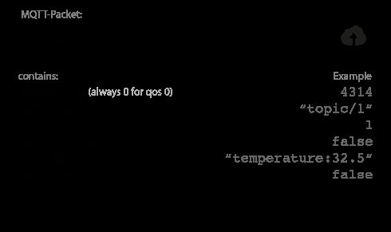
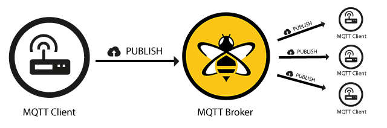
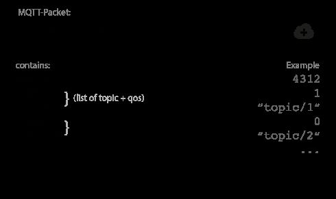
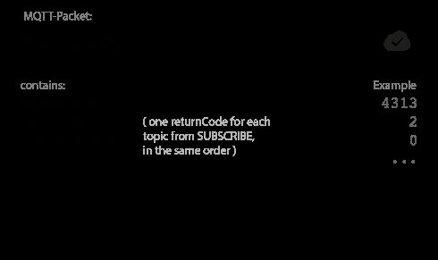
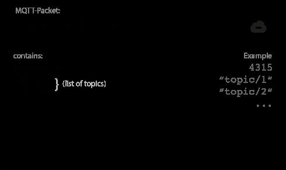
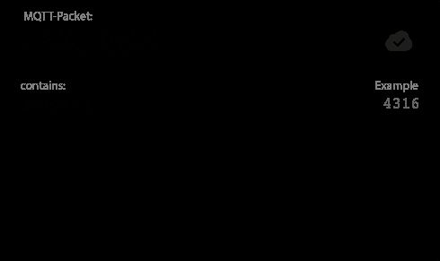
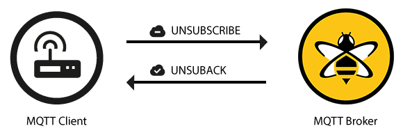

# Publish, Subscribe & Unsubscribe

## Publish

An MQTT client can publish messages as soon as it connects to a broker. MQTT utilizes topic-based filtering of the messages on the broker.Each message must contain a topic that the broker can use to forward the message to interested clients. Typically, each message has a payload which contains the data to transmit in byte format.MQTT is data-agnostic. The use case of the client determines how the payload is structured. The sending client (publisher) decides whether it wants to send binary data, text data, or even full-fledged XML or JSON.

## Topic Name

The topic name is a simple string that is hierarchically structured with forward slashes as delimiters. For example, "myhome/livingroom/temperature" or "Germany/Munich/Octoberfest/people".

## QoS

This number indicates the Quality of Service Level (QoS) of the message. There are three levels: 0,1, and 2. The service level determines what kind of guarantee a message has for reaching the intended recipient (client or broker).

## Retain Flag

This flag defines whether the message is saved by the broker as the last known good value for a specified topic. When a new client subscribes to a topic, they receive the last message that is retained on that topic.

## Payload

This is the actual content of the message. MQTT is data-agnostic. It is possible to send images, text in any encoding, encrypted data, and virtually every data in binary.

## Packet Identifier

The packet identifier uniquely identifies a message as it flows between the client and broker. The packet identifier is only relevant for QoS levels greater than zero. The client library and/or the broker is responsible for setting this internal MQTT identifier.

## DUP flag

The flag indicates that the message is a duplicate and was resent because the intended recipient (client or broker) did not acknowledge the original message. This is only relevant for QoS greater than 0. Usually, the resend/duplicate mechanism is handled by the MQTT client library or the broker as an implementation detail.
When a client sends a message to an MQTT broker for publication, the broker reads the message, acknowledges the message (according to the QoS Level), and processes the message. Processing by the broker includes determining which clients have subscribed to the topic and sending the message to them.

The client that initially publishes the message is only concerned about delivering the PUBLISH message to the broker. Once the broker receives the PUBLISH message, it is the responsibility of the broker to deliver the message to all subscribers. The publishing client does not get any feedback about whether anyone is interested in the published message or how many clients received the message from the broker.

## Subscribe

Publishing a message doesn't make sense if no one ever receives it. In other words, if there are no clients to subscribe to the topics of the messages. To receive messages on topics of interest, the client sends a [SUBSCRIBE](http://docs.oasis-open.org/mqtt/mqtt/v3.1.1/os/mqtt-v3.1.1-os.html#_Toc398718063) message to the MQTT broker. This subscribe message is very simple, it contains a unique packet identifier and a list of subscriptions.

## Packet Identifier

The packet identifier uniquely identifies a message as it flows between the client and broker. The client library and/or the broker is responsible for setting this internal MQTT identifier.

## List of Subscriptions

A SUBSCRIBE message can contain multiple subscriptions for a client. Each subscription is made up of a topic and a QoS level. The topic in the subscribe message can contain wildcards that make it possible to subscribe to a topic pattern rather than a specific topic. If there are overlapping subscriptions for one client, the broker delivers the message that has the highest QoS level for that topic.

## Suback

To confirm each subscription, the broker sends a [SUBACK](http://docs.oasis-open.org/mqtt/mqtt/v3.1.1/os/mqtt-v3.1.1-os.html#_Toc398718068) acknowledgement message to the client. This message contains the packet identifier of the original Subscribe message (to clearly identify the message) and a list of return codes.

## Packet Identifier

The packet identifier is a unique identifier used to identify a message. It is the same as in the SUBSCRIBE message.

## Return Code

The broker sends one return code for each topic/QoS-pair that it receives in the SUBSCRIBE message. For example, if the SUBSCRIBE message has five subscriptions, the SUBACK message contains five return codes. The return code acknowledges each topic and shows the QoS level that is granted by the broker. If the broker refuses a subscription, the SUBACK message conains a failure return code for that specific topic. For example, if the client has insufficient permission to subscribe to the topic or the topic is malformed.

| Return Code | Return Code Response    |
|-------------|-------------------------|
| 0           | Success - Maximum QoS 0 |
| 1           | Success - Maximum QoS 1 |
| 2           | Success - Maximum QoS 2 |
| 128         | Failure                 |

After a client successfully sends the SUBSCRIBE message and receives the SUBACK message, it gets every published message that matches a topic in the subscriptions that the SUBSCRIBE message contained.

## Unsubscribe

The counterpart of the SUBSCRIBE message is the [UNSUBSCRIBE](http://docs.oasis-open.org/mqtt/mqtt/v3.1.1/os/mqtt-v3.1.1-os.html#_Toc398718072) message. This message deletes existing subscriptions of a client on the broker. The UNSUBSCRIBE message is similar to the SUBSCRIBE message and has a packet identifier and a list of topics.

## Packet Identifier

The packet identifier uniquely identifies a message as it flows between the client and broker. The client library and/or the broker is responsible for setting this internal MQTT identifier.

## List of Topic

The list of topics can contain multiple topics from which the client wants to unsubscribe. It is only necessary to send the topic (without QoS). The broker unsubscribes the topic, regardless of the QoS level with which it was originally subscribed.

## Unsuback

To confirm the unsubscribe, the broker sends an [UNSUBACK](http://docs.oasis-open.org/mqtt/mqtt/v3.1.1/os/mqtt-v3.1.1-os.html#_Toc398718077) acknowledgement message to the client. This message contains only the packet identifier of the original UNSUBSCRIBE message (to clearly identify the message).

## Packet Identifier

The packet identifier uniquely identifies the message. As already mentioned, this is the same packet identifier that is in the UNSUBSCRIBE message.

After receiving the UNSUBACK from the broker, the client can assume that the subscriptions in the UNSUBSCRIBE message are deleted.

## References

<https://www.hivemq.com/blog/mqtt-essentials-part-4-mqtt-publish-subscribe-unsubscribe>
