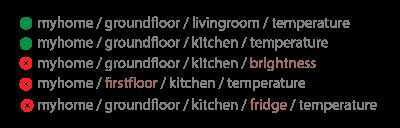

# Topics & Best Practices

In MQTT, the word topic refers to an UTF-8 string that the broker uses to filter messages for each connected client. The topic consists of one or more topic levels. Each topic level is separated by a forward slash (topic level separator).


In comparison to a message queue, MQTT topics are very lightweight. The client does not need to create the desired topic before they publish or subscribe to it. The broker accepts each valid topic without any prior initialization.
Here are some examples of topics:

```bash
myhome/groundfloor/livingroom/temperature
USA/California/San Francisco/Silicon Valley
5ff4a2ce-e485-40f4-826c-b1a5d81be9b6/status
Germany/Bavaria/car/2382340923453/latitude
```

Note that each topic must containat least 1 character and that the topic string permits empty spaces.Topics are case-sensitive.For example, _myhome/temperature and_MyHome/Temperature are two different topics. Additionally, the forward slash alone is a valid topic.

## Wildcards

When a client subscribes to a topic, it can subscribe to the exact topic of a published message or it can use wildcards to subscribe to multiple topics simultaneously. A wildcard can only be used to subscribe to topics, not to publish a message. There are two different kinds of wildcards: _single-level and_multi-level.

Wildcards **are not allowed in topic names when publishing messages**. The wildcard characters are reserved and must not be used in the topic. These characters cannot be escaped.

| **WILDCARD**          | **SYMBOL** | **MEANING**                                                                                                                                               |
|-------------|----------|-------------------------------------------------|
| Single-level Wildcard | +         | A wildcard that matches one complete topic level. It must occupy an entire topic level. This wildcard can be used more than once in a topic subscription. |
| Multi-level Wildcard  | #         | A wildcard that matches any number of levels within a topic. It must be the last character of a topic subscription.                                       |

## VALID MQTT TOPIC EXAMPLES

```bash
- my/test/topic
- my/+/topic
- my/#
- my/+/+ (subscribe all topics that has two levels)
- +/#
- #
```

## Single Level: `+`

As the name suggests, a single-level wildcard replaces one topic level. The plus symbol represents a single-level wildcard in a topic.


Any topic matches a topic with single-level wildcard if it contains an arbitrary string instead of the wildcard. For example a subscription to _myhome/groundfloor/+/temperature can produce the following results:



## Multi Level `#`

The multi-level wildcard covers many topic levels. The hash symbol represents the multi-level wild card in the topic. For the broker to determine which topics match, the multi-level wildcard must be placed as the last character in the topic and preceded by a forward slash.


When a client subscribes to a topic with a multi-level wildcard, it receives all messages of a topic that begins with the pattern before the wildcard character, no matter how long or deep the topic is. If you specify only the multi-level wildcard as a topic (_#), you receive all messages that are sent to the MQTT broker. If you expect high throughput, subscription with a multi-level wildcard alone is an anti-pattern (see the best practices below).

## Topics beginning with `$`

Generally, you can name your MQTT topics as you wish. However, there is one exception: **Topics that start with a `$` symbol have a different purpose.** These topics are not part of the subscription when you subscribe to the multi-level wildcard as a topic (#).The `$-symbol` topics are reserved for internal statistics of the MQTT broker.Clients cannot publish messages to these topics. At the moment, there is no official standardization for such topics. Commonly,$SYS/is used for all the following information, but broker implementations varies.

```bash
$SYS/broker/clients/connected
$SYS/broker/clients/disconnected
$SYS/broker/clients/total
$SYS/broker/messages/sent
$SYS/broker/uptime
```

## Best practices

### Never use a leading forward slash

A leading forward slash is permitted in MQTT. For example,/myhome/groundfloor/livingroom. However, the leading forward slash introduces an unnecessary topic level with a zero character at the front. The zero does not provide any benefit and often leads to confusion.

### Never use spaces in a topic

A space is the natural enemy of every programmer. When things are not going the way they should, spaces make it much harder to read and debug topics. As with leading forward slashes, just because something is allowed, doesn't mean it should be used.[UTF-8 has many different white space types](http://www.cs.tut.fi/~jkorpela/chars/spaces.html), such uncommon characters should be avoided.

### Keep the topic short and concise

Each topic is included in every message in which it is used. Make your topics as short and concise as possible. When it comes to small devices, every byte counts and topic length has a big impact.

### Use only ASCII characters, avoid non printable characters

Because non-ASCII UTF-8 characters often display incorrectly, it is very difficult to find typos or issues related to the character set. Unless it is absolutely necessary, we recommend avoiding the use of non-ASCII characters in a topic.

### Embed a unique identifier or the Client Id into the topic

It can be very helpful to include the unique identifier of the publishing client in the topic. The unique identifier in the topic helps you identify who sent the message. The embedded ID can be used to enforce authorization. Only a client that has the same client ID as the ID in the topic is allowed to publish to that topic. For example, a client with the _client1 ID is allowed to publish to_client1/status, but not permitted to publish to_client2/status.

### Don't subscribe to `#`

Sometimes, it is necessary to subscribe to all messages that are transferred over the broker. For example, to persist all messages into a database.Do not subscribe to all messages on a broker by using an MQTT client and subscribing to a multi-level wildcard.Frequently, the subscribing client is not able to process the load of messages that results from this method (especially if you have a massive throughput). Our recommendation is to implement an extension in the MQTT broker. For example, with the [plugin system of HiveMQ](https://www.hivemq.com/extensions) you can hook into the behavior of HiveMQ and add an asynchronous routine to process each incoming message and persist it to a database.

### Don't forget extensibility

Topics are a flexible concept and there is no need to preallocate them in any way. However, both the publisher and the subscriber need to be aware of the topic. It is important to think about how topics can be extended to allow for new features or products. For example, if your smart-home solution adds new sensors, it should be possible to add these to your topic tree without changing the whole topic hierarchy.

### Use specific topics, not general ones

When you name topics, don't use them in the same way as in a queue. Be as specific topics as possible. For example, if you have three sensors in your living room, create topics for _myhome/livingroom/temperature,_myhome/livingroom/brightness and _myhome/livingroom/humidity. Do not send all values over_myhome/livingroom. Use of a single topic for all messages is a anti pattern. Specific naming also makes it possible for you to use other MQTT features such as retained messages.

## References

<https://www.hivemq.com/blog/mqtt-essentials-part-5-mqtt-topics-best-practices>
