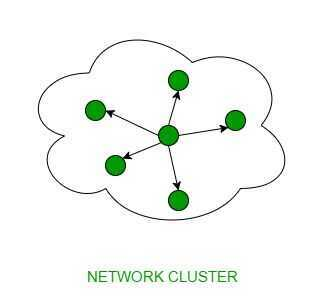
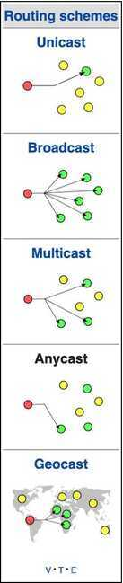

# Addressing Methods / cast protocols

The **cast** term here signifies some data(stream of packets) is being transmitted to the recipient(s) from client(s) side over the communication channel that help them to communicate. Let's see some of the "cast" concepts that are prevailing in the computer networks field.

## Unicast

This type of information transfer is useful when there is a participation of single sender and single recipient. So, in short you can term it as a one-to-one transmission. For example, a device having IP address 10.1.2.0 in a network wants to send the traffic stream(data packets) to the device with IP address 20.12.4.2 in the other network, then unicast comes into picture. This is the most common form of data transfer over the networks.

## Broadcast

Broadcasting transfer (one-to-all) techniques can be classified into two types

### Limited Broadcasting

Suppose you have to send stream of packets to all the devices over the network that you reside, this broadcasting comes handy. For this to achieve, it will append 255.255.255.255 (all the 32 bits of IP address set to 1) called asLimited Broadcast Addressin the destination address of the datagram (packet) header which is reserved for information tranfer to all the recipients from a single client (sender) over the network.

### Direct Broadcasting

This is useful when a device in one network wants to transfer packet stream to all the devices over the other network.This is achieved by translating all the Host ID part bits of the destination address to 1, referred asDirect Broadcast Addressin the datagram header for information transfer.

This mode is mainly utilized by television networks for video and audio distribution.

One important protocol of this class in Computer Networks is [Address Resolution Protocol (ARP)](https://www.geeksforgeeks.org/computer-network-arp-works/) that is used for resolving IP address into physical address which is necessary for underlying communication.

## Multicast

In multicasting, one/more senders and one/more recipients participate in data transfer traffic. In this method traffic recline between the boundaries of unicast (one-to-one) and broadcast (one-to-all). Multicast lets server's direct single copies of data streams that are then simulated and routed to hosts that request it. IP multicast requires support of some other protocols likeIGMP (Internet Group Management Protocol), Multicast routingfor its working. Also in Classful IP addressingClass Dis reserved for multicast groups.

## Anycast

Anycast is a network [addressing](https://en.wikipedia.org/wiki/Addressing) and [routing](https://en.wikipedia.org/wiki/Routing) methodology in which a single destination address has multiple routing paths to two or more endpoint destinations. Routers will select the desired path on the basis of number of hops, distance, lowest cost, latency measurements or based on the least congested route. Anycast networks are widely used for [content delivery network](https://en.wikipedia.org/wiki/Content_delivery_network)(CDN) products to bring their content closer to the end user.

https://en.wikipedia.org/wiki/Anycast

## Geocast

Refers to the delivery of information to a group of destinations in a network identified by their geographical locations. It is a specialized form of multicast addressing used by some routing protocols for mobile ad hoc networks.

## Automatic Repeat Request / Automatic Repeat Query (ARQ)

Automatic repeat request(ARQ), also known asautomatic repeat query, is an [error-control](https://en.wikipedia.org/wiki/Error_control) method for [data transmission](https://en.wikipedia.org/wiki/Data_transmission) that uses [acknowledgements](https://en.wikipedia.org/wiki/Acknowledgement_(data_networks))(messages sent by the receiver indicating that it has correctly received a [packet](https://en.wikipedia.org/wiki/Packet_(information_technology))) and [timeouts](https://en.wikipedia.org/wiki/Timeout_(computing))(specified periods of time allowed to elapse before an acknowledgment is to be received) to achieve [reliable data transmission](https://en.wikipedia.org/wiki/Reliability_(computer_networking)) over an unreliable service. If the sender does not receive an acknowledgment before the timeout, it usually [re-transmits](https://en.wikipedia.org/wiki/Retransmission_(data_networks)) the packet until the sender receives an acknowledgment or exceeds a predefined number of retransmissions.

The types of ARQ protocols include **[Stop-and-wait ARQ](https://en.wikipedia.org/wiki/Stop-and-wait_ARQ), [Go-Back-N ARQ](https://en.wikipedia.org/wiki/Go-Back-N_ARQ), and [Selective Repeat ARQ/Selective Reject ARQ](https://en.wikipedia.org/wiki/Selective_Repeat_ARQ).** All three protocols usually use some form of [sliding window protocol](https://en.wikipedia.org/wiki/Sliding_window_protocol) to tell the transmitter to determine which (if any) packets need to be retransmitted. These protocols reside in the [data link](https://en.wikipedia.org/wiki/Data_link_layer) or [transport layers](https://en.wikipedia.org/wiki/Transport_layer)(layers 2 and 4) of the [OSI model](https://en.wikipedia.org/wiki/OSI_model).

https://en.wikipedia.org/wiki/Automatic_repeat_request

## References

https://www.geeksforgeeks.org/computer-network-difference-unicast-broadcast-multicast
