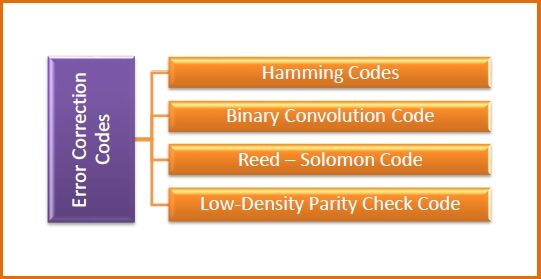
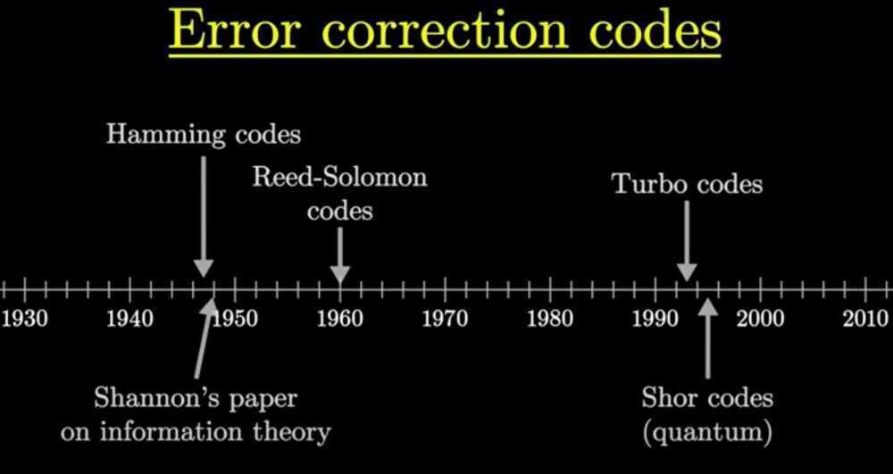
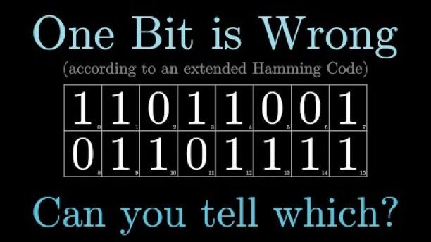

# Forward Error Correction

## Error Detection and Correction Codes

## Parity Bit

Aparity bit, orcheck bit, is a [bit](https://en.wikipedia.org/wiki/Bit) added to a string of [binary code](https://en.wikipedia.org/wiki/Binary_code) to ensure that the total number of 1-bits in the string is [even](https://en.wikipedia.org/wiki/Even_number) or [odd](https://en.wikipedia.org/wiki/Odd_number).Parity bits are used as the simplest form of [error detecting code](https://en.wikipedia.org/wiki/Error_detection_and_correction).
There are two variants of parity bits:even parity bitandodd parity bit.
In the case of even parity, for a given set of bits, the occurrences of bits whose value is 1 is counted. If that count is odd, the parity bit value is set to 1, making the total count of occurrences of 1s in the whole set (including the parity bit) an even number. If the count of 1s in a given set of bits is already even, the parity bit's value is 0.
In the case of odd parity, the coding is reversed. For a given set of bits, if the count of bits with a value of 1 is even, the parity bit value is set to 1 making the total count of 1s in the whole set (including the parity bit) an odd number. If the count of bits with a value of 1 is odd, the count is already odd so the parity bit's value is 0.
Even parity is a special case of a [cyclic redundancy check](https://en.wikipedia.org/wiki/Cyclic_redundancy_check)(CRC), where the 1-bit CRC is generated by the [polynomial](https://en.wikipedia.org/wiki/Polynomial) x+1.
If a bit is present at a point otherwise dedicated to a parity bit, but is not used for parity, it may be referred to as amark parity bitif the parity bit is always 1, or aspace parity bitif the bit is always 0. In such cases where the value of the bit is constant, it may be called astick parity biteven though its function has nothing to do with parity.The function of such bits varies with the system design, but examples of functions for such bits include timing management, or identification of a packet as being of data or address significance. If its actual bit value is irrelevant to its function, the bit amounts to a [don't-care term](https://en.wikipedia.org/wiki/Don%27t-care_term).
Parity bits are generally applied to the smallest units of a communication protocol, typically 8-bit [octets](https://en.wikipedia.org/wiki/Octet_(computing))(bytes), although they can also be applied separately to an entire message string of bits.

<https://en.wikipedia.org/wiki/Parity_bit>

## Forward Error Correction

Forward error correction (FEC) is an error correction technique to detect and correct a limited number of errors in transmitted data without the need for retransmission.
In this method, the sender sends a redundant error-correcting code along with the data frame. The receiver performs necessary checks based upon the additional redundant bits. If it finds that the data is free from errors, it executes error-correcting code that generates the actual frame. It then removes the redundant bits before passing the message to the upper layers.

## Advantages and Disadvantages

- Because FEC does not require handshaking between the source and the destination, it can be used for broadcasting of data to many destinations simultaneously from a single source.
- Another advantage is that FEC saves bandwidth required for retransmission. So, it is used in real time systems.
- Its main limitation is that if there are too many errors, the frames need to be retransmitted.

## Error Correction Codes for FEC

Error correcting codes for forward error corrections can be broadly categorized into two types, namely, block codes and convolution codes.

- **Block codes−** The message is divided into fixed-sized blocks of bits to which redundant bits are added for error correction.
- **Convolutional codes−** The message comprises of data streams of arbitrary length and parity symbols are generated by the sliding application of a Boolean function to the data stream.
There are four popularly used error correction codes.

- **Hamming Codes−** It is a block code that is capable of detecting up to two simultaneous bit errors and correcting single-bit errors.
In [telecommunication](https://en.wikipedia.org/wiki/Telecommunication), Hamming codesare a family of [linear error-correcting codes](https://en.wikipedia.org/wiki/Linear_code). Hamming codes can detect up to two-bit errors or correct one-bit errors without detection of uncorrected errors. By contrast, the simple [parity code](https://en.wikipedia.org/wiki/Parity_bit) cannot correct errors, and can detect only an odd number of bits in error. Hamming codes are [perfect codes](https://en.wikipedia.org/wiki/Perfect_code), that is, they achieve the highest possible [rate](https://en.wikipedia.org/wiki/Block_code#The_rate_R) for codes with their [block length](https://en.wikipedia.org/wiki/Block_code#The_block_length_n) and [minimum distance](https://en.wikipedia.org/wiki/Block_code#The_distance_d) of three.[Richard W. Hamming](https://en.wikipedia.org/wiki/Richard_Hamming) invented Hamming codes in 1950 as a way of automatically correcting errors introduced by [punched card](https://en.wikipedia.org/wiki/Punched_card) readers. In his original paper, Hamming elaborated his general idea, but specifically focused on the [Hamming(7,4)](https://en.wikipedia.org/wiki/Hamming(7,4)) code which adds three parity bits to four bits of data.

<https://en.wikipedia.org/wiki/Hamming_code>- **Binary Convolution Code−** Here, an encoder processes an input sequence of bits of arbitrary length and generates a sequence of output bits.
- **Reed-Solomon Code−** They are block codes that are capable of correcting burst errors in the received data block.
- **Low-Density Parity Check Code−** It is a block code specified by a parity-check matrix containing a low density of 1s. They are suitable for large block sizes in very noisy channels.

<https://www.tutorialspoint.com/forward-error-correction-fec>

<https://en.wikipedia.org/wiki/Forward_error_correction>

[Hamming codes, h■w to ov■rco■e n■ise.](https://www.youtube.com/watch?v=X8jsijhllIA)

## Binary Goley Code

In [mathematics](https://en.wikipedia.org/wiki/Mathematics) and [electronics engineering](https://en.wikipedia.org/wiki/Electronics_engineering), abinary Golay codeis a type of linear [error-correcting code](https://en.wikipedia.org/wiki/Error-correcting_code) used in [digital communications](https://en.wikipedia.org/wiki/Digital_communication). The binary Golay code, along with the [ternary Golay code](https://en.wikipedia.org/wiki/Ternary_Golay_code), has a particularly deep and interesting connection to the theory of [finite sporadic groups](https://en.wikipedia.org/wiki/Finite_sporadic_group) in mathematics.These codes are named in honor of [Marcel J. E. Golay](https://en.wikipedia.org/wiki/Marcel_J._E._Golay) whose 1949 paperintroducing them has been called, by [E. R. Berlekamp](https://en.wikipedia.org/wiki/E._R._Berlekamp), the "best single published page" in coding theory.
There are two closely related binary Golay codes. Theextended binary Golay code, G24(sometimes just called the "Golay code" in finite group theory) encodes 12 bits of data in a 24-bit word in such a way that any 3-bit errors can be corrected or any 7-bit errors can be detected. The other, theperfect binary Golay code, G23, has codewords of length 23 and is obtained from the extended binary Golay code by deleting one coordinate position (conversely, the extended binary Golay code is obtained from the perfect binary Golay code by adding a [parity bit](https://en.wikipedia.org/wiki/Parity_bit)). In standard coding notation the codes have parameters [24, 12, 8] and [23, 12, 7], corresponding to the length of the codewords, the [dimension](https://en.wikipedia.org/wiki/Dimension_(vector_space)) of the code, and the minimum [Hamming distance](https://en.wikipedia.org/wiki/Hamming_distance) between two codewords, respectively.

<https://en.wikipedia.org/wiki/Binary_Golay_code>

## Data Scrubbing

Data scrubbingis an [error correction](https://en.wikipedia.org/wiki/Error_correction) technique that uses a background task to periodically inspect [main memory](https://en.wikipedia.org/wiki/Main_memory) or [storage](https://en.wikipedia.org/wiki/Computer_data_storage) for errors, then correct detected errors using [redundant data](https://en.wikipedia.org/wiki/Data_redundancy) in the form of different [checksums](https://en.wikipedia.org/wiki/Checksum) or copies of data. Data scrubbing reduces the likelihood that single correctable errors will accumulate, leading to reduced risks of uncorrectable errors.
[Data integrity](https://en.wikipedia.org/wiki/Data_integrity) is a high-priority concern in writing, reading, storage, transmission, or processing of the [computer](https://en.wikipedia.org/wiki/Computer)[data](https://en.wikipedia.org/wiki/Data) in computer [operating systems](https://en.wikipedia.org/wiki/Operating_system) and in computer storage and data transmission systems. However, only a few of the currently existing and used file systems provide sufficient protection against [data corruption](https://en.wikipedia.org/wiki/Data_corruption).
To address this issue, data scrubbing provides routine checks of all [inconsistencies](https://en.wikipedia.org/wiki/Inconsistency) in data and, in general, prevention of hardware or software failure. This "scrubbing" feature occurs commonly in memory, disk arrays, [file systems](https://en.wikipedia.org/wiki/File_system), or [FPGAs](https://en.wikipedia.org/wiki/Field-programmable_gate_array) as a mechanism of error detection and correction.

<https://en.wikipedia.org/wiki/Data_scrubbing>

## Checksum

## Verhoeff algorithm

TheVerhoeff algorithmis a [checksum](https://en.wikipedia.org/wiki/Checksum) formula for [error detection](https://en.wikipedia.org/wiki/Error_detection) developed by the Dutch mathematician [Jacobus Verhoeff](https://en.wikipedia.org/wiki/Jacobus_Verhoeff) and was first published in 1969. It was the first decimal [check digit](https://en.wikipedia.org/wiki/Check_digit) algorithm which detects all single-digit errors, and all transposition errors involving two adjacent digits, which was at the time thought impossible with such a code.
Ex - used in aadhaar validation

<https://en.wikipedia.org/wiki/Verhoeff_algorithm>

<https://medium.com/@krs.sharath03/how-aadhar-number-is-generated-and-validated-3c3e7172e606>
