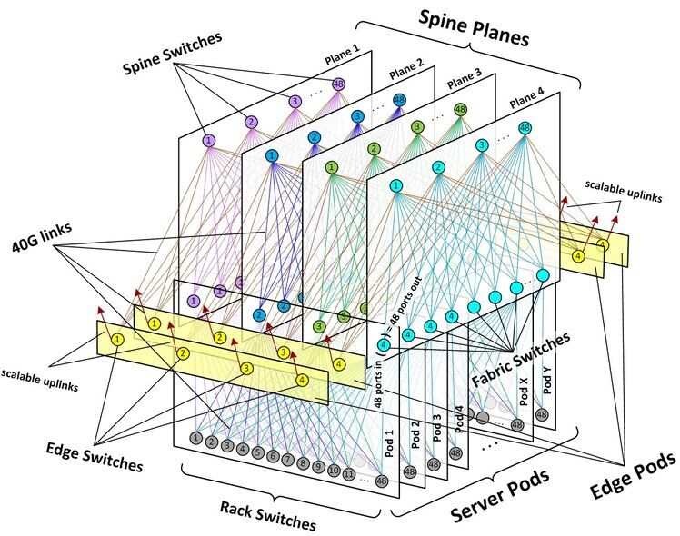

# Networking Fabric

The networking switch fabric is the basic topology of how a network is laid out and connected to switch traffic on a data or circuit-switched network.
The switch fabric concept, in which many connections are made in a matrix, has a long history in communications, dating back to the circuit-switched voice telephone days when connections were switched by humans operating a switchboard. The term "fabric" comes from the criss-cross nature of a networking fabric, which is often visualized as a checkerboard of connections
Although the basic concept of switch fabrics dates back to the origins of the telephone nearly 150 years ago, data networking has pushed theconcept to new levels. We've come a long way from the local telephone switchboard. Now, a myriad of physical connectivity, chip, and switching technologies are used to connect bits in a networking fabric. In some cases, a switching fabric can be boiled down to a single switch, known as a "switch on a chip."
As data networks were developed, switch fabrics took on many variations and evolutions as technology competitors tried to introduce innovations to the market. As Ethernet has gained primary market-share for moving data around the world, the Ethernet switch has become the most popular switching machine to create networking fabrics. However, over the years, many other technologies have been developed to build switching fabrics and many of these are still used in production, including Time Division Multiplexing (TDM), [Frame](https://www.sdxcentral.com/listings/frame/) Relay, and [storage](https://www.sdxcentral.com/data-center/storage/) protocols such as Fibre Channel. All of these technologies can be used to build their own networking fabrics. Optical networking technologies such as Dense Wave Division Multiplexing (DWDM) can also be used to build networking fabrics, though some optical networking technologies are used to create networking "rings," which don't necessarily resemble fabrics but can be used to connect networks using a different topology (for example, a "metro ring" is a common optical technology used to connect metro geographic areas).
Many of the innovations around switching fabrics come down to how technologies can be used to mitigate potential problems in switching data in a fabric, including latency (how fast connections can be made), collisions (data packets or frames "colliding" with each other inside the switch), and power and heat limitations of the switch design.

## From Physical to the Virtual

The latest development in switch fabrics is to build them in a flexible, virtual way, using [software-defined networking (SDN)](https://www.sdxcentral.com/networking/sdn/). Using [SDN](https://www.sdxcentral.com/networking/sdn/definitions/what-the-definition-of-software-defined-networking-sdn/), physical network switches can be managed and automated using software, rather than requiring physical changes. Virtual switches are most often implemented by a hypervisor technology that can be placed on a server or a switch and allow it to be controlled by emerging [SDN](https://www.sdxcentral.com/networking/sdn/definitions/what-is-software-defined-compute/) technology.
This move to large, virtualized networks and [SDN](https://www.sdxcentral.com/networking/sdn/definitions/why-sdn-software-defined-networking-or-nfv-network-functions-virtualization-now/) has given "switch fabric" new life as technology vendors have injected the term into their marketing descriptions for creating large, virtualized switched networks, which tie together physical networking devices. In addition, large "hyperscale" providers such as Facebook have created new "switch fabric architectures" describing how all of the pieces of a data center can be meshed together to move data (see diagram above).
<https://www.sdxcentral.com/data-center/what-is-networking-switch-fabric>
