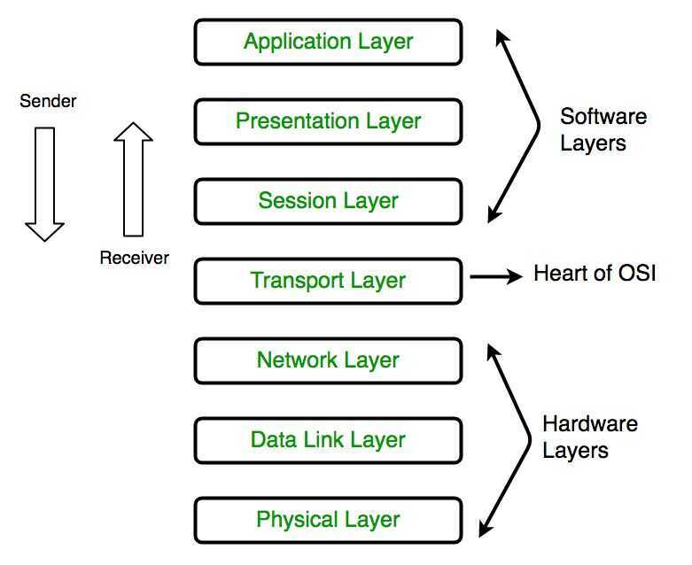
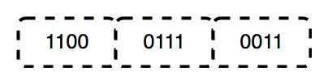
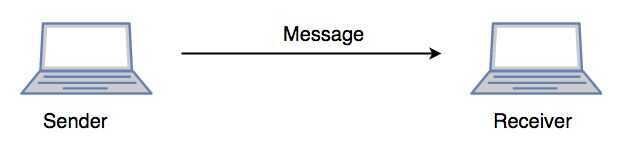

# OSI Layers

Mnemonic - All people seem to need data processing
OSI Model (Open Systems Interconnection)

It was designed to be a reference model for describing the functions of a communication system. It has been developed by ISO -- '**International Organization of Standardization**', in the year 1974.

| Layer | Protocol data unit (PDU) | Function |
| --- | --- | --- |
| 7. [Application](https://en.wikipedia.org/wiki/Application_layer) | Data | High-level APIs, including resource sharing, remote file access |
| 6. [Presentation](https://en.wikipedia.org/wiki/Presentation_layer) |  | Translation of data between a networking service and an application; including character encoding, data compression and encryption/decryption |
| 5. [Session](https://en.wikipedia.org/wiki/Session_layer) |  | Managing communication sessions, i.e. continuous exchange of information in the form of multiple back-and-forth transmissions between two nodes |
| 4. [Transport](https://en.wikipedia.org/wiki/Transport_layer) | Segment, Datagram | Reliable transmission of data segments between points on a network, including segmentation, acknowledgement and multiplexing |
| 3. [Network](https://en.wikipedia.org/wiki/Network_layer) | Packet | Structuring and managing a multi-node network, including addressing, routing and traffic control |
| 2. [Data link](https://en.wikipedia.org/wiki/Data_link_layer) | Frame | Reliable transmission of data frames between two nodes connected by a physical layer |
| 1. [Physical](https://en.wikipedia.org/wiki/Physical_layer) | Bit | Transmission and reception of raw bit streams over a physical medium |

## Physical Layer (Layer 1)

The lowest layer of the OSI reference model is the physical layer. It is responsible for the actual physical connection between the devices. The physical layer contains information in the form ofbits. When receiving data, this layer will get the signal received and convert it into 0s and 1s and send them to the Data Link layer, which will put the frame back together.

The functions of the physical layer are :

- Bit synchronization:The physical layer provides the synchronization of the bits by providing a clock. This clock controls both sender and receiver thus providing synchronization at bit level.

- Bit rate control:The Physical layer also defines the transmission rate i.e. the number of bits sent per second.

- Physical topologies:Physical layer specifies the way in which the different, devices/nodes are arranged in a network i.e. bus, star or mesh topolgy.

- Transmission mode:Physical layer also defines the way in which the data flows between the two connected devices. The various transmission modes possible are: Simplex, half-duplex and full-duplex.

- Hub, Repeater, Modem, Cables are Physical Layer devices.

Network Layer, Data Link Layer and Physical Layer are also known as Lower Layers or Hardware Layers.

## Data Link Layer (DLL) (Layer 2)

The data link layer is responsible for the node to node delivery of the message. The main function of this layer is to make sure data transfer is error free from one node to another, over the physical layer. When a packet arrives in a network, it is the responsibility of DLL to transmit it to the Host using its MAC address.
Data Link Layer is divided into two sub layers :

- Logical Link Control (LLC)

- Media Access Control (MAC)

MAC determines how devices in a network gain access to a medium and permission to transmit data. LLC identifies and encapsulates network layer protocols and controls error checking and frame synchronization.
Packet received from Network layer is further divided into frames depending on the frame size of NIC(Network Interface Card). DLL also encapsulates Sender and Receiver's MAC address in the header.
The Receiver's MAC address is obtained by placing an ARP(Address Resolution Protocol) request onto the wire asking "Who has that IP address?" and the destination host will reply with its MAC address.
The functions of the data Link layer are :

- Framing:Framing is a function of the data link layer. It provides a way for a sender to transmit a set of bits that are meaningful to the receiver. This can be accomplished by attaching special bit patterns to the beginning and end of the frame.

- Physical addressing:After creating frames, Data link layer adds physical addresses (MAC address) of sender and/or receiver in the header of each frame.

- Error control:Data link layer provides the mechanism of error control in which it detects and retransmits damaged or lost frames.

- Flow Control:The data rate must be constant on both sides else the data may get corrupted thus , flow control coordinates that amount of data that can be sent before receiving acknowledgement.

- Access control:When a single communication channel is shared by multiple devices, MAC sub-layer of data link layer helps to determine which device has control over the channel at a given time.

- Packet in Data Link layer is referred asFrame.

** Data Link layer is handled by the NIC (Network Interface Card) and device drivers of host machines.

*** Switch & Bridge are Data Link Layer devices.

## Network Layer (Layer 3)

Network layer works for the transmission of data from one host to the other located in different networks. It also takes care of packet routing i.e. selection of shortest path to transmit the packet, from the number of routes available. **The sender & receiver's IP address are placed in the header by network layer.**

The functions of the Network layer are :

- Routing:The network layer protocols determine which route is suitable from source to destination. This function of network layer is known as routing.

- Logical Addressing:In order to identify each device on internetwork uniquely, network layer defines an addressing scheme. The sender & receiver's IP address are placed in the header by network layer. Such an address distinguishes each device uniquely and universally.
If a packet is too large to be transmitted, it can be split into several fragments which are shipped out and then reassembled on the receiving end. Layer 3 also contains network firewalls and 3-layer switches.

- Segmentin Network layer is referred asPacket.

**Network layer is implemented by networking devices such as routers.

## Transport Layer (Layer 4)

Transport layer provides services to application layer and takes services from network layer. The data in the transport layer is referred to as Segments. It is responsible for the End to End delivery of the complete message. Transport layer also provides the acknowledgement of the successful data transmission and re-transmits the data if error is found.

- At sender's side:

Transport layer receives the formatted data from the upper layers, performsSegmentationand also implementsFlow & Error controlto ensure proper data transmission. It also adds Source and Destination port number in its header and forwards the segmented data to the Network Layer.

Note:The sender need to know the port number associated with the receiver's application.

Generally this destination port number is configured, either by default or manually. For example, when a web application makes a request to a web server, it typically uses port number 80, because this is the default port assigned to web applications. Many applications have default port assigned.

- At receiver's side:

Transport Layer reads the port number from its header and forwards the Data which it has received to the respective application. It also performs sequencing and reassembling of the segmented data.
The functions of the transport layer are :

- Segmentation and Reassembly:This layer accepts the message from the (session) layer , breaks the message into smaller units . Each of the segment produced has a header associated with it. The transport layer at the destination station reassembles the message.

- Service Point Addressing:In order to deliver the message to correct process, transport layer header includes a type of address called service point address or port address. Thus by specifying this address, transport layer makes sure that the message is delivered to the correct process.

The services provided by transport layer :

- Connection Oriented Service:It is a three phase process which include
  - Connection Establishment
  - Data Transfer
  - Termination / disconnection

     In this type of transmission the receiving device sends an acknowledgment, back to the source after a packet or group of packet is received. This type of transmission is reliable and secure.

- Connection less service:It is a one phase process and includes Data Transfer. In this type of transmission the receiver does not acknowledge receipt of a packet. This approach allows for much faster communication between devices. Connection oriented Service is more reliable than connection less Service.

- Data in the Transport Layer is called asSegments.

** Transport layer is operated by the Operating System. It is a part of the OS and communicates with the Application Layer by making system calls.

Transport Layer is called as Heart of OSImodel.

## Session Layer (Layer 5)

This layer is responsible for establishment of connection, maintenance of sessions, authentication and also ensures security.

The functions of the session layer are :

- Session establishment, maintenance and termination:The layer allows the two processes to establish, use and terminate a connection.

- Synchronization :This layer allows a process to add checkpoints which are considered as synchronization points into the data. These synchronization point help to identify the error so that the data is re-synchronized properly, and ends of the messages are not cut prematurely and data loss is avoided.

- Dialog Controller :The session layer determines which device will communicate first and the amount of data that will be sent.

**All the above 3 layers are integrated as a single layer in TCP/IP model as "Application Layer".

**Implementation of above 3 layers is done by the network application itself. These are also known asUpper LayersorSoftware Layers.

SCENARIO:

Let's consider a scenario where a user wants to send a message through some Messenger application running in his browser. The "Messenger" here acts as the application layer which provides the user with an interface to create the data. This message or so called Data is compressed, encrypted (if any secure data) and converted into bits (0's and 1's) so that it can be transmitted.

## Presentation Layer (Layer 6)

Presentation layer is also called theTranslation layer.The data from the application layer is extracted here and manipulated as per the required format to transmit over the network.

The functions of the presentation layer are :

- Translation :For example, ASCII to EBCDIC.

- Encryption/ Decryption :Data encryption translates the data into another form or code. The encrypted data is known as the cipher text and the decrypted data is known as plain text. A key value is used for encrypting as well as decrypting data.

- Compression:Reduces the number of bits that need to be transmitted on the network.

## Application Layer (Layer 7)

At the very top of the OSI Reference Model stack of layers, we find Application layer which is implemented by the network applications. These applications produce the data, which has to be transferred over the network. This layer also serves as window for the application services to access the network and for displaying the received information to the user.

Ex: Application -- Browsers, Skype Messenger etc.

**Application Layer is also called as Desktop Layer.

The functions of the Application layer are :

- Network Virtual Terminal
- FTAM-File transfer access and management
- Mail Services
- Directory Services

OSI model acts as a reference model and is not implemented in Internet because of its late invention. Current model being used is the TCP/IP model.

## References

https://www.digitalocean.com/community/tutorials/an-introduction-to-networking-terminology-interfaces-and-protocols

https://www.freecodecamp.org/news/osi-model-networking-layers-explained-in-plain-english

https://www.freecodecamp.org/news/osi-model-computer-networking-for-beginners

https://www.freecodecamp.org/news/the-five-layers-model-explained
