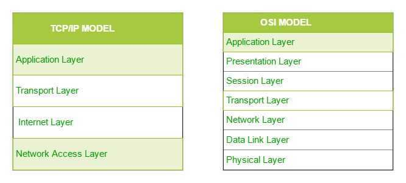
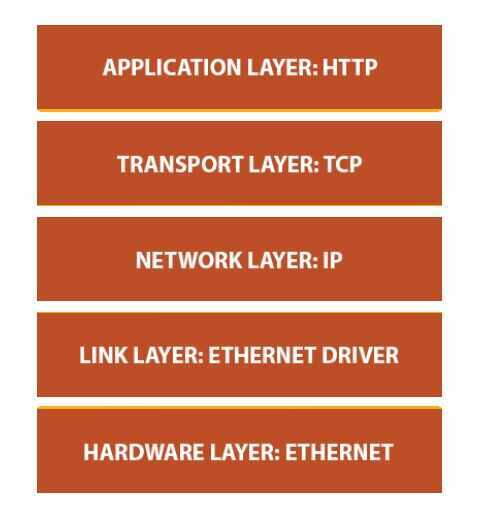

# TCP/IP

TheOSI Modelwe just looked at is just a reference/logical model. It was designed to describe the functions of the communication system by dividing the communication procedure into smaller and simpler components. But when we talk about the TCP/IP model, it was designed and developed by Department of Defense (DoD) in 1960s and is based on standard protocols. It stands for Transmission Control Protocol/Internet Protocol. TheTCP/IP modelis a concise version of the OSI model. It contains four layers, unlike seven layers in the OSI model. The layers are:

1. Process/Application Layer
2. Host-to-Host/Transport Layer
3. Internet Layer
4. Network Access/Link Layer

**TCP is built on top of IP. TCP is obliged to somehow send data reliably using only an unreliable tool (IP)**

The diagrammatic comparison of the TCP/IP and OSI model is as follows

## 1. Network Access Layer / Link layer

This layer corresponds to the combination of Data Link Layer and Physical Layer of the OSI model. It looks out for hardware addressing and the protocols present in this layer allows for physical transmission of data.
We just talked about ARP being a protocol of Internet layer, but there is a conflict about declaring it as a protocol of Internet Layer or Network access layer. It is described as residing in layer 3, being encapsulated by layer 2 protocols.

- The **Multiple Spanning Tree Protocol (MSTP)** and [algorithm](https://en.wikipedia.org/wiki/Algorithm), provides both simple and full connectivity assigned to any given [Virtual LAN](https://en.wikipedia.org/wiki/Virtual_LAN)(VLAN) throughout a Bridged Local Area Network. MSTP uses [BPDUs](https://en.wikipedia.org/wiki/Bridge_Protocol_Data_Unit) to exchange information between spanning-tree compatible devices, to prevent loops in each [MSTI](https://en.wikipedia.org/wiki/Multiple_Spanning_Tree_Protocol#Multiple_Spanning_Tree_Instances_(MSTI))(Multiple Spanning Tree Instances) and in the [CIST](https://en.wikipedia.org/wiki/Multiple_Spanning_Tree_Protocol#Common_and_Internal_Spanning_Tree(CST/CIST))(Common and Internal Spanning Tree), by selecting active and blocked paths. This is done as well as in [STP](https://en.wikipedia.org/wiki/Spanning_Tree_Protocol) without the need of manually enabling backup links and getting rid of [bridge](https://en.wikipedia.org/wiki/Bridging_(networking))[loops](https://en.wikipedia.org/wiki/Switching_loop) danger.

## 2. Internet Layer

This layer parallels the functions of OSI's Network layer. It defines the protocols which are responsible for logical transmission of data over the entire network. The main protocols residing at this layer are :

- **IP (IPV4/IPV6) --** stands for Internet Protocol and it is responsible for delivering packets from the source host to the destination host by looking at the IP addresses in the packet headers. IP has 2 versions:
    IPv4 and IPv6. IPv4 is the one that most of the websites are using currently. But IPv6 is growing as the number of IPv4 addresses are limited in number when compared to the number of users.

- **ICMP --** stands for Internet Control Message Protocol. It is encapsulated within IP datagrams and is responsible for providing hosts with information about network problems.

- **ARP --** stands for Address Resolution Protocol. It's job is to find the hardware address of a host from a known IP address. ARP has several types: Reverse ARP, Proxy ARP, Gratituous ARP and Inverse ARP.

## 3. Host-to-Host Layer / Transport layer

This layer is analogous to the transport layer of the OSI model. It is responsible for end-to-end communication and error-free delivery of data. It shields the upper-layer applications from the complexities of data. The two main protocols present in this layer are :

- **Transmission Control Protocol (TCP) --** It is known to provide reliable and error-free communication between end systems. It performs sequencing and segmentation of data. It also has acknowledgement feature and controls the flow of the data through flow control mechanism. It is a very effective protocol but has a lot of overhead due to such features. Increased overhead leads to increased cost.

- User Datagram Protocol (UDP) --On the other hand does not provide any such features. It is the go to protocol if your application does not require reliable transport as it is very cost-effective. Unlike TCP, which is connection-oriented protocol, UDP is connectionless.

[UDP vs TCP - What are the differences? - YouTube](https://www.youtube.com/watch?v=v6m4DbhQQ_8&ab_channel=Finematics)

## 4. Process Layer / Application layer

This layer performs the functions of top three layers of the OSI model: Application, Presentation and Session Layer. It is responsible for node-to-node communication and controls user-interface specifications. Some of the protocols present in this layer are : HTTP, HTTPS, FTP, TFTP, Telnet, SSH, SMTP, SNMP, NTP, DNS, DHCP, NFS, X Window, LPD.

- **HTTP and HTTPS --** HTTP stands for Hyper-text transfer protocol. It is used by the World Wide Web to manage communications between web browsers and servers. HTTPS stands for HTTP-Secure. It is a combination of HTTP with SSL(Secure Socket Layer). It is efficient in cases where the browser need to fill out forms, sign in, authenticate and carry out bank transactions.

- **SSH --** SSH stands for Secure Shell. It is a terminal emulations software similar to Telnet. The reason SSH is more preferred is because of its ability to maintain encrypted connection. It sets up a secure session over a TCP/IP connection.

- **NTP --** NTP stands for Network Time Protocol. It is used to synchronize the clocks on our computer to one standard time source. It is very useful in situations like bank transactions. Assume the following situation without the presence of NTP. Suppose you carry out a transaction, where your computer reads the time at 2:30 PM while the server records it at 2:28 PM. The server can crash very badly if it's out of sync.

## Is UDP port 80 the same as TCP port 80?

UDP and TCP both support the same port numbers (1-65535) but they're different protocols. You can run 2 different servers on UDP port 80 and TCP port 80 at the same time.

<https://blog.cloudflare.com/unimog-cloudflares-edge-load-balancer>
