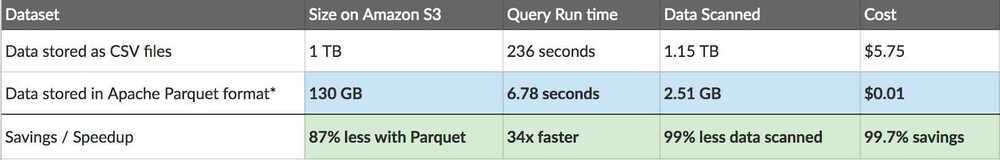
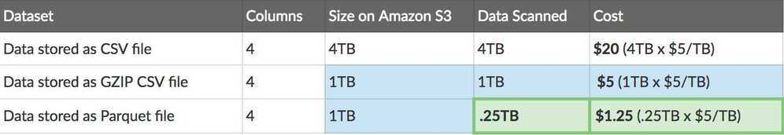
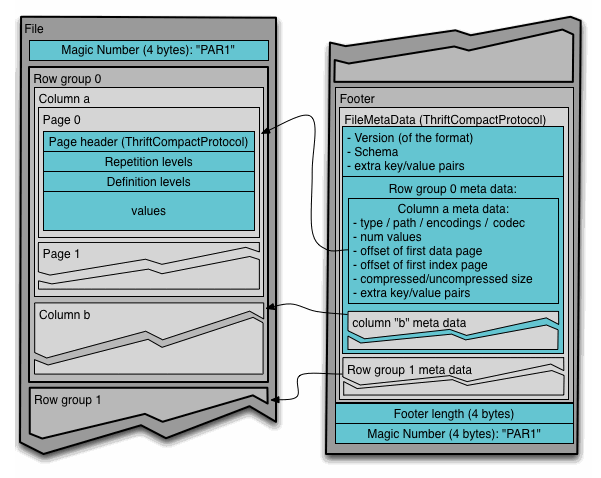

# Apache Parquet

Apache Parquet is a [free and open-source](https://en.wikipedia.org/wiki/Free_and_open-source)[column-oriented](https://en.wikipedia.org/wiki/Column-oriented_DBMS) data store of the [Apache Hadoop](https://en.wikipedia.org/wiki/Apache_Hadoop) ecosystem. It is similar to the other columnar-storage file formats available in [Hadoop](https://en.wikipedia.org/wiki/Apache_Hadoop) namely [RCFile](https://en.wikipedia.org/wiki/RCFile) and Optimized RCFile (ORC). It is compatible with most of the data processing frameworks in the [Hadoop](https://en.wikipedia.org/wiki/Hadoop) environment. It provides efficient [data compression](https://en.wikipedia.org/wiki/Data_compression) and [encoding](https://en.wikipedia.org/wiki/Encoding) schemes with enhanced performance to handle complex data in bulk

Apache Parquet is a self-describing data format which embeds the schema, or structure, within the data itself.- Columnar format

- Schema segregated into footer
- Column major format
- All data is pushed to the leaf
- Integrated compression and indexes
- Support for **predicate pushdown**

## Design Goals

- Interoperability
- Space efficiency
- Query efficiency

## Features

- Improved read performance at the cost of slower writes.
- Apache Parquet is implemented using the **record-shredding and assembly algorithm**, which accommodates the complex [data structures](https://en.wikipedia.org/wiki/Data_structures) that can be used to store the data.The values in each column are physically stored in contiguous memory locations and this columnar storage provides the following benefits:
  - Column-wise compression is efficient and saves storage space
  - Compression techniques specific to a type can be applied as the column values tend to be of the same type
  - Queries that fetch specific column values need not read the entire raw data thus improving performance
  - Different encoding techniques can be applied to different columns

## Compression and encoding

In Parquet, compression is performed column by column, which enables different encoding schemes to be used for text and integer data. This strategy also keeps the door open for newer and better encoding schemes to be implemented as they are invented.

## Dictionary encoding

Parquet has an automatic dictionary encoding enabled dynamically for data with asmallnumber of unique values (i.e. below 105) that enables significant compression and boosts processing speed.

## Bit packing

Storage of integers is usually done with dedicated 32 or 64 bits per integer. For small integers, packing multiple integers into the same space makes storage more efficient.

## Run-length encoding (RLE)

To optimize storage of multiple occurrences of the same value, a single value is stored once along with the number of occurrences.
Parquet implements a hybrid of bit packing and RLE, in which the encoding switches based on which produces the best compression results. This strategy works well for certain types of integer data and combines well with dictionary encoding.

## Parquet Cares About Your Schema

One limitation of CSV/TSV data is that you don't know what the exact schema is supposed to be, or the desired type of each field.

Using our example above, without the schema, should the 'True' values be cast to boolean? How can we be sure without knowing the schema beforehand?

JSON improves upon CSV as each row provides some indication of schema, but without a special header-row, there's no way to derive a schema for every record in the file, and it isn't always clear what type a 'null' value should be interpreted as.

Avro and Parquet on the other hand understand the schema of the data they store. When you write a file in these formats, you need to specify your schema. When you read the file back, it tells you the schema of the data stored within. This is super useful for a framework like Spark, which can use this information to give you a fully formed data-frame with minimal effort.

Even ignoring the runtime of your production jobs, let me outline some of my favorite ways to use Parquet outside of analytics workloads:

1. Data validation- need to do some rough counts to verify your data is complete? Such checks can be run in a few seconds with Parquet, even with a 1TB dataset.

2. Debugging- did your pipeline do the right thing? Did it add/remove/modify the right records? With parquet you can capture quick and easy information (such as all unique values of a column) in a few seconds without scanning the whole file.

3. Quick Metrics Extraction- want to record in your monitoring system a count of a subset of records in your dataset? Previously I captured this information by running a follow-up pipeline, but with Parquet it is a very fast query through either Hive or Spark SQL.

4. Less redundancy- Need a similar dataset for two different pipelines? Instead of building a distinct dataset for each, Parquet lets you just dynamically query a larger, comprehensive dataset without the penalties of scanning a whole file.

5. Analytics- Ok, I cheated and put it in anyway. Yes, Parquet is AMAZING for analytics, anyone running SQL queries will thank you for saving them hours a day in front of a SQL prompt when their queries run up to 1000x faster.

## Working

## Comparison

Apache Parquet is comparable to [RCFile](https://en.wikipedia.org/wiki/RCFile) and [Optimized Row Columnar (ORC)](https://en.wikipedia.org/wiki/Apache_ORC) file formats - all three fall under the category of columnar data storage within the Hadoop ecosystem. They all have better compression and encoding with improved read performance at the cost of slower writes. In addition to these features, Apache Parquet supports limited [schema evolution](https://en.wikipedia.org/wiki/Schema_evolution), i.e., the schema can be modified according to the changes in the data. It also provides the ability to add new columns and merge schemas that don't conflict.

## Negatives of Columnar Formats

The biggest negative of columnar formats is that re-constructing a complete record is slower and requires reading segments from each row, one-by-one. It is for this reason that columnar-file-formats initially hit their groove for analytics-style workflows, rather than Map/Reduce style workflows - which by default operate on whole rows of data at a time.
For real columnar file formats (like [Parquet](http://parquet.apache.org/)), this downside is minimized by some clever tricks like breaking the file up into 'row groups' and building extensive metadata, although for particularly wide datasets (like 200+ columns), the speed impact can be fairly significant.

The other downside, is that they are more CPU and ram intensive to write, as the file writer needs to collect a whole bunch of metadata, and reorganize the rows before it can write the file.

As an aside - I still almost always recommend still using a columnar file format, it's just so useful to be able to quickly peek into a file and gather some simple metrics.

## Tools

<https://github.com/apache/parquet-mr/tree/master/parquet-tools>

## References

<https://en.wikipedia.org/wiki/Apache_Parquet>

<https://parquet.apache.org/documentation/latest>

<https://blog.matthewrathbone.com/2019/12/20/parquet-or-bust.html>

<https://github.com/julienledem/redelm/wiki/The-striping-and-assembly-algorithms-from-the-Dremel-paper>

<https://blog.twitter.com/engineering/en_us/a/2013/dremel-made-simple-with-parquet.html>

[**https://www.youtube.com/watch?v=rVC9F1y38oU**](https://www.youtube.com/watch?v=rVC9F1y38oU)
