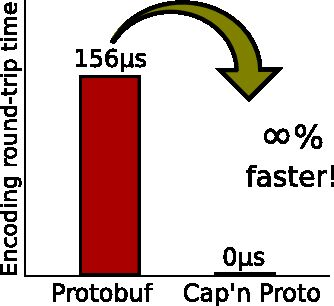

# Data formats

## Hierarchical Data Format

Hierarchical Data Format(**HDF**) is a set of file formats (**HDF4**,**HDF5) designed to store and organize large amounts of data

HDF5 simplifies the file structure to include only two major types of object:

- Datasets, which are multidimensional arrays of a homogeneous type
- Groups, which are container structures which can hold datasets and other groups

In addition to these advances in the file format, HDF5 includes an improved type system, and dataspace objects which represent selections over dataset regions. The API is also object-oriented with respect to datasets, groups, attributes, types, dataspaces and property lists.

Because it uses [B-trees](https://en.wikipedia.org/wiki/B-trees) to index table objects, HDF5 works well for [time series](https://en.wikipedia.org/wiki/Time_series) data such as stock price series, network monitoring data, and 3D meteorological data. The bulk of the data goes into straightforward arrays (the table objects) that can be accessed much more quickly than the rows of an [SQL](https://en.wikipedia.org/wiki/SQL) database, but B-tree access is available for non-array data. The HDF5 data storage mechanism can be simpler and faster than an SQL [star schema](https://en.wikipedia.org/wiki/Star_schema).

<https://en.wikipedia.org/wiki/Hierarchical_Data_Format>

## Cap'n Proto

Cap'n Proto is an insanely fast data interchange format and capability-based RPC system. Think JSON, except binary. Or think [Protocol Buffers](http://protobuf.googlecode.com/), except faster.

Cap'n Proto gets a perfect score because*there is no encoding/decoding step*. The Cap'n Proto encoding is appropriate both as a data interchange format and an in-memory representation, so once your structure is built, you can simply write the bytes straight out to disk!

<https://capnproto.org>

<https://github.com/capnproto/capnproto>

## Apache Thrift

Thrift is an [interface definition language](https://en.wikipedia.org/wiki/Interface_definition_language) and [binary communication protocol](https://en.wikipedia.org/wiki/Binary_protocol) used for defining and creating [services](https://en.wikipedia.org/wiki/Service_(systems_architecture)) for numerous languages. It forms a [remote procedure call](https://en.wikipedia.org/wiki/Remote_procedure_call)(RPC) framework and was developed at [Facebook](https://en.wikipedia.org/wiki/Facebook) for "scalable cross-language services development". It combines a software stack with a code generation engine to build [cross-platform](https://en.wikipedia.org/wiki/Cross-platform) services which can connect applications written in a variety of languages and frameworks, including [ActionScript](https://en.wikipedia.org/wiki/ActionScript), [C](https://en.wikipedia.org/wiki/C_(programming_language)), [C++](https://en.wikipedia.org/wiki/C%2B%2B), [C#](https://en.wikipedia.org/wiki/C_Sharp_(programming_language)), [Cappuccino](https://en.wikipedia.org/wiki/Cappuccino_(application_development_framework)), [Cocoa](https://en.wikipedia.org/wiki/Cocoa_(API)), [Delphi](https://en.wikipedia.org/wiki/Embarcadero_Delphi), [Erlang](https://en.wikipedia.org/wiki/Erlang_(programming_language)), [Go](https://en.wikipedia.org/wiki/Go_(programming_language)), [Haskell](https://en.wikipedia.org/wiki/Haskell_(programming_language)), [Java](https://en.wikipedia.org/wiki/Java_(programming_language)), [Node.js](https://en.wikipedia.org/wiki/Node.js), [Objective-C](https://en.wikipedia.org/wiki/Objective-C), [OCaml](https://en.wikipedia.org/wiki/OCaml), [Perl](https://en.wikipedia.org/wiki/Perl), [PHP](https://en.wikipedia.org/wiki/PHP), [Python](https://en.wikipedia.org/wiki/Python_(programming_language)), [Ruby](https://en.wikipedia.org/wiki/Ruby_(programming_language)) and [Smalltalk](https://en.wikipedia.org/wiki/Smalltalk)

<https://en.wikipedia.org/wiki/Apache_Thrift>
