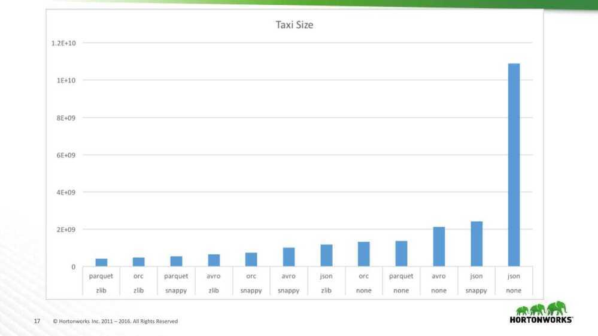
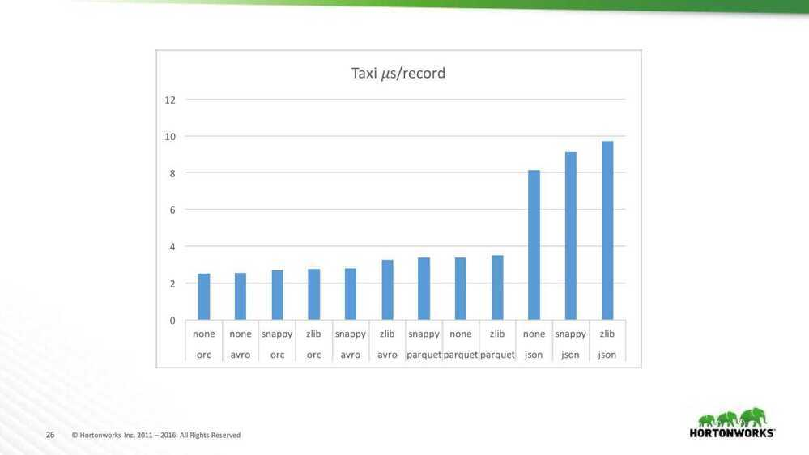
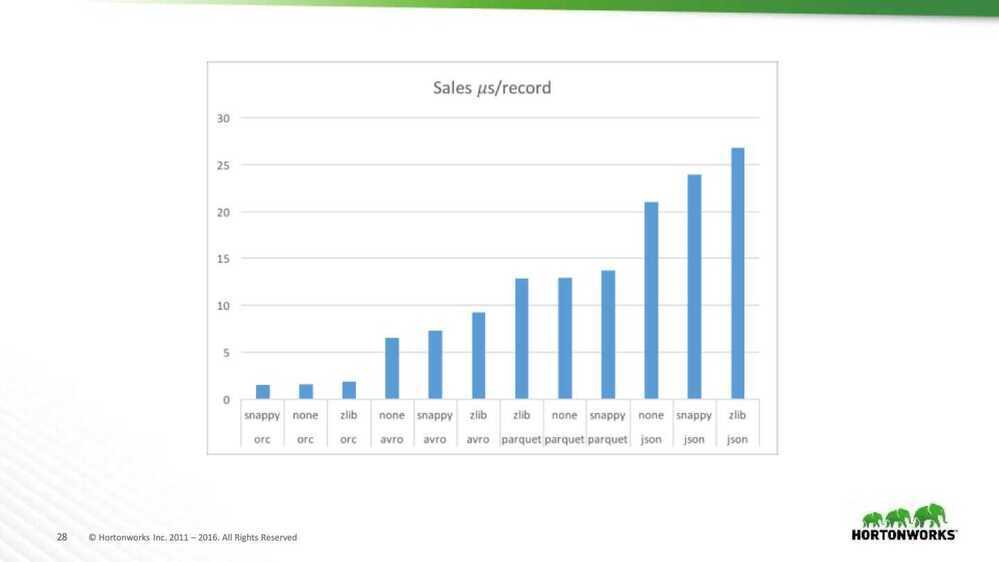

# File Formats

CSV, TSV, JSON, and Avro, are traditional row-based file formats. Parquet, and ORC file are columnar file formats.

## SequenceFile

Sequence files are introduced in Hadoop. Sequence files act as a container to store the small files. Sequence files are flat files consisting of binary key-value pairs. When Hive converts queries to MapReduce jobs, it decides on the appropriate key-value pairs to be used for a given record.Sequence files are in the binary format which can be split and the main use of these files is to club two or more smaller files and make them as a one sequence file.

There are three types of sequence files:

- Uncompressed key/value records.
- Record compressed key/value records -- only 'values' are compressed here
- Block compressed key/value records -- both keys and values are collected in 'blocks' separately and compressed. The size of the 'block' is configurable.

## RCFile

- RCFILE stands of Record Columnar File which is another type of binary file format which offers high compression rate on the top of the rows.
- RCFILE is used when we want to perform operations on multiple rows at a time.
- RCFILEs are flat files consisting of binary key/value pairs, which shares many similarities with SEQUENCEFILE. RCFILE stores columns of a table in form of record in a columnar manner. It first partitions rows horizontally into row splits and then it vertically partitions each row split in a columnar way. RCFILE first stores the metadata of a row split, as the key part of a record, and all the data of a row split as the value part. This means that RCFILE encourages column oriented storage rather than row oriented storage.
- This column oriented storage is very useful while performing analytics. It is easy to perform analytics when we "hive' a column oriented storage type.

## ORCFile

- ORC stands for **Optimized Row Columnar** which means it can store data in an optimized way than the other file formats. ORC reduces the size of the original data up to 75%(eg: 100GB file will become 25GB). As a result the speed of data processing also increases. ORC shows better performance than Text, Sequence and RC file formats.
- An ORC file contains rows data in groups called as Stripes along with a file footer. ORC format improves the performance when Hive is processing the data.

## Choosing File Formats

- If your data is delimited by some parameters then you can use TEXTFILE format.
- If your data is in small files whose size is less than the block size then you can use SEQUENCEFILE format.
- If you want to perform analytics on your data and you want to store your data efficiently for that then you can use RCFILE format.
- If you want to store your data in an optimized way which lessens your storage and increases your performance then you can use ORCFILE format.

https://acadgild.com/blog/apache-hive-file-formats

## Amazon Ion

Amazon Ion is a [richly-typed](http://amzn.github.io/ion-docs/guides/why.html#rich-type-system), [self-describing](http://amzn.github.io/ion-docs/guides/why.html#self-describing), hierarchical data serialization format offering [interchangeable binary and text](http://amzn.github.io/ion-docs/guides/why.html#dual-format-interoperability) representations. The [text format](http://amzn.github.io/ion-docs/docs/spec.html)(a superset of [JSON](http://json.org/)) is easy to read and author, supporting rapid prototyping. The [binary representation](http://amzn.github.io/ion-docs/docs/binary.html) is [efficient to store, transmit, and skip-scan parse](http://amzn.github.io/ion-docs/guides/why.html#read-optimized-binary-format). The rich type system provides unambiguous semantics for long-term preservation of data which can survive multiple generations of software evolution.

Ion was built to address rapid development, decoupling, and efficiency challenges faced every day while engineering large-scale, service-oriented architectures. It has been addressing these challenges within Amazon for nearly a decade, and we believe others will benefit as well.

The Ion text format is a superset of JSON; thus, any valid JSON document is also a valid Ion document.

http://amzn.github.io/ion-docs

http://amzn.github.io/ion-docs/docs/spec.html

## File Format Benchmarks - Avro, JSON, ORC, Parquet

Avro

- Cross-language file format for Hadoop
- Schema evolution was primary goal
- Schema segregated from data
    - Unlike Protobuf and Thrift
- Row major format

JSON

- Serialization format for HTTP & Javascript
- Text-format with many parsers
- Schema completely integrated with data
- Row major format
- Compression applied on top

ORC

- Originally part of Hive to replace RCFile
    - Now top-level project
- Schema segregated into footer
- Column major format with stripes
- Rich type mode, stored top-down
- Integrated compression, indexes, & stats

Parquet

- Design based on Google's Dremel paper
- Schema segregated into footer
- Column major format with stripes
- Simpler type-model with logical types
- All data pushed to leaves of the tree
- Integrated compression and indexes

## DataSets

- NYC Taxi Data
    - 18 columns with no null values
    - Doubles, integers, decimal & strings
    - 2 months of data - 22.7 million rows
- Github Logs
    - 704 columns with a lot of structure & nulls
    - 1/2 month of data - 10.5 million rows
    - Schema is huge (12k)
- Sales
    - 55 columns with lots of nulls
    - A little structure
    - Timestamps, strings, longs, booleans, list & struct
    - 23 million rows

## Compression

- ORC and Parquet use RLE & Dictionaries
- All the formats have general compression
    - ZLIB (GZip) - tight compression, slower
    - Snappy - Some compression, faster

## Taxi size analysis

- Don' use JSON
- Use either Snappy or Zlib compression
- Avor's small compression window hurts
- Parquet Zlib is smaller than ORC
    - Group the column sizes by type

## Taxi size analysis

- ORC did better than expected
    - String columns have small cardinality
    - Lots of timestamp columns
    - No doubles

## Github Size Analysis

- Surprising win for JSON and Avro
    - Worst when uncompressed
    - Best with zlib
- Many partially shared strings
    - ORC and Parquet don't compress across columns

## Use Case - Full Table Scans

- Read all columns & rows
- All formats except JSON are splitable
    - Different workers do different parts of file

## Taxi read performance analysis

- JSON is very slow to read
    - Large storage size for this data set
    - Needs to do a lot of string parsing
- Tradeoff between space & time
    - Less compression is sometimes faster

## Sales read performance analysis

- Read performance is dominated by format
    - Compression matters less for this data set
    - Straight ordering: ORC, Avro, Parquet & JSON
- Garbage collection is important
    - ORC 0.3 to 1.4% of time
    - Avro < 0.1% of time
    - Parquet 4 to 8% of time

## Github read performance analysis

- Garbage collection is critical
    - ORC 2.1 to 3.4% of time
    - Avro 0.1% of time
    - Parquet 11.4 to 12.8% of time
- A lot of columns needs more space
    - Suspect that we need bigger stripes
    - Rows/stripe - ORC: 18.6k, Parquet: 88.1k

## Projection & Predicate Pushdown

- Sometimes have a filter predicate on table
    - Select a superset of rows that match
    - Selective filters have a huge impact
- Improves data layout options
    - Better than partition pruning with sorting
- ORC has added optional bloom filters

## Metadata Access

- ORC & Parquet store metadata
    - Stored in filt footer
    - File schema
    - Number of records
    - Min, max, count of each column
- Provides O(1) access

## Recommendations

- Don't use JSON for processing
- If your use case needs column projection or predicate push down use ORC or Parquet
- For complex tables with common strings - Avro with Snappy is a good fit (w/o projection)
- For other tables - ORC with Zlib or Snappy is a good fit

## Key conclusions - https://eng.uber.com/trip-data-squeeze-json-encoding-compression

1. Simply compressing JSON with zlib would yield a reasonable tradeoff in size and speed. The result would be just a little bigger, but execution was much faster than using BZ2 on JSON.

2. Going with IDL-based protocols, Thrift and Protocol Buffers compressed with zlib or Snappy would give us the best gain in size and/or speed.

https://www.slideshare.net/oom65/file-format-benchmarks-avro-json-orc-parquet

## Compression (zlib)

- In 1 mb of memory
    - raw 7304 (19 kv pair)
    - snappy 3656 (40 kv pair)
    - zlib 2580 (62 kv pair)
- number of messages in json - 52 messages
    - Raw - 18733 B = 18.7 KB
    - zlib - 3846 B - 3.8 KB
- 50 messages - 18 KB
- 150 messages - 54 KB
    - Zlib compression - 150 messages - 11.4 KB
    - 100000 * 150 = 15000000 = 15 millions / day
    - 100000 * 54 = 5400000 KB / day = 5.4 GB / day = 162 GB / month
    - 100000 * 11.4 = 1140000 KB / day = 1.14 GB / day = 34.2 GB / month
    - 1356011*4 = 5424044* 10 = 54240440 = 54240440 = 54 GB / month
- Daily hits: 50000 * 52 = 2600000 messages / day = 2.6 Million msgs/day
- 50000 * 3.8 = 190000 KB = 190 MB / day
    - 190 * 30 = 5,700 MB / month = 5.7 GB / month
    - 5.7 * 6 = 34.2
- 50000* 18.7 = 935000 = 935 MB /day
    - 935 * 30 = 28,050 / month
- 2600000* 3.8 = 9880000 KB = 9.9 GB / day
    - 9.9 * 30 = 297 GB / month

## Things to consider

- **The structure of your data:** Some formats accept nested data such as JSON, Avro or Parquet and others do not. Even, the ones that do, may not be highly optimized for it. Avro is the most efficient format for nested data, I recommend not to use Parquet nested types because they are very inefficient. Process nested JSON is also very CPU intensive. In general, it is recommended to flat the data when ingesting it.
- **Performance:** Some formats such as Avro and Parquet perform better than other such JSON. Even between Avro and Parquet for different use cases one will be better than others. For example, since Parquet is a column based format it is great to query your data lake using SQL whereas Avro is better for ETL row level transformation.
- **Easy to read:** Consider if you need people to read the data or not. JSON or CSV are text formats and are human readable whereas more performant formats such parquet or Avro are binary.
- **Compression:** Some formats offer higher compression rates than others.
- **Schema evolution:** Adding or removing fields is far more complicated in a data lake than in a database. Some formats like Avro or Parquet provide some degree of schema evolution which allows you to change the data schema and still query the data. Tools such [Delta Lake](https://delta.io/) format provide even better tools to deal with changes in Schemas.
- **Compatibility:** JSON or CSV are widely adopted and compatible with almost any tool while more performant options have less integration points.

## h5 File / h5py

Hierarchical Data Format (**HDF**) is a set of file formats (HDF4, HDF5) designed to store and organize large amounts of data. Originally developed at the [National Center for Supercomputing Applications](https://en.wikipedia.org/wiki/National_Center_for_Supercomputing_Applications), it is supported by The HDF Group, a non-profit corporation whose mission is to ensure continued development of HDF5 technologies and the continued accessibility of data stored in HDF

Filename extensions - .hdf,.h4,.hdf4,.he2,.h5,.hdf5,.he5

#### HETEROGENEOUS DATA

HDF supports n-dimensional datasets and each element in the dataset may itself be a complex object.

#### EASY SHARING

HDF is portable, with no vendor lock-in, and is a self-describing file format, meaning everything all data and metadata can be passed along in one file.

#### CROSS PLATFORM

HDF is a software library that runs on a range of computational platforms, from laptops to massively parallel systems, and implements a high-level API with C, C++, Fortran 90, and Java interfaces. HDF has a large ecosystem with 700+ Github projects.

#### FAST I/O

HDF is high-performance I/O with a rich set of integrated performance features that allow for access time and storage space optimizations.

#### BIG DATA

There is no limit on the number or size of data objects in the collection, giving great flexibility for big data.

#### KEEP METADATA WITH DATA

HDF5 allows you to keep the metadata with the data, streamlining data lifecycles and pipelines.

https://en.wikipedia.org/wiki/Hierarchical_Data_Format

https://github.com/h5py/h5py

[**https://docs.h5py.org/en/stable/**](https://docs.h5py.org/en/stable/)

https://www.hdfgroup.org

https://www.geeksforgeeks.org/hdf5-files-in-python

[**https://realpython.com/storing-images-in-python/**](https://realpython.com/storing-images-in-python/)

[**https://github.com/realpython/materials/blob/storing-images/storing-images/storing_images.ipynb**](https://github.com/realpython/materials/blob/storing-images/storing-images/storing_images.ipynb)

## HAR

The **HTTP Archive** format, or **HAR**, is a JSON-formatted archive file format for logging of a web browser's interaction with a site. The common extension for these files is **.har**.

The specification for the HTTP Archive (HAR) format defines an archival format for HTTP transactions that can be used by a web browser to export detailed performance data about web pages it loads. The specification for this format is produced by the Web Performance Working Group of the World Wide Web Consortium (W3C). This document was never published by the Web Performance Working Group and has been abandoned.

[HAR (file format) - Wikipedia](https://en.wikipedia.org/wiki/HAR_(file_format))
