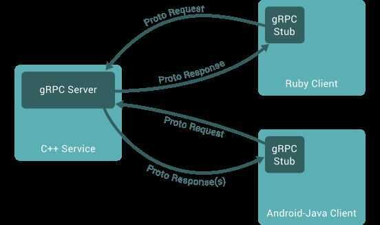
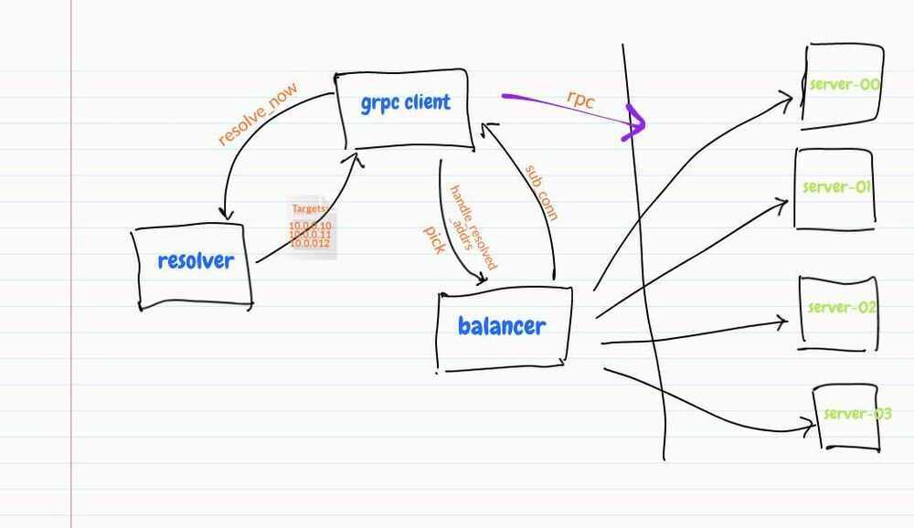

# gRPC

- RPC - Remote Procedure Call framework that uses HTTP 2.0 and Protocol Buffers
- A high performance, open-source universal RPC framework

**gRPC** is an [open source](https://en.wikipedia.org/wiki/Open-source_software)[remote procedure call](https://en.wikipedia.org/wiki/Remote_procedure_call)(RPC) system initially developed at [Google](https://en.wikipedia.org/wiki/Google). It uses [HTTP/2](https://en.wikipedia.org/wiki/HTTP/2) for transport, [Protocol Buffers](https://en.wikipedia.org/wiki/Protocol_Buffers) as the [interface description language](https://en.wikipedia.org/wiki/Interface_description_language), and provides features such as authentication, bidirectional streaming and flow control, blocking or nonblocking bindings, and cancellation and timeouts. It generates cross-platform client and server bindings for many languages

## Overview

In gRPC a client application can directly call methods on a server application on a different machine as if it was a local object, making it easier for you to create distributed applications and services. As in many RPC systems, gRPC is based around the idea of defining a service, specifying the methods that can be called remotely with their parameters and return types. On the server side, the server implements this interface and runs a gRPC server to handle client calls. On the client side, the client has a stub (referred to as just a client in some languages) that provides the same methods as the server.



gRPC clients and servers can run and talk to each other in a variety of environments - from servers inside Google to your own desktop - and can be written in any of gRPC's supported languages. So, for example, you can easily create a gRPC server in Java with clients in Go, Python, or Ruby. In addition, the latest Google APIs will have gRPC versions of their interfaces, letting you easily build Google functionality into your applications.

## Types of gRPC service

gRPC lets you define four kinds of service method

### Unary RPCs

where the client sends a single request to the server and gets a single response back, just like a normal function call.

```go
rpc SayHello(HelloRequest) returns (HelloResponse){
}
```

### Server streaming RPCs

where the client sends a request to the server and gets a stream to read a sequence of messages back. The client reads from the returned stream until there are no more messages.

```go
rpc LotsOfReplies(HelloRequest) returns (stream HelloResponse){
}
```

### Client streaming RPCs

where the client writes a sequence of messages and sends them to the server, again using a provided stream. Once the client has finished writing the messages, it waits for the server to read them and return its response.

```go
rpc LotsOfGreetings(stream HelloRequest) returns (HelloResponse) {
}
```

### Bidirectional streaming RPCs

where both sides send a sequence of messages using a read-write stream. The two streams operate independently, so clients and servers can read and write in whatever order they like: for example, the server could wait to receive all the client messages before writing its responses, or it could alternately read a message then write a message, or some other combination of reads and writes. The order of messages in each stream is preserved.

```go
rpc BidiHello(stream HelloRequest) returns (stream HelloResponse){
}
```

## Specifications for RPCs

- Language-agnostic Semantics
  - Unary RPCs vs Streaming RPCs
  - Metadata
  - **Cancellation/Deadlines**
  - Response messages and errors
- Spec for wire protocol
  - Maps RPC semantics to HTTP/2 protocol

## Runtime Libraries

- Implements Wire Protocol
- Server support
  - Expose service implementations via gRPC
- Client support
  - Machinery for connecting to servers, sending RPCs
  - Service discovery, load balancing, connection management

## Benefits & Tradeoffs of gRPC

### Developer productivity

- Abstracts away networking details
- "Procedure Call" syntax
- Action-centric, not resource-centric

### Strongly Typed Message Schemas

- clear "contract" of what messages can look like
- Compile-time type checking (in languages that allow it)
- Object-oriented APIs facilitate IDE support
- Tradeoff: less flexibility

### Efficiency/Performance

- HTTP/2
- Compact binary format
- Tradeoff: less human-consumable than JSON+REST
- Tradeoff: lack of browser support

### Language agnostic

### Many modern features

- Flow control
- Full-duplex bidirectional streams; not just request-response
- Request and response metadata (headers, trailers)
- Call cancellation, deadline propagation
- Interceptors (middleware)*
- **Service discovery**
- **load balancing (Client-side / Look-aside load balancing)**


- Proxyless RPC Mesh

https://kubernetes.io/blog/2018/11/07/grpc-load-balancing-on-kubernetes-without-tears

#### Client side load balancing

Two main components needed for the gRPC client-side load balancing to work

- [name resolver](https://github.com/grpc/grpc/blob/master/doc/naming)
- [load balancing policy](https://github.com/grpc/grpc/blob/master/doc/load-balancing).



https://github.com/jtattermusch/grpc-loadbalancing-kubernetes-examples

- **Automatic retries, hedging* (Retry hedging)**


- Hit all backend
- If you get response from one client, cancel all requests
- Problem - Cascading Failures
  - Retry throttling
  - Pushback- Transports
- Auth & Security
  - Plugin auth mechanism for extensibility
- Stats, Monitoring and Tracing
  - Prometheus, Zipkin, OpenCensus, Opentracing integrations
- Service Discovery
  - Consul, Zookeeper, Eureka
- Supported with Proxies
  - Envoy, Nginx, linkerd, nghttp2, haproxy

### Opinionated

- gRPC is end-to-end service communications framework
- Few decisions to make
- Tradeoff: must buy in 100%

### Ecosystem

- grpc-gateway
  - Exposes gRPC services as REST APIs
- grpc-web
  - Adapts gRPC to work with browser clients

## Limitations

1. grpc server not available in php - Spiral framework - https://spiral.dev
2. Load Balancing
3. Error handling is really bad
4. No support for browser JS
5. Breaking API changes
6. Poor documentation for some languages
7. No standardization across languages

## Development Flow

1. Define the API in "language agnostic" proto sources
2. Implement server
3. Implement clients

## Architecture

The first thing to note is that the architecture of gRPC is layered:

- **The lowest layer is the transport:** gRPC uses HTTP/2 as its transport protocol. HTTP/2 provides the same basic semantics as HTTP 1.1 (the version with which nearly all developers are familiar), but aims to be more efficient and more secure. The new features in HTTP/2 that are most obvious at first glance are (1) that it can multiplex many parallel requests over the same network connection and (2) that it allows full-duplex bidirectional communication. We'll learn more about
- **The next layer is the channel:** This is a thin abstraction over the transport. The channel defines calling conventions and implements the mapping of an RPC onto the underlying transport. At this layer, a gRPC call consists of a client-provided service name and method name, optional request metadata (key-value pairs), and zero or more request messages. A call is completed when the server provides optional response header metadata, zero or more response messages, and response trailer metadata. The trailer metadata indicates the final disposition of the call: whether it was a success or a failure. At this layer, there is no knowledge of interface constraints, data types, or message encoding. A message is just a sequence of zero or more bytes. A call may have any number of request and response messages.
- **The last layer is the stub:** The stub layer is where interface constraints and data types are defined. Does a method accept exactly one request message or a stream of request messages? What kind of data is in each response message and how is it encoded? The answers to these questions are provided by the stub. The stub marries the IDL-defined interfaces to a channel. The stub code is generated from the IDL. The channel layer provides the ABI that these generated stubs use.

## grpc-web

gRPC-Web provides a Javascript library that lets browser clients access a gRPC service.

https://www.npmjs.com/package/grpc-web

[**https://blog.envoyproxy.io/envoy-and-grpc-web-a-fresh-new-alternative-to-rest-6504ce7eb880**](https://blog.envoyproxy.io/envoy-and-grpc-web-a-fresh-new-alternative-to-rest-6504ce7eb880)

## Alternatives for protocol buffer for grpc

- Google flatbuffers
- Microsoft bond

## Alternatives

1. Rsocket

## Getting Started

https://www.semantics3.com/blog/a-simplified-guide-to-grpc-in-python-6c4e25f0c506

## POC

- load balancing (gRPC will not work with Kubernetes service load balancing out of the box)
- Istio sidecar proxy load balancing of grpc services
- working in Kubernetes (using services/multiple pods)
- proxy
- authentication
- packaging and using proto files in other projects
- sharing client side and server side stubs and servicers
- responses and error handling
- How is HTTP/2 support over our network and applications
- **Security - Keys, pem files, secure connection**
- What if streaming request from client fails in between (like when sending sms as stream)
- Load Testing server (number of rps)
- onboarding for other devs
- Sharing of proto files

## References

https://en.wikipedia.org/wiki/GRPC

https://grpc.io/docs/guides

https://alexandreesl.com/tag/grpc

https://medium.com/@EdgePress/is-grpc-the-future-of-client-server-communication-b112acf9f365

Online book - Practical gRPC

https://bleedingedgepress.com/practical-grpc

https://www.semantics3.com/blog/a-simplified-guide-to-grpc-in-python-6c4e25f0c506

https://dev.to/techschoolguru/is-grpc-better-than-rest-where-to-use-it-3blg

https://grpc.io/blog/optimizing-grpc-part-1

https://github.com/grpc-ecosystem/awesome-grpc

https://www.udemy.com/course/protocol-buffers

[The Story of Why We Migrate to gRPC and How We Go About It - Matthias Grüter, Spotify](https://www.youtube.com/watch?v=fMq3IpPE3TU)

[**The complete gRPC course [Protobuf, Go, Java]**](https://www.youtube.com/playlist?list=PLy_6D98if3UJd5hxWNfAqKMr15HZqFnqf)

[gRPC Crash Course - Modes, Examples, Pros & Cons and more](https://www.youtube.com/watch?v=Yw4rkaTc0f8)
