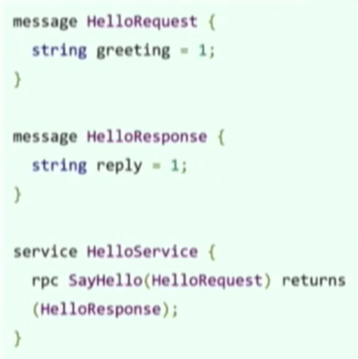

# Protocol Buffers Protobuf

Protocol Buffers are a way of encoding structured data in an efficient yet extensible format. Google uses Protocol Buffers for almost all of its internal RPC protocols and file formats.
Protocol Buffers (a.k.a., protobuf) are Google's language-neutral, platform-neutral, extensible mechanism for **serializing structured data.**

## Protocol Buffersis a method of [serializing](https://en.wikipedia.org/wiki/Serialization) structured data. It is useful in developing programs to communicate with each other over a wire or for storing data. The method involves an [interface description language](https://en.wikipedia.org/wiki/Interface_description_language) that describes the structure of some data and a program that generates source code from that description for generating or parsing a stream of bytes that represents the structured data

Though the primary purpose of Protocol Buffers is to facilitate network communication, its simplicity and speed make Protocol Buffers an alternative to data-centric C++ classes and structs, especially where interoperability with other languages or systems might be needed in the future.- IDL (Interface Definition Language)

Descibe only and generate interfaces for any language

- Data Model

Structure of the request and response

- Wire Format

Binary format for network transmission

<https://github.com/google/protobuf>

<https://developers.google.com/protocol-buffers>

## Advantages over XML

1. are simpler

2. are 3 to 10 times smaller

3. are 20 to 100 times faster

4. are less ambiguous

5. generate data access classes that are easier to use programmatically

## protoc (protobuf compiler)

- Generates data structure that correspond to IDL data model
- Request and response types
docker run --rm -v $(pwd):$(pwd) -w $(pwd) znly/protoc --plugin=protoc-gen-grpc=/usr/bin/grpc_python_plugin --python_out=./messages/ --grpc_out=./messages/ --proto_path=./protobuf ./protobuf/*.proto

## generate pb files from proto files

python -m grpc_tools.protoc -I=pcbook/proto --python_out=pcbook/pb --grpc_python_out=pcbook/pb pcbook/proto/*.proto
protoc --proto_path=.*.proto --python_out=.

## Plugins for protoc

- Generate interfaces and client stubs

## How to define a protocol message

- Name of the message: UpperCamelCase
- Name of the field: lower_snake_case
- Some scalar-value data types:
  - string, bool, bytes
  - float, double
  - int32, int64, uint32, uint64, sint32, sint64, etc.
- Data types can be user-defined enums or other messages
- Tags are more important than field names
  - Is an arbitrary integer
    - From 1 to 536,870,911 (or 2^29-1)
    - Except from 19000 to 19999 (reserved)
  - From 1 to 15 take 1 byte
  - From 16 to 2047 take 2 bytes
  - Don't need to be in-order or sequential
  - Must be unique for same-level fields

## Others

A Protobuf message definition consists of fields defined by a name, a type, and an integer field number. The field number in particular is sacred, as this is what is actually transmitted in a serialised message (as opposed to the field name). All producers and consumers rely on this integer having a consistent meaning, and altering it can cause havoc if a consumer processes old data with a new understanding of what data belongs to a field number.
The tests we've implemented cover the following aspects:

- Field numbers must not be amended.
- Fields must not have their type amended.
- Fields that have been removed from a message must have an entry added to a reserved statement within the message, both for the deleted field and the deleted field number. This ensures that the protoc compiler will complain if someone attempts to add either of these back in to a subsequent version.
- Fields must not have their name amended (this would not break Protobuf compatibility, but we have the test in place to help maintain the evolvable schemas for JSON derived from Protobuf models).

## Python apis

<https://developers.google.com/protocol-buffers/docs/reference/python-generated>

<https://developers.google.com/protocol-buffers/docs/pythontutorial>

<https://developers.google.com/protocol-buffers/docs/proto3>- **SerializeToString():** serializes the message and returns it as a string. Note that the bytes are binary, not text; we only use thestrtype as a convenient container

- **ParseFromString(data):** parses a message from the given string

## Specification

protobuf.common.messageData
