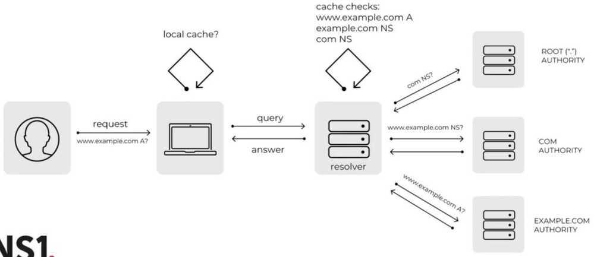
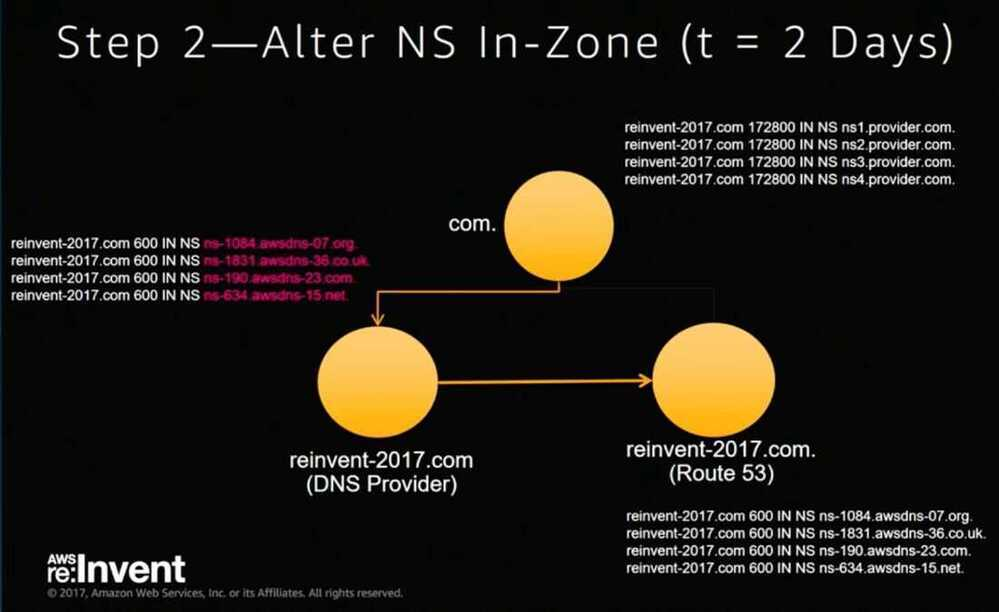

# DNS Domain Name System

https://dnschecker.org

DNS stands for domain name system. It is an application layer protocol used to provide a human-friendly naming mechanism for internet resources. It is what ties a domain name to an IP address and allows you to access sites by name in your browser.

DNS is the directory of the Internet. Whenever you click on a link, send an email, open a mobile app, often one of the first things that has to happen is your device needs to look up the address of a domain.

## There are two sides of the DNS network

### 1. Authoritative (the content side)

Every domain needs to have an Authoritative DNS provider.

### 2. Resolver (the consumer side)

On the other side of the DNS system are resolvers. Every device that connects to the Internet needs a DNS resolver.

Cloudfare DNS = 1.1.1.1

https://blog.cloudflare.com/announcing-1111

Youtube - [What is DNS? - Introduction to Domain Name System](https://www.youtube.com/watch?v=e2xLV7pCOLI)

## Recursive Nameserver

A recursive nameserver is different because if it does not know the ip address for the asked dns name. It will do the work of finding the answer, instead of merely re-directing the query.

The recursive nameserver will check its cache first. If the IP address is not there, it will ask a root nameserver (root nameservers do not know IP addresses, but they can read requests and tell the recursive nameserver where to go next). All recursive nameservers come with 13 root nameservers' IP addresses pre-configured. The recursive nameserver picks one and asks it the same question ("what is the IP address for [www.google.com](http://www.google.com)?").

The root nameserver reads the top-level domain (the end of the request), in this case .com, ([www.google.com](http://www.google.com)) and will tell the recursive nameserver to ask the Global Top Level Domain Servers (GTLD). GTLDs are essentially reference lists for each type of domain---.com, .net., .edu, etc. While they don't know the IP addresses for websites, they do know which nameservers will have that information.

The GTLD nameserver will read the next part of your request, reading from right to left (in this case the 'google' of [www.google.com](http://www.google.com)) and will send back a message with the authoritative nameserver to contact. An authoritative nameserver is a nameserver that is responsible for the domain (and is the primary source of information).

https://www.freecodecamp.org/news/what-is-dns-anyway

## Fully Qualified Domain Name

A **fully qualified domain name**(**FQDN**), sometimes also referred to as an*absolute domain name*, is a [domain name](https://en.wikipedia.org/wiki/Domain_name) that specifies its exact location in the tree hierarchy of the [Domain Name System](https://en.wikipedia.org/wiki/Domain_Name_System)(DNS). It specifies all domain levels, including at least a [second-level domain](https://en.wikipedia.org/wiki/Second-level_domain) and a [top-level domain](https://en.wikipedia.org/wiki/Top-level_domain).A fully qualified domain name is distinguished by its lack of ambiguity: it can be interpreted only in one way.

## DNS Lookup

## Defining DNS Records

### TYPE

A, AAAA, CNAME, ALIAS, ANAME, TXT, MX

### HOST

The root (@ or blank) or subdomain (www, app, blog, etc) where you want to place the record

### VALUE

Can be an IP address (A, AAAA) another domain (CNAME, ALIAS, ANAME, MX) or arbitrary value (TXT)

### PRIORITY

Only for MX records you will be given what value and priority to use by your email provider

### TTL (Time to Live)

How long to let record values be cached Shorter = better for fast changing values Longer = faster resolution time and less traffic for your DNS server

## Most Common Types

### A

Map domain name to IPv4 address. Ex: example.com => 127.0.0.1

### AAAA

Map domain name to IPv6 address. Ex: example.com => ::1

### CNAME

Map domain name to another domain name. CAUTION! Don't do this on the root (@). Ex: [www.example.com](http://www.example.com) => example.com

### ALIAS

Map domain name to another domain name CAN do this on the root. Ex: example.com => example.herokudns.com

### ANAME

Another name for ALIAS (different providers name it differently; also "virtual CNAME") Ex: example.com => example.netlify.com

### TXT

Set arbitrary data on your domain record Ex: @ => my-domain-is-awesome-123

### MX

Setup custom email for your domain Ex: @ => ASPMX.L.GOOGLE.COM. 1

### SOA

A **Start of Authority record** (abbreviated as **SOA record**) is a type of [resource record](https://en.wikipedia.org/wiki/Resource_record) in the [Domain Name System](https://en.wikipedia.org/wiki/Domain_Name_System)(DNS) containing administrative information about the zone, especially regarding [zone transfers](https://en.wikipedia.org/wiki/DNS_zone_transfer). The SOA record format is specified in [RFC 1035](https://tools.ietf.org/html/rfc1035)

https://en.wikipedia.org/wiki/SOA_record

### SRV

A **Service record** (**SRV record**) is a specification of data in the [Domain Name System](https://en.wikipedia.org/wiki/Domain_Name_System) defining the location, i.e. the [hostname](https://en.wikipedia.org/wiki/Hostname) and [port number](https://en.wikipedia.org/wiki/Port_number), of servers for specified services. It is defined in [RFC 2782](https://tools.ietf.org/html/rfc2782), and its type code is 33. Some Internet protocols such as the [Session Initiation Protocol](https://en.wikipedia.org/wiki/Session_Initiation_Protocol)(SIP) and the [Extensible Messaging and Presence Protocol](https://en.wikipedia.org/wiki/Extensible_Messaging_and_Presence_Protocol)(XMPP) often require SRV support by network elements.

| **Commonly used record types** | **Description**             | **Examples**                        |
|------------------------|-----------------------|--------------------------|
| A                              | Host address                | host -t a nixcraft.com              |
| AAAA                           | IPv6 host address           | host -t aaaa nixcraft.com           |
| ALIAS                          | Auto resolved alias         | host -t alias portal2.cyberciti.biz |
| CNAME                          | Canonical name for an alias | host -t cname feeds.cyberciti.biz   |
| MX                             | Mail eXchange               | host -t mx google.com               |
| NS                             | Name Server                 | host -t ns nixcraft.com             |
| PTR                            | Pointer                     | host -t ptr 216.58.200.147          |
| SOA                            | Start Of Authority          | host -t soa nixcraft.com            |
| SRV                            | Location of service         | host -t srv server1.cyberciti.biz   |
| TXT                            | Descriptive text            | host -t txt nixcraft.com            |

https://dev.to/chrisachard/dns-record-crash-course-for-web-developers-35hn

## Dissecting a domain name (URL - Uniform Resource Locator)

## Domain name hierarchy

- Root Name Server (13)
- Top Level Domain
- Authoritative Name Servers
- DNS Zone Files (collection of related dns names)
- Resolver / Recursive DNS

[https://ns1.com/academy#](https://ns1.com/academy)

## Punycode

Punycode is a representation of [Unicode](https://en.wikipedia.org/wiki/Unicode) with the limited [ASCII](https://en.wikipedia.org/wiki/ASCII) character subset used for Internet [host names](https://en.wikipedia.org/wiki/Host_(network)). Using Punycode, host names containing Unicode characters are transcoded to a subset of ASCII consisting of letters, digits, and hyphen, which is called the Letter-Digit-Hyphen (LDH) subset. For example,*München*([German](https://en.wikipedia.org/wiki/German_language) name for [Munich](https://en.wikipedia.org/wiki/Munich)) is encoded as*Mnchen-3ya*

While the [Domain Name System](https://en.wikipedia.org/wiki/Domain_Name_System)(DNS) technically supports arbitrary sequences of octets in domain name labels, the DNS standards recommend the use of the LDH subset of ASCII conventionally used for host names, and require that string comparisons between DNS domain names should be case-insensitive. The Punycode syntax is a method of encoding strings containing Unicode characters, such as [internationalized domain names](https://en.wikipedia.org/wiki/Internationalized_domain_name)(IDNA), into the LDH subset of ASCII favored by DNS. It is specified in [IETF](https://en.wikipedia.org/wiki/IETF)[Request for Comments](https://en.wikipedia.org/wiki/Request_for_Comments) 3492.

https://en.wikipedia.org/wiki/Punycode

## mDNS (multicast DNS)

In [computer networking](https://en.wikipedia.org/wiki/Computer_networking), themulticast DNS(mDNS) protocol resolves [hostnames](https://en.wikipedia.org/wiki/Hostname) to IP addresses within small networks that do not include a local [name server](https://en.wikipedia.org/wiki/Name_server). It is a [zero-configuration](https://en.wikipedia.org/wiki/Zero_configuration_networking) service, using essentially the same programming interfaces, packet formats and operating semantics as the unicast [Domain Name System](https://en.wikipedia.org/wiki/Domain_Name_System)(DNS). Although [Stuart Cheshire](https://en.wikipedia.org/wiki/Stuart_Cheshire) designed mDNS as a stand-alone protocol, it can work in concert with standard DNS servers.

The mDNS protocol is published as [RFC](https://en.wikipedia.org/wiki/Request_for_Comments) [6762](https://tools.ietf.org/html/rfc6762), uses IP multicast [User Datagram Protocol](https://en.wikipedia.org/wiki/User_Datagram_Protocol)(UDP) packets, and is implemented by the Apple [Bonjour](https://en.wikipedia.org/wiki/Bonjour_(software)) and open source [Avahi](https://en.wikipedia.org/wiki/Avahi_(software)) software packages.[Android](https://en.wikipedia.org/wiki/Android_(operating_system)) contains an mDNS implementationNS has also been implemented in [Windows 10](https://en.wikipedia.org/wiki/Windows_10), initially limited to discovering networked printers, later becoming capable of resolving hostnames as well.

mDNS can work in conjunction with [DNS Service Discovery](https://en.wikipedia.org/wiki/DNS_Service_Discovery)(DNS-SD), a companion zero-configuration technique specified separately in [RFC 6763](https://tools.ietf.org/html/rfc6763).

https://en.wikipedia.org/wiki/Multicast_DNS

## What is DNS encryption?

DNS encryption ensures that only you and your DNS provider know what DNS queries are being performed, and therefore which websites you are visiting. Also, it enforces your choice of DNS provider. So you can choose a provider that offers features and guarantees which differ from your ISP, such as speed and privacy.

## Is Cloudflare DNS-encrypted?

Cloudflare DNS, available at 1.1.1.1, is a free public DNS service run by the CDN provider Cloudflare. It supports encryption using DNS over HTTPS (DoH) and DNS over TLS (DoT). As it uses the existing CDN, it can provide very fast response times.

## DoT (DNS over TLS) and DoH (DNS over HTTPS)

https://blog.cloudflare.com/dns-encryption-explained

## Which services can use SNI?

SNI is an extension to TLS that provides support for multiple hostnames on a single IP address. The most common use of TLS is HTTPS for secure websites. However, it is present in all protocols that use TLS for security.

## How does SNI work?

The TLS extension SNI works by requiring the client to transmit the hostname of the service it wishes to securely communicate with before the encryption is established. An updated version of SNI called ESNI allows this hostname to be encrypted, which protects privacy and helps to avoid censorship.

https://www.toptal.com/web/encrypted-safe-with-esni-doh-dot

## Global Traffic Management

- Geoproximity
- Route53
- POPs, Authoritative name servers, recursive name servers
- Sideways delegation

https://aws.amazon.com/blogs/aws/latency-based-multi-region-routing-now-available-for-aws

[AWS re:Invent 2017: DNS Demystified: Global Traffic Management with Amazon Route 53 (NET302)](https://www.youtube.com/watch?v=PVBC1gb78r8)

## DNS Subdomain Names

Most resource types require a name that can be used as a DNS subdomain name as defined in [RFC 1123](https://tools.ietf.org/html/rfc1123). This means the name must:

- contain no more than 253 characters
- contain only lowercase alphanumeric characters, '-' or '.'
- start with an alphanumeric character
- end with an alphanumeric character

## DNS Label Names

Some resource types require their names to follow the DNS label standard as defined in [RFC 1123](https://tools.ietf.org/html/rfc1123). This means the name must:

- contain at most 63 characters
- contain only lowercase alphanumeric characters or '-'
- start with an alphanumeric character
- end with an alphanumeric character

## Links

[Say (an encrypted) hello to a more private internet.](https://blog.mozilla.org/en/products/firefox/encrypted-hello/)
