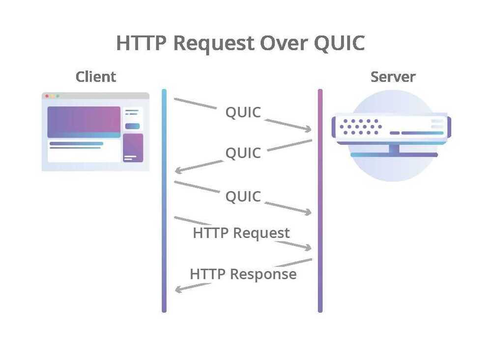

# HTTP/3 QUIC

QUIC - Quick UDP Internet Connections
HTTP/3 don't use TCP as the transport layer for the session, it uses [QUIC, a new Internet transport protocol](https://blog.cloudflare.com/the-road-to-quic/), which, among other things, introduces streams as first-class citizens at the transport layer. QUIC streams share the same QUIC connection, so no additional handshakes and slow starts are required to create new ones, but QUIC streams are delivered independently such that in most cases packet loss affecting one stream doesn't affect others. This is possible because QUIC packets are encapsulated on top of UDP datagrams.
Using UDP allows much more flexibility compared to TCP, and enables QUIC implementations to live fully in user-space - updates to the protocol's implementations are not tied to operating systems updates as is the case with TCP. With QUIC, HTTP-level streams can be simply mapped on top of QUIC streams to get all the benefits of HTTP/2 without the head-of-line blocking.
QUIC also combines the typical 3-way TCP handshake with [TLS 1.3](https://blog.cloudflare.com/rfc-8446-aka-tls-1-3/)'s handshake. Combining these steps means that encryption and authentication are provided by default, and also enables faster connection establishment. In other words, even when a new QUIC connection is required for the initial request in an HTTP session, the latency incurred before data starts flowing is lower than that of TCP with TLS.

But why not just use HTTP/2 on top of QUIC, instead of creating a whole new HTTP revision? After all, HTTP/2 also offers the stream multiplexing feature. As it turns out, it's somewhat more complicated than that.
While it's true that some of the HTTP/2 features can be mapped on top of QUIC very easily, that's not true for all of them. One in particular, [HTTP/2's header compression scheme called HPACK](https://blog.cloudflare.com/hpack-the-silent-killer-feature-of-http-2/), heavily depends on the order in which different HTTP requests and responses are delivered to the endpoints. QUIC enforces delivery order of bytes within single streams, but does not guarantee ordering among different streams.
This behavior required the creation of a new HTTP header compression scheme, called QPACK, which fixes the problem but requires changes to the HTTP mapping. In addition, some of the features offered by HTTP/2 (like per-stream flow control) are already offered by QUIC itself, so they were dropped from HTTP/3 in order to remove unnecessary complexity from the protocol.
QUIC Features

- All QUIC connections are fully encrypted. (End to end encryption)
- forward-error correction (FEC)

When NASA's Deep Space Network talks to the Voyager 2 spacecraft (which recently left our solar system) it transmits messages that become garbled crossing 17.6 billion km of space (that's about 11 billion miles). Voyager 2 can't send back the equivalent of "Say again?" when it receives a garbled message so the messages sent to Voyager 2 contain error-correcting codes that allow it to reconstruct the message from the mess.

- QUIC also solves the HTTP/2 HoL (Head of Line Blocking) problem
- Finally, one of the slower parts of a standard HTTP/2 over TCP connection is the very beginning. When the app or browser makes a connection there's an initial handshake at the TCP level followed by a handshake to establish encryption. Over a high latency connection (say on a mobile phone on 3G) that creates a noticeable delay. Since QUIC controls all aspects of the connect it merges together connection and encryption into a single handshake.
Other features -

1. connection migration

2. zero round trip time resumption
<https://blog.cloudflare.com/http3-the-past-present-and-future>

<https://blog.cloudflare.com/the-road-to-quic>
<https://www.mnot.net/blog/2018/11/27/header_compression>

<https://www.mnot.net/blog/2019/10/13/h2_api_multiplexing>
HTTP Version 2 - <https://httpwg.org/specs/rfc7540.html>

HPACK: Header Compression for HTTP/2 - <https://httpwg.org/specs/rfc7541.html>
<https://www.toptal.com/web/performance-working-with-http-3>

[How Alt-Svc switches HTTP/2 clients to use HTTP/3 - YouTube](https://www.youtube.com/watch?v=2eXbf8-br0Q&ab_channel=HusseinNasser)
