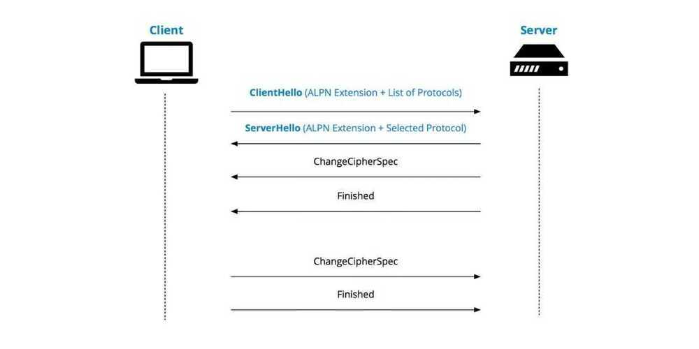

# HTTP / HTTPS

**URL - Uniform Resource Locator**

**URI - Uniform Resource Indicator**

Standing for Hypertext Transfer Protocol, HTTP is an application layer protocol that enables communication between two entities in a network.

HTTP is considered the foundation of the modern web and it works on top of TCP/IP communication protocol. While other ports may be used, the reserved HTTP port is 80.
Communication process is based on a **request/response or request/reply** flow:

- The client initiates the communication by sending an HTTP request message to the host, over an already existing TCP connection.
- After the request has been made, the client waits for a response.
- The host processes the request
- The host sends back the appropriate response.

One fundamental characteristic that made HTTP a powerful protocol is that both parties are aware of each other during the current request only and will forget about each other afterwards. This is the reason why HTTP is considered to be stateless.
HTTP is a request/response architecture, where client sends a request and server sends the request back. Server cannot initiate the request to the client. So if user A has some data to send to user B, then user A will send data to server, but server cannot send data to user B, because server cannot initiate request to the client.

The 4 Parts of a HTTP request

- Method (GET)
- Path (/cat.jpg)
- Headers
- Body

The 3 parts of a HTTP response

- Response Code (like 200)
- Headers
- Body

## Versions

### 1. HTTP/0.9 (1991)

### 2. HTTP/1.0

a new TCP connection is created for each request/response exchange between clients and servers, meaning that all requests incur a latency penalty as the TCP and TLS handshakes are completed before each request.

Worse still, rather than sending all outstanding data as fast as possible once the connection is established, TCP enforces a warm-up period called "slow start", which allows the TCP congestion control algorithm to determine the amount of data that can be in flight at any given moment before congestion on the network path occurs, and avoid flooding the network with packets it can't handle. But because new connections have to go through the slow start process, they can't use all of the network bandwidth available immediately.

### 3. HTTP/1.1 (1997)

Introduced the concept of "keep-alive" connections, that allow clients to reuse TCP connections, and thus amortize the cost of the initial connection establishment and slow start across multiple requests. But this was no silver bullet: while multiple requests could share the same connection, they still had to be serialized one after the other, so a client and server could only execute a single request/response exchange at any given time for each connection.

### 4. HTTP/2 (2015)

Introduced the concept of HTTP "streams": an abstraction that allows HTTP implementations to concurrently multiplex different HTTP exchanges onto the same TCP connection, allowing browsers to more efficiently reuse TCP connections.

### 5. HTTP/3 and QUIC

## HTTP/2 Characteristics

- **Multiplexing:** Can use a single connection for multiple requests, (pipelining of requests)
- **Bidirectional Streaming:** No more polling, sockets, or clunky SSE (Server Side Events)
- **Flow Control:** Control your congestion
- Is binary, instead of textual,
- Uses **header compression** to reduce overhead- HTTP/2 is a binary protocol where HTTP 1.x is textual. Binary protocols are more efficient to parse because there is only one code path where HTTP 1.x defines 4 different ways to parse a message. Binary protocols are also more space efficient on the wire. In return, it is more difficult for humans to deal with them, as they are not human-readable. A tradeoff.
- HTTP/2 is multiplexed to tackle a known limitation in networking known as head-of-line blocking (HOL Blocking). This problem can occur with HTTP 1.1 when multiple requests are issued on a single TCP connection (aka HTTP pipelining). As the entire connection is ordered and blocking (FIFO), a slow request can hold up the connection, slowing down all subsequent requests. Multiplexing definitively solve this problem by allowing several request and response to fly on the wire at the same time.
- HTTP/2 uses header compression to reduce overhead. Typical header sizes of 1KB are common mainly because of the cookies that we all have to accept for a smooth user experience. Transferring 1KB can take several network round trips just to exchange headers, and those headers are being re-sent every time because of the stateless nature of HTTP 1.x. The TCP Slow-start makes the problem even worse by limiting the number of packets that can be sent during the first round trips until TCP effectively finishes to probe the network to figure out the available capacity and properly adapt its congestion window. In this context, compressing headers significantly limits the number of required round trips.
- HTTP/2 Server Push allows servers to proactively send responses into client caches. In a typical HTTP 1.x workflow, the browser requests a page, the server sends the HTML in the response, and then needs to wait for the browser to parse the response and issue additional requests to fetch the additional embedded assets (JavaScript, CSS, etc.). Server push allows the server to speculatively start sending resources to the client. Here, the browser does not have to parse the HTML page and find out which other resources to load; instead the server can start sending them immediately.

## Ports

- HTTP - 80
- HTTPS - 443

## HTTP Polling

- HTTP Short Polling
- HTTP Long Polling
- HTTP Periodic Polling
- HTTP Streaming
- SSE (Server Sent Events / EventSource)
- HTTP/2 Server Push

<https://medium.com/platform-engineer/web-api-design-35df8167460>

## HTTPS

Privacy, Integrity and Identification

<https://howhttps.works/why-do-we-need-https>

<https://howhttps.works/the-handshake>

## Https vs TLS (Transport Layer Security) vs SSL (Secure Sockets Layer)

HTTP is the protocol used by your browser and web servers to communicate and exchange information. When that exchange of data is encrypted with SSL/TLS, then we call it HTTPS. The "S" stands for "Secure". SSL is the predecessor to TLS.

<https://howhttps.works/https-ssl-tls-differences>

## TLS (Tranport Layer Security)

Transport Layer Security(TLS), and its now-deprecated predecessor, Secure Sockets Layer(SSL), are [cryptographic protocols](https://en.wikipedia.org/wiki/Cryptographic_protocol) designed to provide [communications security](https://en.wikipedia.org/wiki/Communications_security) over a [computer network](https://en.wikipedia.org/wiki/Computer_network).Several versions of the protocols find widespread use in applications such as [web browsing](https://en.wikipedia.org/wiki/Web_navigation), [email](https://en.wikipedia.org/wiki/Email), [instant messaging](https://en.wikipedia.org/wiki/Instant_messaging), and [voice over IP](https://en.wikipedia.org/wiki/Voice_over_IP)(VoIP).[Websites](https://en.wikipedia.org/wiki/Website) can use TLS to secure all communications between their [servers](https://en.wikipedia.org/wiki/Server_(computing)) and [web browsers](https://en.wikipedia.org/wiki/Web_browser).

The TLS protocol aims primarily to provide [privacy](https://en.wikipedia.org/wiki/Privacy) and [data integrity](https://en.wikipedia.org/wiki/Data_integrity) between two or more communicating computer applications.When secured by TLS, connections between a client (e.g., a web browser) and a server (e.g., wikipedia.org) should have one or more of the following properties:

- The connection is private (or secure) because [symmetric cryptography](https://en.wikipedia.org/wiki/Symmetric-key_algorithm) is used to [encrypt](https://en.wikipedia.org/wiki/Encryption) the data transmitted. The [keys](https://en.wikipedia.org/wiki/Key_(cryptography)) for this symmetric encryption are generated uniquely for each connection and are based on a [shared secret](https://en.wikipedia.org/wiki/Shared_secret) that was negotiated at the start of the [session](https://en.wikipedia.org/wiki/Session_(computer_science)). The server and client negotiate the details of which encryption algorithm and cryptographic keys to use before the first [byte](https://en.wikipedia.org/wiki/Byte) of data is transmitted. The negotiation of a shared secret is both secure (the negotiated secret is unavailable to [eavesdroppers](https://en.wikipedia.org/wiki/Eavesdropping) and cannot be obtained, even by an attacker who places themselves in the middle of the connection) and reliable (no attacker can modify the communications during the negotiation without being detected).
- The identity of the communicating parties can beauthenticatedusing [public-key cryptography](https://en.wikipedia.org/wiki/Public-key_cryptography). This authentication can be made optional, but is generally required for at least one of the parties (typically the server).
- The connection isreliablebecause each message transmitted includes a message integrity check using a [message authentication code](https://en.wikipedia.org/wiki/Message_authentication_code) to prevent undetected loss or alteration of the data during [transmission](https://en.wikipedia.org/wiki/Data_transmission).

<https://en.wikipedia.org/wiki/Transport_Layer_Security>

## ALPN (Application Layer Protocol Negotiation)

[Application-Layer](https://en.wikipedia.org/wiki/Application_layer) Protocol Negotiation(ALPN) is a [Transport Layer Security](https://en.wikipedia.org/wiki/Transport_Layer_Security)(TLS) extension that allows the application layer to negotiate which [protocol](https://en.wikipedia.org/wiki/Communications_protocol) should be performed over a secure connection in a manner that avoids additional round trips and which is independent of the application-layer protocols. It is needed by secure [HTTP/2](https://en.wikipedia.org/wiki/HTTP/2) connections, which improves the compression of web pages and reduces their latency compared to HTTP/1.x. The ALPN and HTTP/2 standards emerged from development work done by Google on the now withdrawn [SPDY](https://en.wikipedia.org/wiki/SPDY) protocol.

<https://en.wikipedia.org/wiki/Application-Layer_Protocol_Negotiation>

## SOP - Same Origin Policy

Thesame-origin policyis a critical security mechanism that restricts how a document or script loaded from one [origin](https://developer.mozilla.org/en-US/docs/Glossary/origin) can interact with a resource from another origin.It helps isolate potentially malicious documents, reducing possible attack vectors.

<https://developer.mozilla.org/en-US/docs/Web/Security/Same-origin_policy>

## CORS - Cross-Origin Resource Sharing

Cross-Origin Resource Sharing (CORS) is a mechanism that uses additional HTTP headers to tell a browser to let a web application running at one origin (domain) have permission to access selected resources from a server at a different origin. A web application makes a cross-origin HTTP request when it requests a resource that has a different origin (domain, protocol, and port) than its own origin.

A mechanism that allows restricted resources (e.g. fonts) on a web page to be requested from another domain outside the domain from which the first resource was served.

<https://developer.mozilla.org/en-US/docs/Web/HTTP/CORS>

[Cross Origin Resource Sharing (Explained by Example)](https://www.youtube.com/watch?v=Ka8vG5miErk)

## Cookies

An HTTP cookie (also called web cookie, Internet cookie, browser cookie, or simply cookie) is a small piece of data sent from a [website](https://en.wikipedia.org/wiki/Website) and stored on the user's computer by the user's [web browser](https://en.wikipedia.org/wiki/Web_browser) while the user is browsing. Cookies were designed to be a reliable mechanism for websites to remember [stateful](https://en.wikipedia.org/wiki/Program_state) information (such as items added in the shopping cart in an online store) or to record the user's browsing activity (including clicking particular buttons, [logging in](https://en.wikipedia.org/wiki/Access_control), or recording which pages were visited in the past). They can also be used to remember pieces of information that the user previously entered into form fields, such as names, addresses, passwords, and credit-card numbers.

<https://en.wikipedia.org/wiki/HTTP_cookie>

[HTTP Cookies Crash Course](https://www.youtube.com/watch?v=sovAIX4doOE)

## Zombie Cookie

[How Un-deletable Zombie Cookies work (with implementation example)](https://www.youtube.com/watch?v=lq6ZimHh-j4)

## XHR (XMLHttpRequest)

XMLHttpRequest(XHR) is an [API](https://en.wikipedia.org/wiki/Application_programming_interface) in the form of an [object](https://en.wikipedia.org/wiki/Object-oriented_programming) whose [methods](https://en.wikipedia.org/wiki/Method_(computer_programming)) transfer data between a [web browser](https://en.wikipedia.org/wiki/Web_browser) and a [web server](https://en.wikipedia.org/wiki/Web_server). The object is provided by the browser's [JavaScript](https://en.wikipedia.org/wiki/JavaScript) environment. Particularly, retrieval of data from XHR for the purpose of continually modifying a loaded [web page](https://en.wikipedia.org/wiki/Web_page) is the underlying concept of [Ajax](https://en.wikipedia.org/wiki/Ajax_(programming)) design. Despite the name, XHR can be used with protocols other than [HTTP](https://en.wikipedia.org/wiki/HTTP) and data can be in the form of not only [XML](https://en.wikipedia.org/wiki/XML), but also [JSON](https://en.wikipedia.org/wiki/JSON), [HTML](https://en.wikipedia.org/wiki/HTML) or [plain text](https://en.wikipedia.org/wiki/Plain_text)

<https://en.wikipedia.org/wiki/XMLHttpRequest>

Which part of the HTTP response determines whether the browser should redirect to another page?

- The response code - If the response code is 301 or 302, your browser will redirect to the URL in the **Location** header.

What part of the HTTP request does your browser use to keep you logged into a website?

- Headers - The browser will send **Cookie** headers with whatever the website set your cookies to when you logged in. That's what keeps you logged in.

When you submit a form, what request method does your browser use?

- The default is POST, but you can use < form method = "GET" > to send a GET request
- POST puts the form data in the request body
- GET puts the data in the URL.

## Links

HTTP2.0 Demo - <http://www.http2demo.io>

<https://www.code-maze.com/http-series-part-1>

[The Journey of an HTTP request to the Backend | Backend Engineering Show](https://youtu.be/K2qV6VpfR7I)

[HTTP Request Prioritization (RFC 9218) | The Backend Engineering Show - YouTube](https://www.youtube.com/watch?v=mgcv4UR3jKU)

[HTTP 103 - Early Hints - YouTube](https://www.youtube.com/watch?v=iEuz5hPVNXk)
