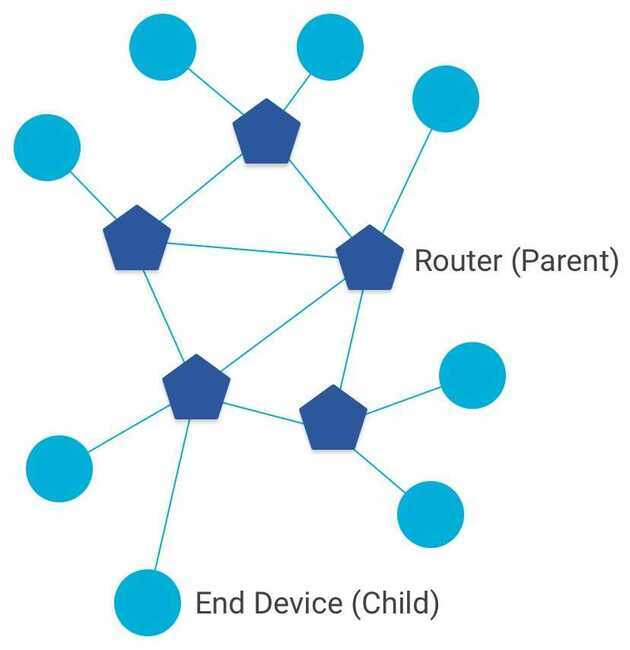
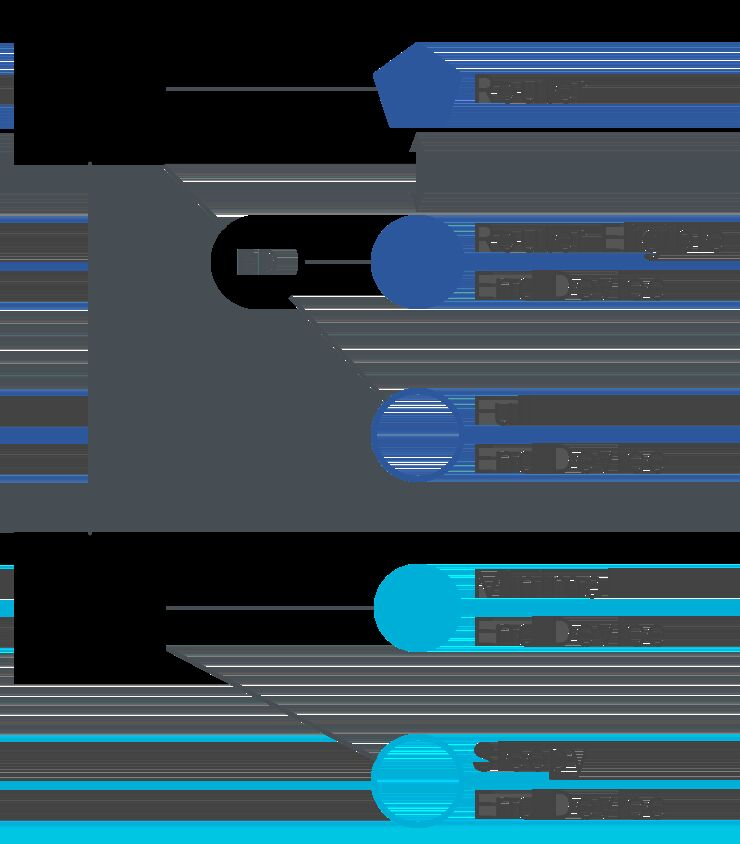

# OpenThread

## Thread

Thread is designed to address the unique interoperability, security, power, and architecture challenges of the IoT.

- Thread is a low-power wireless mesh networking protocol, based on the universally-supported Internet Protocol (IP), and built using open and proven standards.
- Thread enables device-to-device and device-to-cloud communicationsand reliably connects hundreds (or thousands) of products and includes mandatory security features.
- Thread networks have no single point of failure, can self-heal and reconfigure when a device is added or removed, and are simple to setup and use.
- Thread is based on the broadly supported IEEE 802.15.4 radio standard, which is designed from the ground up for extremely low power consumption and low latency.
[Thread](http://threadgroup.org/) is an IPv6-based networking protocol designed for low-power Internet of Things devices in an IEEE 802.15.4-2006 wireless mesh network, commonly called a Wireless Personal Area Network (WPAN). Thread is independent of other 802.15.4 mesh networking protocols, such a ZigBee, Z-Wave, and Bluetooth LE.

Thread's primary features include:

- Simplicity - Simple installation, start up, and operation
- Security - All devices in a Thread network are authenticated and all communications are encrypted
- Reliability - Self-healing mesh networking, with no single point of failure, and spread-spectrum techniques to provide immunity to interference
- Efficiency - Low-power Thread devices can sleep and operate on battery power for years
- Scalability - Thread networks can scale up to hundreds of devices

## Features

OpenThread implements all Thread networking layers (IPv6, 6LoWPAN, IEEE 802.15.4 with MAC security, Mesh Link Establishment, Mesh Routing) and device roles, as well as Border Router support.
[APPLICATION SERVICES](https://openthread.io/reference/)

- IPv6 configuration and raw data interface
- UDP sockets
- CoAP client and server
- DHCPv6 client and server
- DNSv6 client

[ENHANCED FEATURES](https://openthread.io/guides/build)

- Child Supervision
- Inform Previous Parent on Reattach
- Jam Detection
- Periodic Parent Search

[NCP SUPPORT](https://openthread.io/guides/ncp/)

- [Spinel](https://github.com/openthread/openthread/tree/master/src/ncp), a general purpose NCP protocol
- [wpantund](https://github.com/openthread/wpantund), a user-space NCP network interface driver/daemon
- Sniffer support via NCP Spinel nodes

[BORDER ROUTER](https://openthread.io/guides/border-router)

- Web UI for configuration and management
- Thread Border Agent to support an External Commissioner
- NAT64 for connecting to IPv4 networks
- Thread interface driver using wpantund

## Node Roles and Types

In a Thread network, nodes are split into two forwarding roles:

## Router

A Router is a node that:

- forwards packets for network devices
- provides secure commissioning services for devices trying to join the network
- keeps its transceiver enabled at all times

## End Device

An End Device (ED) is a node that:

- communicates primarily with a single Router
- does not forward packets for other network devices
- can disable its transceiver to reduce power

## Device Types

## Full Thread Device

A Full Thread Device (FTD) always has its radio on, subscribes to the all-routers multicast address, and maintains IPv6 address mappings. There are three types of FTDs:

- Router
- Router Eligible End Device (REED) - can be promoted to a Router
- Full End Device (FED) - cannot be promoted to a Router

An FTD can operate as a Router (Parent) or an End Device (Child).

## Minimal Thread Device

A Minimal Thread Device does not subscribe to multicast traffic and forwards all messages to its Parent. There are two types of MTDs:

- Minimal End Device (MED) - transceiver always on, does not need to poll for messages from its parent
- Sleepy End Device (SED) - normally disabled, wakes on occasion to poll for messages from its parent

An MTD can only operate as an End Device (Child).
**References**

<https://openthread.io>

<https://openthread.io/guides/thread-primer>

<https://openthread.io/guides/thread-primer/node-roles-and-types>

<https://openthread.io/guides/ncp>
