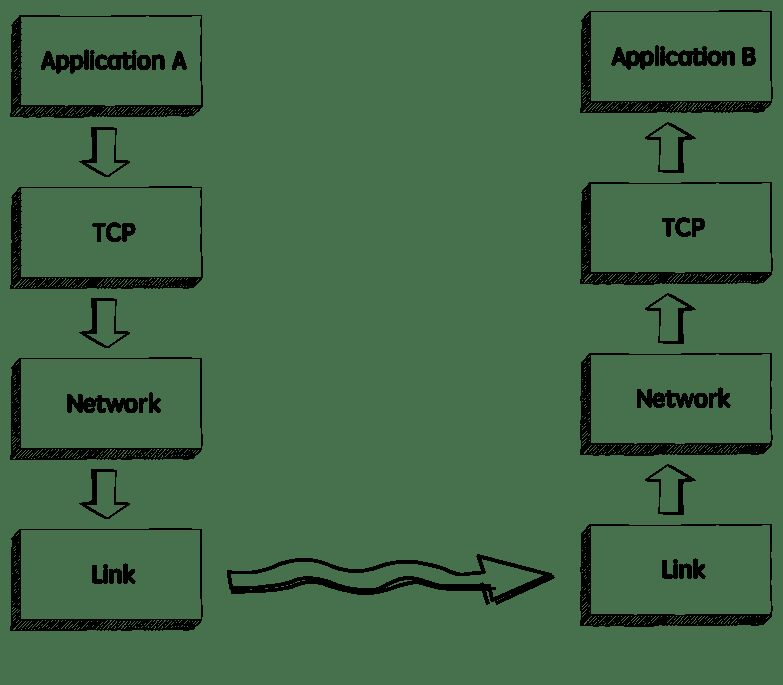
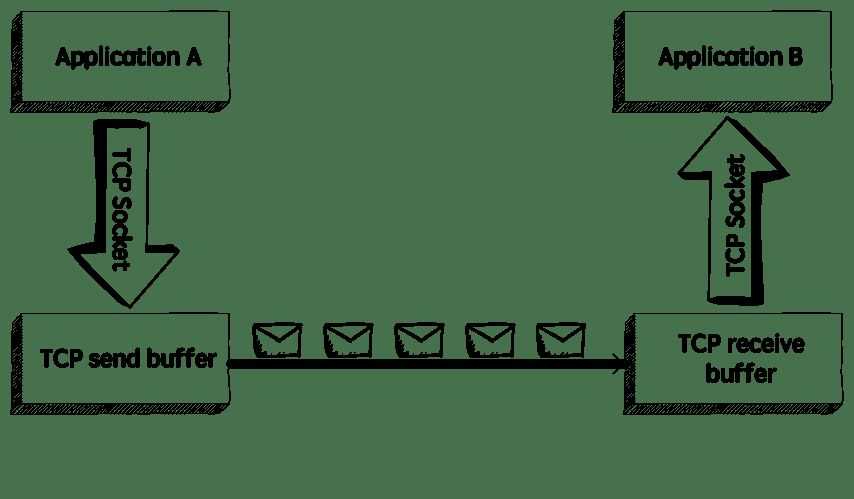
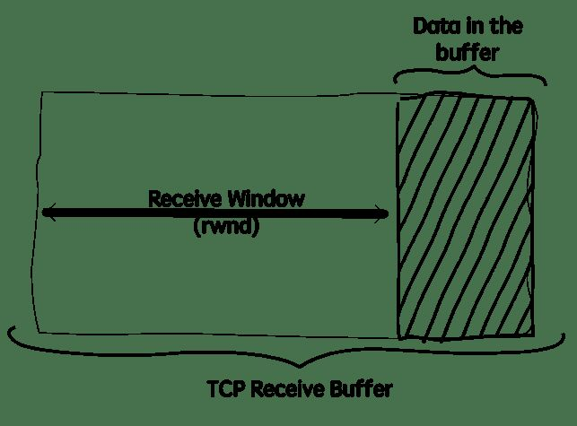
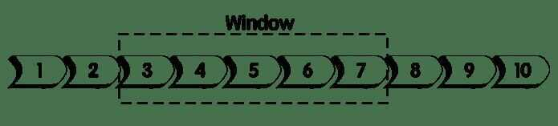
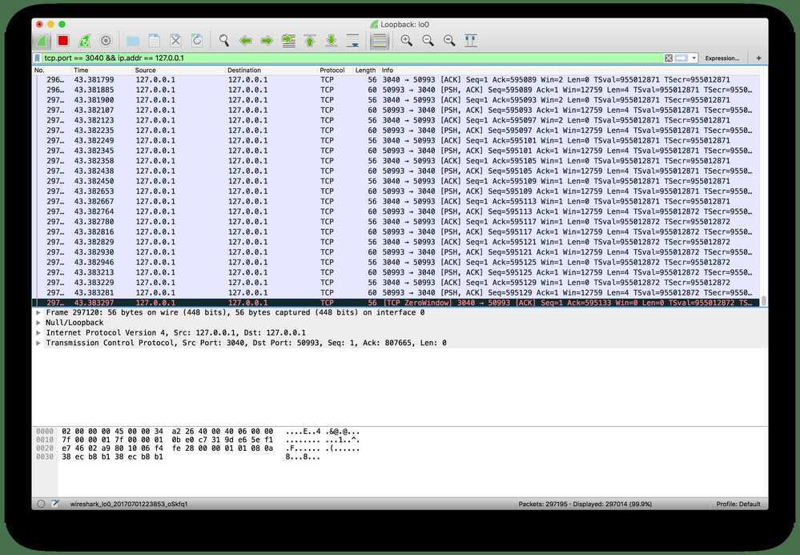
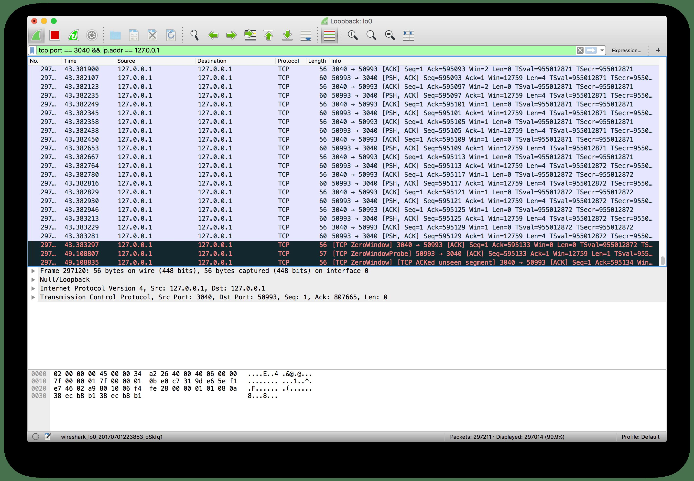
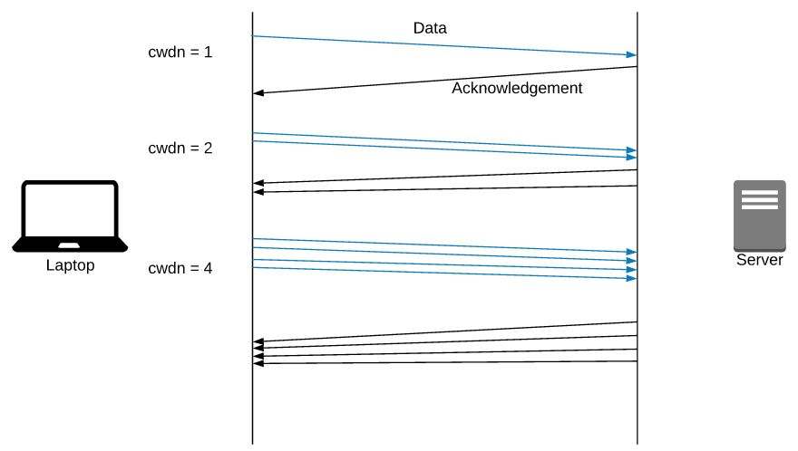
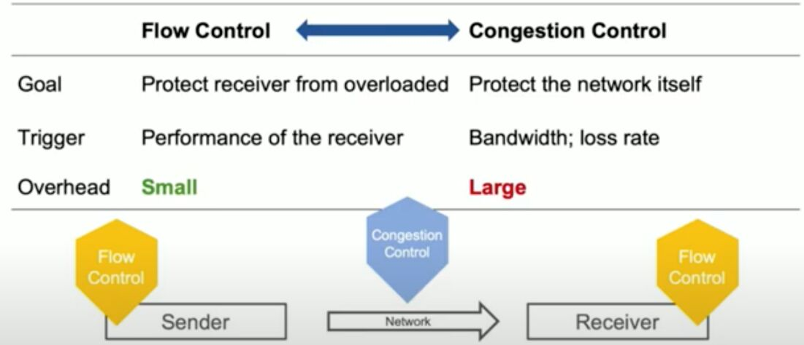
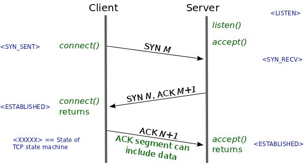
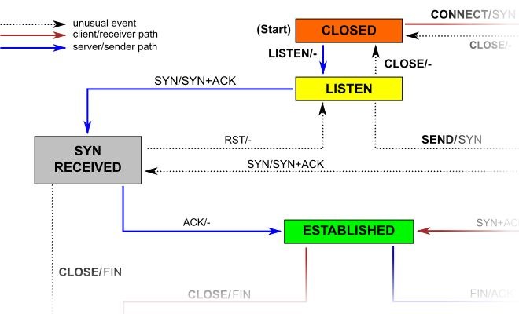

# Flow Control

Flow Control basically means that TCP will ensure that a sender is not overwhelming a receiver by sending packets faster than it can consume. It's pretty similar to what's normally called *Back pressure* in the Distributed Systems literature. The idea is that a node receiving data will send some kind of feedback to the node sending the data to let it know about its current condition.
It's important to understand that this is not the same as *Congestion Control*. Although there's some overlap between the mechanisms TCP uses to provide both services, they are distinct features. Congestion control is about preventing a node from overwhelming the network (i.e. the links between two nodes), while Flow Control is about the end-node.

## Additive increase, Multiplicative decrease

## rwnd - Receiver Window and cwnd - Congestion Window

Congestion Window (cwnd) is a TCP state variable that limits the amount of data the [TCP](https://en.wikipedia.org/wiki/Transmission_Control_Protocol) can send into the network before receiving an [ACK](https://en.wikipedia.org/wiki/Acknowledgement_(data_networks)). The Receiver Window (rwnd) is a variable that advertises the amount of data that the destination side can receive. Together, the two variables are used to regulate data flow in TCP connections, minimize congestion, and improve network performance.

<https://blog.stackpath.com/glossary-cwnd-and-rwnd>

## How it works

When we need to send data over a network, this is normally what happens.



The sender application writes data to a socket, the transport layer (in our case, TCP) will wrap this data in a segment and hand it to the network layer (e.g.IP), that will somehow route this packet to the receiving node.

On the other side of this communication, the network layer will deliver this piece of data toTCP, that will make it available to the receiver application as an exact copy of the data sent, meaning if will not deliver packets out of order, and will wait for a retransmission in case it notices a gap in the byte stream.

If we zoom in, we will see something like this.



TCP stores the data it needs to send in thesend buffer, and the data it receives in thereceive buffer. When the application is ready, it will then read data from the receive buffer.

Flow Control is all about making sure we don't send more packets when the receive buffer is already full, as the receiver wouldn't be able to handle them and would need to drop these packets.

To control the amount of data thatTCPcan send, the receiver will advertise its**Receive Window (rwnd)**, that is, the spare room in the receive buffer.



Every time TCP receives a packet, it needs to send an ack message to the sender, acknowledging it received that packet correctly, and with this ack message it sends the value of the current receive window, so the sender knows if it can keep sending data.

## The sliding window

TCP uses a sliding window protocol to control the number of bytes in flight it can have. In other words, the number of bytes that were sent but not yet acked.
Let's say we want to send a 150000 bytes file from node A to node B.TCPcould break this file down into 100 packets, 1500 bytes each. Now let's say that when the connection between node A and B is established, node B advertises a receive window of 45000 bytes, because it really wants to help us with our math here.
Seeing that, TCPknows it can send the first 30 packets (1500 * 30 = 45000) before it receives an acknowledgment. If it gets anackmessage for the first 10 packets (meaning we now have only 20 packets in flight), and the receive window present in theseackmessages is still 45000, it can send the next 10 packets, bringing the number of packets in flight back to 30, that is the limit defined by the receive window. In other words, at any given point in time it can have 30 packets in flight, that were sent but not yetacked.



Example of a sliding window. As soon as packet 3 is acked, we can slide the window to the right and send the packet 8.
Now, if for some reason the application reading these packets in node B slows down, TCP will still ack the packets that were correctly received, but as these packets need to be stored in the receive buffer until the application decides to read them, the receive window will be smaller, so even if TCP receives the acknowledgment for the next 10 packets (meaning there are currently 20 packets, or 30000 bytes, in flight), but the receive window value received in thisackis now 30000 (instead of 45000), it will not send more packets, as the number of bytes in flight is already equal to the latest receive window advertised.
The sender will always keep this invariant:

LastByteSent - LastByteAcked <= ReceiveWindowAdvertised

## Visualizing the Receive Window

Just to see this behavior in action, let's write a very simple application that reads data from a socket and watch how the receive window behaves when we make this application slower. We will use Wireshark to see these packets, netcat to send data to this application, and ago program to read data from the socket.
Here's the simple go program that reads and prints the data received:

```go
package main

import (
"bufio"
"fmt"
"net"
)

func main() {
listener, _ := net.Listen("tcp", "localhost:3040")
conn, _ := listener.Accept()

for {
message, _ := bufio.NewReader(conn).ReadBytes('n')
fmt.Println(string(message))
}
}
```

This program will simply listen to connections on port 3040 and print the string received.

We can then use net cat to send data to this application:

`$ nc localhost 3040`

Now let's run this command to create a stream of data. It will simply add the string "foo" to a file, that we will use to send to this application:

$ while true; do echo "foo" > stream.txt; done
And now let's send this data to the application:

tail -f stream.txt | nc localhost 3040
The application is still fast enough to keep up with the work, though. So let's make it a bit slower to see what happens:

```go
package main

import (
"bufio"
"fmt"
"net"
"time"
)

func main() {
    listener, _ := net.Listen("tcp", "localhost:3040")
    conn, _ := listener.Accept()

    for {
            message, _ := bufio.NewReader(conn).ReadBytes('n')
            fmt.Println(string(message))
            + time.Sleep(1 * time.Second)
        }
}
```

Now we are sleeping for 1 second before we read data from the receive buffer. If we runnetcatagain and observeWireshark, it doesn't take long until the receive buffer is full andTCPstarts advertising a 0 window size:



At this moment TCP will stop transmitting data, as the receiver's buffer is full.

## The persist timer

There's still one problem, though. After the receiver advertises a zero window, if it doesn't send any otherackmessage to the sender (or if theackis lost), it will never know when it can start sending data again. We will have a deadlock situation, where the receiver is waiting for more data, and the sender is waiting for a message saying it can start sending data again.
To solve this problem, whenTCPreceives a zero-window message it starts the *persist timer*, that will periodically send a small packet to the receiver (usually calledWindowProbe), so it has a chance to advertise a nonzero window size.



When there's some spare space in the receiver's buffer again it can advertise a non-zero window size and the transmission can continue.

## Recap

- TCP's flow control is a mechanism to ensure the sender is not overwhelming the receiver with more data than it can handle;
- With everyackmessage the receiver advertises its current receive window;
- The receive window is the spare space in the receive buffer, that is, rwnd = ReceiveBuffer - (LastByteReceived -- LastByteReadByApplication);
- TCPwill use a sliding window protocol to make sure it never has more bytes in flight than the window advertised by the receiver;
- When the window size is 0, TCPwill stop transmitting data and will start the persist timer;
- It will then periodically send a smallWindowProbemessage to the receiver to check if it can start receiving data again;
- When it receives a non-zero window size, it resumes the transmission.
<https://www.brianstorti.com/tcp-flow-control>

## TCP Slow Start

Slow start is a mechanism which balances the speed of a TCP network connection. It escalates the amount of data transmitted until it finds the network's maximum carrying capacity.cwdnstands for the Congestion Window.
BitTorrent uses tcp slow start
slow start" increases total throughput by keeping networks busy as in "sliding window" and also it solves end-to-end flow control by allowing the receiver to restrict transmission until it has sufficient buffer space to accommodate more data. Whenever the receiver sends ACK, the available buffer space is attached to the ACK (which is known as 'window advertisement'), so that the sender can decide its window size.
In TCP, the window size is defined as the minimum value between**cwnd(congestion window size)** andwindow advertisement.At any time, the window size cannot be greater thanmaximum cwndwhich is fixed.
Not only when the sender starts to transmit at the first time, but also after collision and after idle periods between the sender and the receiver, TCP transmits its data in "slow start" fashion.
<https://www.isi.edu/nsnam/DIRECTED_RESEARCH/DR_HYUNAH/D-Research/slow-start-tcp.html>

## Flow Control vs Congestion Control



## TCP Backlog

Wait, what is the TCP backlog? An application wishing to accept incoming TCP connections must issue thelistensyscall. This syscall instructs the OS to proceed with the TCP 3-way handshake when it receives initial SYN packets. During a handshake, metadata for a connection is maintained in a queue called the TCP backlog. The length of this queue dictates how many TCP connections can be establishing concurrently. The application issues accept syscalls to dequeue connections once they are established; this action frees space in the backlog for new connections.
A backlog length of 1 means the queue will be full while just a single connection is establishing and then waiting to be dequeued. When the queue is full, the OS will drop initial SYN packets from other new connections. A client will resend an initial SYN packet if it doesn't receive a response, but after a couple attempts, it will stop and report failure to connect.



Why would setting the backlog length to 1 occasionally result in HTTP 502s? Most of the time, there are already established connections between the ALB and our API service, so the backlog length does not matter. However, when our service is unusually idle or is about to be upgraded, these connections are closed. A burst of API requests from just a single client at this point could cause the ALB to attempt to establish new TCP connections concurrently. Contention for the single slot in the TCP backlog would cause some of these connections to eventually report failure. The ALB responds to this failure by returning HTTP 502.
<http://veithen.io/2014/01/01/how-tcp-backlog-works-in-linux.html>

When an application puts a socket into LISTEN state using the [listen](http://linux.die.net/man/2/listen) syscall, it needs to specify a backlog for that socket. The backlog is usually described as the limit for the queue of incoming connections.



Because of the 3-way handshake used by TCP, an incoming connection goes through an intermediate state SYN RECEIVED before it reaches the ESTABLISHED state and can be returned by the [accept](http://linux.die.net/man/2/accept) syscall to the application (see the part of the [TCP state diagram](http://commons.wikimedia.org/wiki/File:Tcp_state_diagram_fixed.svg) reproduced above). This means that a TCP/IP stack has two options to implement the backlog queue for a socket in LISTEN state:

1. The implementation uses a single queue, the size of which is determined by thebacklogargument of thelistensyscall. When a SYN packet is received, it sends back a SYN/ACK packet and adds the connection to the queue. When the corresponding ACK is received, the connection changes its state to ESTABLISHED and becomes eligible for handover to the application. This means that the queue can contain connections in two different state: SYN RECEIVED and ESTABLISHED. Only connections in the latter state can be returned to the application by theacceptsyscall.

2. The implementation uses two queues, a SYN queue (or incomplete connection queue) and an accept queue (or complete connection queue). Connections in state SYN RECEIVED are added to the SYN queue and later moved to the accept queue when their state changes to ESTABLISHED, i.e. when the ACK packet in the 3-way handshake is received. As the name implies, theacceptcall is then implemented simply to consume connections from the accept queue. In this case, thebacklogargument of thelistensyscall determines the size of the accept queue.

## Note that a "listen backlog" of 100 connections doesn't mean that your server can only handle 100 simultaneous (or total) connections - this is instead dependent on the number of configured processes or threads. The listen backlog is a socket setting telling the kernel how to limit the number of outstanding (as yet unaccapted) connections in the listen queue of a listening socket. If the number of pending connections exceeds the specified size, new ones are automatically rejected. A functioning server regularly servicing its connections should not require a large backlog size
