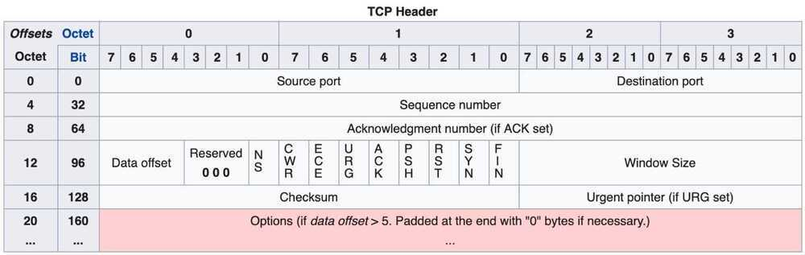

# TCP (Connection Oriented Protocol)

TCP stands for transmission control protocol. It is implemented in the transport layer of the IP/TCP model and is used to establish reliable connections.

TCP is one of the protocols that encapsulates data into packets. It then transfers these to the remote end of the connection using the methods available on the lower layers. On the other end, it can check for errors, request certain pieces to be resent, and reassemble the information into one logical piece to send to the application layer.

The protocol builds up a connection prior to data transfer using a system called a **three-way handshake**. This is a way for the two ends of the communication to acknowledge the request and agree upon a method of ensuring data reliability.

After the data has been sent, the connection is torn down using a similar **four-way handshake**.

TCP is the protocol of choice for many of the most popular uses for the internet, including WWW, FTP, SSH, and email. It is safe to say that the internet we know today would not be here without TCP.

## TCP Congestion Control

### Common Algorithms

- **Reno**
- **BIC**
- **CUBIC**

### General Strategy

- Increase sending rate if ACK
- Decrease if ACK missed

`cat /proc/sys/net/ipv4/tcp_congestion_control`

### TCP BBR

It's a TCP Congestion Control Algorithm

New Backoff algorithm for handling network congestion. Great for clients working in low bandwidth connection like 2G.

Only needed to set a flag on server, Client doesn't need to be updated

https://medium.com/google-cloud/tcp-bbr-magic-dust-for-network-performance-57a5f1ccf437

### Additive increase/multiplicative decrease (AIMD)

The additive-increase/multiplicative-decrease(AIMD) algorithm is a feedback control algorithm best known for its use in [TCP congestion control](https://en.wikipedia.org/wiki/TCP_congestion_control). AIMD combines linear growth of the congestion window with an exponential reduction when congestion is detected. Multiple flows using AIMD congestion control will eventually converge to use equal amounts of a shared link.The related schemes of multiplicative-increase/multiplicative-decrease (MIMD) and additive-increase/additive-decrease (AIAD) do not reach [stability](https://en.wikipedia.org/wiki/Stability_theory).

https://en.wikipedia.org/wiki/Additive_increase/multiplicative_decrease

TCP is a reliable stream delivery service which guarantees that all bytes received will be identical and in the same order as those sent. Since packet transfer by many networks is not reliable, TCP achieves this using a technique known as *positive acknowledgement with re-transmission*. This requires the receiver to respond with an acknowledgement message as it receives the data. The sender keeps a record of each packet it sends and maintains a timer from when the packet was sent. The sender re-transmits a packet if the timer expires before receiving the acknowledgement. The timer is needed in case a packet gets lost or corrupted.

While IP handles actual delivery of the data, TCP keeps track of *segments*- the individual units of data transmission that a message is divided into for efficient routing through the network. For example, when an HTML file is sent from a web server, the TCP software layer of that server divides the file into segments and forwards them individually to the [internet layer](https://en.wikipedia.org/wiki/Internet_layer) in the [network stack](https://en.wikipedia.org/wiki/Network_stack). The internet layer software encapsulates each TCP segment into an IP packet by adding a header that includes (among other data) the destination [IP address](https://en.wikipedia.org/wiki/IP_address). When the client program on the destination computer receives them, the TCP software in the transport layer re-assembles the segments and ensures they are correctly ordered and error-free as it streams the file contents to the receiving application.

## Concepts

The absolute limitation onTCPpacketsizeis 64K (65535 bytes), but in practicality this is far larger than thesizeof any packet you will see, because the lower layers (e.g. ethernet) have lower packetsizes. The MTU (MaximumTransmission Unit) for Ethernet, for instance, is 1500 bytes

## MTU (Maximum Transmission Unit)

Maximum transmission unit is the maximum size of a packet or frame that can flow across the network, without being fragmented. For Ethernet networks, the maximum MTU value is 1500 bytes.

Path MTU Discovery(PMTUD) is a standardized technique in [computer networking](https://en.wikipedia.org/wiki/Computer_networking) for determining the [maximum transmission unit (MTU)](https://en.wikipedia.org/wiki/Maximum_transmission_unit) size on the network path between two Internet Protocol (IP) hosts, usually with the goal of avoiding [IP fragmentation](https://en.wikipedia.org/wiki/IP_fragmentation). PMTUD was originally intended for routers in [Internet Protocol Version 4](https://en.wikipedia.org/wiki/IPv4)(IPv4).However, all modern operating systems use it on endpoints. In [IPv6](https://en.wikipedia.org/wiki/IPv6), this function has been explicitly delegated to the end points of a communications session.

https://en.wikipedia.org/wiki/Path_MTU_Discovery

## MSS (Maximum Segment Size)

Maximum segment size is the maximum TCP datagram size. It represents the maximum payload size an endpoint is willing to accept within a single packet. Maximum MSS value is 1460 bytes. The MSS, IP header and TCP header, together make up the MTU value. That is, 1500 MTU = 1460 byte MSS + 20 byte IP header + 20 byte TCP header. Said another way, MSS = MTU - 40.

Do note that MSS is only announced during the TCP handshake in the SYN segment, it is not a negotiated parameter. Meaning, client and server can announce their own individual and different MSS values [rfc879](https://tools.ietf.org/html/rfc879). The actual MSS is selected based on the endpoint's buffer and outgoing interface MTU. This can be represented visually by considering a communication between client A and server B [cisco-ipfrag](https://www.cisco.com/c/en/us/support/docs/ip/generic-routing-encapsulation-gre/25885-pmtud-ipfrag.html).**TCP Segment Structure**

Transmission Control Protocol accepts data from a data stream, divides it into chunks, and adds a TCP header creating a TCP segment. The TCP segment is then [encapsulated](https://en.wikipedia.org/wiki/Encapsulation_(networking)) into an Internet Protocol (IP) datagram, and exchanged with peers.
The termTCP packetappears in both informal and formal usage, whereas in more precise terminology segment refers to the TCP [protocol data unit](https://en.wikipedia.org/wiki/Protocol_data_unit)(PDU), datagramto the IP PDU, andframeto the data link layer PDU:

Processes transmit data by calling on the TCP and passing buffers of data as arguments. The TCP packages the data from these buffers into segments and calls on the internet module [e.g. IP] to transmit each segment to the destination TCP.

A TCP segment consists of **a segmentheaderand adatasection**. The TCP header contains 10 mandatory fields, and an optional extension field (Options, pink background in table).
The data section follows the header. Its contents are the payload data carried for the application. The length of the data section is not specified in the TCP segment header. It can be calculated by subtracting the combined length of the TCP header and the encapsulating IP header from the total IP datagram length (specified in the IP header).

## Sequence number (32 bits)

TCP uses sequence number field to keep track of the amount of data sent in a communication stream. TCP uses a random 32-bit number to identify the beginning of a conversation. This is known as the initial sequence number (ISN). Rather than starting all TCP conversations with 1, a random ISN helps to identify and keep traffic separate for each flow

Has a dual role:

- If the SYN flag is set (1), then this is the initial sequence number. The sequence number of the actual first data byte and the acknowledged number in the corresponding ACK are then this sequence number plus 1.
- If the SYN flag is clear (0), then this is the accumulated sequence number of the first data byte of this segment for the current session.

## Acknowledgement number

Used by the receiving host to acknowledge successful receipt of a TCP segment. An ACK message is replied to the sending host, which includes the received sequence number incremented by 1. This number also informs the sending host, the sequence number of the next segment expected by the receiving host [www.firewall.cx](http://www.firewall.cx/networking-topics/protocols/tcp/134-tcp-seq-ack-numbers.html).

## Relative sequence number

Wireshark uses numbers relative to each TCP stream to keep track of each session. This essentially means that the 'Sequence' and 'Acknowledgement numbers' will always begin with a 0 for each new session. Using a small number makes it easier to read the packet captures, as opposed to looking at a large number (since 32-bit ISN can be anything from 0 to 4.2 billion). To verify if Wireshark is using this option, go to Wireshark->preferences->protocols->TCP-> check 'Relative sequence numbers'.

## Next sequence number

This is the length of the TCP payload + the current sequence number. It indicates the sequence number of the next segment that will sent by the client.

## Selective ACK (SACK)

This TCP option is used to identify a block of data that was received by a host. The sender does not re-transmit data identified by the left edge and right edge of SACK. This option can be used only if supported by both the parties and is negotiated during the TCP handshake [packetlife-sack](http://packetlife.net/blog/2010/jun/17/tcp-selective-acknowledgments-sack/).

## Duplicate ACK

As part of the TCP fast re-transmit mechanism, duplicate ACKs are used to inform sender of either segments received out-of-order or lost segments. Re-transmission of missing segments is performed immediately [rfc2001-sec](https://tools.ietf.org/html/rfc2001).

## Flags (9 bits) (aka Control bits)

Contains 9 1-bit flags

- NS (1 bit): ECN-nonce - concealment protection (experimental: see [RFC 3540](https://tools.ietf.org/html/rfc3540)).
- CWR (1 bit): Congestion Window Reduced (CWR) flag is set by the sending host to indicate that it received a TCP segment with the ECE flag set and had responded in congestion control mechanism (added to header by [RFC 3168](https://tools.ietf.org/html/rfc3168)).
- ECE (1 bit): ECN-Echo has a dual role, depending on the value of the SYN flag. It indicates:
    - If the SYN flag is set (1), that the TCP peer is [ECN](https://en.wikipedia.org/wiki/Explicit_Congestion_Notification) capable.
    - If the SYN flag is clear (0), that a packet with Congestion Experienced flag set (ECN=11) in the IP header was received during normal transmission (added to header by [RFC 3168](https://tools.ietf.org/html/rfc3168)). This serves as an indication of network congestion (or impending congestion) to the TCP sender.
- URG (1 bit): indicates that the Urgent pointer field is significant
- ACK (1 bit): indicates that the Acknowledgment field is significant. All packets after the initial SYN packet sent by the client should have this flag set.
- PSH (1 bit): Push function. Asks to push the buffered data to the receiving application.
- RST (1 bit): Reset the connection
- SYN (1 bit): Synchronize sequence numbers. Only the first packet sent from each end should have this flag set. Some other flags and fields change meaning based on this flag, and some are only valid when it is set, and others when it is clear.
- FIN (1 bit): Last packet from sender.

https://en.wikipedia.org/wiki/Transmission_Control_Protocol

https://medium.com/walmartlabs/how-tcp-segment-size-can-affect-application-traffic-flow-7bbceed5816e

## TCP Handshake (3-way handshake) (Positive Acknowledgement with Re-transmission / PAR)

A three-way handshake is a method used in a TCP/IP network to create a connection between a local host/client and server. It is a three-step method that requires both the client and server to exchange SYN and ACK (acknowledgment) packets before actual data communication begins.

Now a device using PAR resend the data unit until it receives an acknowledgement. If the data unit received at the receiver's end is damaged(It checks the data with checksum functionality of the transport layer that is used for Error Detection), then receiver discards the segment. So the sender has to resend the data unit for which positive acknowledgement is not received.

- **Step 1 (SYN):** In the first step, client wants to establish a connection with server, so it sends a segment with SYN(Synchronize Sequence Number) which informs server that client is likely to start communication and with what sequence number it starts segments with
- **Step 2 (SYN + ACK):** Server responds to the client request with SYN-ACK signal bits set. Acknowledgement(ACK) signifies the response of segment it received and SYN signifies with what sequence number it is likely to start the segments with
- **Step 3 (ACK):** In the final part client acknowledges the response of server and they both establish a reliable connection with which they will start the actual data transfer

The steps 1, 2 establish the connection parameter (sequence number) for one direction and it is acknowledged. The steps 2, 3 establish the connection parameter (sequence number) for the other direction and it is acknowledged. With these, a full-duplex communication is established.

Initial sequence numbers are randomly selected while establishing connections between client and server.

https://www.geeksforgeeks.org/tcp-3-way-handshake-process

## TCP Connection Termination

1. **Step 1 (FIN From Client)** Suppose that the client application decides it wants to close the connection. (Note that the server could also choose to close the connection). This causes the client send a TCP segment with the **FIN** bit set to **1** to server and to enter the **FIN_WAIT_1** state. While in the **FIN_WAIT_1** state, the client waits for a TCP segment from the server with an acknowledgment (ACK).

2. **Step 2 (ACK From Server) --** When Server received FIN bit segment from Sender (Client), Server Immediately send acknowledgement (ACK) segment to the Sender (Client).

3. **Step 3 (Client waiting) --** While in the **FIN_WAIT_1** state, the client waits for a TCP segment from the server with an acknowledgment. When it receives this segment, the client enters the **FIN_WAIT_2** state. While in the **FIN_WAIT_2** state, the client waits for another segment from the server with the FIN bit set to 1.

4. **Step 4 (FIN from Server) --** Server sends FIN bit segment to the Sender(Client) after some time when Server send the ACK segment (because of some closing process in the Server).

5. **Step 5 (ACK from Client) --** When Client receive FIN bit segment from the Server, the client acknowledges the server's segment and enters the **TIME_WAIT** state. The **TIME_WAIT** state lets the client resend the final acknowledgment in case the **ACK** is lost.The time spent by client in the **TIME_WAIT** state is depend on their implementation, but their typical values are 30 seconds, 1 minute, and 2 minutes. After the wait, the connection formally closes and all resources on the client side (including port numbers and buffer data) are released.

TCP states visited by ClientSide --

TCP states visited by ServerSide --

https://www.geeksforgeeks.org/tcp-connection-termination

## Problems

- **Head of line blocking**

The role of TCP is to deliver the entire stream of bytes, in the correct order, from one endpoint to the other. When a TCP packet carrying some of those bytes is lost on the network path, it creates a gap in the stream and TCP needs to fill it by resending the affected packet when the loss is detected. While doing so, none of the successfully delivered bytes that follow the lost ones can be delivered to the application, even if they were not themselves lost and belong to a completely independent HTTP request. So they end up getting unnecessarily delayed as TCP cannot know whether the application would be able to process them without the missing bits. This problem is known as "head-of-line blocking".

## Peformance-enhancing proxy

Performance-enhancing proxies(PEPs) are network agents designed to improve the end-to-end performance of some [communication protocols](https://en.wikipedia.org/wiki/Communication_protocols)

## Classification

Available PEP implementations use different methods to enhance performance.

- **Proxy type:** A PEP can either 'split' a connection or 'snoop' into it. In the first case, the proxy pretends to be the opposite endpoint of the connection in each direction, literally splitting the connection into two. In the latter case, the proxy controls the transmissions of the TCP segments in both directions, by ack filtering and reconstruction in the existing connection (see [protocol spoofing](https://en.wikipedia.org/wiki/Protocol_spoofing)). This is based on the OSI level of implementation of the PEP.
- **Distribution:** PEPs can be either integrated or distributed. Integrated PEP will run on a single box, while distributed PEP will require to be installed on both sides of the link that cause the performance degradation. This is quite common in commercial PEP devices, which act as a [black box](https://en.wikipedia.org/wiki/Black_box), using more or less open protocols to communicate between them in the place of TCP.
- **Symmetry:** A PEP implementation may be symmetric or asymmetric. Symmetric PEPs use identical behavior in both directions; the actions taken by the PEP occur independent from which interface a packet is received. Asymmetric PEPs operate differently in each direction, which can cause, for example, only one link direction performance to be enhanced.

## Types

- Split-TCP
- Ack filtering/decimation
- Snoop
- D-proxy

https://en.wikipedia.org/wiki/Performance-enhancing_proxy

## TCP Split

TCP splitting uses a performance enhancing proxy access node that divides the end-to-end TCP connection between the client and the server into a multi-overlay-hop path where each overlay hop is an independent TCP connection, such that the RTT of each overlay hop is lower than the direct RTT between A and B. Each hop's throughput is governed by that hop's RTT and is individually higher than the direct throughput between A and B.

But performance issues can arise due to the interaction among path segments and different layers for any particular solution. For example, in TCP Splitting, the intermediate node (the spoofer) sends back a spoofing ACK packet to the TCP sender immediately upon receiving a TCP data packet instead of waiting for the ACK from the final TCP destination.

One of the well known problems of TCP splitting is that by breaking the end-to-end connection, a split TCP connection is no longer reliable or secure, and a server failure may cause the client to believe that data has been successfully received when it has not. From theApplication Server TCP Splittingpane, you can access the TCP Splitting for the Application Server.

https://webhelp.radware.com/AppDirector/v214/214Advanced%20Capabilities.07.04.htm

[split tcp protocol | Adhoc N/W | lec-34 | Bhanu Priya](https://www.youtube.com/watch?v=U1ryk2zIAjc)
