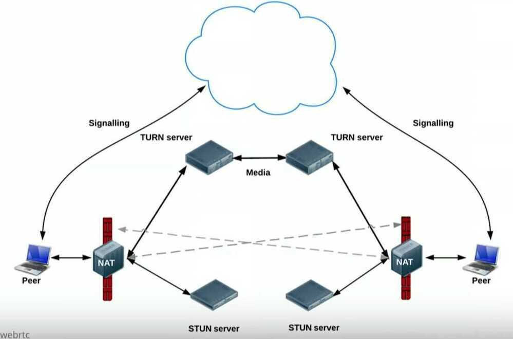
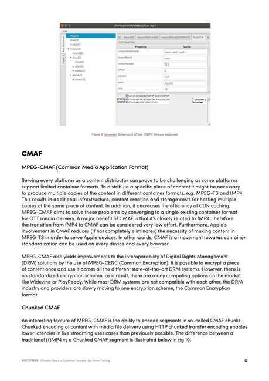
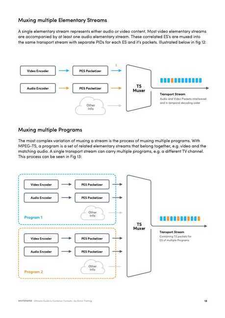
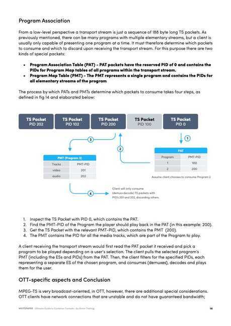

# Video / Live Streaming

## Tools

- **Zoom**
- [Free Video Conferencing Software for Web & Mobile | Jitsi](https://jitsi.org)
    - [Jitsi Meet](https://meet.jit.si)
    - [Introduction | Jitsi Meet](https://jitsi.github.io/handbook/docs/intro)
- Google Meet
- [Zoho Webinar | Video Webinar Platform & Tool](https://www.zoho.com/webinar/)
- Skype
- https://goodmeetings.ai
- [Video Meetings, Video Conferencing and Video Call API](https://whereby.com/)
- [GitHub - 0x5eba/Video-Meeting: Google Meet / Zoom clone in a few lines of code](https://github.com/0x5eba/Video-Meeting)

RTMP - Real-Time Messaging Protocol

https://github.com/facebookincubator/rtmp-go-away

HLS - https://www.toptal.com/apple/introduction-to-http-live-streaming-hls

MPEG-DASH - Dynamic Adaptive Streaming over HTTP

## WebRTC

Peer to peer live streaming protocol

### ICE - Interactivity Connection Establishment

- A framework for connecting peers
- Tries to find the best path for each call
- Vast majority of calls can use STUN
- ICE Agent
- ICE Candidates

### SDP - Session Description Protocol

- What capabilities are there in a call (Audio/Video)
- What codecs can be used
- What bandwidth is available for the call

### STUN - Session Traversals Utility for NAT

- What is my public IP address (because of NAT)
- NAT Hole punching
- A server that is publicly available on internet and that server will respond with your public ip and port that you requested with.
- Google/Twilio hosts STUN server / CoTurn/ Xirsys (https://xirsys.com)

### TURN - Traversal Using Relay around NAT

- Provide a cloud fallback if peer-to-peer communication fails
- Data is sent through server, uses server environment
- Ensures the call works in almost all environments
- Relays packet from point A to point B
- All TURN servers are also STUN servers




[WebRTC Crash Course](https://youtu.be/FExZvpVvYxA)

[GitHub - Jaideep25/Videolify: Peer-peer calling, with screensharing, whiteboard, amazing themes, easy to read the code, etc !!](https://github.com/Jaideep25/Videolify)

## FFMPEG Streaming

ffmpeg (fast forward motion pictures expert group) for streaming videos over rtp to any number of different locations using multicasting

### Commands

```bash
brew install ffmpeg

ffmpeg -i demo.mp4 -v 0 -vcodec mpeg4 -f mpegts udp://192.168.1.119:1234

ffplay udp://192.168.1.119:1234

ffmpeg -i rtp://@239.35.10.4:10000 -map 0:0 -map 0:2 -vcodec copy -acodec

copy -t 10 -y test.mkv- Wowza Streaming Server
```

Red5 FOSS Streaming Server

FFMPEG stitching multiple files into one

https://trac.ffmpeg.org/wiki/Concatenate

## Others

- HDR - High Dynamic Range
- SDR - Standard Dynamic Range


[Bringing HDR video to Reels - Engineering at Meta](https://engineering.fb.com/2023/07/17/video-engineering/hdr-video-reels-meta/)

[GitHub - google-ai-edge/mediapipe: Cross-platform, customizable ML solutions for live and streaming media.](https://github.com/google-ai-edge/mediapipe)

## References

- https://www.wowza.com/docs/tutorials
- http://red5.org
- https://www.wowza.com/docs/how-to-publish-a-video-file-as-a-live-stream
- https://s3-ap-southeast-1.amazonaws.com/shivamexample/Test-Deepak/demo.mp4
- https://aws.amazon.com/cloudfront/streaming
- https://aws.amazon.com/answers/media-entertainment/live-streaming
- https://trac.ffmpeg.org/wiki/Map
- https://trac.ffmpeg.org/wiki/StreamingGuide
- https://trac.ffmpeg.org/wiki/Capture/Webcam
- [EP139: Design a Live Streaming System](https://blog.bytebytego.com/p/ep139-design-a-live-streaming-system)
- [**https://go.bitmovin.com/ultimate-guide-container-formats**](https://go.bitmovin.com/ultimate-guide-container-formats)










## Audio / Codec / Digital Audio

[Understanding Sound & Speakers - YouTube](https://www.youtube.com/playlist?list=PL6rx9p3tbsMvYWeYUTNuRNMLXn0eyJvub)

- Compressions
- Rarefactions

## Links

- [Video Streaming With the AV1 Video Codec in Mobile Devices - Engineering at Meta](https://engineering.fb.com/2025/09/24/video-engineering/video-streaming-with-av1-video-codec-mobile-devices-meta-white-paper/)
