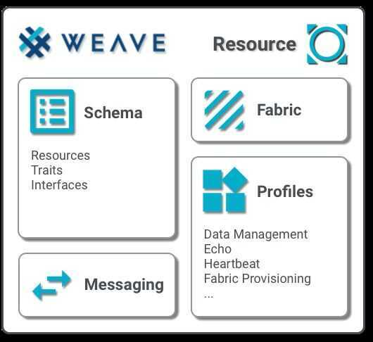

# Weave

Weave is a set of application-level networking protocols built around a common addressing and naming architecture with low overhead serialization protocols and modern security.
Weave protocols deliver device-to-device, device-to-mobile, and device-to-cloud communication for both control and data in the Internet of Things (IoT) space. While Weave is architected around IPv6, it can utilize any IP network or point-to-point communication technology such as BLE.

Weave was designed with the following goals in mind:

- Low overhead - Lightweight solution for low-power devices
- Pervasive - Scalable and unified protocol everywhere
- Robust - Leverages Thread and is self-healing to the cloud
- Secure - Interactions are secure, even when the network is not
- Easy to use - Flexible setup and configuration
- Versatile - Strongly-typed data for powerful interaction

## References

https://openweave.io

https://openweave.io/guides/weave-primer

https://codelabs.developers.google.com/codelabs/happy-weave-getting-started/#0
