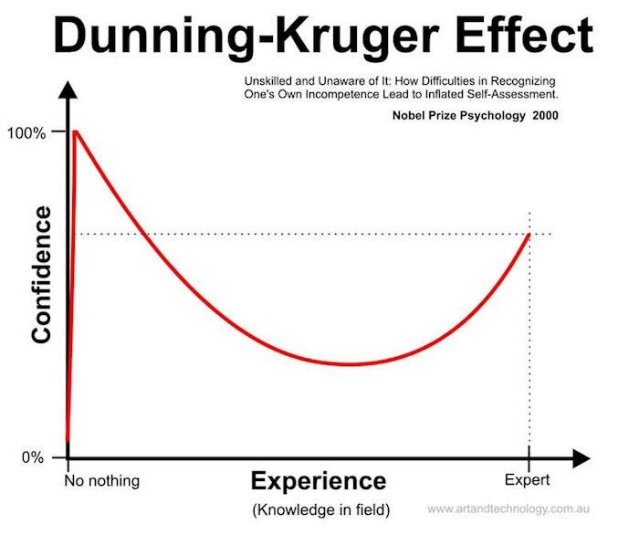
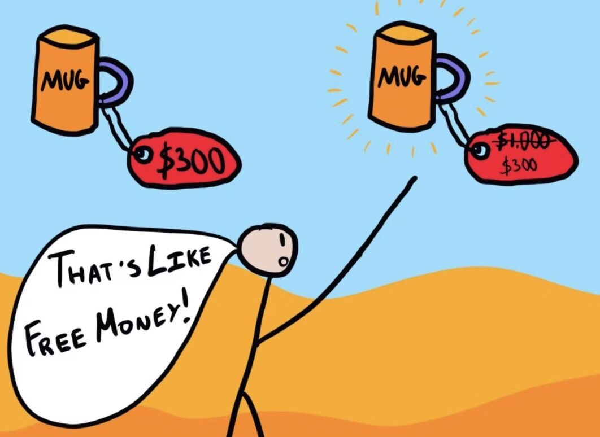
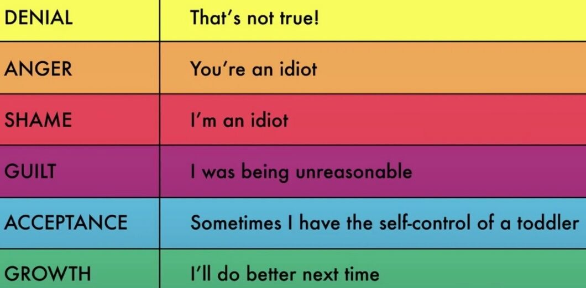

# Biases / Fallacies

There are two major types of **logical fallacies**

1. **Formal fallacies**, there's a problem withhowyou structure your argument, and how you're making your points. You might be speaking the truth, but the logic breaks down because of the way you're putting your arguments together.

2. **Informal fallacies**, there's a problem withwhatyou're saying, and the information might be incorrect or misleading.

https://www.freecodecamp.org/news/logical-fallacies-definition-fallacy-examples

We have a habit of distorting the facts until they become bearable for our own views -- Charlie Munger

## Coding

[**Bandwagon effect**](https://en.wikipedia.org/wiki/Bandwagon_effect)

Just make sure that you're choosing a technology because it solves real needs for you, not because the cool kids are doing it.

**Mere newness bias**

Many software developers tend to undervalue technologies they have worked with for a long time, and overvalue the benefits of a new technology.

[**Feature-positive effect**](https://pigeon.psy.tufts.edu/avc/dittrich/fepef.htm)

We tend to see what is present, and overlook what isn't there. This can wreak havoc when working in concert with the "Mere newness bias", since not only are you inherently putting more value on the new technology, but you're also overlooking the gaps of the new tech.

https://upload.wikimedia.org/wikipedia/commons/c/ce/Cognitive_Bias_Codex_With_Definitions%2C_an_Extension_of_the_work_of_John_Manoogian_by_Brian_Morrissette.jpg

https://www.teachthought.com/critical-thinking/the-cognitive-bias-codex-a-visual-of-180-cognitive-biases

https://en.wikipedia.org/wiki/List_of_cognitive_biases

https://en.wikipedia.org/wiki/Cognitive_bias

https://en.wikipedia.org/wiki/Cognitive_bias_mitigation

## Dunning-Kruger Effect

"Relatively unskilled persons suffer illusory superiority, mistakenly assessing their ability to be much higher than it really is... and highly skilled individuals may underestimate their relative competence and may erroneously assume that tasks which are easy for them are also easy for others." (related: [overconfidence effect](https://en.wikipedia.org/wiki/Overconfidence_effect))

Thinking we know more than we do

[The Knowledge Illusion](../../book-summaries/the-knowledge-illusion)

## Cognitive Dissonance

- New information contradicting our existing beliefs
- Ex - you like both hamburger and cow
- Is a state of uneasiness that happens when you have inconsistent beliefs or behavior
- You may have felt it when you learned new information about the world that contradicted something you'd believed for a long time or maybe you learned something about your behavior that conflicted with your sense of self
- The state of having inconsistent thoughts, beliefs, or attitudes, especially as relating to behavioural decisions and attitude change
- Resistance to change
    - That trait depends on a few factors
        - How much you identify with your belief
        - How much satisfaction you get from your behavior
        - How much pain or loss you'd have to endure to change those things
- Selective exposure
    - Listens to people and media persons that agree with them and dismiss others that challenge their world views
- We'll go a long way to reduce the feeling that our thoughts or actions don't line up with the way we see ourselves or the world

#### Example

Fox tries to reach grapes that are out of his reach

Outcomes -

1. Get to the grapes
2. Admit that he was not smart/skilled enough to get to the grapes (Hurts Ego)
3. Reinterpret the situation retrospectively (Never wanted those sour grapes anyway)

## [Selection Bias](https://en.wikipedia.org/wiki/Selection_bias)

The selection of individuals, groups or data for analysis in such a way that proper randomization is not achieved, thereby ensuring that the sample obtained is not representative of the population intended to be analyzed." (related:[sampling bias](https://en.wikipedia.org/wiki/Sampling_bias))

## Surviorship Bias

Survivorship bias refers to our tendency to focus on the winners in a particular area and try to learn from them while completely forgetting about the losers who are employing the same strategy.

The logical error of concentrating on the people or things that 'survived' some process and inadvertently overlooking those that did not because of their lack of visibility.

Survivorship biasorsurvival biasis the [logical error](https://en.wikipedia.org/wiki/Logical_error) of concentrating on the people or things that made it past some selection process and overlooking those that did not, typically because of their lack of visibility. This can lead to false conclusions in several different ways. It is a form of [selection bias](https://en.wikipedia.org/wiki/Selection_bias).

Survivorship bias can lead to overly optimistic beliefs because failures are ignored, such as when companies that no longer exist are excluded from analyses of financial performance. It can also lead to the false belief that the successes in a group have some special property, rather than just coincidence ([correlation proves causality](https://en.wikipedia.org/wiki/Post_hoc_ergo_propter_hoc)). For example, if three of the five students with the best college grades went to the same high school, that can lead one to believe that the high school must offer an excellent education. This could be true, but the question cannot be answered without looking at the grades of all the other students from that high school, not just the ones who "survived" the top-five selection process. Another example of a distinct mode of survivorship bias would be thinking that an incident was not as dangerous as it was because everyone you communicate with afterwards survived. Even if you knew that some people are dead, they wouldn't have their voice to add to the conversation, leading to bias in the conversation.

#### In the military

During World War II, the statistician [Abraham Wald](https://en.wikipedia.org/wiki/Abraham_Wald) took survivorship bias into his calculations when considering how to minimize bomber losses to enemy fire. Researchers from the Center for Naval Analyses had conducted a study of the damage done to aircraft that had returned from missions, and had recommended that armor be added to the areas that showed the most damage. Wald noted that the study only considered the aircraft that had survived their missions - the bombers that had been shot down were not present for the damage assessment. The holes in the returning aircraft, then, represented areas where a bomber could take damage and still return home safely. Wald proposed that the Navy reinforce areas where the returning aircraft were unscathed, since those were the areas that, if hit, would cause the plane to be lost. His work is considered seminal in the then-nascent discipline of [operational research](https://en.wikipedia.org/wiki/Operational_research).

https://en.wikipedia.org/wiki/Survivorship_bias

## Loss Aversion

Loss aversion refers to our tendency to strongly prefer avoiding losses over acquiring gains. Research has shown that if someone gives you $10 you will experience a small boost in satisfaction, but if you lose $10 you will experience a dramatically higher loss in satisfaction. Yes, the responses are opposite, but they are not equal in magnitude.

Humans may be hardwired to be loss averse due to asymmetric evolutionary pressure on losses and gains: for an organism operating close to the edge of survival, the loss of a day's food could cause death, whereas the gain of an extra day's food would not cause an extra day of life (unless the food could be easily and effectively stored).

https://en.wikipedia.org/wiki/Loss_aversion

## Prospect Theory

- The prospect theory says that investors value gains and losses differently, placing more weight on perceived gains versus perceived losses.
- An investor presented with a choice, both equal, will choose the one presented in terms of potential gains.
- Prospect theory is also known as the loss-aversion theory.
- The prospect theory is part of behavioral economics, suggesting investors chose perceived gains because losses cause a greater emotional impact.
- The certainty effect says individuals prefer certain outcomes over probable ones, while the isolation effect says individuals cancel out similar information when making a decision.

- Money 1 - 100% chance of winning $200 (people choose this)
- Money 2 - 20% chance of winning $1000
- Money 1 - 100% chance of losing $800
- Money 2 - 80% change of losing $1000 (people choose this)

https://www.investopedia.com/terms/p/prospecttheory.asp

https://en.wikipedia.org/wiki/Prospect_theory

## Availability Heuristic

[Availability Bias](https://en.wikipedia.org/wiki/Availability_heuristic) - "People tend to heavily weigh their judgments toward more recent information, making new opinions biased toward that latest news."

The Availability Heuristic refers to a common mistake that our brains make by assuming that the examples which come to mind easily are also the most important or prevalent things.

For example, research by Steven Pinker at Harvard University has shown that we are currently living in the least violent time in history. There are more people living in peace right now than ever before. The rates of homicide, rape, sexual assault, and child abuse are all falling.

Most people are shocked when they hear these statistics. Some still refuse to believe them. If this is the most peaceful time in history, why are there so many wars going on right now? Why do I hear about rape and murder and crime every day? Why is everyone talking about so many acts of terrorism and destruction?

Welcome to the availability heuristic.

The answer is that we are not only living in the most peaceful time in history, but also the best reported time in history. Information on any disaster or crime is more widely available than ever before. A quick search on the Internet will pull up more information about the terrorist act of your choice than any newspaper could have every delivered 100 years ago.

The overall percentage of dangerous events is decreasing, but the likelihood that you hear about one of them (or many of them) is increasing. And because these events are readily available in our mind, our brains assume that they happen with greater frequency than they actually do.

We overvalue and overestimate the impact of things that we can remember and we undervalue and underestimate the prevalence of the events we hear nothing about.

Theavailability heuristicis a mental shortcut that relies on immediate examples that come to a given person's mind when evaluating a specific topic, concept, method or decision. The availability [heuristic](https://en.wikipedia.org/wiki/Heuristics_in_judgment_and_decision_making) operates on the notion that if something can be recalled, it must be important, or at least more important than alternative solutions which are not as readily recalled.Subsequently, under the availability heuristic, people tend to heavily weigh their judgments toward more recent information, making new opinions biased toward that latest news.

The availability of consequences associated with an action is positively related to perceptions of the magnitude of the consequences of that action. In other words, the easier it is to recall the consequences of something the greater those consequences are often perceived to be. Most notably, people often rely on the content of their recall if its implications are not called into question by the difficulty that they experience in bringing the relevant material to mind.

Ex - If you are researching on terrorism, then you will read a lot about terrorism and think that terrorism is more common that it actually is, simply because you are exposed to it a lot.

https://en.wikipedia.org/wiki/Availability_heuristic

## Anchoring

There is a burger joint close to my hometown that is known for gourmet burgers and cheeses. On the menu, they very boldly state, "LIMIT 6 TYPES OF CHEESE PER BURGER."

My first thought:This is absurd. Who gets six types of cheese on a burger?

My second thought:Which six am I going to get?

I didn't realize how brilliant the restaurant owners were until I learned about anchoring. You see, normally I would just pick one type of cheese on my burger, but when I read "LIMIT 6 TYPES OF CHEESE" on the menu, my mind was anchored at a much higher number than usual.

Most people won't order six types of cheese, but that anchor is enough to move the average up from one slice to two or three pieces of cheese and add a couple extra bucks to each burger. You walk in planning to get a normal meal. You walk out wondering how you paid $14 for a burger.

This effect has been replicated in a wide range of research studies and commercial environments. For example, business owners have found that if you say "Limit 12 per customer" then people will buy twice as much product compared to saying, "No limit."

In one research study, volunteers were asked to guess the percentage of African nations in the United Nations. Before they guessed, however, they had to spin a wheel that would land on either the number 10 or the number 65. When volunteers landed on 65, the average guess was around 45 percent. When volunteers landed on 10, the average estimate was around 25 percent. This 20 digit swing was simply a result of anchoring the guess with a higher or lower number immediately beforehand.

Perhaps the most prevalent place you hear about anchoring is with pricing. If the price tag on a new watch is $500, you might consider it too high for your budget. However, if you walk into a store and first see a watch for $5,000 at the front of the display, suddenly the $500 watch around the corner seems pretty reasonable. Many of the premium products that businesses sell are never expected to sell many units themselves, but they serve the very important role of anchoring your mindset and making mid-range products appear much cheaper than they would on their own.

### Anchoring Bias / Anchoring Effect

There are two dominant theories behind anchoring bias

1. The **anchor-and-adjust hypothesis**, says that when we make decisions under uncertainty, we start by calculating some initial value and adjusting it, but our adjustments are usually insufficient

2. The **selective accessibility theory**, says that anchoring bias happens because we are primed to recall and notice anchor-consistent information

https://thedecisionlab.com/biases/anchoring-bias

## Confirmation Bias

Confirmation bias refers to our tendency to search for and favor information that confirms our beliefs while simultaneously ignoring or devaluing information that contradicts our beliefs.

Finding evidence to confirm our existing belief

[Confirmation Bias](https://en.wikipedia.org/wiki/Confirmation_bias) - "The tendency to search for, interpret, favor, and recall information in a way that confirms one's preexisting beliefs or hypotheses, while giving disproportionately less consideration to alternative possibilities." (related:[cognitive dissonance](https://en.wikipedia.org/wiki/Cognitive_dissonance))

Echo-Chamber - an environment where a person only encounters information or opinions that reflect and reinforce their own.

https://en.wikipedia.org/wiki/Echo_chamber_(media)

https://jamesclear.com/common-mental-errors

## Consensus bias

In [psychology](https://en.wikipedia.org/wiki/Psychology), the **false consensus effect**, also known as **consensus bias**, is a pervasive [cognitive bias](https://en.wikipedia.org/wiki/Cognitive_bias) that causes people to "see their own behavioral choices and judgments as relatively common and appropriate to existing circumstances".In other words, they assume that their personal qualities, characteristics, beliefs, and actions are relatively widespread through the general population.

https://en.wikipedia.org/wiki/False_consensus_effect

## Status quo bias

Status quo biasis an [emotional bias](https://en.wikipedia.org/wiki/Emotional_bias); a preference for the current state of affairs. The current baseline (or status quo) is taken as a reference point, and any change from that baseline is perceived as a loss. Status quo bias should be distinguished from a rational preference for the [status quo](https://en.wikipedia.org/wiki/Status_quo) ante, as when the current state of affairs is objectively superior to the available alternatives, or when imperfect information is a significant problem. A large body of evidence, however, shows that status quo bias frequently affects human decision-making.

Status quo bias should also be distinguished from [psychological inertia](https://en.wikipedia.org/wiki/Psychological_inertia), which refers to a lack of intervention in the current course of affairs. For example, consider a pristine lake where an industrial firm is planning to dump toxic chemicals. Status quo bias would involve avoiding change, and therefore intervening to prevent the firm from dumping toxic chemicals in the lake. Conversely, inertia would involve not intervening in the course of events that will change the lake.

https://en.wikipedia.org/wiki/Status_quo_bias

## Recency Bias

"Recency bias" is the phenomenon of a person most easily remembering something that has happened recently, compared to remembering something that may have occurred a while back.

Like current FD rates are 7% but previously it was 12-14% but we don't remember that

## Subjective Validation

Subjective validation, sometimes called personalvalidationeffect, is a cognitive bias by which people will consider a statement or another piece of information to be correct if it has any personal meaning or significance to them.

## Negativity Bias

It is the idea that things of an unpleasant nature, like bad news on the telly, for example, tend to stay with us more than something positive.

The negativity bias, also known as the negativity effect, is the notion that, even when of equal intensity, things of a more negative nature (e.g. unpleasant thoughts, emotions, or social interactions; harmful/traumatic events) have a greater effect on one's psychological state and processes than neutral or positive things.In other words, something very positive will generally have less of an impact on a person's behavior and cognition than something equally emotional but negative. The negativity bias has been investigated within many different domains, including the [formation of impressions](https://en.wikipedia.org/wiki/Impression_formation) and general evaluations; attention, learning, and memory; and [decision-making](https://en.wikipedia.org/wiki/Decision-making) and risk considerations

- Negative messages stick: they embed themselves in our brains better than positive ones
- Our brains are more notice, response to, and be influenced by negative things
- Maybe a survival mechanism - Negative stimuli can be life threatning, so we evolved to focus on bad stuff

https://en.wikipedia.org/wiki/Negativity_bias

## Ostrich Effect

### Why do we prefer to ignore negative information?

Theostrich effect, also known as the ostrich problem, is a cognitive bias that describes how people often avoid negative information, including feedback that could help them monitor their goal progress. Instead of dealing with the situation, we bury our heads in the sand, like ostriches. This avoidance can often make things worse, incurring costs that we might not have had to pay if we had faced things head-on.

https://thedecisionlab.com/biases/ostrich-effect

## Choice Bias

[Magic Isn't Magic: It's Psychology](https://www.youtube.com/watch?v=uJ1AT8sPJXk&ab_channel=SciShowPsych)

[**Response Bias**](https://en.wikipedia.org/wiki/Response_bias)

A wide range of [cognitive biases](https://en.wikipedia.org/wiki/Cognitive_bias) that influence the responses of participants away from an accurate or truthful response

[**Observer Effect**](https://en.wikipedia.org/wiki/Observer_effect_%28physics%29)

Changes that the act of observation will make on a phenomenon being observed. (related:[Schrödinger's cat](https://en.wikipedia.org/wiki/Schr%C3%B6dinger%27s_cat))

## Planning Fallacy

Most people are terrible planners. In fact, people are so bad at planning that psychologists have a name for it - the planning fallacy. The planning fallacy points out that people tend to be overly optimistic planners. Our projects take much longer and more effort than we anticipate.

[**The utility fallacy**](https://deepstash.com/idea/9481/the-utility-fallacy)

Is the tendency, when evaluating the impact of a technology, to confine your attention to comparing the technical features of the new technology to what it replaced.

For example:No one argues that it's better to send an email than a fax. But the modern knowledge worker now sends 125 business emails a day, which works out to one every 3.85 minutes - more back-and-forth communication than what was common in the pre-email era. This new behavior is not "better" in any useful sense.

## Near Miss Effect

Gamblers experiencing the near miss of an almost winning hand, spin, or lottery ticket take it as a sign that they should keep playing.

https://www.psychologyofgames.com/2016/09/the-near-miss-effect-and-game-rewards

## Normalcy Bias

When presented with the possiblity that everything is fine or everything is not, people will presume the more normal, less dangerous situation is accurate

## Slippery Slope Fallacy

A slippery slope argument (SSA), in [logic](https://en.wikipedia.org/wiki/Logic), [critical thinking](https://en.wikipedia.org/wiki/Critical_thinking), political [rhetoric](https://en.wikipedia.org/wiki/Rhetoric), and [caselaw](https://en.wikipedia.org/wiki/Caselaw), is an argument in which a party asserts that a relatively small first step leads to a [chain of related events](https://en.wikipedia.org/wiki/Chain_of_events) culminating in some significant (usually negative) effect.The core of the slippery slope argument is that a specific decision under debate is likely to result in [unintended consequences](https://en.wikipedia.org/wiki/Unintended_consequences). The strength of such an argument depends on whether the small step really is likely to lead to the effect. This is quantified in terms of what is known as the [warrant](https://en.wikipedia.org/wiki/Warrant_(rhetoric))(in this case, a demonstration of the process that leads to the significant effect). This type of argument is sometimes used as a form of [fearmongering](https://en.wikipedia.org/wiki/Fearmongering) in which the probable consequences of a given action are exaggerated in an attempt to scare the audience, although, differentiation is necessary, since, in other cases, it might be demonstrable that the small step will likely lead to an effect.

The fallacious sense of "slippery slope" is often used synonymously with [continuum fallacy](https://en.wikipedia.org/wiki/Continuum_fallacy), in that it ignores the possibility of middle ground and assumes a discrete transition from category A to category B. In this sense it constitutes an [informal fallacy](https://en.wikipedia.org/wiki/Informal_fallacy). In a non-fallacious sense, including use as a legal principle, a middle-ground possibility is acknowledged, and reasoning is provided for the likelihood of the predicted outcome. Other idioms for the slippery slope argument are thethin end/edge of the wedge, the [camel's nose](https://en.wikipedia.org/wiki/Camel%27s_nose) in the tent, or [If You Give a Mouse a Cookie](https://en.wikipedia.org/wiki/If_You_Give_a_Mouse_a_Cookie).

https://en.wikipedia.org/wiki/Slippery_slope

[Can you outsmart the slippery slope fallacy? - Elizabeth Cox](https://www.youtube.com/watch?v=Qt4f7QrfRRc&ab_channel=TED-Ed)

## Contrarianism

Consensus is often right. You shouldn't disagree with something just because the majority of people believe it. That's not contrarianism. That's stupidity.

We always think that democracy is a good thing, and in a Democracy, the majority is more right than wrong. 51% is more right than 49%. 70% is even more right. But if you get to 99.9%, maybe that's totally right - or maybe you're in North Korea."

Have some **skepticism towards consensus**

## Present bias

When we exhibit present bias, we tend to prioritize smaller rewards that we get now over larger rewards that we get later. And while we could tell you about how present bias works, we thought it might be easier to show you.

## Pluralistic Ignorance

The phenomenon of "no one believes, but everyone thinks that everyone believes"

## Decoy effect / attraction effect/ asymmetric dominance effect

In [marketing](https://en.wikipedia.org/wiki/Marketing), thedecoy effect is the phenomenon whereby consumers will tend to have a specific change in preference between two options when also presented with a third option that isasymmetrically dominated. An option is asymmetrically dominated when it is inferior in all respects to one option; but, in comparison to the other option, it is inferior in some respects and superior in others.

https://en.wikipedia.org/wiki/Decoy_effect

## Hot hand fallacy

The hot hand fallacy is the psychological condition that people believe an individual is "hot" or "cold" depending on past performance, when that performance has no bearing on future outcomes. For instance, rolling a die is independent of how you rolled it in the past.

[Hot Hand: What it is, How it Works, Evidence](https://www.investopedia.com/terms/h/hot-hand.asp)

[Hot hand - Wikipedia](https://en.wikipedia.org/wiki/Hot_hand)

## Economic Mental Errors / Fallacies

### Endowment Effect

You tend to value more if you own the item, then if you have to buy that item

Ex - If you own a rare pokemon card then you totally justify that it should be sold at $3000, but if you had to buy that card, you would think it's overpriced.

### Sunk cost fallacy

That if you have already paid for something, you have to consume it because you have paid.

This belief that you have to keep working on something once you've already put time into it?

Ex - If you buyed popcorn and it's bad, then you have to eat it because you have paid for it, even if it's bad. Same for a movie rented on streaming service.

It's fallacy as eating the popcorn or watching the movie will not refund the amount you have spent, so why put yourself through extra pain

A cost that has already been incurred and cannot be recovered. (related: "throwing good money after bad", "in for a penny, in for a pound")

[Sunk Cost](https://en.wikipedia.org/wiki/Sunk_costs)

[Adam Grant: What frogs in hot water can teach us about thinking again | TED](https://www.youtube.com/watch?v=CIlgTBmiov0)

- Escalation of commitment to a losing course of action
- There is a fine line between heroic persistence and stubborn stupidity
- Identify Foreclosure
- Cognitive Entrenchment - stuck in the way you have always done things
- Stages of Feedback Grief

### Transaction utility

If you have paid a subscription fee, then you are gonna order more than you really need.

### Mental accounting

Seperating money into categories in respect to where it came from. Like if you win the money in lottery, you want to spent the money in leisure instead of saving.

But it violates the rule, that money is fungible i.e. $1 is equal to $1 from any source it came from. It doesn't depend on the source of the money.

### Clearing Debt

- Avalanche approach - clean by decreasing interest rates
- Snowball method - list by balance

### Base Effect

### broken window fallacy

It states that when we spend money on war, this creates demand, but also it represents a huge opportunity cost -- rather than building bombs and rebuilding destroyed towns, we could have used this money to improve education or health care.

He explains this with the help of a short anecdote where a boy breaks the window of a shopkeeper. When that happens, the shopkeeper has to call a glazier to come fix the window. This gives rise to income for the glazier, who in-turn, spends it at other shops, thus, benefiting the economy overall.

The only issue with this idea is that it doesn't take into account "that which is not seen." What could the shopkeeper have done with all the money that he had to pay to the glazier? Thus, the fallacy.

#### Story

Imagine that you’re playing a friendly indoor game of cricket with your siblings or friends across a long corridor at home. You need just 3 runs to win the innings and power up for a six. You scream with joy until you hear the ball crashing through an adjacent window.

At this point, you’re only going to think of the thrashing you’ll get when your folks come to know of what you’ve done. It’s obviously a needless repair expense.

But if this were to happen in 1850, then you’d have a way to convince your parents that your mistake has actually done more good than harm.

How’s that you ask?

Presenting to you, the broken window fallacy.

It’s a theoretical misconception that fixing damages can boost the economy through a multiplier effect. French economist Frédéric Bastiat’s essay called The Parable of the Broken Window simplifies this.

In his story, a boy carelessly breaks a window of a shop that belongs to his father. But instead of disciplining him, the local folks decide that he has actually helped the economy. Because repairing a window will add some income in the hands of the glazier (a chap who fixes glasses). He’ll in turn spend this extra income on buying something, creating a multiplier effect of sorts and ultimately boosting the economy.

But here’s the unseen part according to Bastiat. Often when we’re trying to console ourselves that such acts have pumped up the economy, we forget its opportunity cost (losing one benefit when we choose another).

For instance, the 6 francs that the shopkeeper spends on repairing the broken window could have actually been spent on buying some stock for this business. Selling that could have been a better way of creating value rather than just creating a false multiplier effect.

And that misconception is called the broken window fallacy.

[Coaching centres are a sign of broken-window economics](https://theprint.in/national-interest/coaching-centres-are-a-sign-of-broken-window-economics-see-how-china-crushed-it-all-overnight/2205441/)

### [24 Biases That Come In Your Way While Making Money](https://www.youtube.com/watch?v=gRNqZzmmL-0)

- Consistency & Commitment Bias
    - Once an idea has taken hold of the brain it's almost impossible to eradicate
    - Over the years, I began to realize that it was a bad idea to speak publicly about stocks that I own. The issue isn't that other investors might steal my best ideas. The real problem is that it messes with my head. Once we've made a public statement, it's psychologically difficult to back away from what we've said - even if we've come to regret that opinion
- Contrast Bias
- Social Proof Bias
- Liking Bias
    - Don't fall in love with a stock
- Excessive Self-regard Bias
- Authority Bias
- Lollapalooza effect
    - When multiple bias are used to sway someone's decision

## Fallacies

- Ad Hominem
- Hasty Generalization
- Red Herring - a clue or piece of information that is, or is intended to be, misleading or distracting
	- red herring something that distracts attention from the main issue, diversion
- Tu QuoQue
- Slippery Slope
- Special Pleading
- Loaded Question
- False Dilemma
- Strawman
- Circular Reasoning
- Appeal to Authority
- Appeal to Nature
- Composition Fallacy
- Division Fallacy
- Affirming the Consequent
- Anecdotal Fallacy
- Appeal to Emotion
- Burden of Proof Fallacy
- No True Scotsman
- Texas Sharpshooter
- Suppressed Correlative
- Personal Incredulity
- Ambiguity Fallacy
- Genetic Fallacy
- Middle-Ground Fallacy
- Affirming the Disjunct
- Appeal to Tradition
- Sunk Cost Fallacy
- Appeal to Ignorance
- Continuum Fallacy
- Equivocation
- Faulty Analogy
- Denying the Antecedent
- False Cause
- Definist Fallacy
- Ecological Fallacy
- Etymological Fallacy
- Quoting out of Context
- False Equivalence
- Historian's Fallacy
- Inflation of Conflict
- Incomplete Comparison
- Ludic Fallacy
- Moralistic Fallacy
- Nirvana Fallacy
- Proof by Assertion
- Cherry Picking
- Psychologist's Fallacy
- Reification Fallacy
- Retrospective Determinism
- Thought Terminating Cliché
- Fallacy of the single cause
- Appeal to the Stone
- Ignoratio Elenchi
- Circumnstantial ad Hominem
- Tone Policing
- Association Fallacy
- Appeal to Accomplishment
- Courtier's Reply
- Appeal to Consequences
- Appeal to Novelty
- Bulverism
- Chronological Snobbery
- Entitled to my Opinion Fallacy
- Two wrongs make a right
- Vacuous Truth
- Fallacy Fallacy

[Every Logical Fallacy Explained in 11 Minutes - YouTube](https://www.youtube.com/watch?v=pCg-SNOteQQ&ab_channel=ThePaintExplainer)

[Every Logical Fallacy Explained in 4 Minutes - YouTube](https://www.youtube.com/watch?v=VZbYecAkGo0&ab_channel=Explainem)

[31 logical fallacies in 8 minutes - YouTube](https://www.youtube.com/watch?v=Qf03U04rqGQ&ab_channel=JillBearup)

## Links

[LessWrong - Wikipedia](https://en.wikipedia.org/wiki/LessWrong)

[21 Mind Traps : The Ultimate Guide to your most common Thinking errors - YouTube](https://www.youtube.com/watch?v=nYYkRaU0xh8)

[21 Mind Traps : The Ultimate Guide to your most common Thinking errors (Part II) - YouTube](https://www.youtube.com/watch?v=6G1F1KVeiNA)

[Why People Prefer More Pain - YouTube](https://www.youtube.com/watch?v=v4r71kEdYME&ab_channel=Veritasium)
