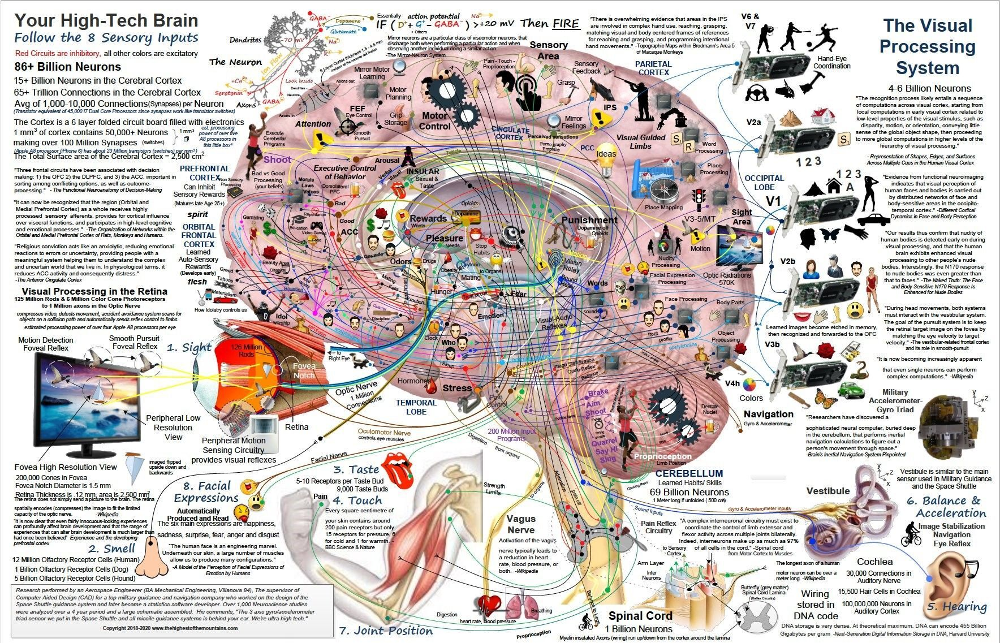

# Brain

Left side of brain - Logic, Language, Linear (Analytical / Logical)

Right - Creative, Imagination, Emotion, Visualization (Emotional / Social)

Brain has many different functional centers. The part at the back of your head, called the occipital lobe, processes vision. At the side, there's audio processing and language comprehension.

Sitting on your shoulders is the most complicated object in the known universe. -- Michio Kaku

Brain is made to be efficient and not accurate

## Facts

- Historial events and future imagination activates same networks in the brain, so your future and past are linked

## Brain Exercises for increasing cognition

1. Left elbow to right knee and right elbow to left knee alternatively
2. Turn up and down the palms (hands) and do it 1/2 the speed than the other one. First for left and then for right
3. Turn one hand clockwise and other anti-clockwise toward you facing forward and vice-versa
4. Tap your head and roll your hand clockwise or anti-clockwise on stomach
5. 3 ball Juggling
6. Get into a room, observe everything, get out and write all the things you remember. Try this everyday with different rooms and soon you will be very attentive and a great observer rather than blank.

## Brain Exercises

- Manage by walking about
- Read funny books
- Play games
- Act out
- Find what you're not learning
- Get the most out of business trips
- Take notes - and then go back and read them
- Try new technologies
- Learn a new language or instrument
- Exercise, exercise, exercise

https://deepstash.com/article/2794/easy-memory-exercises-you-can-do-almost-everywhere

- Do mental math

  It will make your brain sharper and will allow you to boost your memory as well. For example, if you are at a store purchasing something, try to calculate the bill by adding up the prices of individual items in your head

- Play Rhyming Games

  Whenever you see or hear a complex word, **try to recall as many rhyming words as possible**. This will help you in the long run by allowing you to recall things faster.

- Play Around With Words

  Whenever you discover a new word, try to play around with it. **Recall the synonyms associated with it, recall any possible verbs or adverbs, or maybe even try to recall similar sounding words.** It can go a long way in boosting your memory.

- Test Your Recalling Skills

  Whenever you are meeting a person, try recalling your previous interactions with them. Try to remember when you met them for the first time, try to associate their hobbies with them, or you could even try to remember tiny details about their background

- Test Your Taste Buds

  Whenever you get the opportunity, **try to eat something new and then try to identify the key ingredients of that particular dish.** Your sense will be rejuvenated, and you will be able to boost your memory as well.

- Solve Puzzles

  Puzzles easy to access and can be of great help in improving your memory. **They activate certain areas of your brain that are designed to think logically.** Additionally, puzzles can build your ability to reason and resonate.

- Play Chess

  Chess helps you in sharpening your brain. This is because chess has a **combination of so many possible moves at a given time.** It can help you build your ability to think logically. Thinking about your next move in advance will be based on your past experience of playing the game and hence will help your memory.

- Draw a Map from Memory

  If you visit a new place, you can try to visualize your way back home in your mind without looking at a map. **You can do this by trying to recall the milestones or landmarks that come in your path home.** This will help you in sharpening your memory a great deal.

## Self Hyponosis

Just five minutes before sleeping, create a movie in your mind about what your ideal image will be or what your tomorrow will be. Picture your goal everyday before going to sleep.

## Brain Tricks

1. What does J O K E spell, what does P O K E spell, what's the white part of the egg. Everyone will say YOKE, but its albumen and the yellow part is YOLK
2. Shake your hand, make a fist and put it to your chin (put it to your head)
3. The combined cost of a ball and a bat equals Rs. 110. The bat costs Rs. 100 more than the ball. How much does the ball cost? (Answer is Rs. 5)

## Physical brain tricks

1. put your right ear on your right shoulder while sitting in a rotating chair and then move round and round while keeping your eyes closed. After some time open your eyes, you will feel dizzeness and may fall.

## Optical Illusions

[Never trust your brain](https://www.youtube.com/watch?v=fpKyR5ybG4M)

[The Image You Can Only See Once](https://youtu.be/0pUku1Vk7e0)

Brain is a prediction making machine

Adelson's checkerboard

### Other Illusions

[McGurk effect - Wikipedia](https://en.wikipedia.org/wiki/McGurk_effect)

## There are more than 5 senses

Proprioception - One of the senses, where you know where your body parts are relative to other body parts

Equilibrioception - Keep your balance and sense body movement in terms of acceleration and directional changes

## Object Permanence

Object Permanence is the understanding that objectscontinue to exist even when they cannot be perceived (seen, heard, touched, smelled or sensed in any way)

## Neuromodulators

- Acetylcholine (focused learning and attention)
- Dopamine (unexpected rewards)
- Serotonin molecule (social life and risk taking behavior)
- Noradrenaline

[Overloaded: How Your Brain Chemicals Influence Your Life - with Ginny Smith](https://youtu.be/ZOsi_ia810U)

## Biology

- Limbic system (amygdala & hipocampus) processing information and decision making
- The brain is divided into four main lobes: the frontal lobe, parietal lobe, temporal lobe, and occipital lobe.

    - The frontal lobe is responsible for movement, problem solving, judgment, and planning. It also plays a role in personality and emotional expression.
    - The parietal lobe is responsible for sensation, such as touch, temperature, and pain. It also plays a role in spatial awareness and navigation.
    - The temporal lobe is responsible for auditory processing, memory, and language.
    - The occipital lobe is responsible for vision.

  

[Mouse brain research is helping us better understand human minds](https://blog.google/technology/research/mouse-brain-research/)

[Google AI: New insights from 6 images of the human brain](https://blog.google/technology/research/google-ai-research-new-images-human-brain/)

## Meditation / Mental Exercises

https://blog.trello.com/sophrology-for-better-work-life-harmony

## Links

[What is a mind? - with Philip Ball](https://www.youtube.com/watch?v=uKZWF5amZMg)

[Sleep](psychology/sleep.md)

[How to Keep Your Brain Young and Healthy | Louisa Nicola - YouTube](https://www.youtube.com/watch?v=tZQcd2K9HwQ)

[Mind–body dualism - Wikipedia](https://en.wikipedia.org/wiki/Mind%E2%80%93body_dualism)

[Why Some People Don’t ‘See’ Mental Imagery: Aphantasia - YouTube](https://youtu.be/3I4KxfXrCPw)
