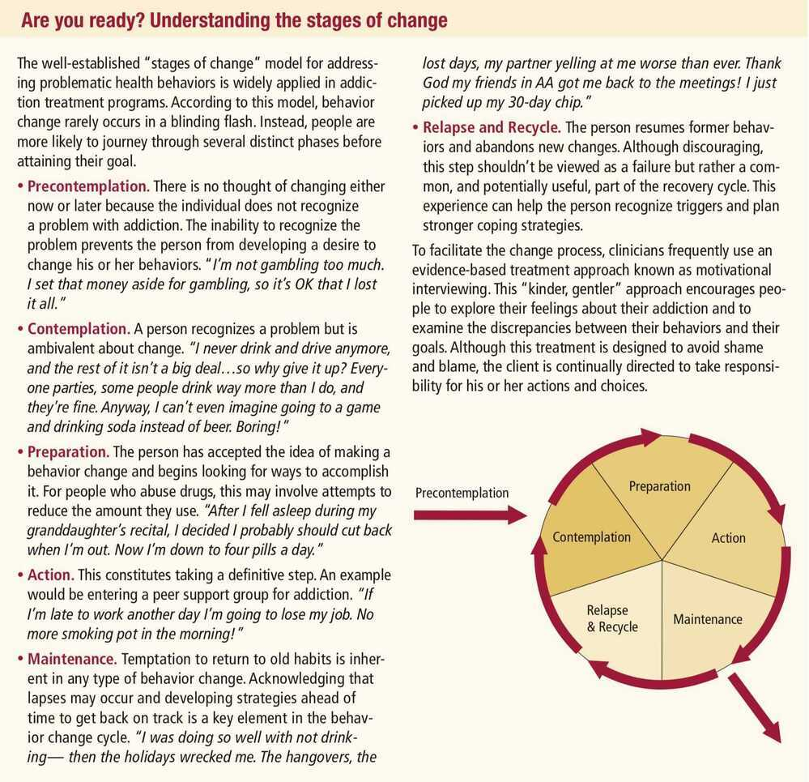
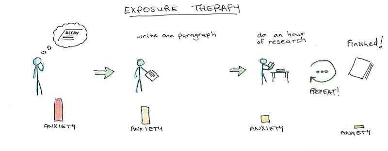

# Habits

## Self-Control

Prime your environment to make the next action easy.

Your habits are how you embody a particular identity.

When you make your bed, you embody the identity of someone who is clean and organized. When you study, you embody the identity of someone who is studious.

What identity are you embodying today? Who are your habits helping you become?

[How to Trick Your Brain to Like Doing Hard Things - Atomic Habits by James Clear - YouTube](https://www.youtube.com/watch?v=o7w5r5PfBKo)

## Core Ideas of Self Improvement

1. Habits
2. Goal-setting
3. Systems
4. Emotional Self-Regulation
5. Learning
6. Values and Meaning
7. Thoughts and Beliefs

https://www.scotthyoung.com/blog/2020/03/23/core-self-improvement-ideas

### Identity-Based habits

Changing your beliefs isn't nearly as hard as you might think. There are two steps.

1. Decide the type of person you want to be.
2. Prove it to yourself with small wins.

https://jamesclear.com/identity-based-habits

## Ask Questions

If you did that activity continuously for a year, would your life be any different? If not then don't do it.

## Natural Recoverers

Addiction researchers use the term "natural recoverers" to refer to people who are able to overcome addiction on their own, without treatment or self-help groups. Often, natural recoverers try to quit many times; ultimately, many are successful.

Each attempt represents a lesson learned and progress toward the ulti- mate goal of quitting. In fact, research shows that each failed attempt to quit any addiction is independent of the others. Because each attempt has its own probability of success, repeated attempts to quit increase the likelihood of eventual success.

## Exposure Theory for overcoming fears

- Graded exposure (slowly step by step exposure)
- Flooding (facing the most fearful)

Exposure therapy, where you give yourself small doses of the thing you're scared of to diminish the fear it generates, works for phobias of spiders or clowns, but it can also help with getting started

Say you need to write an essay, but you're not sure what topic to do it on. You've implemented the suggestions above, and picked a default topic and a deadline. Now the deadline has passed, and you're supposed to get started on the essay, but you're still dragging your feet. Now what?

Here, you can start by giving yourself a task that is small enough to be manageably unpleasant. Instead of telling yourself to sit for several hours writing the essay in the library, only ask yourself to write one paragraph. After which you can take a break.

Writing one paragraph will overcome your initial resistance and make the built-up aversion to getting started slightly less. Once you've done this, you might try sitting for thirty minutes to write, no expectations on accomplishing anything. Later, you can keep expanding until the essay is done.

You might have dealt with a similar problem with starting a business. But what if you just had to get one client, or sell only one thing? What if you just had to make something, and not try to sell it? Breaking down your fears into atomic parts can make them something you can overcome.

Exposure therapyis just one tool. Another can be**pairing taking action with a reward,** so overcoming your procrastination becomes positively reinforced.

Another can also be**punishing yourself for failure to act**. I knew someone once who forced himself to only take showers with cold water if he missed any of his goals, the day before. The thought of cold water started to motivate action.

## RAIN (to remove any bad habit or addiction)

- R - Recognize the craving
- A - Accept that you are craving
- I - Investigate - See all the senses and how it effects your body
- N - Note - from moment to moment how those sensation change and move

## Practice makes permanent

- Why learning math is so difficult
    - because there is no analogous thing to point to
    - Because math is abstract
- Therefore practice is more important to learn abstract concepts. We have to build neural pathways in our brain through practice

## Habits

1. The cue - It can be useful or harmful it's a routine, what we do in reaction to that cue matters.
2. The routine - This is our zombie mode
3. The reward - giving rewards for following routines can be helpful to avoid procrastination
4. The belief

## Process vs Product

Its ok to feel bad while starting to do something you don't like. But then just letting it go and working on it will feel great. That's important.

Process means, the flow of time and the habits and actions associated with that flow of time. As in, I'm going to spend 20 minutes working. Product is an outcome, for example, a homework assignment that you need to finish.

To prevent procrastination you want to avoid concentrating on product. Instead, your attention should be on building processes. Processes relate to simple habits, habits that coincidentally allow you to do the unpleasant tasks that need to be done. For example, lets say you don't like doing homework in a particular class. So you put off working on the homework. It's only five questions you think. How hard could that be? Deep down, you realize that answering these five questions could be a very lengthy job. It's easier to live in a fantasy world where the five questions, or the ten page report or whatever, can be done at the last minute. You're challenge is to avoid focusing on the product, the answers to the questions. The product is what triggers the pain that causes you to procrastinate. Instead, you need to focus on the process or processes. The small chunks of time you need over days or even weeks to answer the questions or prepare for tests. Who cares whether you finish the homework or grasp the key concepts in any one session. The whole point instead, is that you calmly put forth your best effort for a short period.

Using pomodoro can help building process and not focus on completing the task.

## Creating Habits

Overwrite a few parts of old habits and write new ones.

The trick to overriding a habit is to look to change your reaction to a cue. The only place we have to use willpower is for changing these.

1. The cue
    - location
    - time
    - how you feel
    - reactions

2. The routine
    - The unhappy feeling
    - You funnel attention onto a more pleasant task (these place we have to rewire our old habbit)

       - Develop a plan / ritual, adjust your plans and then savor vitories when your plan works. Don't try to change everything at once

3. The reward

    Reward is very important to rewire the old habit. Because brain will look for that reward and then will stick to that habit.

    The better you get at something the more enjoyable it becomes

4. The belief

    You can do it.

    Belief that your system works.

## Juggling life and learning

- Weekly list of key tasks
- Write daily to do list, evening before

Research has shown that this helps your subconscious to grapple with the tasks on the list so you can figure out how to accomplish them. Writing the list before you go to sleep, enlists your zombies, to help you accomplish the items on the list the next day. If you don't write your tasks down on a list, they lurk at the edge of the four or so slots of your working memory, taking up valuable mental real estate. But once you make a task list, it frees working memory for problem solving.

- Planning your quitting time is as important as planning your working time
- Try to have a break time and make it fixed
- Eat your frogs first in the morning. Try to work on a most important and most disliked task first. At least just one Pomodoro

## Summary

1. Create processes instead of product
2. Having a leisure time is as important as working
3. Create habits

    1. The cue
    2. The routine
    3. The reward
    4. The belief

4. Always have reward if you follow habits
5. Look for procrastination cues
6. Keep a planar journal
7. Create a task list before you go to sleep
8. Eat your frogs first thing in the morning

## Carpe diem

You know that this is Latin for "**seize the day**" right? No matter how yesterday went-whether you had great triumphs or whether you wish you'd spent the whole day in bed, remember that every new day is a new opportunity. You can't rest on yesterday's accomplishments, and you never have to repeat yesterday's mistakes.

## Implementation Intentions

I will [BEHAVIOR] at [TIME] in [LOCATION].

- I will meditate for one minute at 7 a.m. in my kitchen.
- I will study Spanish for twenty minutes at 6 p.m. in my bedroom.
- I will exercise for one hour at 5 p.m. in my local gym.
- I will make my partner a cup of tea at 8 a.m. in the kitchen.

Give your habits a time and a space to live in the world. The goal is to make the time and location so obvious that, with enough repetition, you get an urge to do the right thing at the right time, even if you can't say why.

https://jamesclear.com/implementation-intentions

## Habit Graduation

Graduating from your current habit to one level higher. Basically, habit graduation is about increasing your average speed.

Examples

- If your average speed is eating three healthy meals per week, can you "graduate" that to one healthy meal per day?
- If your average speed is exercising twice per month, can you "graduate" that to once per week?
- If your job is crazy and you only talk to your old friends on the phone once every three months, can you schedule those calls into your calendar and "graduate" that habit to once per month?

https://jamesclear.com/average-speed

## COMFY

- Calm
- Openness
- Movement
- Funny
- whY

## Practice Loop

https://www.scotthyoung.com/blog/2020/04/03/practice-loop

## Limits to Habits

### Habits Aren't Routines

One limit is pretty straightforward: not all behaviors can be easily automated.

As [Nir Eyal argues here](https://click.convertkit-mail.com/5qu6vpn5kgh7h3lq0dh6/48hvh7u2o4760rhx/aHR0cHM6Ly93d3cubmlyYW5kZmFyLmNvbS9oYWJpdHMv), a lot of what we refer to as habits are simply routines. Cognitively effortful activities that require effort and attention. Thus there isn't, strictly speaking, a habit for studying a difficult topic or putting in a hard workout at the gym. Nobody ever becomes absent-minded and snaps out of it to realize they're midway through a benchpress.

Habits, in this stricter sense, are those behaviors that flow automatically and unconsciously from a set of prompts. Routines are behaviors we do repeatedly, but involve many deliberate actions that can't be done without some effort and thinking.

This suggests putting some caution on one's goals for habits. If the idea is that a behavior can proceed with zero effort after sufficient habituation, you may be disappointed. Routines can become easier with time, but they rarely have zero effort required.

### Habits are Often Fragile

This leads into a second limitation of habits: they are rarely permanent.

Since many habits are actually routines - mixtures of automated and deliberate action - there are few we care about that don't involve some ongoing effort to sustain.

I've written before about why I think [habits are often meta-stable](https://click.convertkit-mail.com/5qu6vpn5kgh7h3lq0dh6/wnh2h6uozelxrqs7/aHR0cHM6Ly93d3cuc2NvdHRoeW91bmcuY29tL2Jsb2cvMjAxNS8wMy8yNS9wZXJtYW5lbnQtaGFiaXRzLw==). They can require little effort to sustain provided everything else in your life is static. Since that assumption rarely holds, there is always some effort required to reassert the routine you want.

Exercise is a clear example. If you go to the gym every day, without fail, for an entire year, it's safe to say that it will feel quite automatic when you're done. No small part of that is simply the commitment you've made makes the exercising routine highly salient. Thus it might feel fairly easy to continue.

Except you switch jobs, move houses or get injured and your schedule changes. You miss a few days, maybe even a few weeks. Certainly rebuilding is easier than exercising for the first time, but there is a non-trivial effort involved.

Where this is particularly relevant is when there are multiple habits you want to sustain. Maintaining one or two good habits is fine. But if you need to maintain dozens, all which have non-zero time commitments? You may have a situation that's [untenable long-term](https://click.convertkit-mail.com/5qu6vpn5kgh7h3lq0dh6/reh8h9u58gowqwu2/aHR0cHM6Ly93d3cuc2NvdHRoeW91bmcuY29tL2Jsb2cvMjAxOC8xMi8xMy9wcm9kdWN0aXZpdHktZ3VpbHQv).

### Habits Aren't Commitments

I've already spoken about the difference between habits and routines. The latter require active effort and can't be fully automated. The most you can hope for is to automate some of the aspects of setting up or getting started, that make it a little smoother.

Commitments are another thing that seem similar to habits [but are quite different](https://click.convertkit-mail.com/5qu6vpn5kgh7h3lq0dh6/08hwhgu783pgmztl/aHR0cHM6Ly93d3cuc2NvdHRoeW91bmcuY29tL2Jsb2cvMjAxOS8wMy8wOC9oYWJpdHMtdnMtY29tbWl0bWVudHMv). A commitment is a rule you've put in place for yourself. That rule might be something like, "I must exercise at least 5 times per week," or, "I don't eat desserts on weekdays."

### Habits are Often Too Slow

The [habit-forming philosophy](https://click.convertkit-mail.com/5qu6vpn5kgh7h3lq0dh6/8ghqh3u54m7qgkfk/aHR0cHM6Ly93d3cuc2NvdHRoeW91bmcuY29tL2Jsb2cvMjAxOC8xMC8xOC9ib29rLXJlY29tbWVuZGF0aW9uLWF0b21pYy1oYWJpdHMv)-that you ought to do things slowly and steadily, since positive, automatic behaviors will compound over time - has major benefits. But there are many areas where such a strategy doesn't apply.

The person starting a business may only have a few months to reach profitability or they'll run out of capital. Starting a new job, going back to school, taking on a difficult project all often involve similar large upfront investments of effort that can't be smoothed down.

### Human Nature Has Limits

Habits are an important tool, but they're just a tool. Like a hammer or a saw, they work really well for some things (banging nails, cutting wood) and really bad for other things (painting a picture, petting a kitten).

https://www.scotthyoung.com/blog/2020/09/21/habit-limits

https://www.scotthyoung.com/blog/2020/10/26/foundation-practices

[How to become 37.78 times better at anything | Atomic Habits summary (by James Clear)](https://youtu.be/PZ7lDrwYdZc)

[TRIGGERS by Marshall Goldsmith | Core Message](https://youtu.be/_j3HHxPH2HU)

- If we do not create and control our environment, our environment creates and controls us
- Surround yourself with people who promote & praise the behavior you're striving for

## Genius Habits

- Reflect for 10 minutes a day
- Read for 20 minutes a day
- Focus for 30 minutes a day

[DOPAMINE NATION by Anna Lembke | Core Message](https://www.youtube.com/watch?v=F-HDYRgZel0)

[5 Habits Keeping you STUCK & 5 Ways to Get UNSTUCK | Shadé Zahrai](https://www.youtube.com/watch?v=v9GDpSL9W5E)

- Infomaniac
- The knowing doing gap
- Achievement addict
- Endlessly multitask
- Dopamine addiction feedback loop

## Links

- [13 Things Mentally Strong People Don't Do](../book-summaries/13-things-mentally-strong-people-dont-do)
- [The Seven Habits of Highly Effective People](../book-summaries/the-seven-habits-of-highly-effective-people)
- [Atomic Habits](../book-summaries/atomic-habits)
- [Procrastination](psychology/procrastination.md)
- [Habits | Quotes](knowledge/quotes-proverbs/habits.md)
- [When are Minimal Habits Useful for Learning? - Scott H Young](https://www.scotthyoung.com/blog/2023/06/20/minimal-habits-learning/)
- [10 Challenges, 90 Days SUCCESS BLUEPRINT for 2024! | Life Advice 2023 | Ankur Warikoo Hindi - YouTube](https://www.youtube.com/watch?v=6azp2ClkdCk)
    - Structured Thinking
    - Confident Speaking
    - Eliminate Sugar Craving
    - Reading
    - Meditation
    - Getting Rejected
    - Resist the Obvious
    - Wake Up on Time
    - Avoid Overthinking
    - Conquer Procrastination
- [Live Online Habit-building Programs | HabitStrong](https://www.habitstrong.com/)
- [Top 5 Habit-Building Methods From 25+ Books on Habits - YouTube](https://youtu.be/gFSWD9r8dTE)
