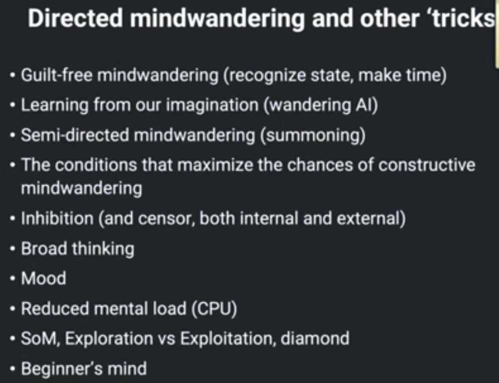

# Human Psychology & Thinking

We all crave attention - Therefore if you even know everything, still you ask questions, just for attention

War is a tricky game the only way to win it is to not play it at all

True test of a man's character is what he does when no one is watching

Mansons law of avoidance

It's very difficult to let your self image go

Being self critical is a must

Cynical, FUD, Privacy, scepticism, distrust

Conform - (of a person) behave according to socially acceptable conventions or standards.

Everyone is an authority on everything these days. Take weight loss for instance. Everyone will have a tip or two to offer, much of it common sense; eat healthy, exercise daily, sleep well.

New tech, like BRC-20, will always attract some of the most brilliant engineers & investors…and the most brilliant scammers & risk-takers too.

I don't care how technically brilliant you are in your field; if you don't understand people, you're going to neutralize all your powers -- Robert Greene

## Group Behavior / Group Dynamism / Social conformity

[The Asch Experiment](https://www.youtube.com/watch?v=iRh5qy09nNw)

Another explanation is human beings' deep rooted desire to belong. We want to agree with the group so that we are accepted by the group -- being part of a group has proved beneficial, from an evolutionary standpoint, by offering better safety and security. The need to belong is still a strong motive for us to agree with the majority view point. This was established by Solomon Asch in the 1950s, through a set of famous experiments (called Asch's conformity experiments)

The experiments showed how normal, intelligent people were willing to give an obviously wrong answer to conform with the rest of their group (of merely actors) who chose the wrong answer to be the right answer. Asch opined, "That intelligent, well-meaning, young people are willing to call white black is a matter of concern."

[Social Conformity - Brain Games](https://www.youtube.com/watch?v=o8BkzvP19v4)

[The Milgram Experiment | THE HEIST | Derren Brown](https://www.youtube.com/watch?v=Xxq4QtK3j0Y)

https://www.collaborativefund.com/blog/think

1. Everyone belongs to a tribe and underestimates how influential that tribe is on their thinking
2. What people present to the world is a tiny fraction of what's going on inside their head
3. Prediction is about probability and putting the odds of success in your favor. But observers mostly judge you in binary terms, right or wrong
4. We are extrapolating machines in a world where nothing too good or too bad lasts indefinitely
5. There are limits to our sanity. Optimism and pessimism always overshoot because the only way to know the boundaries of either is to go a little bit past them
6. Ignoring that people who think about the world in unique ways you like also think about the world in unique ways you won't like
7. We are pushed toward maximizing efficiency in a way that leaves no room for error, despite room for error being the most important factor of long-term success
8. The best story wins
9. We are swayed by complexity when simplicity is the real mark of intelligence and understanding
10. Your willingness to believe a prediction is influenced by how much you want or need that prediction to be true
11. It's hard to empathize with other people's beliefs if they've experienced parts of the world you have not
12. An innocent denial of your own flaws, caused by the ability to justify your mistakes in your own head in a way you can't do for others
13. **An underappreciation for how small things compound into extraordinary things**
14. **The gap between knowing what to do and actually getting people to do it can be enormous**
15. We're bad at imagining how change will feel because there's no context in dreams
16. We are blind to how fragile the world is due to a poor understanding of rare events
17. The inability to accept hassle, nonsense, and inefficiency frustrates people who can't accept how the world works

[How we make memories and how memories make us -- with Veronica O'Keane](https://www.youtube.com/watch?v=TZMYvnL8dfI)

- Collective consciousness
- Einstein, Sigmund Freud

[Ethical dilemma: Would you lie? - Sarah Stroud](https://youtu.be/OI-G23HF6Sw)

[The original ring of power - Alex Gendler](https://www.youtube.com/watch?v=TfVmW6sNux8)

- Why people act justly
    - Is it because it's what's right
    - Or because it's a convention that's enforced through punishment and reward?
- If presented an opportunity to get what they desired without consequence?
- 3 Classes
    - We desire things for their own sake, like the experience of harmless pleasure
    - The second class of things we want only for the value they bring, though they may be onerous, like exercise or medicine
    - The third class comprises things we desire for their own sake and the value they offer, like knowledge and health
- Glaucon argues that justice belongs to the second class of good: it's a burden that nevertheless brings rewards. The only reason anyone conducts themselves virtuously, he reasons, is due to external influences. So it's appearing, not actually being, virtuous that matters
- Socrates, as written by Plato, disagrees, countering that justice belongs to the third class of good, offering both extrinsic and intrinsic benefits.
- Human soul has 3 parts: Reason, spirt, and appetite
    - Reason guides an individual to truth and knowledge, and is influenced by either spirit or appetite
    - Spirit is righteous, ambitious, and the source of bold action
    - While appetite consists of baser (without moral principles), bodily desires
- To Socrates, the philosopher is led by reason, and their spirit keeps their appetite in check, making them the most just and the happiest. Even without consequences for self-serving wrongdoings, they wouldn't commit them
- Meanwhile, the tyrant succumbs to appetite and acts unjustly

[ATLAS OF THE HEART by Brené Brown | Core Message](https://www.youtube.com/watch?v=NNdN14bosbA)

- Envy
    - If I can't have that, I don't want you to have that
    - Schadenfreude - taking please in someone else's misfortune
    - Freudenfreude - taking pleasure in someone else's success
- Pity
    - Pity - I'm glad that's not me. That couldn't happen to me
    - Compassion - Me too. That could be me
        - Ask what their experience is like?
        - Accept
        - Clarify
- Disappointment

## Mindwandering

## Laws of Stupidity

1. Always and inevitably everyone underestimates the number of stupid individuals in circulation.
2. The probability that a certain person be stupid is independent of any other characteristic of that person.
3. A stupid person is a person who causes losses to another person or to a group of persons while himself deriving no gain and even possibly incurring losses.
4. Non-stupid people always underestimate the damaging power of stupid individuals.
5. A stupid person is the most dangerous type of person.

## Gaslight

Gaslight - manipulate (someone) by psychological means into doubting their own sanity.

psychological manipulation of a person for one’s advantage-causing the person to question the validity of their own thoughts, reality, or sanity.

## Johari Window model

The Johari Window model is a tool that helps people understand themselves and others. It's a visual framework that's often used in self-help groups and in corporate settings.

|                  | What it is                                                                             |
| ---------------- | -------------------------------------------------------------------------------------- |
| **Purpose**      | Improve self-awareness and communication                                               |
| **How it works** | Categorizes personal attributes into four quadrants                                    |
| **Quadrants**    | Open, blind, hidden, and unknown                                                       |
| **Goal**         | Move information from the hidden and unknown quadrants to the open and blind quadrants |

## Collectibles

All collectible culture fits into 3 buckets:

- Cultural Icons (Mona Lisa, Banksy)
- Luxury Signals (Rolex, PFPs)
- Cultural Memory (first-edition comics, trading cards, vinyl)

Meaning

- The first is about status through reverence.
- The second is status through scarcity.
- The third is meaning through memory.

## Non Regrettable Minute

In the context of learning, a "non-regrettable minute" refers to a moment where a learner makes a decision or chooses an action that, despite the uncertainty of the environment, leads to a beneficial outcome in terms of learning progress or knowledge gain. This concept is central to "no-regret learning," a field that focuses on online learning strategies where the learner can adapt their choices over time to minimize the cumulative loss, even when facing unpredictable or noisy feedback.

### Online Learning and the No-Regret Framework

- **Online Learning:** In online learning, learners interact with an environment and receive feedback (or lack thereof) for each decision. They must learn to adapt their strategies based on this feedback while making decisions that are immediately beneficial.
- **No-Regret Learning:** This framework aims to find strategies that, even if the environment is uncertain or noisy, ensure that the cumulative loss is minimized compared to any other strategy that could have been chosen.
- **Non-Regrettable Minute:** A "non-regrettable minute" in this context refers to a specific instance where a learner makes a decision that, in retrospect, proves to be a good one and contributes to their overall learning progress.

### Examples in Different Contexts

- **Route Optimization:** Imagine choosing a route to work each morning. Some days, the chosen route might be faster, and some days it might be slower due to traffic. A "non-regrettable minute" in this context could be choosing a route that consistently provides good travel time, even if the environment is unpredictable.
- **Online Game Playing:** In an online game, a player might choose different actions based on limited information. A "non-regrettable minute" would be an action that, even with imperfect knowledge, leads to a positive outcome for the player, such as gaining resources or progressing towards a goal.
- **Machine Learning:** In machine learning, a model might make predictions based on incomplete data. A "non-regrettable minute" could be a prediction that, despite the uncertainty, results in the model making a correct classification or achieving a desired outcome.

### Key Characteristics of Non-Regrettable Minutes

- **Adaptive Strategies:** Learners use strategies that adapt to the environment and past experiences.
- **Minimizing Cumulative Loss:** The overall goal is to minimize the total negative impact of all decisions over time.
- **Robustness:** The strategies should be robust to uncertainty and variations in the environment.

In essence, a "non-regrettable minute" is a moment where the learner makes a smart decision that contributes to their learning, even if the environment is uncertain or the consequences are not immediately apparent.

## Others

- [Why We Always Feel Bad and Guilty - YouTube](https://www.youtube.com/watch?v=71WImmxUPRo)
- [The Science Of Catching Up In Life - YouTube](https://www.youtube.com/watch?v=IOWelVx5CUw)
- [Why People become Criminals? | The Problem of Liberty | Dhruv Rathee - YouTube](https://www.youtube.com/watch?v=d0KuhikVnVs)
- [THE LAWS OF HUMAN NATURE (understanding this will change your life) - Robert Greene//book summary - YouTube](https://www.youtube.com/watch?v=R-iIQ0kQni0&ab_channel=LITTLEBITBETTER)
- [The Dumber Side of Smart People · Collab Fund](https://collabfund.com/blog/the-dumber-side-of-smart-people/)
- [Pioneering sociologist Erving Goffman saw magic in the mundane | Aeon Essays](https://aeon.co/essays/pioneering-sociologist-erving-goffman-saw-magic-in-the-mundane)
- [3 Hours of Mind Games to Fall Asleep To](https://youtu.be/ef2cZPL4EQ8)
- [3 Hours of Mental Traps People Use to Control You](https://youtu.be/fwJdEN1oBkc)
- [3 Hours of BANNED Ancient Knowledge to Fall Asleep To](https://youtu.be/JN2MyLEEewU)
- [3 Hours of Persuasion Tricks That Hijack the Human Brain](https://youtu.be/olQP0SJN_5g)
- [3 Hours of Brainwashing Techniques to Fall Asleep To](https://youtu.be/OfqFx5Ic2-Q)
- [Levels 1–100 of the Most Brain-Breaking Paradoxes to Fall Asleep To](https://youtu.be/GwhNeeSoE9A)
- [100 Real Mental Hacks That Actually Work in Real Life](https://youtu.be/Ys9kxhEpdfI)
- [101 Manipulation Tactics That Should Be Illegal](https://youtu.be/CrjHfo8h4gg)
- [Level 1 to 100 of the Most Life-Changing Lessons to Fall Asleep To](https://youtu.be/jfDq7iD0iPo)
- [Level 1 to 100 Philosophy Concepts to Fall Asleep To](https://youtu.be/C_kLFRxOc4I)
- [The Terrifying Theory of Stupidity You Were Never Meant to Hear – Dietri...](https://youtu.be/Sfekgjfh1Rk)
- [Don't Be A Loser.](https://youtu.be/922wELpMIuE)
- [How to Build a Brain That Doesn't Get Distracted](https://youtu.be/sAHlZMDHYhY)
- [How to communicate clearly](https://youtu.be/btWlBHE0pe4)
- [How to be a Better Decision-Maker | 5 Habits to Counter Our Biggest Biases](https://youtu.be/Ne2ZtjOxj-I)
- [5 Steps to Rapidly Reduce Stress (Top Stress Management Techniques)](https://youtu.be/1WIHlVZcrzs)
- [How Neurodiversity Can Help Your Life, Team & Business • Katrine Hald Kj...](https://youtu.be/CIBlbmk1U_c)
- [Don't Believe Everything You Think by Joseph Nguyen | Core Message](https://youtu.be/qFCVRjRaxII)
- [When Nothing’s Working, Do This: RESET by Dan Heath | Core Message](https://youtu.be/qHOzI_MLAVw)
- [100 Study Techniques to Get Ahead of 99% of People](https://youtu.be/9r1TCUty9TM)
- [100 Mental Tricks That Make You Smarter Than 99% of People](https://youtu.be/3S01HXwGQBM)
- [3 Hours of Secrets About the Brain That Neuroscientists Won’t Admit](https://youtu.be/z1JUOoulKZc)
- [How to End Factory Farming | Lewis Bollard | TED](https://youtu.be/dvLnIecUNL8)
- [100 Tricks to Read Anyone Instantly](https://youtu.be/13WubeyFsek)
- [3 Hours of Life Lessons So You Don't Screw Up Your life](https://youtu.be/1qJ8KWww50g)
- [100 Forbidden Psychology Hacks That Schools Don’t Want You To Know](https://youtu.be/i7K84slSHNw)
- [3 Hours of BANNED Philosophies to Fall Asleep To](https://youtu.be/oZd8Q1TB6Cc)
- [Rethink God, Astrology, and Karma with Acharya Prashant | Rethink India ...](https://youtu.be/DgHdUtWu8Qs)
- [3 Hours of 2,500 Years of Philosophy to Fall Asleep To](https://youtu.be/4Nofua1DAtI)
- [100 Dark Lessons in Nihilism to Fall Asleep To](https://youtu.be/LHept0zrXU4)
- [3 Hours of BIZARRE War Tactics to Fall Asleep to](https://youtu.be/MvSpXyYEV3g)
- [3 Hours of the Worst Punishments in History to Fall Asleep To](https://youtu.be/5jTpwcoHRvo)
- [Level 1 to 100 Life Hacks That Put You Ahead of 99% of People](https://youtu.be/rFNJ1gvTaKs)
- [3 Hours of Political Ideology to Fall Asleep To](https://youtu.be/9o8t210_yxw)
- [Psychology of People Who Don't Post their Photos on Social Media - YouTube](https://www.youtube.com/watch?v=LGx_cmEH8Lw)
