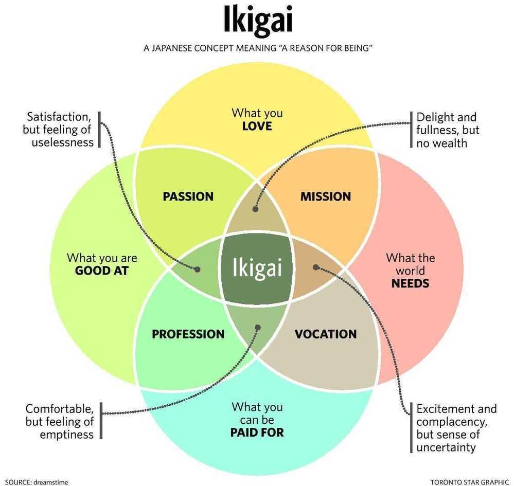

# Ikigai

## ikigai is seen as the convergence of four primary elements

- What you love (your passion)
- What the world needs (your mission)
- What you are good at (your vocation)
- What you can get paid for (your profession)

## 10 Rules

1. Stay active and don't retire
2. Leave urgency behind and adopt a slower pace of life
3. Only eat until you are 80 per cent full
4. Surround yourself with good friends
5. Get in shape through daily, gentle exercise
6. Smile and acknowledge people around you
7. Reconnect with nature
8. Give thanks to anything that brightens our day and makes us feel alive
9. Live in the moment
10. Follow your ikigai

https://medium.com/thrive-global/ikigai-the-japanese-secret-to-a-long-and-happy-life-might-just-help-you-live-a-more-fulfilling-9871d01992b7

https://www.sloww.co/ikigai-book

[IKIGAI](https://www.linkedin.com/posts/thewokesalaryman_the-woke-salaryman-ikigai-activity-7012618347548745728--XQE/)
