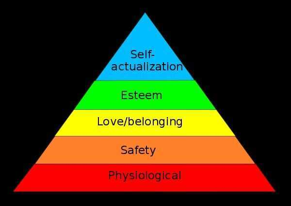
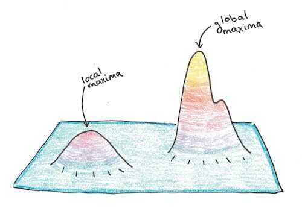

# Psychology

## Maslow's hierarchy of needs

[Maslow's Hierarchy of Needs](https://en.wikipedia.org/wiki/Maslow%27s_hierarchy_of_needs#Criticism) - "Maslow used the terms 'physiological', 'safety', 'belongingness' and 'love', 'esteem', 'self-actualization', and 'self-transcendence' to describe the pattern that human motivations generally move through... [though there is] little evidence for the ranking of needs that Maslow described or for the existence of a definite hierarchy at all."

Maslow's hierarchy of needsis a theory in [psychology](https://en.wikipedia.org/wiki/Psychology) proposed by [Abraham Maslow](https://en.wikipedia.org/wiki/Abraham_Maslow) in his 1943 paper "A Theory of Human Motivation" in [*Psychological Review*](https://en.wikipedia.org/wiki/Psychological_Review)

https://en.wikipedia.org/wiki/Maslow%27s_hierarchy_of_needs

[LEVELS (Basic Version) - YouTube](https://www.youtube.com/watch?v=kse87ocS0Uo&ab_channel=hoe_math)

## NLP - Neuro Linguistic Programming

Neuro-linguistic programming(NLP) is an approach to communication, personal development, and [psychotherapy](https://en.wikipedia.org/wiki/Psychotherapy) created by [Richard Bandler](https://en.wikipedia.org/wiki/Richard_Bandler) and [John Grinder](https://en.wikipedia.org/wiki/John_Grinder) in [California](https://en.wikipedia.org/wiki/California), United States in the 1970s. NLP's creators claim there is a connection between neurological processes (neuro-), language (linguistic) and behavioral patterns learned through experience (programming), and that these can be changed to achieve specific goals in life. Bandler and Grinder also claim that NLP methodology can "model" the skills of exceptional people, allowing anyone to acquire those skills.They claim as well that, often in a single session, NLP can treat problems such as phobias, depression, tic disorders, [psychosomatic illnesses](https://en.wikipedia.org/wiki/Psychosomatic_illness), near-sightedness, allergy, common cold, and learning disorders

https://en.wikipedia.org/wiki/Neuro-linguistic_programming

## Full spectrum mapping for taking big decisions

### RID

- Reflect

Declutter your mind by creating a mental inventory. Get rid of things that don't matter.

- Ideate

Focus on things that interest you by designing small actionable projects

- Dedicate

Get into a daily habit of updating your mental inventory

Brain works on association.

Baker Baker paradox - It is easy to remember someone's profession than his/her name. Like someone told "I am a baker" you will remember it more than if he told "I am Mr. Baker".

What cows drink? Test your automatic vs reflective system

## Growth Mindset vs fixed mind-set

I love a challenge and do not question your own abilities. (You will learn something)

Don't run from difficulty, don't find someone who has done worse than you and feel good about yourself.

Not Yet - gives confidence

## Body Poses

- High Power Body Postures

Our bodies change our minds, and our minds change our behavior, and our behavior changes our outcomes.

- Low Power Body Postures

## Charismatic

1. Presence
2. Power
3. Warmth

   - Practice gratitude
   - Develop your empathy

## Resiliency

- Am I conscious of being mentally and physically rugged?
- Do I challenge hardships or do I try to avoid hardships and difficulties by following "the line of least resistance?
- As boy or man, have I ever shown individual heroism or is my bravery always of the mass or mob kind?
- Do I struggle to master matters that test all of my resources?
- Can I stand and profit by severe criticism when I have been or seem to have been at fault?
- Do I rebound quickly from defeat?
- Am I indifferent to supercilious fault-finding?
- If I were a candidate for some elective office would defeat dishearten me or should I reckon each successive defeat as preparation for final victory?
- When confronted with unexpected difficulties in anything that I have undertaken, is my first impulse, or reaction, the desire to back down or to go ahead with greater energy than before?
- Have I a persistent resolution when once a careful judgment has been made?
- In making purchases - whether of neckties or machinery equipments - do I inspect the goods under consideration and form independent opinion of their merits or am I influenced unconsciously in my decisions by what I think the salesman may think of me?
- Do I sometimes accept less than I know I should for services rendered because I lack the stamina to stand up for my rights?

## Diderot Effect

The Diderot Effect states that obtaining a new possession often creates a spiral of consumption which leads you to acquire more new things. As a result, we end up buying things that our previous selves never needed to feel happy or fulfilled.

https://en.wikipedia.org/wiki/Diderot_effect

https://jamesclear.com/diderot-effect

[Why new things make us sad - BBC REEL](https://youtu.be/hUNxBSiV4ZY)

## Let go of wanting things

There will never be a level where you will be done wanting things. There is always something to upgrade to. Get a new Honda? You can upgrade to a Mercedes. Get a new Mercedes? You can upgrade to a Bentley. Get a new Bentley? You can upgrade to a Ferrari. Get a new Ferrari? Have you thought about buying a private plane? Realize that wanting is just an option your mind provides, not an order you have to follow.

## Obsoledge - Obsolute Knowledge

## How to Say No, Resist Temptation, and Stick to Your Health Goals

- **Instead of Saying I can't say I don't**
    - I can't eat icecream/white rice vs **i don't eat icecream/white rice**
    - I can't miss workout vs **I don't miss workouts**
- **Why this works**

Your words help to frame your sense of empowerment and control. Furthermore, the words that you use create a feedback loop in your brain that impacts your future behaviors.

"I don't" is experienced as a choice, so it feels empowering. It's an affirmation of your determination and willpower. "I can't" isn't a choice. It's a restriction, it's being imposed upon you. So thinking "I can't" undermines your sense of power and personal agency.

In other words, the phrase "I don't" is a psychologically empowering way to say no, while the phrase "I can't" is a psychologically draining way to say no.

https://jamesclear.com/how-to-say-no

## Panpsychism

Claiming that consciousness is an intrinsic element of all matter.

## Cognitive Behavioral Therapy (CBT)

## Explore/Exploit

Failing to explore enough can result in local maxima traps.

https://www.scotthyoung.com/blog/2019/09/17/explore-exploit

Nomophobia - the irrational fear of being without your mobile phone or being unable to use your phone for some reason, such as the absence of a signal or running out of minutes or battery power. A phobia is by definition an irrational fear.

Inherently humans are only afraid of two things - falling and loud noises (babies)

## Most Scariest Thing

Elevation of carbon dioxide in the blood caused by an uncontrollable external threat (drowning, waterboarding)

## Birth Order Effect

Birth order refers to the order a child is born in their family; [first-born](https://en.wikipedia.org/wiki/Firstborn) and second-born are examples. Birth order is often believed to have a profound and lasting effect on psychological development. This assertion has been repeatedly challenged. Recent research has consistently found that earlier born children score slightly higher on average on [measures of intelligence](https://en.wikipedia.org/wiki/Intelligence_quotient), but has found zero, or almost zero, robust effect of birth order on personality. Nevertheless, the notion that birth-order significantly influences personality continues to have a strong presence in [pop psychology](https://en.wikipedia.org/wiki/Pop_psychology) and popular culture

https://en.wikipedia.org/wiki/Birth_order

## Types of behavior

1. **Passive:** Indirect, dishonest, does not take control, is nice at all cost, focuses on others.

2. **Assertive:** Direct, honest, self-worth, to the point, focuses on the self, respects others.

    Behavior which enables a person to act in his own best interests, to stand up for himself without undue anxiety, to express his honest feeling comfortably, or to exercise his own rights without denying the rights of others.

3. **Aggressive:** Harmful, egocentric, will to win at any cost, justifies the means, wants to control others.

## Rorschach Test

The Rorschach test is a [psychological test](https://en.wikipedia.org/wiki/Psychological_test) in which subjects' perceptions of [inkblots](https://en.wikipedia.org/wiki/Ink) are recorded and then analyzed using [psychological](https://en.wikipedia.org/wiki/Psychology) interpretation, complex [algorithms](https://en.wikipedia.org/wiki/Algorithm), or both. Some psychologists use this test to examine a person's personality characteristics and emotional functioning. It has been employed to detect underlying [thought disorder](https://en.wikipedia.org/wiki/Thought_disorder), especially in cases where patients are reluctant to describe their thinking processes openly.The test is named after its creator, Swiss psychologist [Hermann Rorschach](https://en.wikipedia.org/wiki/Hermann_Rorschach). The Rorschach can be thought of as a psychometric examination of [pareidolia](https://en.wikipedia.org/wiki/Pareidolia), active distorted perception of visual stimuli. In the 1960s, the Rorschach was the most widely used [projective test](https://en.wikipedia.org/wiki/Projective_test).

https://en.wikipedia.org/wiki/Rorschach_test

[How does the Rorschach inkblot test work? - Damion Searls - YouTube](https://www.youtube.com/watch?v=LYi19-Vx6go)

## Barnum Effect / Generalized Statement (That sounds like me)

Barnum Effect, also called Forer Effect, in psychology, the phenomenon that occurs when individuals believe that personality descriptions apply specifically to them (more so than to other people), despite the fact that the description is actually filled with information that applies to everyone.

## 4 stages of personal development

1. Discovery
2. Consumption
3. Application
4. Teaching

## Defensive failure

It's what occurs when we want to achieve something and we think about it constantly but we don't do it.

This happens because of a few mental blocks that are keeping us locked in this cycle.

- I just don't think I can do this
- People like me aren't good at this
- I have to do this, but I don't really want to

## Seven Ways to Feel More in Control of Your Life

### Control Stimuli

Acting independently begins with what you let into your mind - meaning what comes in from your environment. If you are lacking agency, it's likely your attention is being hijacked and you need to figure out how to restore it.

To help you increase your control, practice going to quiet and screen-free spaces to escape overstimulation.

### [Associate selectively](https://deepstash.com/idea/13067/associate-selectively)

It's impossible not to be affected by those around us - it's easy to "catch" their emotions and our brains tend to synch up when we associate with other people.

We should set boundaries with difficult people, disentangle yourself from negative online interactions, and be more conscious of how you might be vulnerable to "groupthink"-pressures to behave or think in ways that are contrary to your values.

### [Move](https://deepstash.com/idea/13068/move)

Physical movement can lead to greater self-control - the ability to defer gratification.

If you're in deep at work, set a timer to go off every hour and remind yourself to take a moment to assess your mood. If you're feeling stuck or overwhelmed, get up and move. And, if you're having any issues at work, discussing them in a walking meeting (instead of a sitting meeting) may help mitigate conflicts.

### [Position yourself as a learner](https://deepstash.com/idea/13069/position-yourself-as-a-learner)

This requires nurturing your curiosity and allowing yourself to explore new ideas, skills, and people.

This isn't always easy. Practicing a growth mindset - where you recognize that you are a work in progress, capable of learning and changing - can help combat the fear of failure or judgment that often come with learning new things

### [Manage your emotions and beliefs](https://deepstash.com/idea/13070/manage-your-emotions-and-beliefs)

Increasing your awareness of how your emotions and beliefs drive your thinking, influence your behavior, and affect your judgment will help you navigate life with greater confidence.

While uncovering these inner thoughts and emotions may take effort, being more self-reflective helps you keep yourself grounded by slowing down your thinking process.

### [Check your intuition](https://deepstash.com/idea/13071/check-your-intuition)

Think of intuition as deep inner knowledge that is comprised of millions of data points that our brains have observed over the course of our lives.

When used wisely, it can be a tremendous boost to our creativity and help us make important decisions.

### [Deliberate, then act](https://deepstash.com/idea/13072/deliberate-then-act)

When making an important decision, it's helpful to stop and deliberate first:

- Focus on the issue at hand enough to clarify your primary objective and what is at stake.
- Generate lots of options at first, making sure that any strong emotions or biases aren't driving your thoughts.
- Draft a plan for yourself based on those options, putting your thoughts and decisions into writing.
- Set your plan aside and come back a while later to reassess it, making changes as necessary.

https://deepstash.com/article/2260/seven-ways-to-feel-more-in-control-of-your-life

## Narcissist / Narcissism

1. Morphing criticism.
2. Spending more time on their feelings than yours.
3. Repeatedly insisting on having good intentions.
4. Projecting badness onto those poking at their self-image.
5. Narcissistic rage.
6. Narcissism is not excessive self-love. It’s a lack of self-love.

[5 Dark Signs You’re Talking To A Narcissist](https://www.youtube.com/watch?v=mb58zWMfgZs)

## Resources / Links

[Self Help Videos](https://www.youtube.com/playlist?list=PLGwmAEmjn4fnPC_VpwRiD60w6axy1Txbd) - Think School

[Dr. Gabor Maté on The Connection Between Stress and Disease](https://youtu.be/ajo3xkhTbfo)

[The hidden opportunity behind every rejection | Jia Jiang | TEDxMtHood](https://www.youtube.com/watch?v=iwl-Pe0FbSg)

- Rejection is just and opinion

[The power of regret](../book-summaries/the-power-of-regret)

[How to manage your emotions](https://www.youtube.com/watch?v=Uew5BbvmLks)
