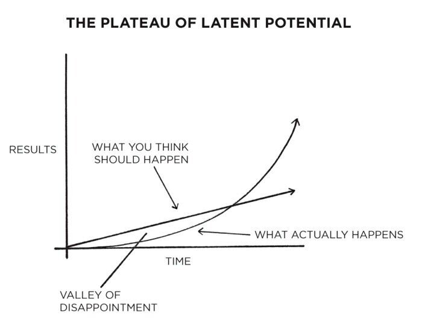

# Concentration / Mindfulness / Attention / Focus / Hard Work

I think, therefore I am distracted.

Think of many things. Do one.

Mindfulness - Always put a half-smile while doing things

If you wait at a bus stop long enough, you're guaranteed to catch a bus, but if you run from bus stop to bus stop, you may never catch a bus.

The successful warrior is the average man, with laser-like focus -- Bruce Lee

## Attention

1. Involuntary attention
2. Voluntary attention
3. Default mode - Mind Wandering
4. Narrow vs Broad Focus Attention

## Murphy's Law - Entropy

- **Anything that can go wrong, will go wrong. -- Murphy's Law**
- The natural state of the universe is chaos: entropy tends to increase in closed systems
- Don't let entropy get at your daily routine. Avoid entropy-driven work.
- **Without periodic attention, we "decay" to our old selves**

[https://jamesclear.com/entropy](https://jamesclear.com/entropy)

## Focusing

Generalized Focus

Directed Focus

[https://www.artofmanliness.com/articles/attention-please-what-every-man-ought-to-know-about-focus](https://www.artofmanliness.com/articles/attention-please-what-every-man-ought-to-know-about-focus)

[https://www.youtube.com/watch?v=wfKv2qG8d_w&ab_channel=FreedominThought](https://www.youtube.com/watch?v=wfKv2qG8d_w&ab_channel=FreedominThought)

1. Sit in a comfortable chair and see how still you can keep. This is not as easy as it seems. You will have to center your attention on sitting still. Watch and see that you are not making any involuntary muscular movements. By a little practice you will find you are able to sit still without a movement of the muscles for fifteen minutes. At first I advise sitting in a relaxed position for five minutes. After you are able to keep perfectly still, increase the time to ten minutes and then to fifteen. This is as long as it is necessary. But never strain yourself to keep still. You must be relaxed completely. You will find this habit of relaxing is very good.
2. Sit in a chair with your head up and your chin out, shoulders back. Raise your right arm until it is on the level with your shoulder, pointing to your right. Look around, with head only, and fix your gaze on your fingers, and keep the arm perfectly still for one minute. Do the same exercise with left arm. When you are able to keep the arm perfectly steady, increase the time until you are able to do this five minutes with each arm. Turn the palm of the hand downward when it is outstretched, as this is the easiest position. If you will keep your eyes fixed on the tips of the fingers you will be able to tell if you are keeping your arm perfectly still.
3. Fill a small glass full of water, and grasp it by the fingers; put the arm directly in front of you. Now fix the eyes upon the glass and try to keep the arm so steady that no movement will be noticeable. Do this first for one moment and then increase it to five. Do the exercise with first one arm and then the other.
4. Watch yourself during the day and see that your muscles do not become tense or strained. See how easy and relaxed you can keep yourself. See how poised you can be at all times. Cultivate a self- poised manner, instead of a nervous, strained appearance. This mental feeling will improve your carriage and demeanor. Stop all useless gestures and movements of the body. These mean that you have not proper control over your body. After you have acquired this control, notice how "ill-at-ease" people are that have not gained this control. I have just been sizing up a salesman that has just left me. Part of his body kept moving all the time. I just felt like saying to him, "Do you know how much better appearance you would make if you would just learn to speak with your voice instead of trying to express what you say with your whole body?" Just watch those that interview you and see how they lack poise.

Get rid of any habit you have of twitching or jerking any part of your body. You will find you make many involuntary movements. You can quickly stop any of these my merely centering your attention on the thought, "I will not"

If you are in the habit of letting noises upset you, just exercise control; when the door slams, or something falls, etc., just think of these as exercises in self-control. You will find many exercises like this in your daily routine.

The purpose of the above exercises is to gain control over the involuntary muscular movement, making your actions entirely voluntary. The following exercises are arranged to bring your voluntary muscles under the control of the will, so that your mental forces may control your muscular movements.

5. Move your chair up to a table, placing your hands upon it, clenching the fists, keeping the back of the hand on the table, the thumb doubled over the fingers. Now fix your gaze upon the fist for a while, then gradually extend the thumb, keeping your whole attention fixed upon the act, just as if it was a matter of great importance. Then gradually extend your first finger, then your second and so on until you open the rest. Then reverse the process, closing first the last one opened and then the rest, and finally you will have the fist again in the original position with the thumb closed over the finger. Do this exercise with the left hand. Keep up this exercise first with one hand and then the other until you have done it five times with each hand. In a few days you can increase it to ten times.

The chances are that the above exercises will at first make you "tired," but it is important for you to practice these monotonous exercises so you can train your attention. It also gives you control over your muscular movement. The attention, of course, must be kept closely on each movement of the hand; if it is not, you of course lose the value of the exercise.

6. Put the right hand on knee, both fingers and thumb closed, except the first finger, which points out in front of you. Then move the finger slowly from side to side, keeping the attention fixed upon the end of the finger. You can make up a variety of exercises like these. It is good training to plan out different ones. The main point you should keep in mind is that the exercise should be simple and that the attention should be firmly fixed upon the moving part of the body. You will find your attention will not want to be controlled and will try to drift to something more interesting. This is just where these exercises are of value, and you must control your attention and see it is held in the right place and does not wander away.

7. Concentration on the Within. Lie down and thoroughly relax your muscles. Concentrate on the beating of your heart. Do not pay any attention to anything else. Think how this great organ is pumping the blood to every part of the body; try to actually picture the blood leaving the great reservoir and going in one stream right down to the toes. Picture another going down the arms to the tips of the fingers. After a little practice you can actually feel the blood passing through your system. If, at any time, you feel weak in any part of the body, will that an extra supply of blood shall go there. For instance, if your eyes feel tired, picture the blood coming from the heart, passing up through the head and out to the eyes. You can wonderfully increase your strength by this exercise.

Say every night and every morning "Every cell in my body thrills with life; every part of my body is strong and healthy."

8. Concentration Will Save Energy and Appearance. Watch yourself and see if you are not in the habit of moving your hands, thumping something with your fingers or twirling your mustache. Some have the habit of keeping their feet going, as, for instance, tapping them on the floor. Practice standing before a mirror and see if you are in the habit of frowning or causing wrinkles to appear in the forehead. Watch others and see how they needlessly twist their faces in talking. Any movement of the face that causes the skin to wrinkle will eventually cause a permanent wrinkle. As the face is like a piece of silk, you can make a fold in it a number of times and it will straighten out of itself, but, if you continue to make a fold in it, it will in time be impossible to remove it.

By Concentration You Can Stop the Worry Habit. If you are in the habit of worrying over the merest trifles, just concentrate on this a few minutes and see bow needless it is; if you are also in the habit of becoming irritable or nervous at the least little thing, check yourself instantly when you feel yourself becoming so; start to breathe deeply; say, "I will not be so weak; I am master of myself," and you will quickly overcome your condition.

9. **"I am going to try today not to make a useless gesture or to worry over trifles, or become nervous or irritable. I intend to be calm, and, no difference what may be the circumstances, I will control myself. Henceforth I resolve to be free from all signs that show lack of self-control."**

[https://www.youtube.com/watch?v=UQzvNIIMayo&ab_channel=TED](https://www.youtube.com/watch?v=UQzvNIIMayo&ab_channel=TED)

[https://ideas.ted.com/4-simple-exercises-to-strengthen-your-attention-and-reduce-distractibility](https://ideas.ted.com/4-simple-exercises-to-strengthen-your-attention-and-reduce-distractibility)

## Focused attention exercises cultivate your brain's ability to focus on one single object, like one's breath

To do mindful breathing, sit in a comfortable, upright position and focus all your attention on the sensation of breathing - "for example, the coolness of air moving in and out of your nostrils or your abdomen moving in and out," says Jha. "Focus on something that is tied to your sensory experience. When your mind wanders away from that sensation to internal mental content or an external distraction, gently return it to the breath-related object." Don't be surprised or disappointed if you find yourself retrieving your mind hundreds of times during a 15-minute session. Think of your brain like a puppy you're training to walk on a leash. Gently redirect it every time it darts away.

## Another focused-attention exercise is mindful walking

Notice the sensations of walking - "your feet on the ground, the wind caressing your skin, sounds in the air," says Jha. Walking can take place either indoors or outdoors. You might find this activity easier than mindful breathing; go with whatever exercise works best for you.

## One final focused-attention exercise is the body scan

Remember the idea of your attention being like a flashlight? "A body scan is essentially taking that flashlight and directing it systematically through the entire body," Jha says. Start by focusing your attention on your toes, taking note of whatever sensations might be there. Tightness? Tingling? Warmth? Cold? Next, you can move on to the soles of the feet and the heels, then the legs, stomach, and so on, slowly moving your flashlight up your body. After you have a good grounding in focused attention practice and can keep your attention on a particular object or set of sensations for a period of time, you can move on to open monitoring.

## Open monitoring helps you learn to pay attention to what's happening around you without becoming attached to it

This practice is not about paying attention to a particular object or objects. Instead, it's about remaining open to any experience - internal or external - that arises, and allowing it to wash over you. "You don't process it, you don't think about it," Jha says. "You just notice its occurrence and allow it to dissipate." To do this, sit in a comfortable, upright position and try to be aware of any sensations, thoughts or emotions that emerge, without holding on to them. It might help you to label what comes up by using words like "planning," "worrying," "judging," "remembering." You can do this silently or out loud. After you name it, let it go. Think of what you're doing as like watching clouds move in the sky and observing the different shapes they make - but in this practice, you're watching your thoughts travel through your mind. And yes, there will be times when you feel like you keep getting hooked on a particular thought or sensation and can't seem to drop it. Says Jha, "If you find you're so lost in thought that you can't do the open monitoring practice, go back to doing a focused attention exercise to steady yourself again."

## Time Block Your Calendar

When you block out your day so that you're doing just ONE Thing at a time -- guess what? You're more likely to just do that ONE Thing.

## Meditation

Observe your breathing. Don't force it or change your natural breathing pattern, simply tap your consciousness into the breathing. (15-30 minutes, once a day.)

[https://www.artofmanliness.com/articles/your-concentration-training-program-11-exercises-that-will-strengthen-your-attention](https://www.artofmanliness.com/articles/your-concentration-training-program-11-exercises-that-will-strengthen-your-attention)

Increase the strength of your focus gradually

Create a distraction to-do list

Build your willpower

Memorize stuff

Memorizing stuff is an excellent way to exercise your mind muscles

Make it a goal to memorize a poem or a verse of scripture each week.

Read long stuff slowly. Fight the TL;DR culture

- Longreads.com
- Longform.org
- Arts and Letters Daily
- The Economist
- The New Yorker
- The Art of Manliness

Stay curious

Practice attentive listening

[Why Rest Takes Hard Work | TIME](https://time.com/6566763/rest-takes-hard-work-essay/)

## Alter Ego

We are judged in our lives by what we do, not by what we think or intend to do. -- Todd Herman

The book asserts that desire, faith, and persistence can propel one to great heights if one can suppress negative thoughts and focus on long-term goals.

[https://www.freethink.com/culture/history-of-boredom](https://www.freethink.com/culture/history-of-boredom)

- Quit social media
- Drain the shallows

    - Ex - attending meetings, making phone calls, answering emails, other activities of low value
- Routines

    - Monastic philosophy - cutting off oneself from distractions completely
    - Bimodal philosophy - alternates between living a normal engaged life and a monastic approach
    - Rhythmic philosophy - setting a fixed time for deep work every day
    - Journalistic philosophy - fitting deep work into your schedule anytime you can
- Value of systematic idleness

    - Downtime aids insights
    - During deep work, we use up a form of energy called directed attention. It is a limited resource, to recharge, we need to take a break
    - Less mental clutter means more mental resources available for deep thinking
- Productivity is not about committing more hours into work; instead it is making the most of the hours worked and getting optimal recovery from the hours you do not work

## Big Rock

- Place the biggest rock first in jar, then smaller pebbles, and then sand

## 4-3-1 Rule

- 4 hours for 3 months on 1 thing

## Controlling Thoughts

I no longer believe in everthing I think - Bjorn Lindeblad

There is no subtraction or division in mind, only addition and multiplication

The Left Hemisphere -- using analytics.

The Right Hemisphere -- harnessing creativity.

The Amygdala -- tapping the power of empathy.

The Prefrontal Cortex -- managing risk.

The Inner Ear -- Balancing Ownership & Partnership."

- Growth mind-set - the perspective that intelligence evolves and that challenges are learning opportunities

## Hard Work

[http://paulgraham.com/hwh.html](http://paulgraham.com/hwh.html)

Graham says that in professional life one of the things that makes sustained hard work over decades tough is that, unlike in school, you don't have "**clearly defined externally imposed rules**". He says:"It is straightforward to work hard if you have clearly defined, externally imposed goals, as you do in school. There is some technique to it: you have to learn not to lie to yourself, not to procrastinate (which is a form of lying to yourself), not to get distracted, and not to give up when things go wrong. But this level of discipline seems to be within the reach of quite young children, if they want it.

Firstly, you need to cultivate the habit of consistent hard work:"The most basic level of which is simply to feel you should be working without anyone telling you to. Now, when I'm not working hard, alarm bells go off. I can't be sure I'm getting anywhere when I'm working hard, but I can be sure I'm getting nowhere when I'm not, and it feels awful.

There wasn't a single point when I learned this. Like most little kids, I enjoyed the feeling of achievement when I learned or did something new. As I grew older, this morphed into a feeling of disgust when I wasn't achieving anything. The one precisely dateable landmark I have is when I stopped watching TV, at age 13.

Finally, once you have identified what you want to do, you then need to get your head down and keep at it. This too is not as simple as it sounds:"**Once you know the shape of real work,** you have to learn how many hours a day to spend on it. You can't solve this problem by simply working every waking hour, because in many kinds of work there's a point beyond which the quality of the result will start to decline.

That limit varies depending on the type of work and the person. I've done several different kinds of work, and the limits were different for each. My limit for the harder types of writing or programming is about five hours a day. Whereas when I was running a startup, I could work all the time. At least for the three years I did it; if I'd kept going much longer, I'd probably have needed to take occasional vacations.

The only way to find the limit is by crossing it. **Cultivate a sensitivity to the quality of the work you're doing,** and then you'll notice if it decreases because you're working too hard. Honesty is critical here, in both directions: you have to notice when you're being lazy, but also when you're working too hard. And if you think there's something admirable about working too hard, get that idea out of your head. You're not merely getting worse results, but getting them because you're showing off - if not to other people, then to yourself.

Many problems have a hard core at the center, surrounded by easier stuff at the edges. Working hard means aiming toward the center to the extent you can. Some days you may not be able to; some days you'll only be able to work on the easier, peripheral stuff. But you should always be aiming as close to the center as you can without stalling.

The bigger question of what to do with your life is one of these problems with a hard core. There are important problems at the center, which tend to be hard, and less important, easier ones at the edges. So as well as the small, daily adjustments involved in working on a specific problem, you'll occasionally have to make big, lifetime-scale adjustments about which type of work to do. And the rule is the same: working hard means aiming toward the center - toward the most ambitious problems

What you're suited for depends not just on your talents but perhaps even more on your interests. **A deep interest in a topic makes people work harder than any amount of discipline can**

The best test of whether it's worthwhile to work on something is whether you find it interesting. That may sound like a dangerously subjective measure, but it's probably the most accurate one you're going to get. You're the one working on the stuff. Who's in a better position than you to judge whether it's important, and what's a better predictor of its importance than whether it's interesting?

For this test to work, though, you have to be honest with yourself. Indeed, that's the most striking thing about the whole question of working hard: how at each point it depends on being honest with yourself."

## Links

- [The Distraction Addiction](../../book-summaries/the-distraction-addiction)
- [Do Hard Things](../../book-summaries/do-hard-things)
- [Deep Work](../../book-summaries/deep-work)
- [Collaborative Intelligence](../../book-summaries/collaborative-intelligence)
- [Hyperfocus](../../book-summaries/hyperfocus)
- [Switch on your Brain](../../book-summaries/switch-on-your-brain)
- [The Power of Concentration](../../book-summaries/the-power-of-concentration)
- [Think and Grow Rich](../../book-summaries/think-and-grow-rich)

[STOLEN FOCUS by Johann Hari | Core Message - YouTube](https://www.youtube.com/watch?v=DqlywBxYELw&ab_channel=ProductivityGame)

[How to FOCUS for 16 hours a day! - YouTube](https://www.youtube.com/watch?v=EePH5kYNmvc)

[Nir Eyal | Indistractable: How to Control Your Attention and Choose Your Life | Talks at Google - YouTube](https://www.youtube.com/watch?v=WtLIJwObk2M)
