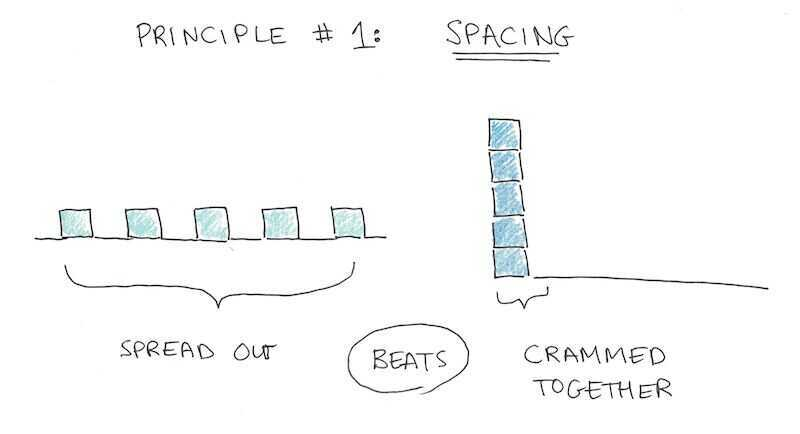
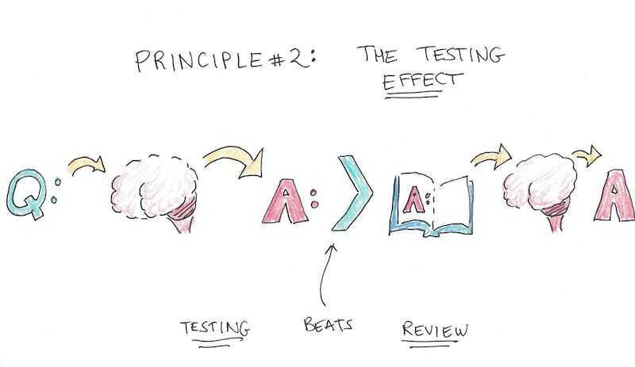
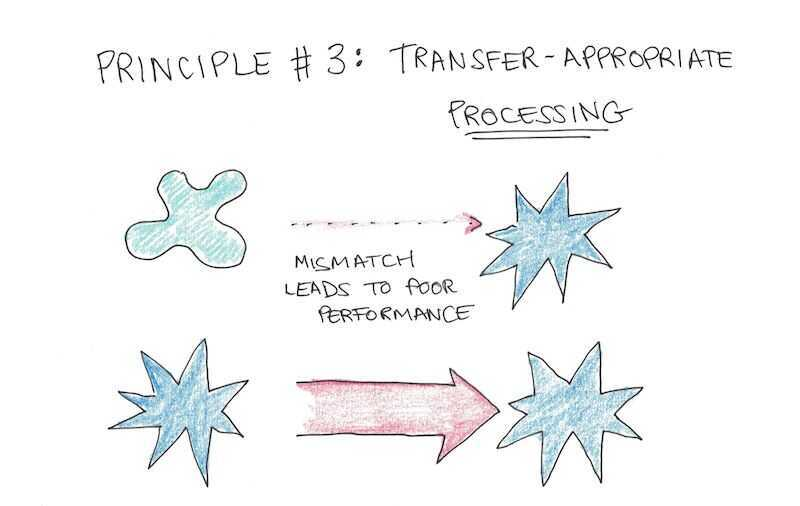
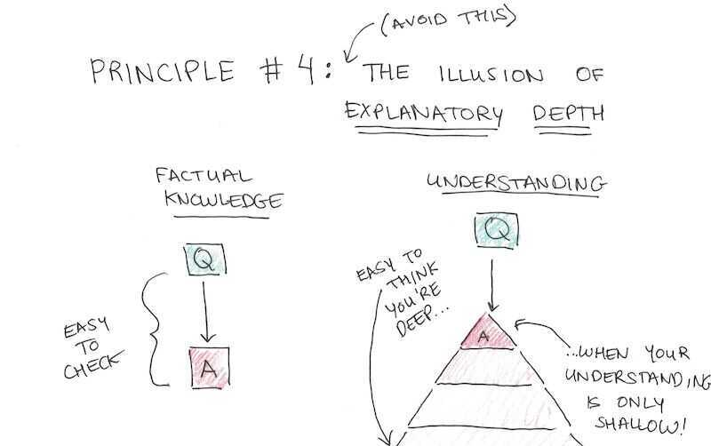
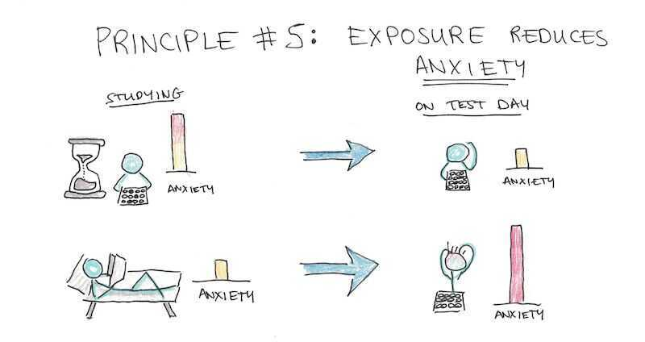

# Exams

## The strategy to ace Exams

### Spacing

Keep your study schedule evenly spaced out, with only a slight bump right before the test (if at all). Try to practice each piece of info five times from when you first learn it, until your exam.

### Recalling

After your first time learning the material, the majority of subsequent studying should be in the form of retrieval practice - trying to reproduce the information, solve a problem or explain an idea - without looking at the source.

Consider one experiment by psychologists Jeffrey Karpicke and Janelle Blunt.In it, they had students in four groups: single review, repeatedly reviewing the information, free recall of the information (meaning you try to remember as much as you can without looking), and creating a concept map (also called a mind map).

**Free recall did much better than the other groups**

### Practice

Always prioritize higher-quality problem sets. Mock exams are best, followed by in-class problems and then writing prompts from big ideas or concepts discussed.

### Understanding

Identify the core concepts and make sure you can explain them without looking at the material. If you really don't get something, go back and forth between the explanation in the textbook and your own understanding until you do.

### Simulate (to beat Anxiety)

Simulate your exam by doing mock exams (or if you lack those, with other problems) under the same time constraints and conditions of the actual exam.

**Testing** (1 hour of testing is far productive than 1 hour of learning)
