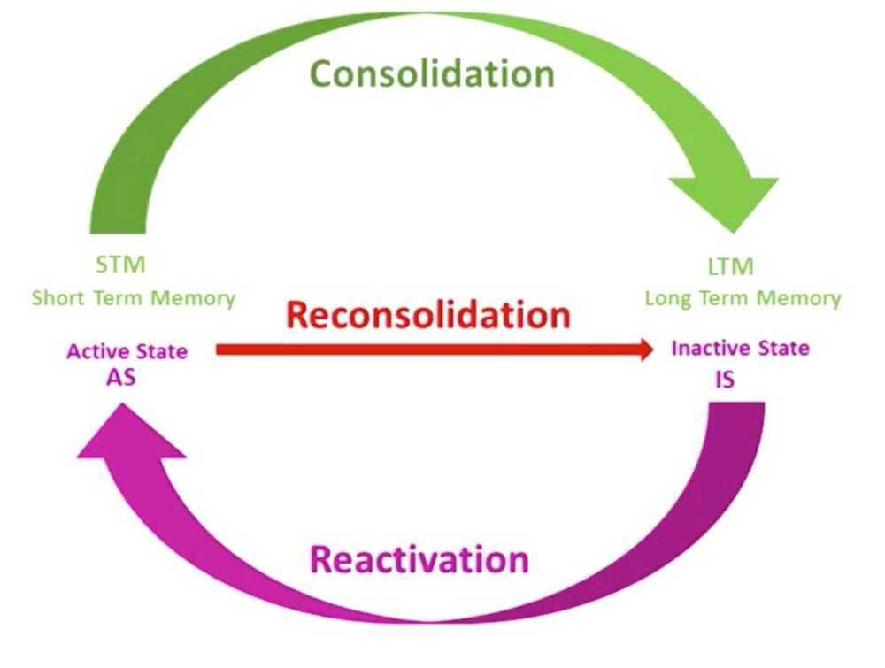

# Memory

Brain have a visual spatial center - Therefore images are stored very efficiently.

Neuron hooks

Use index cards

Spaced repeatition (and then spacing the space between repeatition)

Interleave your learning, mix concepts together so that new concepts can be formed

Sleep is where our mind repeats pattern and solutions together to solidy the neural pathways.

Hippocampus is used to store new memories. It is used for memory consolidation.

Whenever we recall a memory it changes in a process called reconsolidation

Astrocytes maintain the ion balance.

Astrocytes have a key role in learning.

## Introduction to memory

Two major memory system

- Long term memory (like a storage warehouse)
- Working memory (centered our of prefrontal cortex but have links to other parts of the brain to retrieve from Long term memory)
    - Can only hold 4 chunks of information

## Meaningful Groups

1. Have first letters of a list of items and map them together to create a meaningful group representing some simple object.
2. Create a mnemonic for some concepts.
3. Memory palace technique

## Long term memories for facts and events

- are subject to modification by a process called "reconsolidation"
- are living parts of the brain, that changes each time your access them.

## Renaissance Learning and Unlocking your Potential

- Sometimes you cannot go forward with learning, that means the brain is restructuring itself to create a better foundation for next learning. After you come out of these phase, your learning potential or understanding can take a large leap forward.
- Create a lively Visual Metaphor or Analogy
- No need for genius Envy - Imposter Syndrome (Imposter syndrome involves frequent feelings of inadequacy.)
- Change your thoughts, change your life
- Perseverance (the virtue of the less brilliant)
- The value of teamwork
- A test checklist
- Hard Start - Jump to Easy Technique
- This test has got me excited to do my best
- Have a deep breath in and out when you feel anxious

## Working Memory

Working memory is essentially your mental bandwidth.If you have a good working memory, or can use yours more effectively, you can think and learn better.

## Phonological Loop

- Ideally, avoid noise during learning and don't listen to any kind of music
- The best way to down out noise is by using earplugs (or listening to white noise)
- If you do have to listen to music (because it helps you calm down for instance), choose instrumental music with no lyrics
- To boost your comprehension and memory, read aloud what you're studying
    - Only apply this to a selection of the most important concepts / information
    - If you read aloud everything, it won't work

## Visuospatial Sketchpad

- Don't worry if you have problems with visuospatial tasks -- it's mostly a matter of choosing the right strategy.
- Use the analytical strategy (step-by-step) approach to solve visuospatial tasks.
    - Break down complex tasks into small components.
    - Offload the results of intermediate steps onto paper.
- Try the drawing-construction strategy to help you with reading comprehension.
    - This strategy can make you process information more deeply.

## Central Executive

- Avoid multitasking and interruptions even if you feel that it's not affecting you -- the negative effect can be well hidden from you sight
- Multitasking will not affect your learning and performance only if the two or more activities that you do simultaneously don't share the same working memory resources (e.g. practicing flashcards while commuting)
- When studying, put all information relevant to one concept into one place to prevent divided attention
- Try to find study materials which feature integrated information (graphs and text combined together rather than presented separately)
- If necessary, re-draw or photo-copy different parts of your notes/textbooks/lecture notes so that everything is integrated
- Design your own study materials (like flashcards) in an integrative way to boost your memory

## Chunking

- Use chunking to compress information so that you can remember more.
- You can chunk your study materials by grouping concepts into categories.
    - For instance, you can group foreign language vocabulary by topics, similar meanings, or similar pronunciation.
- To gain expertise in any subject or skill, you need to build increasingly complex chunks of information
    - You can do this with pre-training (pre-studying the definitions and meanings of concepts before your lecture or before you read a textbook)
- If you don't understand something, try to identify what exactly you're having a problem with and study this first
- Firstly master the underlying sub-skills and then practice your target skill to save time and energy

## Cognitive Load

- If your study material feels too complex, then you need to reduce your **intrinsic load**
- If your study material feels unclear or confusing, then you need to reduce your **extrinsic load**
- To reduce intrinsic load, use segmenting and sequencing or find some worked examples
- To reduce extrinsic load, find study materials with clear language and modest graphics, and approach solving problems in a goal-free way
- Germane load.The effort required to make new chunks and remember.

## Anxiety

- If your teacher is math-anxious, ignore them and find a better teacher online (e.g. the Khan academy)
- Use ***cognitive reappraisal*** and subvocalization to transform anxiety into excitement ("I'm excited")
- Use expressive writing to offload your worries from memory onto paper

## Memory Types

### Retrospective Memory - Remembering the past

- By Content
    - Implicit Memory / skill memory

The ability to do a task (brushing teeth)

- **Declarative / Explicit**
- Semantic - Memory of facts and meaning
- Episodic - Memory from events

   Experiences you've had

- By Duration
- **Working Memory -** What you can "keep in mind" at the same time, to think, reason and solve problems.

Can be divided into 4 components

1. **Phonological loop -** stores sounds including words, digits, sentences
2. **Visuospatial sketchpad -** stores images of objects
3. **Central executive -** directs attention and manipulates information
4. **Episodic buffer**

- Long-term Memory -- Anything you remember longer than a moment--what you ate for breakfast, exam questions or your friend's birthday.

### Prospective Memory - Reminding yourself to do something in the future

Remember to describe doing the task as vividly as possible, like passing through a library.

Encoding: Putting Memories into Brain

## Retaining/Storage: Keeping Memories in the Brain

Forgetting can be caused by two different processes. The first is a **failure of storage** -the information might be forgotten because our brain loses it over time. The second is a **failure of retrieval** -the information might be "in" there, but we can't access it.

## Trace Decay

- Memories follow an exponential decay curve, it fades fast just after studying something and began to slow down after 2 days
- Spend about 1/10 of your study time revising old material
- Insert brief periods of revision of old material into the study of new material

## References

https://www.scotthyoung.com/blog/2019/04/24/working-memory

https://en.wikipedia.org/wiki/Mnemonic_major_system

[How To ABSORB TEXTBOOKS Like A Sponge - YouTube](https://www.youtube.com/watch?v=nqYmmZKY4sA)
