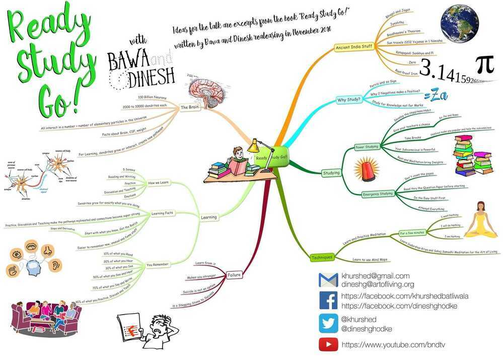
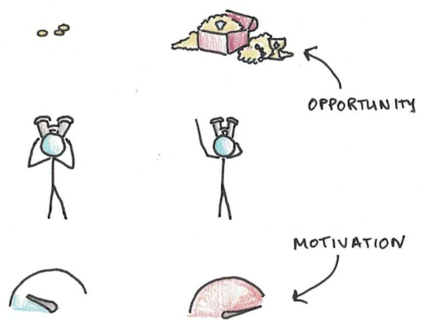

# Tips

<https://en.wikipedia.org/wiki/List_of_mnemonics>

Immediately after every lecture, meeting, or any significant experience, take 30 seconds --- no more, no less --- to write down the most important points.

## Mind Mapping - Put main topic in center of the page and write connections form it

Pomodora Technique (25 + 5 mins and after 4 times 30 mins breaks)

## Cognitive Fitness

- Experiences makes the brain grow
- Work hard at play
- Search for patterns
- Seek novelty and innovation

## How to Learn Something

1. If something comes to you easy, you will forget it. Like in airport if you see gate number and then turnaround then you forget it. But if you see the gate number and then without looking ask yourself what's the gate number and recall the gate number then you are going to remember it.

2. Connect new things to old things, it's called elaboration

## Quickly learn a new thing (FAST)

### F - Forget

Old things about the subject you are about to learn

About situational things

About negative things like you cannot do it

### A - Active

### S - State

All learning is state dependent

### T - Teach (When you teach something you get to learn it twice)

### M - Motivation

Reasons reap Results

### O - Observation

Shake your hand, make a fist and put it to your chin (put it to your head)

Listen to people by being Silent

### M - Mechanics

## What words we tend to remember in a group of words

- Primacy - You remember first words
- Unique
- Organized
- Recency

Story Method

Practice makes Permanent

## LOCI Method (Location)

## ADEPT Method

- **Analogy**
- **Diagram**
- **Example**
- **Plain English**
- **Definition**

Teaching someone the concept is the best way to learn, since you will make mistakes.

90% of our learning is wasted as we retain only 10% of what we learn.

## Time Management

1. **Eliminate Half-Work at all costs**
2. **Do the most important things first**
3. **Reduce the scope, but stick to the schedule.**

<https://jamesclear.com/time-management-tips>

## Techniques that can help learning

- Pomodoro Technique

- Chunking
- Space Repetition
  - 1-2-4-7 Technique
  - Feynman Technique
- Imagery to Text Mapping
  - Mnemonics
  - Mind Palace
  - Index cards
  - Meaningful groups

<https://kwiklearning.com/kwik-tips/5-leisure-activities-that-are-great-for-your-brain>

## Breathing Exercises

1. Water Breathing (for balance)

    Inhale for 4 seconds, exhale for 4 seconds

2. Whiskey Breathing (for sleeping)

    Inhale for 4 seconds, exhales for 8 seconds

3. Coffee Breathing / Kapalabhati (breath of fire)

    - for agitating body, activating symphathetic nervous system
    - Exhale rapidly
    - 3 rounds of 20 in the morning
    - 3 rounds of 20 right before exercise
    - 3 rounds of 20 in the afternoon at 3 PM
    - 5.5 seconds in and 5.5 seconds out

## Motivation

Theories of motivation tend to come in two flavors:

1. **Rational.** Our motivations reflect our preferences. We're motivated by visible opportunities. If you don't feel driven, the problem is a lack of destinations worth driving towards.

2. **Biased.** We're short-sighted and lazy. Our minds weren't built for modernity, so we often ignore obvious ways to make our lives better. Boosting your motivation, even artificially, can make you better off.

3. 

These two perspectives suggest two different approaches you should take:

1. **If you believe motivation is mostly rational, the correct attitude is to listen.** Pay attention to what motivates you. If you feel uninspired, it might be that your current opportunities aren't particularly good. If you feel obsessed, that's a good sign you're on the right path.

2. **Believe motivation is biased and some nudging is necessary.** Even great opportunities require discipline to recognize. Rules, systems and habits can nudge you out of your lazier self.

## Memory Palace

1. Front gate
2. parking
3. stairs
4. Drawing room - 1
5. Drawing room - 2
6. Bathroom - big
7. Bathroom - small
8. Didi's room
9. My room
10. Dining room / Drawing room - 3
11. kitchen
12. parlor
13. parent's room

<https://en.wikipedia.org/wiki/Mnemonic_major_system>

## WFH (Work From Home)

Learning being around smarter folks & absorption by osmosis and overhearing has reduced to zero.
