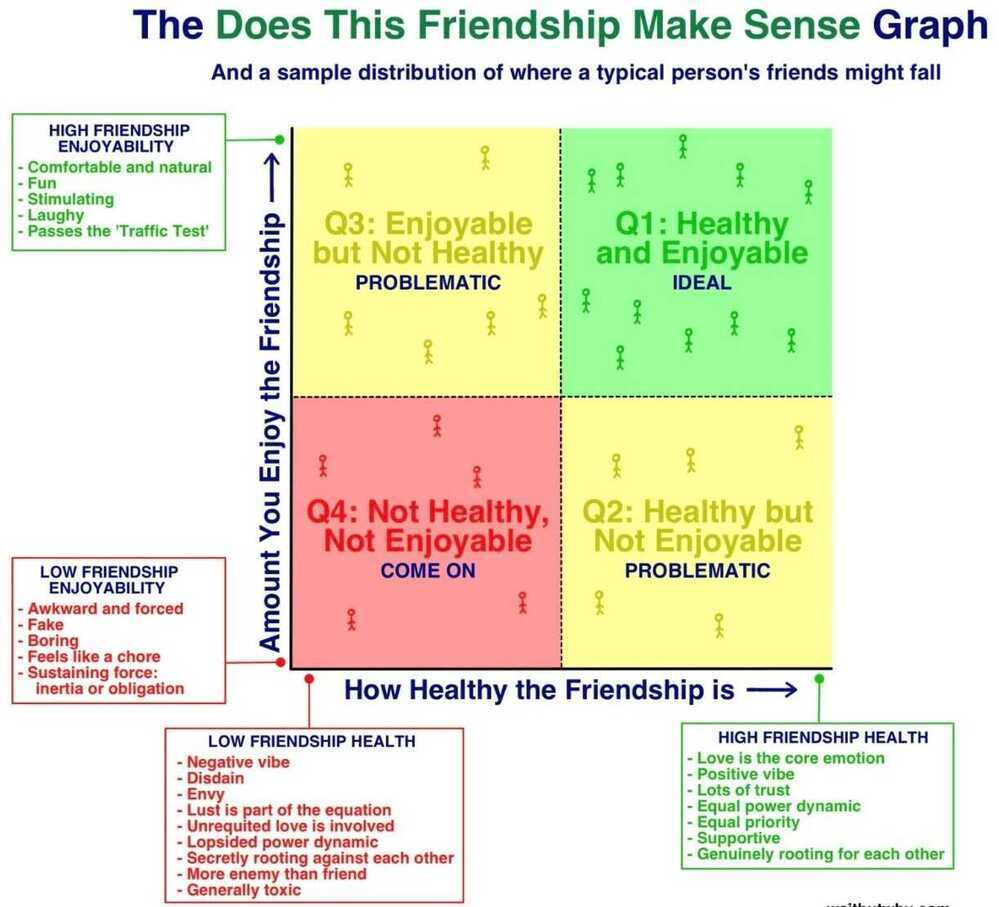
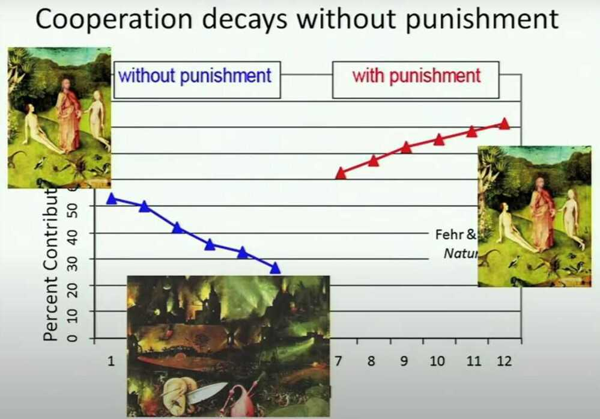

# Life / Relationship / People

When working with people, assume good intentions.

When listening to people, interpret their words in a generous way.

You will occasionally get burned and mistreated by always assuming the best in others, but it is a far better way to live than the opposite

Never tell people that they are moron

There are some very smart people in the world who like to solve really hard problems.

Like should be treated alike

If you trust me then you shouldn't ask for my account statement and if you don't trust me then you should trust my given account statement - Pandit Jawaharlal Nehru to his father

#### Ernest Hemingway

- Before you talk, listen.
- Before you react, think.
- Before you spend, earn.
- Before you criticise, wait.
- Before you pray, forgive.
- Before you quit, try.

[Building a Life - Howard H. Stevenson](https://youtu.be/wLn28DrSF68)

- What makes you happy
- What you want to achieve

## Relationship Quotes (Marriage)

Marrying well makes everything easier.

It's okay to dislike someone, or even dislike someone for no reason. But it's not okay to disrespect, degrade, and humiliate that person

Find a partner who is ready to build with you.

It is not about finding perfection in another person, it is about realizing when you come across an undeniable connection that nourishes your being and matches the type of support you are looking for. Getting lost in the idea of perfection is a hindrance. Being with someone who is committed to going through the ups and downs of life together is truly priceless.

When two people embrace their imperfections and commit to growing into better versions of themselves, it will naturally enhance the happiness they share in the relationship.

Double down on your best relationship.

It's the investment with the highest return.

It's easier to destroy a relationship than build one.

_patri mile na mile, sleep schedule zaroor milna chahiye_ (your sleep schedule being compatible is more important than your astrological charts being compatible!)

The secret to feeling great about yourself is not to be found in searching for people who are less than you and then show yourself superior to them, but in searching for people who are more than you and then show yourself worthy of their company.

I would recognize you in total darkness, were you mute and I deaf. I would recognize you in another lifetime entirely, in different bodies, different times. And I would love you in all of this, until the very last star in the sky burnt out into oblivion."

1. **Body:** The condition of your body, including your diet, stamina, strength, and recovery.
2. **Mind:** [Your ability to focus](http://email.c.kajabimail.net/c/eJwdjstuwyAURL_GbCoQl5fDgkWqJlLX_YAIw3VCYkOEcdT-fWml2cxopHOi0zrGiSQnuODcCgDFreQMmOLHk7Yn825Go_o6KB7Yw9_9lFafFpaxkZvjQhmp7AzChzjJcNDj7HXQdoSDVRLI4m6tPbdBHgdx7om-pn2bSy37Nwtl7dNcwr7RCVvDSlef_RWp7yW3VDLNpdGWVuxHgn_kS8QlvbD-XFJ0FEajFVjgilQXEZ_-sZUSDdgufP037RTS3Fdq-Pb5MQiplda_n4hMdg), rest, and acquire knowledge.
3. **Love:** Your relationship with family, friends, kids, and intimate partner.
4. **Work:** How much inner satisfaction and financial rewards you receive from your career.
5. **Money:** What you do with the money youhave.
6. **Play:** How well you're able to entertain yourself.

https://dariusforoux.com/six-spokes-theory

### Date nights (Questions to wife) - Blinkist - Eight Dates by John Gottman

1. Trust and commitment
2. Addressing conflict
3. Sex and intimacy
4. Money and savings
5. Family and children
6. Play and adventure
7. Goals and Sprituality
8. Dreams (sacrificing, shared dreams)
9. Actionable Advice - Be present and attentive when talking to your partner

Don't tell your whole life on the 1st date night

"A good marriage is one in which each spouse secretly thinks he or she got the better deal, and this is true also of our friendships."

What most people call love today is little more than a mutual benefit scheme. Love is an unconditional sweetness of emotion. -- Sadhguru

What you need to make your marriage successful is not the perfect person. What you need is absolute integrity. -- Sadhguru

The idea of marriage is to multiply the joy. Multiplying misery is a crime against Humanity. -- Sadhguru

If one spouse commutes longer than 45 minutes, that couple is 40% more likely to get divorced

There is really no such thing as conditional love and unconditional love -- there are conditions, and there is love. -- Sadhguru

Love is not a noun, but a verb. It's a thing you do.

Always give value before you ask for value.

Not taking things personally is a superpower.

Entrepreneur Cindy Gallop on how to build a successful business:

"There is a formula for success in business, and it goes like this: You set out to find the very best talent in the marketplace, and then give them a compelling and inspirational vision of what you want them to achieve for you and the company. Then you empower them to achieve those goals using their own skills and talents in any way they choose. If, at the same time, you demonstrate how enormously you value them, not just through compensation, but also verbally, every single day, and if you enable that talent to share in the profit that they help create for you, you'll be successful. It's so simple, and virtually nobody does it, because it requires a high-trust working environment, and most business environments are low-trust. In order to own the future of your business, you have to design it around trust."

The less rigid your personality, the more powerful your presence. -- Sadhguru

Having expectations of others means you are trying to fix their lives. Fix your own life -- that is freedom. -- Sadhguru

Love is not about somebody. Love is not some kind of act. Love is the way you are.

I want to live in a world where friends feel **ok** to drop by each other's home unannounced

### 7 secrets to a healthy relationship

1. Appreciate your partner's efforts - If you want your relationship to work, constantly remind yourself that the other is more significant than you.
2. Learn to respect personal space
3. Express your emotions
4. Discuss your concerns
5. Trust your partner
6. Share your passions
7. Avoid blame game

### Gottman Ratio - 5 to 1 (can be used for habits also, for every one slip, do right 5/4 times)

This means that for every one negative feeling or interaction between partners, there must be five positive feelings or interactions. Stable and happy couples share more positive feelings and actions than negative ones. Unhappy couples tend to have more negative feelings and actions than positive ones. Partners who criticize each other, provide constant negative feedback, aren't supportive of each other, don't demonstrate affection or appreciation, or behave uninterested in their partner are in relationships that are out of balance.

### The 5 love languages

1. Positive, uplifting words of affirmation

   - Praise is the sweetest of all sounds
   - Verbal compliments

       - appreciate their sense of humor
       - look great in a new outfit
       - praise their ability to care for your children

2. Spend quality time with your partner
3. Gifts are visual symbols of love and surprising your partner with regular presents, regardless of their monteary value, is a great way to show affection
4. Doing useful things for your partner is a common way to express love
5. Physical touch is a powerful way to show your love
6. Greatest gift - Helping your partner through hard times (simply standing by your partner during rough periods)

### TEAM Method

A marriage done well is a superpower

Daily 10 mins checkin to boost your marriage

#### T - Touch

Hold hands, sit next to each other on the couch. Remind yourselves with touch you're in this together

#### E - Education

You each share one thing you learned that day that was interesting. A fact. A hard truth. Whatever. It's a chance for novelty and endorphins when we expand our brains.

#### A - Appreciation

You each share one thing you appreciate about the other. Could be how beautiful your partner looks that day. If you're ticked, it could be that they took out the trash. Only rules are, points for creativity and you can't keep using the same one

#### M - Metrics

Usually, when you're upset you tell them that moment. That gets naggy 321 times a day. With the check-in, you wait and bring it to this time. You don't fight when elevated, but you always get to explain your point.

## Friendship

## Tips

- Always make the first move
- In marriages, there are divergent expectations. The woman expects the man to change. The man expects the woman to never change.
- Early concepts of intimacy: Young humans use saliva sharing to infer close relationships - https://www.science.org/doi/10.1126/science.abh1054

## Party / Host / Hosting / Ceremony / Anchor / Commentator

MC is short for **Master of Ceremonies** and may often be written as **emcee**. An MC can be an important part of a birthday party, acting as a host to allow the birthday boy or girl to enjoy the party along with guests. Although the party atmosphere will provide a good time, the MC ideally remains focused on the multifaceted responsibilities the job demands.

- Annoucements
- Music selection
- Setting the tone
- Setting the place

https://pdfslide.net/documents/emcee-academic-debate-script.html

https://www.ehow.com/info_8146690_mcs-duties-birthday-party.html

https://www.ehow.com/info_8201232_duties-emcee.html

1. **Arrive to the party venue well before the guests** so you can become familiar with the sound system and test the microphone. Showing up early will also allow you to see how the party site is set up, so you know where to make eye contact to keep the audience engaged.

2. **Look at the program for your manager's farewell party**. As the MC, you'll need to know how to introduce each speaker that will present an award or kind word to the **guest of honor.** If you have a small speech prepared, becoming familiar with the program will give you an idea of when you should present it. If necessary, jot down a few notes on the program that will help you with guest introductions, such as "worked with guest of honor the longest" or "closest professional friend."

3. Take your place on the stage or podium before guests arrive so you can welcome all the party goers.

4. **State the reason for the gathering,** and lead the guests in showing your manager a round of applause as she's ushered into the room or seated at the main table.

5. **Introduce each individual** before he gets up to share a short speech or poem at the celebration, using your notes as guidelines. Encourage the crowd to give every presenter a round of applause as he walks to the front of the room.

6. **Conclude the speaking portion** of the farewell party by sharing a fond memory you have of your manager, and calling her up to the front so you can present her with a gift from you and the rest of your colleagues, like a plaque or large bouquet of flowers.

7. **Thank everyone for coming** to the farewell celebration and prompt everyone to continue socializing or dining or cordially dismiss them from the party venue, depending on how the program is scheduled.

## Techniques for preparing for stressed events beforehand

- Prospective Hindsight
- Pre-mortem

## Boundaries

You have a boundary issue if...

- you feel like people take advantage of you or use your emotions for their own gain.
- you feel like you're constantly having to "save" people close to you and fix their problems all the time.
- you find yourself sucked into pointless fighting or debating regularly.
- you find yourself more invested in a person than you should.
- you tell people how much you hate drama but seem to always be stuck in the middle of it.
- you spend a lot of time defending yourself for things you believe aren't your fault

https://deepstash.com/article/3412/the-guide-to-strong-boundaries

## Types of people

1. Maker
2. Scientist
3. Maven (learning/knowledge acquisition)
4. Essentialist (organizer)
5. Performer
6. Warrior
7. Teachers
8. Advocate
9. Advisor
10. Nurturer

## Talking

- F - Family
- O - Occupation
- R - Recreational
- D - Dreams

First question must be directed towards the Heart.

Ex - What's the best moment you remember with your father

Start with I'm curious

Daily talk about (rose, thorn, bud excercise)

- rose - best part of your day
- thorn - worst part of your day
- bud - something in your day that gave you hope

## Meaning of life

- Belonging
- Purpose
- Transcendence
- Story Telling - How you tell story about yourself, Change your story to change your life

## HEAR (Halt, Empathy, Anticipate, Review)

## Pleasure

Extrinsic Pleasure (do work that leads to pleasure)

Intrinsic Pleasure (happiness while doing that work)

Abstain from short term pleasure

- Meditation
- Deep Work
- Not To Do List

## Transcendental Meditation

Transcendental Meditation(TM) refers to a specific form of silent, [mantra](https://en.wikipedia.org/wiki/Mantra)[meditation](https://en.wikipedia.org/wiki/Meditation) and to the organizations that constitute the [Transcendental Meditation movement](https://en.wikipedia.org/wiki/Transcendental_Meditation_movement).[Maharishi Mahesh Yogi](https://en.wikipedia.org/wiki/Maharishi_Mahesh_Yogi) created and introduced the TM technique and TM movement in [India](https://en.wikipedia.org/wiki/India) in the mid-1950s.

The TM technique involves the use of a silently-used sound called a mantra, and is practiced for 15--20 minutes twice per day. It is taught by certified teachers through a standard course of instruction, which costs a fee that varies by country. According to the Transcendental Meditation movement, it is a non-religious method for relaxation, [stress](https://en.wikipedia.org/wiki/Stress_(biology)) reduction, and self-development. The technique has been seen as both religiousand non-religious;[sociologists](https://en.wikipedia.org/wiki/Sociologist), scholars, and a [New Jersey](https://en.wikipedia.org/wiki/New_Jersey) judge and court are among those who have expressed views on it being religious or non-religious.The United States Court of Appeals upheld the federal ruling that TM was essentially "religious in nature" and therefore could not be taught in public schools.

High-quality studies that demonstrate positive health outcomes that can be attributed to the specific practice of TM as compared to other forms of stress reduction do not exist.

https://en.wikipedia.org/wiki/Transcendental_Meditation

## Healthy social interactions

1. Tolerating frustration
2. Flexibility
3. Problem solving abilities
4. Empathy
5. Engaged observation

## Implicit Association Test (IAT)

The **implicit-association test(IAT)** is a [measure](https://en.wikipedia.org/wiki/Measurement) within [social psychology](https://en.wikipedia.org/wiki/Social_psychology) designed to detect the strength of a person's subconscious association between mental representations of objects ([concepts](https://en.wikipedia.org/wiki/Concept)) in [memory](https://en.wikipedia.org/wiki/Memory). It is commonly applied to assess [implicit stereotypes](https://en.wikipedia.org/wiki/Implicit_stereotype) held by test subjects, such as unconsciously associating stereotypically black names with words consistent with black stereotypes. The test's format is highly versatile, and has been used to investigate biases in racial groups, gender, sexuality, age, and religion, as well as assessing self-esteem.

The IAT was introduced in the scientific literature in 1998 by [Anthony Greenwald](https://en.wikipedia.org/wiki/Anthony_Greenwald), Debbie McGhee, and Jordan Schwartz.The IAT is now widely used in social psychology research and, to some extent, in [clinical](https://en.wikipedia.org/wiki/Clinical_psychology), [cognitive](https://en.wikipedia.org/wiki/Cognitive_psychology), and [developmental psychology](https://en.wikipedia.org/wiki/Developmental_psychology) research. The IAT is the subject of much controversy regarding validity, reliability, and whether test results are an accurate representation of [implicit bias](https://en.wikipedia.org/wiki/Implicit_bias).

https://en.wikipedia.org/wiki/Implicit-association_test

## Ethnography - Study of people and culture

in-depth observation of how people behave and interact with their surroundings

## Worst idea of psychology - Mind is a blank slated birth

Developmental psychology has shown that kids come into the world, already knowing so much about the physical and social world and programmed in such a way as to make it easy to learn certain things and hard to learn others

## Inateness

1. **Harm/care**
2. **Fairness/reciprocity**
3. **Ingroup/loyalty**
4. **Authority/respect**
5. **Purity/sanctity**

https://www.youtube.com/watch?v=8SOQduoLgRw

## Weak link vs Strong link

- Basketball - strong link
- Football - weak link
- Programming - strong link
- Investment group - strong link
- Donation to Schools should be weak link

[YouTube](https://www.youtube.com/watch?v=UAqZMgBtECQ)

## 7 reasons smart, hardworking people don't become successful

1. Meet same people, ideas are recycled. Solution is to meet new people
2. Aversion to change. Solution - be open and curious
3. Rely on credentials. Solution - Strategic thinking
4. Not willing to take risks
5. You can't commit to decisions
6. Constantly go after exiting things and leave things mid way, Shiny object syndrome
7. You don't believe in yourself

## Ubuntu - I am because you are

Ubuntu is an ancient African word meaning '**humanity to others**'. It is often described as reminding us that 'I am what I am because of who we all are'.

https://en.wikipedia.org/wiki/Ubuntu_philosophy

[Michael Burry: 5 Life Lessons That Made Him Rich (UCLA Speech)](https://www.youtube.com/watch?v=b53QBOu_Tos)

- Be a hyper realist, don't try to assume the world as you want, but take it as it is
- Question everything
- Be skeptical for most authoritative sources too
- Don't stop learning
- Use information abundance as an advantage
    - We are privileged to have so much information at our finger tips
- Do no harm

## Parasocial Relationship

Parasocial interaction(PSI) refers to a kind of [psychological relationship](https://en.wikipedia.org/wiki/Social_relation) experienced by an audience in their mediated encounters with performers in the [mass media](https://en.wikipedia.org/wiki/Mass_media), particularly on [television](https://en.wikipedia.org/wiki/Television) and on [online platforms](https://en.wikipedia.org/wiki/Internet#Social_impact).Viewers or listeners come to consider media personalities as friends, despite having no or limited interactions with them. PSI is described as an [illusionary](https://en.wikipedia.org/wiki/Illusion)[experience](https://en.wikipedia.org/wiki/Experience), such that media audiences interact with [personas](https://en.wikipedia.org/wiki/Persona)(e.g., [talk show](https://en.wikipedia.org/wiki/Talk_show) hosts, [celebrities](https://en.wikipedia.org/wiki/Celebrities), [fictional characters](https://en.wikipedia.org/wiki/Fictional_character), [social media influencers](https://en.wikipedia.org/wiki/Influencer_marketing)) as if they are engaged in a [reciprocal relationship](https://en.wikipedia.org/wiki/Reciprocity_(social_psychology)) with them. The term was coined by Donald Horton and [Richard Wohl](https://en.wikipedia.org/wiki/Richard_Wohl) in 1956.

https://en.wikipedia.org/wiki/Parasocial_interaction

## Classes

[Rich Class , Middle Class And Lower Class | A Different Emotion Defining Them - YouTube](https://www.youtube.com/watch?v=0q04x6QKSC4)

- Upper class - Ambitions
- Middle class - Aspirations
- Lower class - Enthusiasm

## Links

- [The Almanack of Naval Ravikant](../book-summaries/the-almanack-of-naval-ravikant)
- [How to be an adult in relationships](../book-summaries/how-to-be-an-adult-in-relationships)
- [From Strength to Strength](../book-summaries/from-strength-to-strength)
- [Didn't see it coming](book-summaries/didnt-see-it-coming.md)
- [The Courage to be Happy](book-summaries/the-courage-to-be-happy.md)
- [Life is in the Transitions](book-summaries/life-is-in-the-transitions.md)
- [Power Relationships](book-summaries/power-relationships.md)
- [How should we live?](book-summaries/how-should-we-live.md)
- [Solve for Happy](book-summaries/solve-for-happy.md)
- [Social Intelligence](book-summaries/social-intelligence.md)
- [The Book of Joy](book-summaries/the-book-of-joy.md)
- [Essentialism](book-summaries/essentialism.md)
- [Find Your Element](book-summaries/find-your-element.md)
- [The Secret to Making New Friends as an Adult | Marisa G. Franco | TED](https://www.youtube.com/watch?v=-k0p-DYYZKU)
    - Make others feel valued and listened
- [Good sex explained in 9 minutes | Dr. Emily Nagoski - YouTube](https://www.youtube.com/watch?v=eqX38J9ya1I)
- [What is the RIGHT AGE to Get Married? - YouTube](https://www.youtube.com/watch?v=kFOqci-3WPs)
    - The biggest decision in life is to choose whom to get married to
- [Do North Indians Have A Habit Of Showing Off ? | Deep Analysis And Solution - YouTube](https://www.youtube.com/watch?v=3ckyja7K8U4)
- [You Never Marry the Right Person - RELEVANT](https://relevantmagazine.com/life5/you-never-marry-the-right-person/)
- [Bedtime Battles: A Couple's Guide to Better Sleep](https://tbthealth.substack.com/p/bedtime-battles-a-couples-guide-to)
- [Your Life in Weeks — Wait But Why](https://waitbutwhy.com/2014/05/life-weeks.html)
	- [Habits + Life Calendar By Weeks Of The Year - Google Sheets](https://docs.google.com/spreadsheets/d/1_xR5aqMFNOGVqH4DnytqeiOs7laCX5VEFo0SsEK4U3U/edit?gid=15#gid=15)
	- [Build A 'Your Life In Weeks' Calculator With Google Sheets: No-Code Tutorial - YouTube](https://www.youtube.com/watch?v=eM_T7e-uC28&ab_channel=RavinderDeol)
	- [Your Life in Weeks - Interactive](https://www.bryanbraun.com/your-life/weeks.html)
