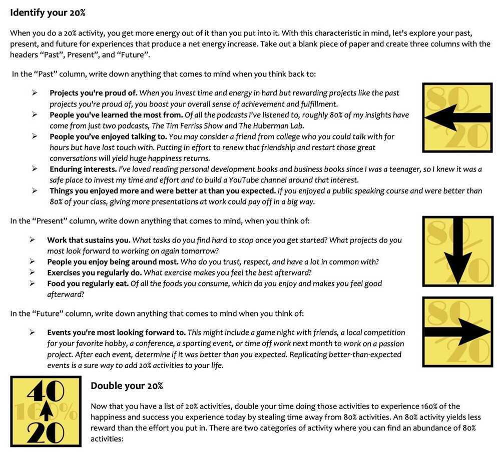

# Mental Models

## 80/20 Rule / Pareto Principle

In 1906 there was an Italian economist named Vilfredo Pareto. One day Pareto noticed that every year, 20% of the pea pods in his garden produced approximately 80% of the peas.

**The basic theory is that a limited number of actions create outsized results**

This got him thinking about economic output on a larger scale. Sure enough, he began to find that in various industries, societies and even companies, 80% of the production often came from the 20% most productive faction.

### The 80/20 Principle states that 80% of the output or results will come from 20% of the input or action

- What are the 20% of [your possessions](https://markmanson.net/minimalism) you get the most value out of?
- What do you spend 20% of your time doing that gives you 80% of [your happiness](https://markmanson.net/how-to-be-happy)?
- Who are the 20% of people you're close to who [make you the happiest](https://markmanson.net/how-to-be-happy)?
- What are the 20% of the clothes you wear 80% of the time?
- What's the 20% of food you eat 80% of the time?

[THE 80/20 PRINCIPLE by Richard Koch | Core Message](https://www.youtube.com/watch?v=2YDR5-Mij1c)

- About a fifth of your time is likely to give you 4/5ths of your achievement or results and 4/5th of your happiness -- Richard Koch

### 64/4 Rule

4 percent of your activities create 64 percent of the revenue for your business. Make it your goal to give all your time to your 4 percent.

By doubling the 80-20 rule, you get 4-64 rule

Top 4% gives 64% revenue

## Priming Effect

The priming effect occurs when an individual's exposure to a certain stimulus subconsciously influences his or her response to a subsequent stimulus. These stimuli are often related to words or images that people see during their day-to-day lives.

### Types

- [1.1 Positive and negative priming](https://en.wikipedia.org/wiki/Priming_(psychology)#Positive_and_negative_priming)
- [1.2 Perceptual and conceptual priming](https://en.wikipedia.org/wiki/Priming_(psychology)#Perceptual_and_conceptual_priming)
- [1.3 Repetition](https://en.wikipedia.org/wiki/Priming_(psychology)#Repetition)
- [1.4 Semantic](https://en.wikipedia.org/wiki/Priming_(psychology)#Semantic)
- [1.5 Associative priming](https://en.wikipedia.org/wiki/Priming_(psychology)#Associative_priming)
- [1.6 Response priming](https://en.wikipedia.org/wiki/Priming_(psychology)#Response_priming)
- [1.7 Masked priming](https://en.wikipedia.org/wiki/Priming_(psychology)#Masked_priming)
- [1.8 Kindness priming](https://en.wikipedia.org/wiki/Priming_(psychology)#Kindness_priming)
- [1.9 Affective priming](https://en.wikipedia.org/wiki/Priming_(psychology)#Affective_priming)
- [1.10 Cultural priming](https://en.wikipedia.org/wiki/Priming_(psychology)#Cultural_priming)
- [1.11 Anti-priming](https://en.wikipedia.org/wiki/Priming_(psychology)#Anti-priming)

https://thedecisionlab.com/biases/priming

https://en.wikipedia.org/wiki/Priming_(psychology)

## Normalization of deviance

**Normalization of deviance** is a term used by the American sociologist [Diane Vaughan](https://en.wikipedia.org/wiki/Diane_Vaughan "Diane Vaughan") to describe the process in which [deviance](https://en.wikipedia.org/wiki/Deviance_(sociology) "Deviance (sociology)") from correct or proper behavior or rule becomes normalized in a government or corporate culture.

Vaughan defines this as a process where a clearly unsafe practice comes to be considered normal if it does not immediately cause a catastrophe: "a long incubation period (before a final disaster) with early warning signs that were either misinterpreted, ignored or missed completely".

[Normalization of deviance - Wikipedia](https://en.wikipedia.org/wiki/Normalization_of_deviance)

## Dark forest hypothesis

The dark forest hypothesis is the conjecture that many alien civilizations exist throughout the universe, but they are both silent and paranoid. In this framing, it is presumed that any space-faring civilization would view any other intelligent life as an inevitable threat, and thus destroy any nascent life that makes its presence known. As a result, the electromagnetic spectrum would be relatively quiescent, without evidence of any intelligent alien life, as in a "dark forest" filled with "armed hunter(s) stalking through the trees like a ghost".

[Dark forest hypothesis - Wikipedia](https://en.wikipedia.org/wiki/Dark_forest_hypothesis)

## as-judged-by-themselves

The "as-judged-by-themselves" principle is a standard that focuses on people's preferences and the importance of informed choice. It can justify a nudge-based intervention if the nudge aligns people's choices with what they already prefer.

According to Thaler and Sunstein, nudges should be used to enrich people's lives "as judged by themselves". They also establish that nudges should be transparent and come with the option to opt out.

A nudge is a mechanism that influences the behavior of a group of individuals through providing indirect suggestions. The purpose of nudging is to subtly direct people towards positive behavioral choices.

## Links

- [Law of Triviality](soft-skills/prioritization-leverage#law-of-triviality)
- [Predictably Irrational](../book-summaries/predictably-irrational)
