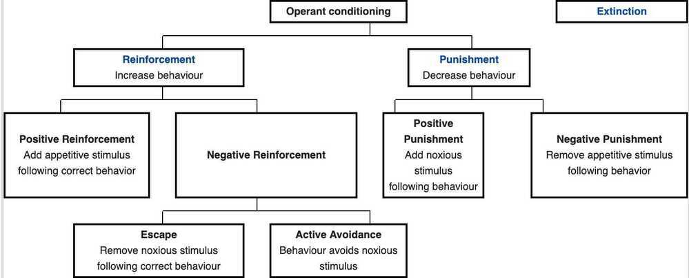

# Others

## Classical Conditioning (Pavlov's Experiment)

Classical conditioning (also known as **Pavlovian** or **respondent conditioning**) refers to a [learning](https://en.wikipedia.org/wiki/Learning) procedure in which a biologically potent [stimulus](https://en.wikipedia.org/wiki/Stimulus_(physiology))(e.g. food) is paired with a previously neutral stimulus (e.g. a bell). It also refers to the learning process that results from this pairing, through which the neutral stimulus comes to elicit a response (e.g. salivation) that is usually similar to the one elicited by the potent stimulus

- Forward conditioning
    - Delay conditioning
    - Trace conditioning
- Simultaneous conditioning
- Second-order and higher-order conditioning
- Backward conditioning
- Temporal conditioning

#### Pavlov's Experiment

Pavlov was conducting research on the digestion of dogs when he noticed that the dogs' physical reactions to food subtly changed over time. At first, the dogs would only salivate when the food was placed in front of them. However, later they salivated slightly before their food arrived.

https://en.wikipedia.org/wiki/Classical_conditioning

## Operant Conditioning / Instrument Conditioning

Is a learning process through which the strength of a behavior is modified by reinforcement or punishment. It is also a procedure that is used to bring about such learning.

Although operant and [classical conditioning](https://en.wikipedia.org/wiki/Classical_conditioning) both involve behaviors controlled by environmental stimuli, they differ in nature. In operant conditioning, stimuli present when a behavior is rewarded or punished come to control that behavior. For example, a child may learn to open a box to get the sweets inside, or learn to avoid touching a hot stove; in operant terms, the box and the stove are "discriminative stimuli". Operant behavior is said to be "voluntary": for example, the child may face a choice between opening the box and petting a puppy.

[B.F. Skinner](https://en.wikipedia.org/wiki/B.F._Skinner)(1904--1990) is referred to as the father of operant conditioning, and his work is frequently cited in connection with this topic. To implement his empirical approach, Skinner invented the [operant conditioning chamber](https://en.wikipedia.org/wiki/Operant_conditioning_chamber), or "**Skinner Box**", in which subjects such as pigeons and rats were isolated and could be exposed to carefully controlled stimuli.

https://en.wikipedia.org/wiki/Operant_conditioning

## Hyperbolic discounting

People prefer smaller, immediate rewards to larger, later ones.

This occurs more when the delay is closer to the present than the future.

Scenario 1: 5000 immediate payment or 10000 payment after 1 year (a lot of people choose 1st option)

Scenario 2: 5000 payment after 4 year orr 10000 payment after 5 year (a lot of people choose 2nd option)

Time gap is same for both the scenarios

The idea here is that when we need to choose between rewards right now and rewards in the far future, we're much less patient than we ought to be.

In [economics](https://en.wikipedia.org/wiki/Economics), hyperbolic discounting is a time-inconsistent model of [delay discounting](https://en.wikipedia.org/wiki/Delay_discounting). It is one of the cornerstones of [behavioral economics](https://en.wikipedia.org/wiki/Behavioral_economics).

The discounted utility approach states that [intertemporal choices](https://en.wikipedia.org/wiki/Intertemporal_choice) are no different from other choices, except that some consequences are delayed and hence must be anticipated and discounted (i.e., re-weighted to take into account the delay).

Given two similar rewards, humans show a preference for one that arrives sooner rather than later. Humans are said to discount the value of the later reward, by a factor that increases with the length of the delay. This process is traditionally modeled in the form of [exponential discounting](https://en.wikipedia.org/wiki/Exponential_discounting), a time-consistent model of discounting. A large number of studies have since demonstrated deviations from the constant discount rate assumed in exponential discounting. Hyperbolic discounting is an alternative mathematical model that accounts for these deviations.

According to hyperbolic discounting, valuations fall relatively rapidly for earlier delay periods (as in, from now to one week), but then fall more slowly for longer delay periods (for instance, more than a few days). For example, in an early study subjects said they would be indifferent between receiving $15 immediately or $30 after 3 months, $60 after 1 year, or $100 after 3 years. These indifferences reflect annual discount rates that declined from 277% to 139% to 63% as delays got longer. This contrasts with exponential discounting, in which valuation falls by a constant factor per unit delay and the discount rate stays the same.

The standard experiment used to reveal a test subject's hyperbolic discounting curve is to compare short-term preferences with long-term preferences. For instance: "Would you prefer a dollar today or three dollars tomorrow?" or "Would you prefer a dollar in one year or three dollars in one year and one day?" It has been claimed that a significant fraction of subjects will take the lesser amount today, but will gladly wait one extra day in a year in order to receive the higher amount instead. Individuals with such preferences are described as "[present-biased](https://en.wikipedia.org/wiki/Present-biased_preferences)".

The most important consequence of hyperbolic discounting is that it creates temporary preferences for small rewards that occur sooner over larger, later ones. Individuals using hyperbolic discounting reveal a strong tendency to make choices that are inconsistent over time -- they make choices today that their future self would prefer not to have made, despite knowing the same information. This [dynamic inconsistency](https://en.wikipedia.org/wiki/Dynamic_inconsistency) happens because hyperbolas distort the relative value of options with a fixed difference in delays in proportion to how far the choice-maker is from those options.

https://en.wikipedia.org/wiki/Hyperbolic_discounting

[Hyperbolic Discounting: Why You Make Terrible Life Choices](https://www.nirandfar.com/hyperbolic-discounting-why-you-make-terrible-life-choices/)

## Illusion of Control

The illusion of controlis the tendency for people to overestimate their ability to control events; for example, it occurs when someone feels a sense of control over outcomes that they demonstrably do not influence.The effect was named by psychologist [Ellen Langer](https://en.wikipedia.org/wiki/Ellen_Langer) and has been replicated in many different contexts.It is thought to influence [gambling](https://en.wikipedia.org/wiki/Gambling) behavior and belief in the [paranormal](https://en.wikipedia.org/wiki/Paranormal).Along with [illusory superiority](https://en.wikipedia.org/wiki/Illusory_superiority) and [optimism bias](https://en.wikipedia.org/wiki/Optimism_bias), the illusion of control is one of the [positive illusions](https://en.wikipedia.org/wiki/Positive_illusions).

The illusion might arise because people lack direct [introspective](https://en.wikipedia.org/wiki/Introspection) insight into whether they are in control of events. This has been called the [introspection illusion](https://en.wikipedia.org/wiki/Introspection_illusion). Instead they may judge their degree of control by a process that is often unreliable. As a result, they see themselves as responsible for events when there is little or no [causal link](https://en.wikipedia.org/wiki/Causality). In one study, college students were in a virtual reality setting to treat a fear of heights using an elevator. Those who were told that they had control, yet had none, felt as though they had as much control as those who actually did have control over the elevator. Those who were led to believe they did not have control said they felt as though they had little control.

Psychological theorists have consistently emphasized the importance of perceptions of control over life events. One of the earliest instances of this is when [Adler](https://en.wikipedia.org/wiki/Alfred_Adler) argued that people strive for proficiency in their lives.[Heider](https://en.wikipedia.org/wiki/Fritz_Heider) later proposed that humans have a strong motive to control their environment and Wyatt Mann hypothesized a basic competence motive that people satisfy by exerting control.[Wiener](https://en.wikipedia.org/wiki/Bernard_Weiner), an [attribution](https://en.wikipedia.org/wiki/Attribution_(psychology)) theorist, modified his original theory of achievement motivation to include a controllability dimension. [Kelley](https://en.wikipedia.org/wiki/Harold_Kelley) then argued that people's failure to detect noncontingencies may result in their attributing uncontrollable outcomes to personal causes. Nearer to the present, Taylor and Brownargued that positive illusions, including the illusion of control, foster mental health.

The illusion is more common in familiar situations, and in situations where the person knows the desired outcome.Feedback that emphasizes success rather than failure can increase the effect, while feedback that emphasizes failure can decrease or reverse the effect.The illusion is weaker for [depressed](https://en.wikipedia.org/wiki/Depression_(mood)) individuals and is stronger when individuals have an emotional need to control the outcome.The illusion is strengthened by stressful and competitive situations, including [financial trading](https://en.wikipedia.org/wiki/Trader_(finance)).Although people are likely to overestimate their control when the situations are heavily chance-determined, they also tend to underestimate their control when they actually have it, which runs contrary to some theories of the illusion and its adaptiveness.People also showed a higher illusion of control when they were allowed to become familiar with a task through practice trials, make their choice before the event happens like with throwing dice, and when they can make their choice rather than have it made for them with the same odds. People are more likely to show control when they have more answers right at the beginning than at the end, even when the people had the same number of correct answers.

https://en.wikipedia.org/wiki/Illusion_of_control

## Mere exposure effect

The mere-exposure effect is a [psychological](https://en.wikipedia.org/wiki/Psychological) phenomenon by which people tend to develop a preference for things merely because they are familiar with them. In [social psychology](https://en.wikipedia.org/wiki/Social_psychology), this effect is sometimes called the familiarity principle. The effect has been demonstrated with many kinds of things, including words, [Chinese characters](https://en.wikipedia.org/wiki/Chinese_character), paintings, pictures of faces, [geometric figures](https://en.wikipedia.org/wiki/Polygon), and sounds. In studies of interpersonal attraction, the more often someone sees a person, the more pleasing and likeable they find that person.

https://en.wikipedia.org/wiki/Mere-exposure_effect

## Norm of reciprocity

The **norm of reciprocity** requires that we repay in kind what another has done for us. It can be understood as the expectation that people will respond favorably to each other by returning benefits for benefits, and responding with either indifference or hostility to harms. The [social norm](https://en.wikipedia.org/wiki/Social_norm) of reciprocity often takes different forms in different areas of social life, or in different societies. All of them, however, are distinct from related ideas such as [gratitude](https://en.wikipedia.org/wiki/Gratitude), the [Golden Rule](https://en.wikipedia.org/wiki/Golden_Rule), or mutual goodwill.

The **Golden Rule** is the principle of treating others as oneself would wish to be treated. It is a [maxim](https://en.wikipedia.org/wiki/Maxim_(philosophy)) that is found in many religions and [cultures](https://en.wikipedia.org/wiki/Culture)

In [*Mahābhārata*](https://en.wikipedia.org/wiki/Mahabharata), the ancient epic of India, there is a discourse in which the wise minister Vidura advises the King Yuddhiśhṭhira

Listening to wise scriptures, austerity, sacrifice, respectful faith, social welfare, forgiveness, purity of intent, compassion, truth and self-control - are the ten wealth of character (self). O king aim for these, may you be steadfast in these qualities. These are the basis of prosperity and rightful living. These are highest attainable things. All worlds are balanced on *dharma*, *dharma* encompasses ways to prosperity as well. O King, *dharma* is the best quality to have, wealth the medium and desire (*kāma*) the lowest. Hence, (keeping these in mind), by self-control and by making *dharma* (right conduct) your main focus, treat others as you treat yourself.

-*Mahābhārata Shānti-Parva* 167:9

https://en.wikipedia.org/wiki/Golden_Rule

https://en.wikipedia.org/wiki/Norm_of_reciprocity

## Tribalism

Tribalismis the state of being organized by, or advocating for, [tribes](https://en.wikipedia.org/wiki/Tribe) or tribal lifestyles. Human evolution has primarily occurred in small groups, as opposed to [mass societies](https://en.wikipedia.org/wiki/Mass_society), and humans naturally maintain a [social network](https://en.wikipedia.org/wiki/Social_network). In [popular culture](https://en.wikipedia.org/wiki/Popular_culture), tribalism may also refer to a way of thinking or behaving in which people are loyal to their social group above all else, or, [derogatorily](https://en.wikipedia.org/wiki/Pejorative), a type of [discrimination](https://en.wikipedia.org/wiki/Discrimination) or animosity based upon group differences.

https://en.wikipedia.org/wiki/Tribalism

## Thinkers vs Doers

https://www.scotthyoung.com/blog/2019/09/23/thinkers-vs-doers

## Others

[Stream of consciousness - Wikipedia](https://en.wikipedia.org/wiki/Stream_of_consciousness)
