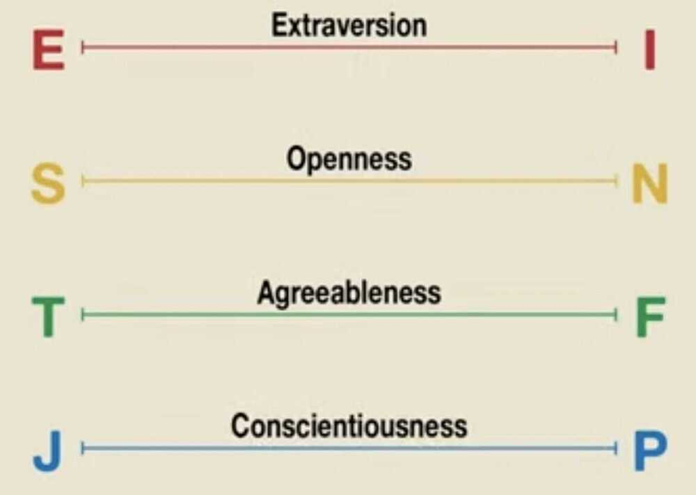
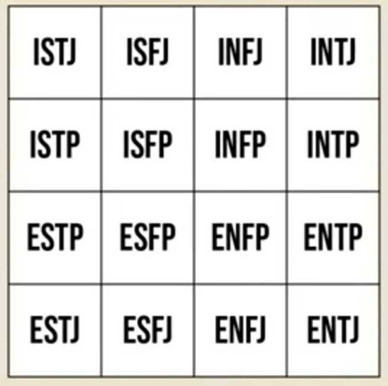

# Personality

Class is permanent and form is temporary

## MBTI

Myers-Briggs Type Indicator for personality test

https://www.16personalities.com/free-personality-test

[Is There An Atheist Personality Type? (Psychology of Atheism Part 2)](https://www.youtube.com/watch?v=xejfuTNov7Y)

## Four temperaments

The **four temperament theory** is a proto-psychological theory which suggests that there are four fundamental personality types: **sanguine**, **choleric**, **[melancholic](https://en.wikipedia.org/wiki/Melancholic "Melancholic")**, and **phlegmatic**.

[Four temperaments - Wikipedia](https://en.wikipedia.org/wiki/Four_temperaments)

## Big 5 Theories of Personality

### 1. Extraversion

- Talkative
- Loud
- Energetic
- Adventurous
- Sociable
- Outgoing

### 2. Openness

- Innovative
- Artistic
- Imaginative
- Creative
- Refined
- Intellectual

### 3. Agreeableness

- Kind
- Pleasant
- Gentle
- Cooperative
- Generous
- Mild

### 4. Conscientiousness

- Organized
- Fussy
- Efficient
- Neat
- Thorough
- Systematic

### 5. Neuroticism

- Tense
- Irritable
- Nervous
- Anxious
- Sad
- Touchy

## 12 Positive Personality Traits Of Effective People

### Capable

There's no exception to this trait. I've never met an effective, happy, or successful person who wasn't capable. They take their life and work seriously. They do things with a purpose. And most importantly, they know what they are talking about.

### Curious

Effective people avoid assumptions. Effective people ask a lot of questions. That's how you avoid assumptions.

### Assertive

People think you have to be nice. That's wrong. It's good to be **polite**, but you don't have to go out of your way to be nice all the time. Effective people think about themselves. But they don't sacrifice others. That's what assertiveness is about.

### Forgiving

Holding grudges is the least effective thing you can do. So many people have destroyed relationships and group dynamics because of grudges. "How could that person do this to me!" Well, maybe that other person doesn't even know why! People do stupid things. Move on.

### Independent

Effective people are not easily influenced by others. Theylistento others. But they are independent thinkers. They are not easily swayed by outside events.

### Respectful

You know how insecure people make subtle digs at you or other people? "You look so tired. What's going on?" That's one of those dirty remarks that's meant to make you feel bad. There are a lot of people who want to put you down, which automatically makes them feel better than you. Respectful people never do that. You can also disagree with people and still be respectful. Basically, effective people are the opposite of internet trolls.

### Truthful

When you regularly tell lies (no matter how small they are), you will eventually get caught by your own web. Call me superstitious (or a little-stitious, as Michael Scott once said), but I think lies will eventually catch up with you. That's why it's better to tell the truth. It's not always pretty, but at least it's not a lie.

### Precise

It's hard to explain things in a few words. It requires thought and effort to be precise. That's why you see a lot of people talk endlessly. They don't know what to say, so they use a shotgun approach. They spray words and hope a few will hit the mark. To be precise, you want to be like a marksman. Every sentence and action serves a purpose.

### Fair

People who say that fairness is an impossible concept are usually not fair people. There are universal principles of fairness. In summary, be straight with people and don't play favors. Be consistent in the way you treat people. That's the fairest thing we can do. And yes, that seems impossible in practice because it goes against our nature sometimes. But effective people do a lot of things that go against nature. They do things that others don't do.

### Flexible

Life is complex and full of change. To survive and thrive, one must adapt all the time. That's why effective people are highly flexible and fluid. If you give them a new idea that works better than their old one, they go with the new one. They don't care about their ego or looking smart. They care about whatworks.

### Self-aware

Knowing what you can and can't, will make your life a lot easier. Too often, [we're not aware of who we are](https://el2.convertkit-mail4.com/c/n4umv8ro7gsvhv4zd6f6/d0ueh0hw8wqzkv/aHR0cHM6Ly9kYXJpdXNmb3JvdXguY29tL3NlbGYtcmVsaWFuY2UtY2VydGFpbnR5Lw==). But to be effective, you must know who you are and what you're made of. And if you have weaknesses or make mistakes, self-awareness will help you to be honest about it. There's nothing wrong with imperfection. In fact, if you're not imperfect, you're probably a robot.

### Optimistic

Give effective people a challenge, and they'll think about a solution. Give them a bleak outlook, and they'll find things to be grateful for. In contrast, being pessimistic is the easiest thing in the world. Everyone can complain and say "we can't do that." But it takes strength to say "let's figure out a way to make it happen."

https://dariusforoux.com/positive-personality-traits

## 5 types of toxic people to avoid

1. The Energy Drainer: You feel tense and uneasy after each interaction with them.
2. The Pessimist: They have a negative outlook of the world. Always try to talk you out of your dreams.
3. The Criticizer: They don't support you in your decisions. They criticise every move you make. They make you feel like you can't do anything right.
4. The Manipulator: They try to control everything. Pretend to like you and other people. But they just want to make every decision for themselves and others.
5. The Victim: They blame others for their misfortune. Constantly seek attention from others. Talk mostly about their excuse for failing.

## How can you become a 10xer?

### Here are the 4 things you can do to become a 10xer

- See opportunities where others only see threats.
- Create a bias for action.
- Be positive, not negative. ("Yes, and" beats "no, but").
- Make your team better.
- Do everything you say you are going to do.
- Manage your boss and colleagues, don't make them spend time managing you.
- Proactively help the organization.

### Here's how you can identify 10xers in your organization

- A 10xer can be any level of experience or in any profession.
- A 10xer is in the top 10 percent of anyone you've ever worked with.
- A 10xer works harder than their peers.
- You want to work with them again and you'll fight to bring them into your next company.
- A star employee will be a 10xer for the foreseeable future.
- 10xers are hard to hire because they have so many opportunities.
- 10xers weren't always star employees.
- A star employee today is not necessarily a star employee tomorrow.
- Conversely, an average employee today could be a 10xer tomorrow.

https://summation.net/2020/05/14/how-can-you-become-a-10xer

https://blog.codegiant.io/how-to-become-a-10x-engineer-492fa3f57101

## Links

[The path between us](../book-summaries/the-path-between-us)

[Do You Really Know Your Personality? | Introduction to Psychology 16 of 30 | Study Hall - YouTube](https://www.youtube.com/watch?v=MEhuMpWnu8M)
