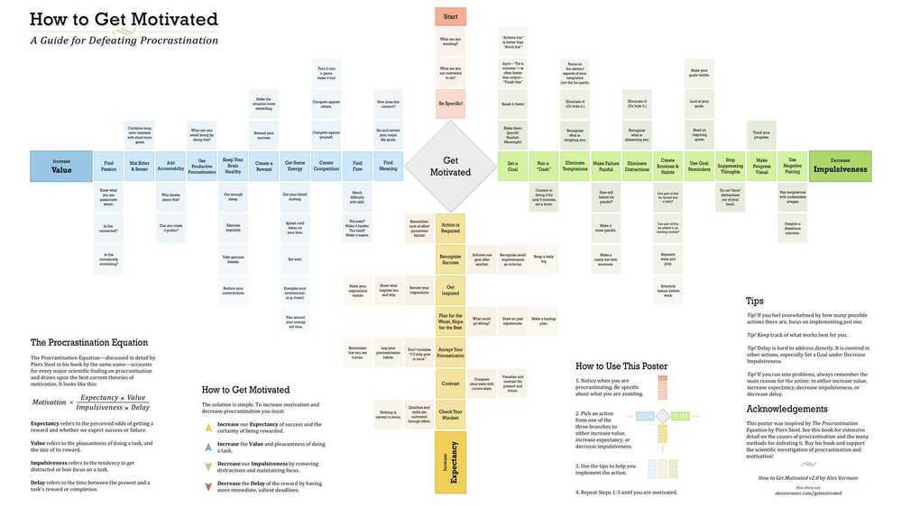

# Procastination

Procastination and Lazyness are the biggest disability of all.

Planning and preparation are useful until they become a form of procrastination.

Is this task enhancing my actions or substituting for them?

Getting past procastination - Vermeer Chart

<https://alexvermeer.com/wp-content/uploads/howtogetmotivated-1920x1080.jpg>

<https://alexvermeer.com/wp-content/uploads/howtogetmotivated-2560x1440.jpg>

## Akrasia

Akrasiais the state of acting against your better judgment. It is when you do one thing even though you know you should do something else. Loosely translated, you could say thatakrasiais procrastination or a lack of self-control.Akrasiais what prevents you from following through on what you set out to do.

One explanation for whyakrasiarules our lives and procrastination pulls us in has to do with a behavioral economics term called "time inconsistency." Time inconsistency refers to the tendency of the human brain to value immediate rewards more highly than future rewards.

## The framework to beat procastination

### 1. Design your future action

A commitment device is a choice you make in the present that controls your actions in the future.It is a way to lock in future behavior, bind you to good habits, and restrict you from bad ones.

### 2. Reduce the friction of starting

### 3. Utilize implementation intentions

<https://jamesclear.com/akrasia>

[When Procrastination Isn't So Bad](https://www.youtube.com/watch?v=8p_9wccG2NY)

[FINISH WHAT YOU START by Peter Hollins | Core Message](https://www.youtube.com/watch?v=yg0opil8TMA)

1. 10-10-10 (10 mins from now, 10 hours, 10 days)
2. Wait for 10 mins to pass when you not feel like doing something
3. No multitasking
4. 3 task daily, no more, no less
5. 5 things you cannot do, no things you must do
6. Reaffirmation

[4 Proven Ways to Kick Your Procrastination Habit | Ayelet Fishbach | TED - YouTube](https://www.youtube.com/watch?v=tB5J9qgM2zI&ab_channel=TED) - Intrinsic motivation

### [Stop Wasting your Time! | The Scientific Way | Dhruv Rathee - YouTube](https://www.youtube.com/watch?v=b8n-wpvBjrw)

## Links

- [No.1 Habit & Procrastination Expert: We've Got ADHD Wrong! Break Any Habit & Never Be Distracted! - YouTube](https://www.youtube.com/watch?v=rDdoUbCFn24)
- [How to stop procrastinating | SOLVING THE PROCRASTINATION PUZZLE by Timothy Pychyl | Core Message - YouTube](https://www.youtube.com/watch?v=6a7NdW4sFIU)
