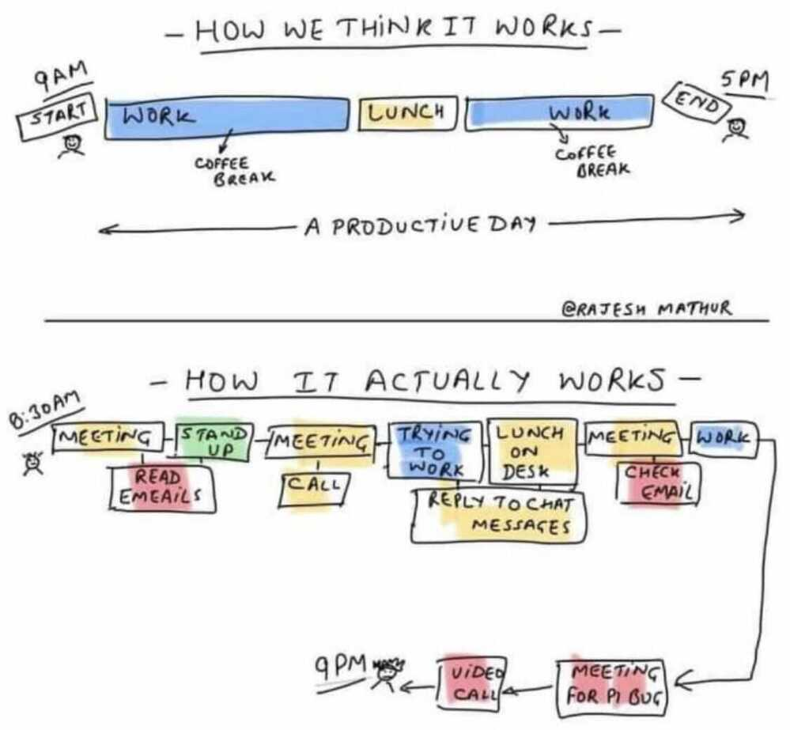

# Productivity / Productive / Time Management / TODO

Productivity isn't everything, but, in the long run, it is almost everything -- Economist Paul Krugman, in The Age of Diminished Expectations

The most invisible form of wasted time is doing a good job on an unimportant task.

Take care of the minutes and the hours will take care of themselves -- Lord Chesterfield

https://www.scotthyoung.com/blog/2020/10/26/foundation-practices

1. Establish an Airtight Productivity System
2. Exercise Every Weekday
3. Read 30 Minutes, Each Day
4. Journal Weekly
5. One Conversation Per Week with Someone Smarter Than You
6. Track Every Purchase
7. Fence In All Your Vices
8. Wake Up on Time Every Morning
9. Always Have a Major Project
10. One New Experience Each Week

https://www.scotthyoung.com/blog/2020/09/07/beyond-self-improvement

Focus on being productive instead of being busy. -- Tim Ferriss

You cannot fix all the things - Use the rule 63 - Pick 3, suck up the other 60

Motion does not equal action. Busyness does not equal effectiveness.

Bekaar aadmi kuch kiya kar... Kapde udherkar siya kar...

Process based vs outcome based

OHIO principle, also known as "Only Handle it Once."

The secret to being productive is to work on the right thing - even if it's at a slow pace.

Fight procrastination with mini-deadlines that hold you accountable.

Quickly handle low-priority tasks by keeping your perfectionism at bay.

Time famine - People not having enough time for Doctor, Health, etc

The biggest risk to productivity is always the same: working on the wrong thing.

Bekaar Aadmi Kuch Kiya Kar ... Kapde Udherkar Siya Kar

One thing that you cannot recycle is wasted time

Think about what you want today and you'll spend your time.

Think about what you want in 5 years and you'll invest your time.

Productivity is never an accident. It is always the result of a commitment to excellence, intelligent planning, and focused effort.

Two truths that can be at odds:

1 There are no bonus points in life for doing it the hard way.
2 There is a lot to be gained in life by acting fast and giving your best effort.

Don't let the excuse of searching for a better way prevent you from taking action.

"Sometimes the most productive thing you can do is eliminate the task.

Downsize. The rooms you don't have, don't need to be cleaned.

Donate. The items you don't own, don't need to be organized.

Delete. The projects you don't take on, don't need to be finished.

Is this a problem that needs to be solved? Or is it a problem that can be eliminated all together?"

"It is wonderful how much work can be got through in a day, if we go by the rule - map out our time, divide it off, and take up one thing regularly after another. To drift through our work, or to rush through it in a helter-skelter fashion, ends in comparatively little being done. "One thing at a time" will always perform a better day's work than doing two or three things at a time. By following this rule, one person will do more in a day than another does in a week."

## MIT Technique

A Most Important Task (MIT) is a critical task that will create the most significant results. Every day, create a list of two or three M.I.T.s, and focus on getting them done as soon as possible. Keep this list separate from your general to-do list. -[The PersonalMBA](https://personalmba.com/most-important-tasks/)

## Mental Models

- [Makers vs Manager's Schedule](http://www.paulgraham.com/makersschedule.html) - "When you're operating on the maker's schedule, meetings are a disaster." (related:[Deep Work](http://knowledge.wharton.upenn.edu/article/deep-work-the-secret-to-achieving-peak-productivity/))
- [Murphy's Law](https://en.wikipedia.org/wiki/Murphy%27s_law) - "Anything that can go wrong, will." (related:[Hofstadter's Law](https://en.wikipedia.org/wiki/Hofstadter%27s_law), "It always takes longer than you expect, even when you take into account Hofstadter's Law.")
- [Parkinson's Law](https://en.wikipedia.org/wiki/Parkinson%27s_law) - "Work expands so as to fill the time available for its completion."
- (3) Gate's Law - "Most people overestimate what they can do in one year and underestimate what they can do in ten years."

## Choosing a productivity system

1. Your system needs to fit your work (not the other way around)
2. The system should counterbalance your worst tendencies.
3. The system needs a way of dealing with exceptions.
4. A good productivity system shouldn't "feel" productive.
5. If your work changes, your system should too.
6. Always measure against your baseline (not somebody else's).
7. A system cannot give your work meaning or motivation.

https://www.scotthyoung.com/blog/2020/04/27/productivity-rules

## Productivity

1. Do the #1 Most Important Task At The Start of the Day
2. Don't Multitask
3. Have Themed Days
4. Discipline Matters More Than Intelligence
1. You might have all the knowledge, talent, or skill in the world, but because of a lack of discipline, you will never make it. - Daniel Walter
5. Recharge and Refresh Mid-Day To Keep Up Your Mental Fitness
6. Devote at Least 50% of Your Time to Building Great Products. Avoid Ego-Gratifying Activities.
7. Write Notes Down on Paper
8. Be Willing to Say No and Give Yourself Time
9. Reduce (or Eliminate) the Meetings You Have
10. Don't Under-Emphasize the Basics: Exercise, Eat Right, and Read
11. Realize You Control Your Time and Simplify Your Calendar

### Emails

- Pause your emails so you only receive it once or twice in a day

## Planning

The 10% Rule: Taking Planning Seriously

The first step to becoming a better planner is simply to set aside more time for it. Since we're evolved to be seat-of-our-pants doers, not patient planners, we need to counteract that urge by forcing ourselves to map out the path ahead.

Informally, I like to follow the 10% Rule, which says that you should spend, roughly 10% of the total time you anticipate for a project on planning the project. So if you were going to spend 100 hours on a project, you should spend about 10 hours planning it.

At first this seems crazy large. And, admittedly, this rule can be reduced for longer projects (especially those that might need intermediate planning as you learn more). Yet, for new project types where you lack experience, the time spent planning is often the most valuable.

https://www.scotthyoung.com/blog/2020/12/07/planning

## Chunking

1. Start by capturing
2. Look for commonalities
3. Relate it to your purpose
4. Take action

https://www.tonyrobbins.com/productivity-performance/power-of-chunking

## Multitasking

Cognitive neuro ergonomics

[Humans and multitasking - How much can we do simultaneously? | DW Documentary](https://www.youtube.com/watch?v=aK3lhinHd_8)

## Tools

### Liner - a web productivity extension

Liner is a browser extension that lets you highlight anything you see online. Be it articles, images or even videos! The extension saves everything you highlight in a folder so that you can look at it later, all in one place.

"You can also pinpoint time stamps of any YouTube video via it. It’s very handy and convenient and a great tool for research." she says.

### Others

- [AI-Powered Productivity. A Second Brain for Teams | Taskade](https://www.taskade.com/)
- [Exam Countdown app to keep track of exam dates.](https://examcountdownapp.com/)

## Resources

- https://www.freecodecamp.org/news/how-to-get-things-done-lessons-in-productivity
- https://deepstash.com/article/1700/23-time-management-techniques-of-insanely-busy-people
- https://www.youtube.com/watch?v=fBr8BKPW5tc
- https://medium.com/swlh/the-5-most-productive-things-to-do-when-youre-too-tired-to-work-4157efe9091b
- https://hellonehha.hashnode.dev/how-to-protect-your-time-at-work-cksoxjhtq079dvks125jhewf3
- https://www.productivitygame.com
	- [Personal Productivity](https://www.youtube.com/watch?v=-f3dNkkFBvM)
- [Productivity as a Developer – Full Course - YouTube](https://www.youtube.com/watch?v=C_jQahOnGUU)

## Links

- [Books / Blinkist - Productivity](book-summaries/books-blinkist-productivity.md)
- [Organize Tomorrow Today](../book-summaries/organize-tomorrow-today)
- [The Slight Edge](../book-summaries/the-slight-edge)
- [The 4 Hour Workweek](../book-summaries/the-4-hour-workweek)
- [Principles](../book-summaries/principles)
- [Primed to Perform](../book-summaries/primed-to-perform)
- [Getting things done](../book-summaries/getting-things-done)
- [Game Changers](../book-summaries/game-changers)
- [The 5 AM Club](../book-summaries/the-5-am-club)
- [The Organized Mind](../book-summaries/the-organized-mind)
- [Off the Clock](../book-summaries/off-the-clock)
- [First Things First](../book-summaries/first-things-first)

- [Prioritization / Leverage](soft-skills/prioritization-leverage)
- The Productivity Project - Chris Bailey
- [Edsger Dijkstra's One-Day Workweek - Cal Newport](https://calnewport.com/edsger-dijkstras-one-day-workweek)
- [How I manage MY WEEK running a 27 CRORE BUSINESS! | Ankur Warikoo Hindi - YouTube](https://www.youtube.com/watch?v=rpuT3LPDAZY)
