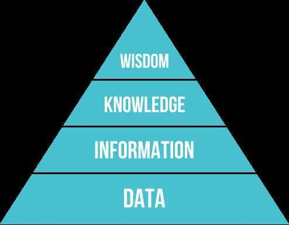

# Research

The main point of science is **to ask the right questions.**

## DIKW Pyramid

Typically information is defined in terms of data, knowledge in terms of information, and wisdom in terms of knowledge

## References

https://en.wikipedia.org/wiki/DIKW_pyramid

## Fact Checking

1. Who's behind this information?

2. What is the evidence for their claims?

3. What do other sources say about the organization and its claims?

https://www.freecodecamp.org/news/building-a-habit-of-reading-research-papers

https://www.userinterviews.com

## Cross-sectional study

Both the cross-sectional and the longitudinal studies are observational studies. This means that researchers record information about their subjects without manipulating the study environment. In our study, we would simply measure the cholesterol levels of daily walkers and non-walkers along with any other characteristics that might be of interest to us. We would not influence non-walkers to take up that activity, or advise daily walkers to modify their behaviour. In short, we'd try not to interfere.

[Cross-sectional study - Wikipedia](https://en.wikipedia.org/wiki/Cross-sectional_study)

## Longitudinal study

A longitudinal study, like a cross-sectional one, is observational. So, once again, researchers do not interfere with their subjects. However, in a longitudinal study, researchers conduct several observations of the same subjects over a period of time, sometimes lasting many years.

The benefit of a longitudinal study is that researchers are able to detect developments or changes in the characteristics of the target population at both the group and the individual level. The key here is that longitudinal studies extend beyond a single moment in time. As a result, they can establish sequences of events.
