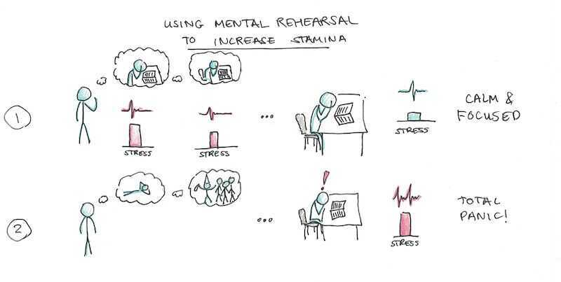
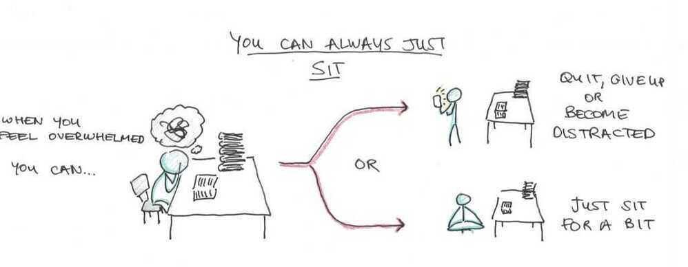
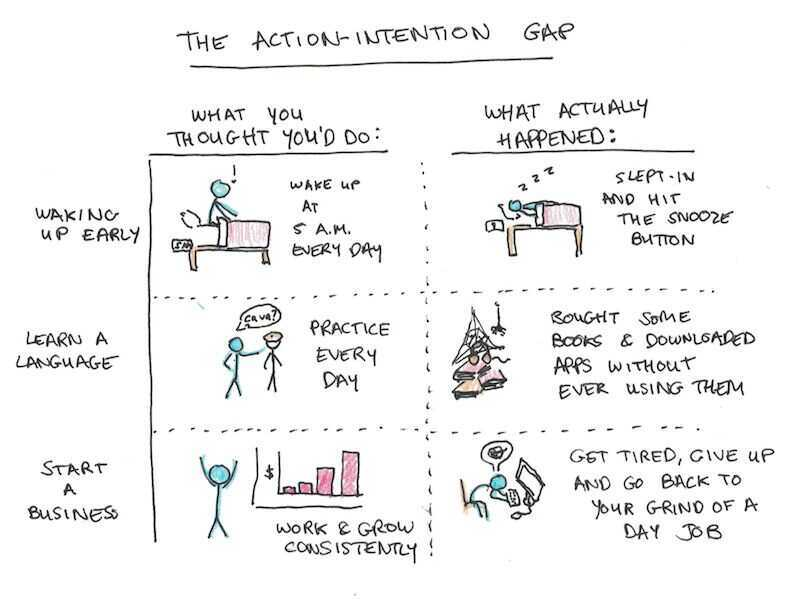

# Self Control / Will Power

Before you try to increase your willpower, try to decrease the friction in your environment.

Between stimulus and response, there is a space. - Victor E. Frankl

## Self Control

Indulge now and pay the price later? Or wait a little and reap bigger re- wards in the future? Many of life's biggest challenges come down to a simple trade off.

It's your ability to resolve conflicts between your short-term desires and your long-term goals

## Techniques to identify self control conflicts

### broad-bracketing

- think of your choice (whether to indulge or not) not as a one-shot decision, but as a sequence of habitual decisions;
- always ask yourself: what will be the consequences if I indulge every time?

### psychological connectedness

- realize that in the future you likely won't change much -- you'll be equally tempted to indulge as you're now and you won't have more willpower or resources to deal with temptations than you have now
- ask yourself -- what would my older self ask me to do better now?

### adjusting your identity

- identify yourself with the self-image of a strong-willed person
- choose your identity based on your goals -- if you want to become a runner, start thinking like one

## The secret to self control - Willingness

- I am having a thought that I am feeling a lot of stress right now and I need to smoke a cigaratte
- I am noticing that I am having the thought that I am feeling a lot of stress right now and I need to smoke a cigaratte

## Four Burners' Theory

The Four Burners Theorysays that "in order to be successful you have to cut off one of your burners. And in order to bereallysuccessful you have to cut off two."

## How to handle mid-life crisis

Surround yourself with believers. Go to leadership conferences, engage with people who dream

[The Secret to Mastering Life's Biggest Transitions | Bruce Feiler | TED](https://www.youtube.com/watch?v=ICxYOe54Zx4)

## Deck of Disruptors

https://www.thefivecoatconsultinggroup.com/the-coronavirus-crisis/transition

## Tips for increasing mental stamina

- **Mental rehearsal -** spend considerable time obsessing, rehearsing and preparing for those challenges before the actual challenge

- Just sit

## Action - Intention Gap

Our actions don't match our intentions.

1. Understand your intentions
2. Understand yourself
3. Align your intentions

## Resistance vs Exhaution

- There are various techniques to overcome resistance
    - Divide the task into multiple subtasks
    - All this must be as public as possible, because then it creates a sense of responsibility

## Motivation

1. A good pre-game routine starts by being so easy that you can't say no to it. You shouldn't need motivation to start your pre--game routine.

2. Your routine should get youmovingtowards the end goal.

3. You need to follow the same pattern every single time.

https://www.scotthyoung.com/blog/2019/06/05/7-habit-approaches

[How a "Hi Level" Mindset Helps You Realize Your Potential | Cordae | TED](https://www.youtube.com/watch?v=x9Ezzxy0frA)

## Mental Toughness is important

https://jamesclear.com/mental-toughness

## Will power

I have an unlimited will power

Should not waste it on fending out procrastination except when absolutely necessary.

Higher you go into studies more its important to take a hold on your procrastination.

At first its really hard, but later we don't even think about it.

Chunking is related to habit. Habit is an energy saver for us. It allows us to free our mind for other types of activities.

## Self Reliance

Self-reliance is nothing more than being self-sufficient. It means notclingingto people. It means not making life harder for others than it already is.

## Self Affirmation

- when people receive information about the risks of their current lifestyle, they tend to avoid, downplay, or derogate such information (this is called defensive processing)
- you can overcome your own defensive processing with self-affirma- tion
    - one way to self-affirm is by reflecting on your most cherished personal values and strengths (see an online test)
    - another way is to repeat positive statements about possible change in important areas in your life (e.g. "I'm capable of grad- ually improving my diet") -- these need to be grounded in reality
- self-affirmation helps you realize that you're a competent and adequate person, even though you may not always have perfect self-control.

## Construal

Construe - interpret

A person's perception and interpretation of attributes and behavior of the self or of others

A construal is a way that people perceive, comprehend, and interpret their world, particularly the acts of others toward them.

### Construal and Reappraisal: Reframing Self-Control Conflict

- Whenever making an important decision, get yourself into a high-level (=abstract) construal by asking yourself a series of '**why**' questions
    - for instance, if you want to lose weight, ask yourself: Why do I
        want to lose weight?
    - if your answer is 'to be more attractive', turn it into another 'why'
        question: Why do I want to be attractive?
    - Do this until you've connected to your deepest values (because it
        gives me great joy, because I deeply value my life, etc.)
- Whenever you need to plan how to achieve your goals, you need to
    get into a low-level (=concrete) construal by asking yourself a series of '**how**' questions
- If you have a tendency for harsh self-criticism, practice mindful construal

- When deciding between a tempting option (watching TV, smoking a cigarette, eating a high-calorie dessert) and a healthy option (exercising, drinking herbal tea, eating fruit), you can use three re-appraisal strategies:
    - You can stimulate disgust by imaging the possible negative consequences of choosing the tempting option (e.g. someone sneezing on food)
    - You can think of the positive consequences of not choosing the tempting option (e.g. not putting on weight)
    - The best approach is to focus on the positive aspects of selecting the healthy option (e.g. staying slim and healthy, feeling proud of yourself)

### Construal-Level Theory (CLT)

People are capable of thinking about the future, the past, remote locations, another person's perspective, and counterfactual alternatives. Without denying the uniqueness of each process, it is proposed that they constitute different forms of traversing psychological distance. Psychological distance is egocentric: Its reference point is the self in the here and now, and the different ways in which an object might be removed from that point - in time, in space, in social distance, and in hypotheticality - constitute different distance dimensions. Transcending the self in the here and now entails mental construal, and the farther removed an object is from direct experience, the higher (more abstract) the level of construal of that object.

If something feels far from us, we view it abstractly. This is calledhigh-levelconstrual.

When something feels close, we view it more concretely. This is calledlow-levelconstrual.

https://www.ncbi.nlm.nih.gov/pmc/articles/PMC3152826

https://en.wikipedia.org/wiki/Construal_level_theory

## Hyperopia

when people persistently sacrifice their immediate desires for their long term goals. This is called 'hyperopia'

1. I often fail to enjoy attractive opportunities.
2. It's hard for me to make myself indulge.
3. I regret missed opportunities to enjoy rich experiences in the past.
4. I have difficulty pampering myself.
5. "Seizing the day" is difficult for me.
6. I rarely enjoy the luxuries life has to offer

- hyperopia is not the same thing as extremely strong self-control -- rather, it's an excessive focus on the distant goal of being productive at all cost
- the result of hyperopia is a lack of life satisfaction and often poor health
- you can overcome hyperopia by:
    - pre-committing to indulgence (e.g. buying vouchers)
    - anticipating that you'll regret your puritan decisions in the future (with high-level construal)
    - indulging after you've made a lot of effort at work
    - making use of discounts and promotions
    - making up 'functional alibi' (=emphasizing utilitarian value of objects rather than their hedonic qualities)

## How to use the power of movies to have same dedication for study

https://www.scotthyoung.com/blog/2021/05/03/effort-opportunity-cost

1. Effort Depends on Alternatives
2. Willpower Depends on Reward

[learned industriousness](https://www.scotthyoung.com/blog/2020/11/02/motivation/#07-05)

Eisenberg's theory was that when you get rewarded for effortful activity, the experience of effort itself becomes less unpleasant and thus you more easily choose high-reward, high-effort activities over low-reward, low-effort ones.

Learned industriousness claims that when you are rewarded for expending higher effort, the experience of effortful activity itself is reinforced. This leads to the experience of effort itself becoming less unpleasant, and thus changes your willingness to work harder for bigger payoffs.

