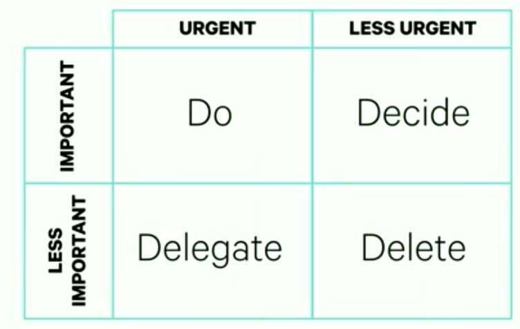

# Prioritization / Leverage

Many people work hard, but few people work on the highest and best thing.

Usually, it takes no more effort to work on high leverage tasks than it does to work on low leverage ones.

It's just a matter of directing your energy.

What is important is seldom urgent, and what is urgent is seldom important

The best time to plant a tree was 20 years ago. The second best time is now.

## Naval Ravikant on the importance of leverage

Humans evolved in societies where there was no leverage. If I was chopping wood or carrying water for you, you knew eight hours put in would be equal to about eight hours of output. Now we've invented leverage... As a worker, you want to be as leveraged as possible so you have a huge impact without as much time or physical effort.

A leveraged worker can out-produce a non-leveraged worker by a factor of one thousand or ten thousand. With a leveraged worker, judgment is far more important than how much time they put in or how hard they work.

For example, a good software engineer, just by writing the right little piece of code and creating the right little application, can literally create half a billion dollars' worth of value for a company. But ten engineers working ten times as hard, just because they choose the wrong model, the wrong product, wrote it the wrong way, or put it in the wrong viral loop, have basically wasted their time. Inputs don't match outputs, especially for leveraged workers.

What you want in life is to be in control of your time. You want to get into a leveraged job where you control your time and you're tracked on outputs.

## Focus on High-leverage Activities

Leverage should be the central, guiding metric that helps you determine where to focus your time.

#### Warren Buffett - 25/5 Method

1. Write out 25 things you want to accomplish this year
2. Circle the 5 most important things on your list
3. Everything you didn't circle is "avoid-at-all-costs" list
4. You cannot give any attention to them until you've completed your top 5
5. The difference between successful and really successful people is that really successful people say no to almost everything. -- Warren Buffett

## Law of Triviality

Members of an organisation give disproportionate weight to trivial issues.

The law of triviality is C. Northcote Parkinson's 1957 argument that people within an organization commonly or typically give disproportionate weight to trivial issues.[1] Parkinson provides the example of a fictional committee whose job was to approve the plans for a nuclear power plant spending the majority of its time on discussions about relatively minor but easy-to-grasp issues, such as what materials to use for the staff bicycle shed, while neglecting the proposed design of the plant itself, which is far more important and a far more difficult and complex task.

The law has been applied to software development and other activities. The terms bicycle-shed effect, bike-shed effect, and bike-shedding were coined based on Parkinson's example; it was popularised in the Berkeley Software Distribution community by the Danish software developer Poul-Henning Kamp in 1999 and, due to that, has since become popular within the field of software development generally.

[Law of Triviality](https://en.wikipedia.org/wiki/Law_of_triviality)

## Eisenhower Matrix

1. Urgent & Important
2. Urgent & Not Important
3. Important & Not Urgent
4. Not Urgent & Not Important

[The Eisenhower Decision Matrix: How to Distinguish Between Urgent and Important Tasks and Make Real Progress in Your Life](https://www.artofmanliness.com/character/knowledge-of-men/eisenhower-decision-matrix/)

## Links

[Secrets of Power Negotiating](../../book-summaries/secrets-of-power-negotiating)
